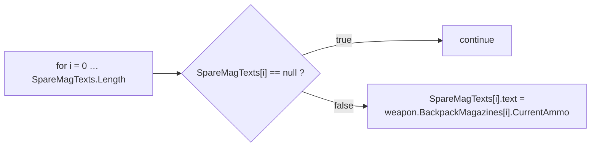
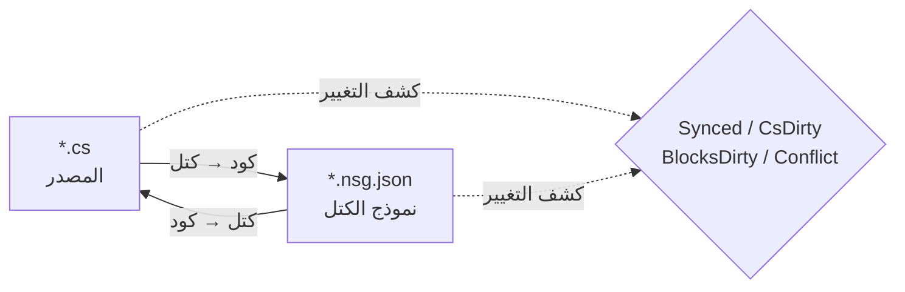

# NekoScriptGraph (NSG) — النشر السريع والدليل

**الإصدار** 1.0.1 · **Unity** 2022.3+ · **المؤلف** NekoAndreeva · **الترخيص** MIT · **الحزمة** `com.nekoandreeva.nekoscriptgraph`

> برمجة مرئية بأسلوب Scratch لـ Unity و**لا تضع أي شيء في شفرتك أبدًا.**
> يكتب NSG ملف تهيئة كتل *بجوار* برنامج نصي ليجعله قابلًا للتحرير ككتل، ويترجم في الاتجاهين. الملف `.cs` الناتج لا يحتوي على أي أثر للإضافة — احذف مجلد الإضافة وستظل برامجك النصية تُصرَّف.

---

## جدول المحتويات

**الجزء أ — النشر السريع**

1. [نشر واجهة API الشاملة بنقرة واحدة](#1-one-click-global-api)
2. [أول برنامج كتل لك](#2-your-first-block-program)
3. [مسار التأهيل في 10 دقائق](#3-the-10-minute-onboarding-path)

**الجزء ب — الدليل**

4. [المفاهيم الأساسية](#4-core-concepts)
5. [التثبيت والمتطلبات](#5-install--requirements)
6. [محرّر الكتل](#6-the-block-editor)
7. [مرجع القائمة](#7-menu-reference)
8. [كتل API (تعمّق)](#8-api-blocks-deep-dive)
9. [اللغات وإضافة لغة](#9-languages--adding-one)
10. [المزامنة والصيغة القياسية ونسبة المنافذ الاحتياطية](#10-sync-canonical-form--escape-ratio)
11. [سلامة البنية](#11-architecture-health)
12. [التعريب](#12-localization)
13. [الوكلاء وMCP](#13-agents--mcp)
14. [مساعد ProgramNeko (اختياري)](#14-programneko-assistant-optional)
15. [الإعدادات](#15-settings)
16. [تخطيط المجلدات](#16-directory-layout)
17. [إلغاء التثبيت](#17-uninstall)
18. [استكشاف الأخطاء والأسئلة الشائعة](#18-troubleshooting--faq)
19. [التواصل](#19-contact)

**الملاحق**

- [أ. مخطط تعريف الكتل](#appendix-a-block-definition-schema)
- [ب. مخطط وصف اللغة](#appendix-b-language-descriptor-schema)
- [ج. مفاتيح الإعدادات](#appendix-c-settings-keys)

---
---

# الجزء أ — النشر السريع

انتقل من "مجلد مُلقى داخل `Assets`" إلى "كتابة الكود بالكتل" في نحو عشر دقائق، وبأقل قدر من الكتابة على لوحة المفاتيح.

<a id="1-one-click-global-api"></a>
## 1. نشر واجهة API الشاملة بنقرة واحدة

**الفكرة:** مشروعك يحتوي بالفعل على مئات الدوال. يستطيع NSG قراءتها وإنشاء **كتلة API** لكل واحدة منها، بحيث تصبح كل دالة كتبتها بالفعل كتلة قابلة للسحب والإفلات في لوحة الكتل. عندئذٍ تُكتب الشفرة الجديدة بتجميع مفردات مشروعك *أنت*.

### 1.1 نفّذ ذلك

1. تأكد من أن الإضافة قد تُصرّفت (لا أخطاء حمراء في وحدة التحكم؛ Unity 2022.3+).
2. القائمة: **`NekoScriptGraph ▸ Build API Library for Whole Project`**.
3. يحصي NSG ملفات المصدر التي سيفحصها ويعرض مربع حوار تأكيد:

   > *بناء مكتبة API للمشروع كله — N ملفات مصدر → `Assets/NekoScriptGraph/Blocks/API`. هل تريد المتابعة؟*

4. انقر **متابعة**. في مشروع كبير يعني هذا آلاف الكتل ويستغرق لحظة ملحوظة — وهذا أمر متوقع، ولهذا يُعرض العدد أولًا.
5. عند الانتهاء، تسجّل وحدة التحكم ملخصًا ويعرض مربع حوار الإجماليات:

   ```
   [NekoScriptGraph] API blocks: <generated> generated, <skipped> skipped.
   ```

6. تُعاد مكتبة الكتل **تحميلها تلقائيًا**. لا شيء آخر لفعله — الكتل الجديدة جاهزة.

> **النطاق.** يشمل الفحص مجلد `Assets` لكل لغة مسجّلة. يستخدم C# واجهة `AssetDatabase` (`t:MonoScript`)؛ أما C/C++/Rust/HLSL/etc. فيتم التنقل فيها على القرص حسب امتداد الملف. ويُستثنى `Dependencies/` و`.checkpoints/` دائمًا.

### 1.2 مجلد واحد فقط بدلًا من ذلك

تعمل على نظام فرعي واحد؟ حدّد مجلدًا في نافذة Project واستخدم:

**`NekoScriptGraph ▸ Generate API Blocks for Selected Folder`**

الآلية نفسها، ونطاق تأثير أصغر، وأسرع بكثير. هذه هي الجولة الأولى الموصى بها — استهدف المجلد الذي تريد البرمجة مقابله فعلًا.

### 1.3 ما الذي تحصل عليه

ملف JSON واحد لكل دالة مؤهلة، يُكتب في المجلد المحدد في `apiOutputFolder` (افتراضيًا `Assets/NekoScriptGraph/Blocks/API`):

```
Blocks/API/api.DecalUtils.ProjectNormals.5.json
Blocks/API/api.DecalManager.GetSpawner.3.json
Blocks/API/api.GPUDecalUtils.UpdateDrawIndirectCommandBuffer.3.json
```

مخطط التسمية: `api.<Type>.<Method>.<arity>.json` — حقل **arity** (عدد المعاملات) جزء من المعرّف حتى تتعايش النسخ المحمّلة فوق بعضها (overloads).

داخل لوحة الكتل تندرج تحت فئة **API** (`cat.api`)، **مجمّعة فرعيًا حسب النوع المُعلِن**:

| مجموعة لوحة الكتل | المحتوى |
|---|---|
| `API` → `DecalUtils` | كل دالة `DecalUtils` مؤهلة |
| `API` → `DecalManager` | كل دالة `DecalManager` مؤهلة |
| `API` → *(الدوال الحرة)* | دوال C / HLSL من المستوى الأعلى |

استخدم مربع البحث في لوحة الكتل للعثور على كتلة بالاسم فورًا.

<a id="14-the-eligibility-rule-know-this-before-you-wonder"></a>
### 1.4 قاعدة الأهلية (اعرفها قبل أن تتساءل)

لا تُنشأ **كتلة API إلا إذا** كانت الدالة:

| الشرط | السبب |
|---|---|
| `public` | إنها واجهة API عامة |
| بلا أنواع عامة (`<…>` على الدالة أو نوع إرجاعها) | لا يوجد استدلال أنواع وقت التشغيل في الكتلة |
| بلا `async` | لا يوجد مجدول للانتظار عليه |
| **بلا معاملات `ref` / `out` / `in` / `params` / `this`** | معاملات الخرج ستحتاج منافذ إضافية |
| **بلا قيم افتراضية للمعاملات** (`=`) | كل المنافذ مطلوبة |
| بلا قيود `where` | مثل الأنواع العامة |
| ليست بانية (constructor) | إنها ليست استدعاء دالة |

أي شيء يفشل في هذه الشروط يُتخطى بصمت — وهذا العدد هو الرقم "skipped" في الملخص.

<a id="15-static-vs-instance--the-one-asymmetry"></a>
### 1.5 `static` مقابل `instance` — التباين الوحيد

هذا هو أهم تحذير في ميزة API بأكملها:

| نوع الدالة | سلوك الكتلة | قابلية العكس |
|---|---|---|
| **`static`** | تُطابق عبر هدف الاستدعاء المنقّط + عدد المعاملات (`matchCall` + `matchArity`) | **ثنائية الاتجاه بالكامل** — كود ⇄ كتل |
| **instance** | تحصل على منفذ `target` إضافي في المقدمة: `{0}.Method({1}, …)` | **أحادية الاتجاه** — تُطبَع بشكل صحيح، لكن عند الاستيراد تُقرأ مجددًا ككتلة استدعاء عامة |

> قاعدة عامة: **واجهات `static` تصنع كتلًا مثالية.** لا تزال دوال `instance` تمنحك استدعاءً صحيحًا وموثّقًا بذاته، لكن تعديل استدعاء `instance` بالكتل فقط لن يعود في صورة كتلة محددة قابلة للتعرّف. فضّل نقاط الدخول `static` لأي شيء تنوي تأليفه بالكتل.

الدوال الحرة (C، HLSL) ليس لها نوع مالك، ولذلك تُعامَل كـ `static` — ثنائية الاتجاه بالكامل.

### 1.6 انضباط إعادة البناء

- **أعد التشغيل بعد إعادة الهيكلة.** إعادة تسمية دالة تترك كتلة API قديمة. أعد تشغيل المُنشئ واحذف الأيتام، أو احذف `Blocks/API/` وأعد التوليد من الصفر.
- **إعادة التوليد idempotent.** المعرّفات حتمية؛ وتُحتسب التكرارات كـ *skipped*، فلا يؤدي إعادة التشغيل إلى تكديس المجلد.
- **من الآمن إيداعها في Git.** ملف `Blocks/API/*.json` بيانات وليس كودًا. وإيداعه يعني حصول زملائك على مفردات كتلك دون إعادة الفحص.

---

<a id="2-your-first-block-program"></a>
## 2. أول برنامج كتل لك

جولة عملية متكاملة من البداية إلى النهاية. سنعيد بناء قطعة صغيرة من منطق على نمط `CompassManager` — "طباعة عدد المخازن، مع إظهار `--` للخانات الفارغة" — باستخدام كتل API.

### الخطوة 1 — ضع ملفًا واحدًا تحت الإدارة

1. حدّد ملف `.cs` في نافذة Project.
2. **`NekoScriptGraph ▸ Take Selected Script Under Management`**.

   فيظهر ملف بجواره:

   ```
   Assets/Scripts/ChrControl/CompassManager.cs
   Assets/Scripts/ChrControl/CompassManager.nsg.json   ← the block model
   ```

   (الملف `.nsg.json` مخفي في نافذة Project افتراضيًا — وهذه ميزة لا خلل. `Cmd/Ctrl+Shift+H` يبدّل ظهوره.)

### الخطوة 2 — افتح المحرّر

**`NekoScriptGraph ▸ Open Block Editor`**. يُفتح الملف كتبويب.

### الخطوة 3 — اعثر على كتلك

انظر إلى اللوحة اليمنى:

- **Palette search** — اكتب `SpareMagTexts` أو `Count` للتصفية.
- مجموعة **API** تحمل الكتل المُنشأة في الجزء أ.
- **التحكم / التعبيرات / المتغيرات / البنية** تحمل كتل اللغة.

### الخطوة 4 — جمّع

اسحب الكتل إلى اللوحة. الحلقة الكلاسيكية:



كل منفذ مطلوب يُترك فارغًا يُعلَّم بواسطة **سلامة البنية** (Architecture Health) كـ `danglingInput`.

### الخطوة 5 — اكتبه مرة أخرى

اضغط **الكتل → الكود** (أو استخدم زر التوليد في شريط الأدوات). يطبع NSG الكود المصدري ويبلّغ بأحد الحالات:

| الحالة | المعنى |
|---|---|
| `Synced` | الكود ونموذج الكتل متوافقان |
| `Code changed` | تقدّم الملف `.cs` — أعد الاستيراد |
| `Blocks changed` | تقدّمت الكتل — ولّد الكود لكتابتها |
| `Conflict` | تغيّر **الجانبان** — أنت من يختار الفائز |

### الخطوة 6 — تأكد من بقاء الكود نظيفًا

افتح الملف `.cs`. إنه C# عادي. لا سمات، ولا منطقة مُولّدة، ولا مراجع للإضافة. وهذا هو بيت القصيد.

### الخطوة 7 — أودع في Git

أودع كلا الملفين: `.cs` و`.nsg.json`. نموذج الكتل أصل مشروع عادي.

> **الكتابة الأولى تُعيد التنسيق.** إذا لم تكن دالة بصيغة NSG القياسية أصلًا (أقواس ناقصة، أو إزاحة غير منتظمة، أو كتابة مكافئة لكن مختلفة)، فإن أول تمرير من *الكتل → الكود* يُطبّعها. الدلالة لا تتغير؛ التنسيق يتغير. ويُنبَّه إليك مسبقًا: *"N من الدوال ليست في الصيغة القياسية…"*. لتجنّب فروق غير متوقعة، راجع [§10](#10-sync-canonical-form--escape-ratio).

---

<a id="3-the-10-minute-onboarding-path"></a>
## 3. مسار التأهيل في 10 دقائق

القائمة المكثفة. اطبعها وألصقها على الشاشة.

| # | الإجراء | المكان | ~الوقت |
|---|---|---|---|
| 1 | ألقِ الإضافة داخل `Assets/` ودعها تُصرَّف | Unity | 1 دقيقة |
| 2 | حدّد مجلدًا → **Generate API Blocks for Selected Folder** | القائمة | 1 دقيقة |
| 3 | **Take Selected Folder Under Management** | القائمة | 1 دقيقة |
| 4 | **Open Block Editor** | القائمة | 10 ثوانٍ |
| 5 | ابحث في لوحة الكتل عن إحدى دوالك | المحرّر | 1 دقيقة |
| 6 | اسحب ثلاث كتل، وصّلها، واترك منفذًا واحدًا فارغًا | المحرّر | 2 دقيقة |
| 7 | افتح **سلامة البنية** واقرأ نتيجة `danglingInput` | القائمة | 1 دقيقة |
| 8 | أصلحها بسحب كتلة إلى المنفذ | المحرّر | 1 دقيقة |
| 9 | اضغط **الكتل → الكود** وتأكد أن الحالة `Synced` | المحرّر | 30 ثانية |
| 10 | افتح الملف `.cs` — وتحقق من أنه C# نظيف | المحرّر | 20 ثانية |
| 11 | أودع `.cs` + `.nsg.json` | Git | 30 ثانية |
| 12 | *(اختياري)* **MCP Bridge: Start** ووجّه عميلك إلى `http://127.0.0.1:8765/` | القائمة + العميل | 2 دقيقة |

**النموذج الذهني في سطر واحد:** الملف `.cs` هو مصدر الحقيقة، والملف `.nsg.json` *عدسة* عليه، ويحافظ NSG على توافق العدسة مع المصدر.

---
---

# الجزء ب — الدليل

<a id="4-core-concepts"></a>
## 4. المفاهيم الأساسية

### 4.1 الملفات المُدارة مقابل الملفات الحرة

- **ملف حر** — برنامج نصي عادي ليس بجواره `.nsg.json`.
- **ملف مُدار** — له `.nsg.json`؛ ويمكن فتحه ككتل.

### 4.2 أجساد الدوال فقط تتحوّل إلى كتل

القاعدة الأهم في NSG:

- `using`، وإعلانات الأنواع، والحقول، والسمات، والتعليقات **خارج أجساد الدوال** تُصان **حرفيًا** وتنجو في الاتجاهين دون مساس.
- **أجساد الدوال** تُحلَّل إلى كتل.
- أي شيء لا يستطيع نموذج الكتل التعبير عنه يُصان كـ **مقتطف خام** ويُبلَّغ عنه كتشخيص (`NSG0002`). **لا شيء يُفقد بصمت أبدًا.**

### 4.3 نموذج المزامنة ثنائية الاتجاه



| الحالة | المعنى |
|---|---|
| `Synced` | الكود ونموذج الكتل متوافقان |
| `CsDirty` | تغيّر الملف `.cs`؛ والنموذج متأخر |
| `BlocksDirty` | تغيّرت الكتل؛ ولم يُعَد كتابة الكود |
| `Conflict` | تغيّر الجانبان — عليك اختيار الفائز |
| `Unmanaged` | لا يوجد ملف كتل |

يتتبّع NSG **أي جانب تحرّك أولًا**، فتعرف دائمًا ما إذا كان الضغط على توليد سيدمّر عملك أنت.

> مسار MCP/الوكيل **أحادي الاتجاه عمدًا: كود → كتل**. يكتب الوكيل كودًا عاديًا؛ وتعيد الإضافة التحليل وبناء النموذج.

---

<a id="5-install--requirements"></a>
## 5. التثبيت والمتطلبات

1. Unity **2022.3** أو أحدث.
2. ضع مجلد `NekoScriptGraph` تحت `Assets/` (أو أضفه كحزمة محلية).
3. الحزمة بأكملها محصورة بـ **تعريف تجميعة للمحرّر فقط** — ولا تسهم **بأي شيء** في بناء المشغّل (player build).

### أجزاء اختيارية (كل منها قابل للحذف كوحدة مستقلة)

| المجلد | الغرض | عند الحذف |
|---|---|---|
| `Dependencies/` | صور مستديرة الزوايا بتقنية 9-slice | يتراجع إلى زوايا مستديرة بسيطة؛ والحزمة ~1.4 MB |
| `LanguageSupport/{c,cpp,hlsl,java,python,rust}` | لغات غير C# | تختفي تلك اللغة؛ ولا يتعطل أي شيء آخر |
| `ProgramNeko/` | مساعدة القطة البكسلية | تعمل الإضافة بشكل جيد بدونها |
| `Locale/*` | ترجمات الواجهة | تتراجع تلك اللغة إلى الإنجليزية |

### حجم الحزمة

≈ **2.2 MB** كما تُشحن:

| الجزء | الحجم |
|---|---|
| `Editor/` — النواة والواجهة ومحرّك C# | ~0.9 MB |
| `Dependencies/Editor/Sprite/` — صور 9-slice اختيارية | ~0.86 MB |
| `Blocks/` — مكتبة الكتل المدمجة (تُعاد توليدها عند الطلب) | ~0.23 MB |
| `LanguageSupport/` — سبع لغات قابلة للإسقاط | ~0.21 MB |

---

<a id="6-the-block-editor"></a>
## 6. محرّر الكتل

نافذة متعددة التبويبات بأسلوب VS Code، بحد أدنى 980×600.

| المنطقة | المحتوى |
|---|---|
| شريط التبويبات | عدة مستندات مفتوحة في آن واحد |
| اللوحة (Canvas) | البرنامج النصي ككتل — سحب، وتوصيل، وطيّ، وتكبير، وملاءمة |
| اللوحة اليمنى | لوحة الكتل + البحث + الإعدادات المسبقة؛ ويُحفظ عرضها |
| أسفل اليسار | نص الحالة، وتراجع/إعادة، وخانة المساعد (فقط إذا كانت مثبتة) |
| صف الأدوات | إعادة تحميل المكتبة، المشكلات، السلامة، نقاط الحفظ، Git، الصور |

### 6.1 نمطا العرض

| العرض | الأسلوب | الأنسب لـ |
|---|---|---|
| **مكدّس (Scratch)** | تكديس التعليمات عموديًا | التعليم والمنطق الخطي |
| **Blueprint (UE)** | مخطط عُقدي | تدفّق البيانات وسلاسل التعبيرات |

بدّل من القائمة المنسدلة **العرض** (`view.stack` / `view.blueprint`).

### 6.2 لوحة الكتل

- مجمّعة حسب `categoryKey`، وقابلة للطيّ ككل (`Collapse all` / `Expand all`).
- تبدأ الفهارس الأبجدية مطويّة؛ وسّعها يدويًا.
- حقل البحث يقع **خارج** قائمة الكتل عن قصد — إذ تُبنى القائمة من جديد مع كل ضغطة مفتاح وستفقد التركيز لولا ذلك.
- يمكنك سحب **الإعداد المسبق** بأكمله إلى اللوحة، لا كتلة واحدة فقط.

**الفئات المدمجة:**

| المفتاح | التسمية | المحتوى |
|---|---|---|
| `cat.ctrl` | التحكم | `if`, `for`, `foreach`, `while`, `break`, `continue`, `return` |
| `cat.expr` | التعبيرات | binary, unary, call, cast, conditional, ident, index, literal, member, new, postfix |
| `cat.var` | المتغيرات | المتغيرات المحلية والإسناد |
| `cat.frame` | البنية | الإعلانات |
| `cat.api` | API | كتل API المولّدة (مجمّعة حسب النوع) |
| `cat.macro` | الكتل الخاصة | إعدادات المستخدم المسبقة |
| `cat.raw` | المخرج الاحتياطي | المقتطفات الخام |

### 6.3 نقاط الحفظ

لقطات مدمجة تعيش في `.checkpoints/`، وهو **متجاهَل في git** — فلا يمكن أن يعارض سجلّ مستودعك أبدًا. خذ لقطة قبل كتابة كبيرة من *الكتل → الكود*.

### 6.4 إخفاء ملفات الكتل

`hideBlockFiles` افتراضيه `true`، فلا تغرق نافذة Project بملفات `.nsg.json`.

- القائمة: **`Toggle Block Files Visibility`** — اختصار عام `Cmd/Ctrl+Shift+H`.
- الاختصار عام: يعمل حتى إذا كانت نافذة الإضافة مغلقة.

### 6.5 اشرح الكتلة المحددة

`Cmd/Ctrl+Shift+E` (قائمة **`Explain Selected Block`**) يطلب من المساعد شرح الكتلة الحالية. وهو اختصار عام أيضًا.

---

<a id="7-menu-reference"></a>
## 7. مرجع القائمة

> عناوين `[MenuItem]` ثوابت وقت التصريف، لذا فإن الاسم **الإنجليزي الثابت** هو ما تشحنه Unity؛ وتستبدل طبقة التعريب التسميات المترجمة عند التحميل وتغيّر اللغة. أما مدخلات `MCP Bridge` فإنجليزية عمدًا.

| عنصر القائمة | الغرض |
|---|---|
| `Open Block Editor` | فتح النافذة الرئيسية |
| `Problems` | قائمة التشخيص |
| `Assistant (ProgramNeko)` | فتح المساعد؛ وينبّه إن لم يكن مثبتًا |
| `Explain Selected Block` `%#e` | شرح الكتلة المحددة |
| `Architecture Health` | فتح نافذة السلامة |
| `Take Selected Script Under Management` | إدارة ملف واحد |
| `Release Selected Script` | تحرير ملف واحد من الإدارة |
| `Take Selected Folder Under Management` | إدارة جماعية |
| `Take Whole Project Under Management` | إدارة كل شيء |
| `Release Selected Folder` | تحرير جماعي |
| `Release Whole Project` | تحرير كل شيء |
| `Generate API Blocks for Selected Folder` | إنشاء API بنطاق مجلد |
| `Build API Library for Whole Project` | واجهة API الشاملة بنقرة واحدة (الجزء أ) |
| `Reload Block Library` | إعادة قراءة `Blocks/` |
| `Export Default Block Library` | كتابة الكتل المدمجة إلى `Blocks/` |
| `Generate ShaderLab Shell` | إخراج البنية الخارجية للشادر |
| `Self Test: Round Trip` | فحص ذاتي لاتساق الرحلة ذهابًا وإيابًا |
| `Toggle Block Files Visibility` `%#h` | إظهار/إخفاء `.nsg.json` |
| `Languages: Show Loaded` | إخراج سجلّ اللغات |
| `MCP Bridge: Start` / `Stop` / `Copy Client URL` | جسر MCP |

---

<a id="8-api-blocks-deep-dive"></a>
## 8. كتل API (تعمّق)

غطّى الجزء أ سير العمل. وهذه هي الآلية.

### 8.1 ما الذي يُخرجه المُنشئ

لكل دالة مؤهلة، `NsgBlockDef` واحد:

```jsonc
// Blocks/API/api.DecalUtils.ProjectNormals.5.json
{
  "id": "api.DecalUtils.ProjectNormals.5",
  "level": "high",
  "shape": "expression",                 // "statement" if return type is void
  "category": "DecalUtils",              // declaring type → palette sub-group
  "categoryKey": "cat.api",              // the "API" group
  "label": "DecalUtils.ProjectNormals({0}, {1}, {2}, {3}, {4})",
  "labelEn": "DecalUtils.ProjectNormals({0}, {1}, {2}, {3}, {4})",
  "labelRu": "DecalUtils.ProjectNormals({0}, {1}, {2}, {3}, {4})",
  "sockets": [
    { "name": "decalPosW", "kind": "expr", "required": true, "variadic": false, "choices": [] },
    { "name": "parents",   "kind": "expr", "required": true, "variadic": false, "choices": [] },
    { "name": "decalNorm", "kind": "expr", "required": true, "variadic": false, "choices": [] },
    { "name": "decalTform","kind": "expr", "required": true, "variadic": false, "choices": [] },
    { "name": "decalColor","kind": "expr", "required": true, "variadic": false, "choices": [] }
  ],
  "emit": "",
  "node": "call",
  "op": "",
  "color": "",
  "matchCall": "DecalUtils.ProjectNormals",  // dotted match target
  "matchArity": 5,                           // parameter count
  "builtin": true,
  "manual": "DecalUtils.ProjectNormals(decalPosW, parents, decalNorm, decalTform, decalColor) : Color[]",
  "variantGroup": "",
  "variantLabel": ""
}
```

ملاحظات:

- **أسماء المنافذ** هي أسماء المعاملات الحقيقية — ولذا فإن تسمية لوحة الكتل موثّقة بذاتها.
- **`manual`** يحمل التوقيع المؤهَّل الكامل مع نوع الإرجاع. وهو *المخرج الاحتياطي*: الصيغة اليدوية للكتلة.
- **دوال instance** تحصل على منفذ `target` إضافي في المقدمة (مطلوب)، وتصبح التسمية `{0}.Method({1}, …)` — ومن هنا التحذير الخاص بأحادية الاتجاه في §1.5.
- **الدوال الحرة** (C/HLSL) ليس لها مالك وتُعامَل كـ `static`.

### 8.2 الحتمية وإزالة التكرار

- المعرّف هو `api.<QualifiedType>.<Method>.<arity>` — حتمي عبر التشغيلات.
- المعرّفات المكررة تُحتسب كـ **skipped**، ولا تُكتب مرتين أبدًا.
- إعادة التشغيل بعد إعادة الهيكلة **لن** تحذف الأيتام. احذف `Blocks/API/` وأعد التوليد للبدء من صفحة نظيفة.

### 8.3 لغات متعددة

يمرّ `Build API Library for Whole Project` على سجلّ اللغات ويستدعي `GenerateApiBlocks` لكل محرّك. يمرّ C# عبر `AssetDatabase`؛ وتتنقل اللغات الشبيهة بـ C في نظام الملفات حسب امتداد الوصف، متخطية `.checkpoints/` و`Dependencies/`. وإذا فشل إنشاء محرّك لغة، تُحتسب تلك اللغة كفاشلة وتستمر البقية.

### 8.4 إرشادات عملية

| الحالة | النصيحة |
|---|---|
| تريد كتلًا لنظام فرعي | استخدم صيغة **المجلد**، لا صيغة المشروع |
| تريد كتلًا ثنائية الاتجاه | اعرض نقطة دخول **`static`** |
| لديك واجهات `ref`/`out`/`params` | ستُتخطى — غلّفها في دالة static بسيطة إن أردت كتلًا |
| تتعارض النسخ المحمّلة فوق بعضها في لوحة الكتل | **arity** موجود في المعرّف والمنافذ تميّز بينها؛ ابحث بالاسم |
| أعدت تسمية دالة | أعد التوليد؛ واحذف ملف JSON اليتيم |

---

<a id="9-languages--adding-one"></a>
## 9. اللغات وإضافة لغة

`C` · `C++` · `C#` · `Go` · `HLSL` · `Java` · `Rust` · `Python`

- كل واحدة تترجم **في الاتجاهين**.
- **C# مدمجة** (`Editor/Languages/CSharp/`: Lexer، Parser، Printer، Splitter، CodeMap).
- الأخريات **مجلدات تُسقَط مباشرة**. احذف `LanguageSupport/<lang>/` وتختفي تلك اللغة من الإضافة دون تعطيل أي شيء آخر.

### إضافة لغة

أنشئ مجلدًا يحتوي على وصف ومحرّك:

```jsonc
// LanguageSupport/python/python.language.json
{
  "apiVersion": 1,
  "id": "python",
  "displayName": "Python",
  "icon": "PYTHON",
  "extensions": [".py"],
  "blocksFolder": "blocks",
  "engineType": "NekoScriptGraph.Nsg_PythonLanguage",
  "author": "",
  "note": "Self-contained language: its own engine, sharing only the block skeleton."
}
```

ثم نفّذ الصنف المُسمّى في `engineType` (التحليل، والطباعة، وتوليد كتل API) وأضف مجلد `blocks/` الخاص باللغة. استخدم `Nsg_PythonLanguage`، و`Nsg_CLanguage`، و`Nsg_RustLanguage` وغيرها كتنفيذات مرجعية.

---

<a id="10-sync-canonical-form--escape-ratio"></a>
## 10. المزامنة والصيغة القياسية ونسبة المنافذ الاحتياطية

### 10.1 نسبة المخرج الاحتياطي

حصة كتل **المقتطف الخام**. وهي تقيس مقدار الكود الذي يُنمذَج فعلًا ككتل.

- ابوِبها بـ `maxEscapeRatio: 0` (MCP) لطلب ترجمة *كاملة* إلى كتل.
- أي شيء لا يستطيع المحلّل نمذجته يُصان حرفيًا ويُبلَّغ عنه كـ **`NSG0002`**.

### 10.2 الصيغة القياسية

كود له "كتابة معيارية" واحدة. أول تمرير من *الكتل → الكود* يُطبّع:

- الأقواس الناقصة،
- الإزاحة غير المنتظمة،
- الكتابات المكافئة لكن المختلفة.

التحذير الظاهر للمستخدم:

> *"N من الدوال ليست في الصيغة القياسية (أقواس ناقصة، أو إزاحة غير منتظمة، أو صيغ مكافئة متعددة). سيُطبّعها أول تمرير من الكتل → الكود — الدلالة لا تتغير، والتنسيق يتغير."*

### 10.3 النقطة الثابتة

كرّر حتى `canon(text) == text`. وبمجرد أن يصبح النص نقطة ثابتة، يبقى المستند `Synced` ولا يُعاد تنسيقه مرة أخرى أبدًا. وهذا بالضبط ما تفعله حلقة الوكيل في §13 قبل الكتابة إلى القرص.

---

<a id="11-architecture-health"></a>
## 11. سلامة البنية

قائمة **`Architecture Health`** — مع تحديد برنامج نصي، تحلّل ذلك الملف؛ وإلا فتُفتح فارغة.

**المقاييس:** عدد الكتل/التعليمات، وعدد الدوال، ونسبة المخرج الاحتياطي (`escapes`)، ودرجة مركّبة `score`.

**الفحوص:**

| المفتاح | المعنى |
|---|---|
| `emptyBody` / `emptyMethod` | جسد فارغ / دالة فارغة |
| `constantCondition` | شرط صحيح دائمًا أو خاطئ دائمًا |
| `cycle` | حلقة استدعاء أو اعتماد |
| `danglingInput` | منفذ مطلوب تُرك غير موصول |
| `duplicate` | كود مكرر |
| `escapeRatio` | نسبة عالية من المقتطفات الخام |
| `expressionSize` | تعبير مفرط الحجم |
| `nesting` | تعشيش مفرط |
| `methodLength` | دالة طويلة جدًا |
| `memberChain` | سلسلة أعضاء طويلة (`a.b.c.d.e`) |
| `magicNumber` | رقم سحري |
| `placeholderName` / `shortName` | أسماء حشو / قصيرة جدًا |
| `unusedLocal` | متغير محلي غير مستخدم |
| `afterReturn` | كود بعد `return` |
| `leak` | تسريب محتمل |

**إجراءات الإصلاح:** `fixBreakLink`, `fixFillZero`, `fixAddRelease`, `fixApply`, `rerun`.

---

<a id="12-localization"></a>
## 12. التعريب

**15 لغة واجهة:**

الصينية المبسطة · الصينية التقليدية · الإنجليزية · الفرنسية · الألمانية · **الإيطالية** · الروسية · الإسبانية · البرتغالية · اليابانية · الكورية · البولندية · التركية · العربية · العبرية

- **العربية والعبرية تعكسان المحرّر بأكمله**: تنتقل لوحة الكتل إلى اليسار وتنمو الكتل نحو اليسار (RTL).
- يظل شريط قوائم Unity نفسه بالإنجليزية **بحكم التصميم**.
- النصوص تعيش في `Locale/<code>/strings.json`، مقسّمة حسب المفتاح (`ui`، `blocks`، …). وتستخدم مفردات الكتل قسم `blocks`، مثل `c.assert` → `assert {0}`.

---

<a id="13-agents--mcp"></a>
## 13. الوكلاء وMCP

تشحن NSG **خادم MCP يعمل داخل محرّر Unity**: JSON-RPC 2.0 عبر نقل MCP **Streamable HTTP**. **لا توجد عملية جانبية ولا وقت تشغيل إضافي — لا Node ولا Python. المحرّر *هو* الخادم.**

```
MCP client ──HTTP POST JSON-RPC──▶ 127.0.0.1:8765 ──▶ Unity Editor
```

### 13.1 شغّله

قائمة **`NekoScriptGraph ▸ MCP Bridge: Start`**:

```
[NekoScriptGraph] MCP bridge listening on http://127.0.0.1:8765/
```

- يتذكّر أنه كان مُشغّلًا و**يعيد التشغيل تلقائيًا** بعد إعادة تحميل النطاق أو إعادة تشغيل المحرّر.
- أوقفه بـ **`MCP Bridge: Stop`**؛ وانسخ الرابط بـ **`MCP Bridge: Copy Client URL`**.
- تحقّق يدويًا — دون الحاجة إلى عميل:

```bash
curl -s http://127.0.0.1:8765/ -d '{"jsonrpc":"2.0","id":1,"method":"tools/list"}'
```

طلب `GET /` عادي يعيد صفحة حالة تسرد إصدار الخادم، ومراجعات البروتوكول المدعومة، والأدوات المتاحة.

### 13.2 وجّه عميلك إليه

أي عميل MCP من نوع Streamable HTTP يعمل. ويختلف شكل التهيئة قليلًا (`type` في بعضها، و`transport` في غيرها، و`url` مجرّد في قليل منها):

```json
{
  "mcpServers": {
    "nekoscriptgraph": {
      "type": "http",
      "url": "http://127.0.0.1:8765/"
    }
  }
}
```

يستخدم VS Code المفتاح `servers` بدلًا من `mcpServers`؛ والمدخل متطابق في ما عدا ذلك.

إذا كان عميلك يتحدث **stdio** فقط، ضع وكيلًا وسيطًا HTTP↔stdio في المقدمة (مثل `npx mcp-remote http://127.0.0.1:8765/`). ذلك الوسيط شأن العميل لا شأن الإضافة.

> نقل HTTP+SSE القديم (`GET /sse`) **غير** مُنفَّذ. يقدّم الجسر Streamable HTTP بمراجعة بروتوكول `2025-03-26` وأحدث، ويقبل أيضًا عملاء `2024-11-05` الذين يرسلون POST إلى الرابط نفسه.

### 13.3 الأدوات السبع

| الأداة | هل تكتب؟ | ما تفعله |
|---|---|---|
| `nsg_writing_spec` | لا | المجموعة القابلة للكتابة القياسية للغة، مولّدة من مكتبة الكتل والطابع |
| `nsg_verify` | لا | حالة ملف على القرص: `Synced`، `CsDirty`، `BlocksDirty`، `Conflict`، `Unmanaged` |
| `nsg_plan` | لا | تحليل الكود المرشّح، وإبلاغ التشخيصات، وأعداد الكتل، ونسبة المخرج الاحتياطي، وهل هو قياسي؟ |
| `nsg_canon` | لا | النص القياسي — مرجع النقطة الثابتة |
| `nsg_apply` | **نعم** | إعادة بناء `.nsg.json` وكتابة الكود المصدري القياسي |
| `nsg_list_managed` | لا | كل ملف `.nsg.json` تحت مجلد |
| `nsg_release` | **نعم** | حذف ملفات `.nsg.json` تلك (إلغاء تثبيت نظيف) |

### 13.4 الحلقة المقصودة — كود → كتل

1. `nsg_writing_spec` مرة واحدة، لتتعلّم المجموعة الخاصة باللغة.
2. حرّر الملف `.cs` (أو احتفظ بالنص في المحادثة فقط).
3. `nsg_plan` — التشخيصات، وأعداد الكتل، ونسبة المخرج الاحتياطي. **لا يكتب شيئًا ولا يحتاج تصريفًا**، لذا هو آمن على كود لا يُبنى بعد.
4. إذا كانت `canonical` خاطئة، استدعِ `nsg_canon` وكرّر حتى `canon(text) == text`. تلك هي النقطة الثابتة: بمجرد الوصول إليها يبقى المستند `Synced` ولا يُعاد تنسيق أي شيء لاحقًا.
5. `nsg_apply` — يكتب الملف `.cs` القياسي وملف `.nsg.json` المُعاد بناؤه.

ابوِب على نسبة المخرج الاحتياطي بـ `maxEscapeRatio: 0` لطلب ترجمة كاملة إلى كتل.

```json
{"jsonrpc":"2.0","id":1,"method":"tools/call","params":{
  "name":"nsg_plan",
  "arguments":{"file":"Assets/Scripts/CompassManager.cs","maxEscapeRatio":0.0}}}
```

تقبل `nsg_plan` و`nsg_canon` و`nsg_apply` أيضًا `source`، فيستطيع الوكيل التحقق من النص قبل أن يصل إلى القرص أصلًا:

```json
{"jsonrpc":"2.0","id":2,"method":"tools/call","params":{
  "name":"nsg_canon",
  "arguments":{"file":"Assets/Scripts/Foo.cs","source":"class Foo { void A(){ } }"}}}
```

### 13.5 الأمان

يكتب الجسر ملفات داخل مشروعك، لذا هو ضيّق النطاق عمدًا:

- يرتبط بـ **`127.0.0.1` فقط** — لا يرتبط أبدًا بواجهة قابلة للتوجيه.
- الطلبات التي تحمل ترويسة **`Origin`** تُرفض بـ **`403`**. المتصفحات ترسل `Origin` دائمًا؛ وعملاء MCP الأصليون لا يفعلون ذلك أبدًا — لذا **لا يمكن لأي صفحة مفتوحة في متصفحك الوصول إلى الجسر**. وإذا كنت تحتاج فعلًا إلى عميل متصفح، فخفّف القيد بـ `Nsg_McpBridge.SetAllowOrigin(true)`.
- الخادم **متوقف حتى تشغّله**، ويتوقف عند الإنهاء.

### 13.6 استكشاف الأخطاء

| العَرَض | السبب / الحل |
|---|---|
| لم يستجب المحرّر في الوقت المحدد | يوجّه الجسر كل استدعاء إلى الخيط الرئيسي، ولا تشغّل Unity `EditorApplication.update` أثناء التصريف أو إعادة تحميل النطاق. الطلبات المُرسَلة أثناء إعادة التصريف تنتظر ثم تفشل بعد **60 ثانية**. أعد المحاولة فقط |
| المنفذ مستخدم بالفعل | عملية أخرى تحجز `8765`. غيّره بـ `Nsg_McpBridge.SetPort(n)`، أو أغلق المستمع الآخر |
| الأدوات مفقودة | تحقق من تصريف الإضافة — `Nsg_Json` و`Nsg_Mcp` و`Nsg_McpBridge` برامج نصية عادية للمحرّر لا تحتاج أي إعداد. و`GET /` يسرد الأدوات المتاحة حاليًا |

### 13.7 استخدامه بدون MCP

الجسر نقطة نهاية JSON-RPC عادية؛ والعمليات نفسها متاحة بلا أي بروتوكول:

- **بدون واجهة / CI**

```bash
Unity -batchmode -quit -projectPath <project> \
      -executeMethod NekoScriptGraph.Nsg_AgentCli.Main \
      -nsgRequest req.json -nsgResponse resp.json
```

- **في الكود** — `Nsg_AgentApi.Run(request)`، مع `Nsg_Mcp.Handle(jsonString)` لطبقة البروتوكول وحدها.

---

<a id="14-programneko-assistant-optional"></a>
## 14. مساعد ProgramNeko (اختياري)

`ProgramNeko/` مساعد قط بكسل اختياري. **احذف المجلد بأكمله وتستمر الإضافة في العمل.**

- قائمة **`Assistant (ProgramNeko)`** تفتحه. وهي النافذة *نفسها* التي تعرضها Problems: بدونها ليست سوى قائمة أخطاء؛ ومعها تجلس القطة في الأعلى وتتحدث في الأسفل.
- `Cmd/Ctrl+Shift+E` يطلب منها شرح الكتلة المحددة.
- لها تعريبها الخاص: `ProgramNeko/Locale/<code>/neko.json` (15 لغة).
- البيان: `ProgramNeko/programneko.json`.

---

<a id="15-settings"></a>
## 15. الإعدادات

`Assets/NekoScriptGraph/NekoScriptGraph.settings.json`:

```jsonc
{
  "viewMode": 0,                        // 0 = Stack (Scratch), 1 = Blueprint (UE)
  "hideBlockFiles": true,               // hide .nsg.json by default
  "useSprites": false,                  // 9-slice sprites
  "headerSprite": "block_header",
  "bodySprite": "block_body",
  "footerSprite": "block_footer",
  "exprSprite": "block_expr",
  "bodyIndent": 14,                     // body indent
  "cornerRadius": 6,
  "footerHeight": 10,
  "rightPaneWidth": 240.0,              // remembered after you drag it
  "presetPaneHeight": 200.0,
  "shaderPipeline": "auto",             // auto / ...
  "apiOutputFolder": "Assets/NekoScriptGraph/Blocks/API"
}
```

الإعدادات المسبقة (حزم سحب متعددة الكتل) تعيش في `.presets/presets.json`، بـ `schemaVersion: 1`، وكل مدخل يسجّل `name`، و`createdAt`، و`blockCount`، و`languageId`، ومصفوفة `nodes`.

---

<a id="16-directory-layout"></a>
## 16. تخطيط المجلدات

```
NekoScriptGraph/
├─ Editor/
│  ├─ Core/                      engine core
│  │  ├─ Esketamine/             AST, parse/print, block library, diagnostics,
│  │  │                          settings, MCP, agent API, L10n, undo, checkpoints
│  │  └─ cstyle/                 C-style engine, shader pipeline, agent spec
│  ├─ Languages/CSharp/          lexer / parser / printer / splitter / code map
│  ├─ UI/                        main window, block view, blueprint view, health,
│  │                             error window, RTL, picker, name dialog
│  ├─ Nsg_Menu.cs                menu items
│  ├─ Nsg_McpBridge.cs           MCP HTTP bridge
│  ├─ Nsg_AgentCli.cs            headless CLI
│  └─ Nsg_SelfTest.cs            round-trip self test
├─ Blocks/                       built-in block library + API/*.json
├─ LanguageSupport/{c,cpp,hlsl,java,python,rust}/
├─ Locale/{15 locales}/strings.json
├─ Dependencies/Editor/Sprite/   optional 9-slice sprites
├─ ProgramNeko/                  optional assistant
├─ .presets/presets.json
├─ NekoScriptGraph.settings.json
├─ MCP.md                        dedicated MCP chapter
└─ package.json                  com.nekoandreeva.nekoscriptgraph v1.0.1
```

---

<a id="17-uninstall"></a>
## 17. إلغاء التثبيت

غير تدخّلي، ومساران:

1. **القائمة** — `Release Selected Script` / `Release Selected Folder` / `Release Whole Project`، أو أزرار الواجهة **Release** / **Release All** / **Release Folder**.
2. احذف كل ملفات `.nsg.json` تحت المجلد المختار أو المشروع كله.

**لا تُمس ملفات المصدر أبدًا.** وبعد ذلك لا يبقى سوى مجلد الإضافة نفسه — احذفه وستكون قد انتهيت.

---

<a id="18-troubleshooting--faq"></a>
## 18. استكشاف الأخطاء والأسئلة الشائعة

**هل يحتوي الملف `.cs` المولَّد على آثار للإضافة؟**
لا. احذف مجلد الإضافة ويظل البرنامج النصي يُصرَّف.

**لماذا لا تُحوَّل `using` أو الحقول أو السمات إلى كتل؟**
بحكم التصميم. أجساد الدوال فقط تشارك في ترجمة الكتل؛ وكل ما عداها يُصان حرفيًا في الاتجاهين.

**لماذا أُعيد تنسيق ملفي؟**
لم يكن في الصيغة القياسية. أول تمرير من *الكتل → الكود* يُطبّع الأقواس والإزاحة؛ والدلالة لا تتغير. كرّر مع `nsg_canon` حتى نقطة ثابتة أولًا إن أردت صفر تغييرات تنسيقية.

**تحوّلت بعض التعليمات إلى "مقتطفات خام" — لماذا؟**
إنها خارج المجموعة القابلة للكتابة لتلك اللغة. يحفظها NSG حرفيًا ويبلّغ بـ `NSG0002` بدلًا من إسقاطها. استخدم `maxEscapeRatio` لتحويل ذلك إلى بوابة صارمة.

**لماذا عناصر قائمة `MCP Bridge` بالإنجليزية؟**
عمدًا — شريط قوائم Unity لا يشارك في تعريب الإضافة، وخلط مدخلات مترجمة وأخرى غير مترجمة أسوأ.

**هل يمكنني إدارة مجلد واحد فقط؟**
نعم: **`Take Selected Folder Under Management`**.

**ملفات كتل كثيرة تزدحم بها نافذة Project؟**
إنها مخفية افتراضيًا؛ بدّل بـ `Cmd/Ctrl+Shift+H`.

**كتل API لديّ قديمة بعد إعادة التسمية.**
إعادة التوليد لا تشذّب الأيتام. احذف `Blocks/API/` وأعد التوليد.

**كتلة API كنت أتوقعها مفقودة.**
فشلت الدالة في شرط الأهلية — والأكثر شيوعًا `ref`/`out`/`params`، أو قيمة افتراضية للمعامل، أو نوع عام، أو `async`. راجع [§1.4](#14-the-eligibility-rule-know-this-before-you-wonder).

**كتلة API لدالة instance لا تعمل ذهابًا وإيابًا.**
متوقع. دوال `static` فقط ثنائية الاتجاه بالكامل؛ أما دوال instance فتحمل منفذ `target` وهي أحادية الاتجاه. راجع [§1.5](#15-static-vs-instance--the-one-asymmetry).

---

<a id="19-contact"></a>
## 19. التواصل

المؤلف: **NekoAndreeva**

- البريد الإلكتروني: elenaandreevasvinolup@gmail.com
- WhatsApp: +852 5247 4163
- GitHub: `https://github.com/elenaandreevasvinolup-alt`

---
---

<a id="appendix-a-block-definition-schema"></a>
## الملحق أ. مخطط تعريف الكتل

`Blocks/<id>.json` — ملف واحد لكل كتلة.

| الحقل | النوع | ملاحظات |
|---|---|---|
| `id` | string | فريد، وهو أيضًا هوية الكتلة في لوحة الكتل؛ `api.<Type>.<Method>.<arity>` للكتل المولّدة |
| `level` | string | `high` (مستوى تعليمة) / غير ذلك |
| `shape` | string | `control` · `statement` · `expression` |
| `category` | string | مجموعة العرض؛ وفي كتل API هو النوع المُعلِن |
| `categoryKey` | string | مفتاح تعريب المجموعة: `cat.ctrl`، `cat.expr`، `cat.var`، `cat.frame`، `cat.api`، `cat.macro`، `cat.raw` |
| `label` | string | تسمية لوحة الكتل مع خانات `{0}`، `{1}`… |
| `labelEn` / `labelRu` | string | تسميات لكل لغة |
| `sockets` | array | `{ name, kind, required, variadic, choices[] }` |
| `emit` | string | قالب إخراج مخصص (فارغ = افتراضي المحرّك) |
| `node` | string | عقدة AST التي يُقابلها: `if`، `call`، `binary`، … |
| `op` | string | المعامل، عند الاقتضاء |
| `color` | string | تجاوز اختياري |
| `matchCall` | string | هدف الاستدعاء المنقّط المراد تعرّفه عند الاستيراد |
| `matchArity` | int | عدد المعاملات المطلوب مطابقته (`-1` = أي عدد) |
| `builtin` | bool | تُشحن مع الإضافة |
| `manual` | string | الصيغة/التوقيع اليدوي الكامل، ويُستخدم في مدخل الدليل الخاص بالكتلة |
| `variantGroup` / `variantLabel` | string | تجميع المتغيرات |

**كتل التعليمات/التعبيرات المدمجة:** `stmt.if`, `stmt.for`, `stmt.foreach`, `stmt.while`, `stmt.break`, `stmt.continue`, `stmt.return`, `stmt.localDecl`, `stmt.assign`, `stmt.expr`, `stmt.add`, `stmt.sub`, `stmt.mul`, `stmt.div`, `stmt.mod`, `stmt.raw`, وتعبيرات `expr.binary`, `expr.unary`, `expr.call`, `expr.cast`, `expr.conditional`, `expr.ident`, `expr.index`, `expr.literal`, `expr.member`, `expr.new`, `expr.postfix`, `expr.raw`.

<a id="appendix-b-language-descriptor-schema"></a>
## الملحق ب. مخطط وصف اللغة

`LanguageSupport/<id>/<id>.language.json`:

| الحقل | النوع | ملاحظات |
|---|---|---|
| `apiVersion` | int | حاليًا `1` |
| `id` | string | `c`، `cpp`، `csharp`، `hlsl`، `java`، `python`، `rust` |
| `displayName` | string | يظهر في الواجهة |
| `icon` | string | نص الشارة، مثل `PYTHON` |
| `extensions` | string[] | مثل `[".py"]` |
| `blocksFolder` | string | مجلد الكتل النسبي، مثل `blocks` |
| `engineType` | string | صنف المحرّك المؤهَّل بالكامل، مثل `NekoScriptGraph.Nsg_PythonLanguage` |
| `author` | string | اختياري |
| `note` | string | وصف اختياري |

<a id="appendix-c-settings-keys"></a>
## الملحق ج. مفاتيح الإعدادات

راجع [§15](#15-settings). المفاتيح الوحيدة التي يُرجّح أن تغيّرها: `viewMode`، و`hideBlockFiles`، و`useSprites`، و`apiOutputFolder`، و`shaderPipeline`.

---

# تصدير هذا المستند إلى PDF

لا يوجد `pandoc` أو `node` أو `npx` مثبّتًا حاليًا على هذا الجهاز. الخيارات:

**أ. أدوات macOS المدمجة (بدون تثبيت، الأسرع)**
احفظ ملف Markdown، واعرضه بصيغة HTML (معاينة Markdown في VS Code، أو Typora)، وافتحه في Safari، ثم **File ▸ Print… (⌘P) ▸ PDF ▸ Save as PDF**.

**ب. Homebrew + pandoc (أفضل تنضيد)**

```bash
brew install pandoc
brew install --cask basictex        # or mactex-no-gui
pandoc GUIDE.md -o NSG-GUIDE.pdf \
  --pdf-engine=xelatex \
  -V mainfont="Helvetica Neue" \
  -V monofont="Menlo" \
  -V geometry:margin=2cm \
  --toc --toc-depth=2 -N
```

**ج. إضافة VS Code**
ثبّت `Markdown PDF` (yzane) أو `Markdown Preview Enhanced`، ثم انقر بزر الفأرة الأيمن على الملف → **Markdown PDF: Export (pdf)**.
