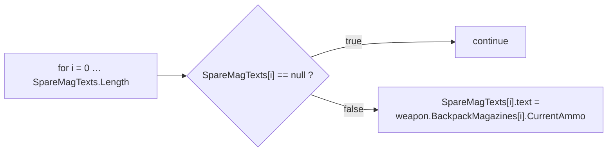
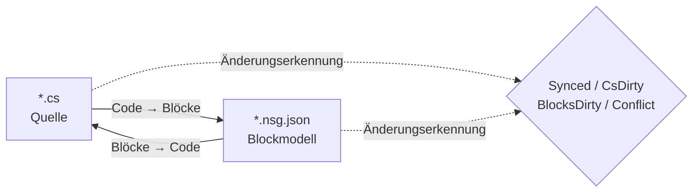

# NekoScriptGraph (NSG) — Schnell-Deploy & Handbuch

**Version** 1.0.1 · **Unity** 2022.3+ · **Autor** NekoAndreeva · **Lizenz** MIT · **Paket** `com.nekoandreeva.nekoscriptgraph`

> Visuelle Scratch-artige Programmierung für Unity, die **niemals etwas in deinen Code schreibt.**
> NSG schreibt eine Block-Konfigurationsdatei *neben* ein Skript, damit es als Blöcke editierbar wird, und übersetzt in beide Richtungen. Die erzeugte `.cs` enthält keine Spur des Plugins — lösche den Plugin-Ordner, und deine Skripte kompilieren weiter.

---

## Inhaltsverzeichnis

**Teil A — Schnell-Deploy**

1. [Globale API mit einem Klick](#1-one-click-global-api)
2. [Dein erstes Blockprogramm](#2-your-first-block-program)
3. [Der 10-Minuten-Einstiegspfad](#3-the-10-minute-onboarding-path)

**Teil B — Handbuch**

4. [Kernkonzepte](#4-core-concepts)
5. [Installation & Voraussetzungen](#5-install--requirements)
6. [Der Block-Editor](#6-the-block-editor)
7. [Menüreferenz](#7-menu-reference)
8. [API-Blöcke (ausführlich)](#8-api-blocks-deep-dive)
9. [Sprachen & eine hinzufügen](#9-languages--adding-one)
10. [Synchronisierung, kanonische Form & Ausweichrate](#10-sync-canonical-form--escape-ratio)
11. [Architekturqualität](#11-architecture-health)
12. [Lokalisierung](#12-localization)
13. [Agenten & MCP](#13-agents--mcp)
14. [ProgramNeko-Assistent (optional)](#14-programneko-assistant-optional)
15. [Einstellungen](#15-settings)
16. [Verzeichnisstruktur](#16-directory-layout)
17. [Deinstallation](#17-uninstall)
18. [Fehlerbehebung & FAQ](#18-troubleshooting--faq)
19. [Kontakt](#19-contact)

**Anhänge**

- [A. Schema für Blockdefinitionen](#appendix-a-block-definition-schema)
- [B. Schema für Sprachdeskriptoren](#appendix-b-language-descriptor-schema)
- [C. Einstellungsschlüssel](#appendix-c-settings-keys)

---
---

# TEIL A — SCHNELL-DEPLOY

Von „Ordner in Assets abgelegt“ zu „mit Blöcken Code schreiben“ in etwa zehn Minuten, mit fast keiner Tipparbeit.

<a id="1-one-click-global-api"></a>
## 1. Globale API mit einem Klick

**Die Idee:** dein Projekt enthält bereits Hunderte Methoden. NSG kann sie lesen und für jede einen **API-Block** prägen, sodass jede bereits geschriebene Methode zu einem Drag-and-Drop-Block in der Palette wird. Neuer Code entsteht dann durch das Zusammensetzen des Vokabulars *deines eigenen* Projekts.

### 1.1 So geht's

1. Bestätige, dass das Plugin kompiliert ist (keine roten Fehler in der Console; Unity 2022.3+).
2. Menü: **`NekoScriptGraph ▸ Build API Library for Whole Project`** (API-Bibliothek für das ganze Projekt erstellen).
3. NSG zählt die Quelldateien, die es scannen wird, und zeigt einen Bestätigungsdialog:

   > *API-Bibliothek für das ganze Projekt erstellen — N Quelldateien → `Assets/NekoScriptGraph/Blocks/API`. Fortfahren?*

4. Klicke auf **Continue (Fortfahren)**. In einem großen Projekt sind das Tausende von Blöcken, und es dauert einen spürbaren Moment — das ist erwartet, deshalb wird die Anzahl zuerst angezeigt.
5. Wenn es fertig ist, protokolliert die Console eine Zusammenfassung, und ein Dialog meldet die Gesamtzahlen:

   ```
   [NekoScriptGraph] API blocks: <generated> generated, <skipped> skipped.
   ```

6. Die Blockbibliothek wird **automatisch neu geladen**. Sonst ist nichts zu tun — die neuen Blöcke sind sofort live.

> **Umfang.** Der Scan deckt `Assets` für jede registrierte Sprache ab. C# nutzt `AssetDatabase` (`t:MonoScript`); C/C++/Rust/HLSL/usw. werden auf der Festplatte anhand der Dateiendung durchlaufen. `Dependencies/` und `.checkpoints/` sind immer ausgeschlossen.

### 1.2 Stattdessen nur ein Ordner

Arbeitest du an einem einzelnen Subsystem? Wähle im Project-Fenster einen Ordner aus und verwende:

**`NekoScriptGraph ▸ Generate API Blocks for Selected Folder`** (API-Blöcke für den gewählten Ordner erzeugen)

Dieselbe Maschinerie, kleinerer Wirkungskreis, viel schneller. Das ist der empfohlene erste Durchlauf — ziele auf den Ordner, gegen den du wirklich scripten willst.

### 1.3 Was du bekommst

Eine JSON-Datei pro geeigneter Methode, geschrieben in den Ordner aus `apiOutputFolder` (Standard `Assets/NekoScriptGraph/Blocks/API`):

```
Blocks/API/api.DecalUtils.ProjectNormals.5.json
Blocks/API/api.DecalManager.GetSpawner.3.json
Blocks/API/api.GPUDecalUtils.UpdateDrawIndirectCommandBuffer.3.json
```

Benennungsschema: `api.<Type>.<Method>.<arity>.json` — die **Arity** (Parameteranzahl) ist Teil der ID, damit Überladungen koexistieren können.

In der Palette landen sie unter der Kategorie **API** (`cat.api`), **untergruppiert nach deklarierendem Typ**:

| Palettengruppe | Enthält |
|---|---|
| `API` → `DecalUtils` | jede geeignete `DecalUtils`-Methode |
| `API` → `DecalManager` | jede geeignete `DecalManager`-Methode |
| `API` → *(freie Funktionen)* | Top-Level-Funktionen aus C / HLSL |

Nutze das Suchfeld der Palette, um eine sofort per Namen zu finden.

<a id="14-the-eligibility-rule-know-this-before-you-wonder"></a>
### 1.4 Die Eignungsregel (lies das, bevor du dich wunderst)

Ein **API-Block wird nur erzeugt, wenn** die Methode:

| Anforderung | Warum |
|---|---|
| `public` | Es ist öffentliche API |
| Keine Generika (`<…>` an der Methode oder ihrem Rückgabetyp) | Keine Laufzeit-Typinferenz in einem Block |
| Nicht `async` | Kein Scheduler zum Warten |
| **Keine `ref`- / `out`- / `in`- / `params`- / `this`-Parameter** | Out-Parameter bräuchten zusätzliche Sockets |
| **Keine Standardparameterwerte** (`=`) | Sockets sind alle erforderlich |
| Keine `where`-Constraints | Wie bei Generika |
| Kein Konstruktor | Es ist kein Methodenaufruf |

Alles, was das verletzt, wird still **übersprungen** — diese Zahl ist die Zahl „skipped“ in der Zusammenfassung.

<a id="15-static-vs-instance--the-one-asymmetry"></a>
### 1.5 Statisch vs. Instanz — die eine Asymmetrie

Das ist die wichtigste Einschränkung des gesamten API-Features:

| Methodenart | Blockverhalten | Umkehrbarkeit |
|---|---|---|
| **`static`** | Erkannt an gepunktetem Aufrufziel + Arity (`matchCall` + `matchArity`) | **Vollständig bidirektional** — Code ⇄ Blöcke |
| **Instanz** | Erhält einen zusätzlichen führenden `target`-Socket: `{0}.Method({1}, …)` | **Einweg** — druckt korrekt, liest beim Import aber wieder als generischer Aufrufblock |

> Faustregel: **statische APIs ergeben perfekte Blöcke.** Instanzmethoden liefern weiterhin einen korrekten, selbstdokumentierenden Aufruf, aber eine reine Block-Bearbeitung eines Instanzaufrufs wird nicht als spezifisch erkennbarer Block zurückgeführt. Bevorzuge `static`-Einstiegspunkte für alles, was du in Blöcken verfassen willst.

Freie Funktionen (C, HLSL) haben keinen Besitzertyp und gelten daher als statisch — vollständig bidirektional.

### 1.6 Disziplin beim Neuerzeugen

- **Nach Refactorings erneut ausführen.** Das Umbenennen einer Methode hinterlässt einen veralteten API-Block. Führe den Generator erneut aus und lösche Waisen, oder lösche einfach `Blocks/API/` und erzeuge von Grund auf neu.
- **Neuerzeugung ist idempotent.** IDs sind deterministisch; Duplikate werden als *übersprungen* gezählt, ein erneuter Lauf flutet den Ordner also nicht.
- **Es ist sicher, das zu committen.** `Blocks/API/*.json` sind Daten, kein Code. Sie zu committen bedeutet, dass Teammitglieder dein Blockvokabular erhalten, ohne neu zu scannen.

---

<a id="2-your-first-block-program"></a>
## 2. Dein erstes Blockprogramm

Ein konkreter End-to-End-Durchlauf. Wir bauen ein kleines Stück `CompassManager`-artiger Logik neu auf — „die Magazinanzahl ausgeben, bei leeren Slots `--` anzeigen“ — unter Verwendung von API-Blöcken.

### Schritt 1 — Eine Datei unter Verwaltung nehmen

1. Wähle im Project-Fenster eine `.cs`-Datei aus.
2. **`NekoScriptGraph ▸ Take Selected Script Under Management`** (Ausgewähltes Skript unter Verwaltung nehmen).

   Daneben erscheint eine Datei:

   ```
   Assets/Scripts/ChrControl/CompassManager.cs
   Assets/Scripts/ChrControl/CompassManager.nsg.json   ← the block model
   ```

   (Die `.nsg.json` ist im Project-Fenster standardmäßig verborgen — das ist ein Feature, kein Bug. `Cmd/Ctrl+Shift+H` schaltet sie um.)

### Schritt 2 — Editor öffnen

**`NekoScriptGraph ▸ Open Block Editor`** (Block-Editor öffnen). Die Datei öffnet sich als Tab.

### Schritt 3 — Deine Blöcke finden

Sieh dir den rechten Bereich an:

- **Palettensuche** — tippe `SpareMagTexts` oder `Count`, um zu filtern.
- Die Gruppe **API** enthält die in Teil A geprägten Blöcke.
- **Steuerung / Ausdrücke / Variablen / Struktur** enthalten die Sprachblöcke.

### Schritt 4 — Zusammensetzen

Ziehe Blöcke auf den Canvas. Die klassische Schleife:



Jeder erforderliche Socket, der leer bleibt, wird von **Architecture Health** (Architekturqualität) als `danglingInput` markiert.

### Schritt 5 — Zurückschreiben

Drücke **Generate** (Blöcke → Code) (oder nutze die Generieren-Schaltfläche der Werkzeugleiste). NSG druckt den Quellcode und meldet eines von:

| Status | Bedeutung |
|---|---|
| `Synced` | Code und Blockmodell stimmen überein |
| `Code changed` | Die `.cs` ist vorausgeeilt — erneut importieren |
| `Blocks changed` | Die Blöcke sind vorausgeeilt — Generate, um sie zu schreiben |
| `Conflict` | **Beide** Seiten wurden geändert — du entscheidest, wer gewinnt |

### Schritt 6 — Bestätigen, dass der Code sauber geblieben ist

Öffne die `.cs`. Es ist gewöhnliches C#. Keine Attribute, kein generierter Bereich, keine Plugin-Referenzen. Genau das ist der Punkt.

### Schritt 7 — Committen

Committe sowohl die `.cs` als auch die `.nsg.json`. Das Blockmodell ist ein normales Projekt-Asset.

> **Der erste Schreibvorgang formatiert neu.** Wenn eine Methode noch nicht in NSGs kanonischer Form war (fehlende Klammern, seltsame Einrückung, eine gleichwertige, aber andere Schreibweise), normalisiert der erste *Blöcke → Code*-Durchlauf sie. Die Semantik bleibt unverändert; die Formatierung ändert sich. Du wirst vorab gewarnt: *„N Methode(n) sind nicht in kanonischer Form…“*. Um überraschende Diffs zu vermeiden, siehe [§10](#10-sync-canonical-form--escape-ratio).

---

<a id="3-the-10-minute-onboarding-path"></a>
## 3. Der 10-Minuten-Einstiegspfad

Die komprimierte Checkliste. Ausdrucken, an den Monitor kleben.

| # | Aktion | Wo | ~Zeit |
|---|---|---|---|
| 1 | Das Plugin nach `Assets/` legen und kompilieren lassen | Unity | 1 Min. |
| 2 | Ordner auswählen → **Generate API Blocks for Selected Folder** | Menü | 1 Min. |
| 3 | **Take Selected Folder Under Management** | Menü | 1 Min. |
| 4 | **Open Block Editor** | Menü | 10 s |
| 5 | Die Palette nach einer eigenen Methode durchsuchen | Editor | 1 Min. |
| 6 | Drei Blöcke ziehen, verbinden, einen Socket leer lassen | Editor | 2 Min. |
| 7 | **Architecture Health** öffnen und den `danglingInput`-Befund lesen | Menü | 1 Min. |
| 8 | Beheben, indem ein Block in den Socket gezogen wird | Editor | 1 Min. |
| 9 | **Generate** drücken, Status `Synced` bestätigen | Editor | 30 s |
| 10 | Die `.cs` öffnen — prüfen, dass es sauberes C# ist | Editor | 20 s |
| 11 | `.cs` + `.nsg.json` committen | Git | 30 s |
| 12 | *(Optional)* **MCP Bridge: Start** und den Agenten auf `http://127.0.0.1:8765/` zeigen | Menü + Client | 2 Min. |

**Das mentale Modell in einer Zeile:** die `.cs` ist die Quelle der Wahrheit, die `.nsg.json` ist eine *Linse* darauf, und NSG hält Linse und Quelle in Übereinstimmung.

---
---

# TEIL B — HANDBUCH

<a id="4-core-concepts"></a>
## 4. Kernkonzepte

### 4.1 Verwaltete vs. freie Dateien

- **Freie Datei** — ein gewöhnliches Skript ohne danebenliegende `.nsg.json`.
- **Verwaltete Datei** — hat eine `.nsg.json`; sie kann als Blöcke geöffnet werden.

### 4.2 Nur Methodenkörper werden zu Blöcken

Die wichtigste Regel in NSG:

- `using`, Typdeklarationen, Felder, Attribute und Kommentare **außerhalb von Methodenkörpern** bleiben **wortgetreu** erhalten und überstehen beide Richtungen unangetastet.
- **Methodenkörper** werden in Blöcke geparst.
- Alles, was das Blockmodell nicht ausdrücken kann, bleibt als **rohes Fragment** erhalten und wird als Diagnose (`NSG0002`) gemeldet. **Nichts geht jemals still verloren.**

### 4.3 Das bidirektionale Sync-Modell



| Zustand | Bedeutung |
|---|---|
| `Synced` | Code und Blockmodell stimmen überein |
| `CsDirty` | Die `.cs` wurde geändert; das Modell hinkt hinterher |
| `BlocksDirty` | Die Blöcke wurden geändert; der Code wurde nicht neu geschrieben |
| `Conflict` | Beide Seiten wurden geändert — du musst den Gewinner wählen |
| `Unmanaged` | Keine Blockdatei |

NSG verfolgt, **welche Seite sich zuerst bewegt hat**, sodass du immer weißt, ob ein Drücken von Generate deine eigene Arbeit zerstören würde.

> Der MCP-/Agenten-Pfad ist bewusst **einweg: Code → Blöcke**. Der Agent schreibt gewöhnlichen Quellcode; das Plugin parst neu und baut das Modell neu auf.

---

<a id="5-install--requirements"></a>
## 5. Installation & Voraussetzungen

1. Unity **2022.3** oder neuer.
2. Lege den Ordner `NekoScriptGraph` unter `Assets/` (oder füge ihn als lokales Paket hinzu).
3. Das gesamte Paket ist durch eine **Editor-only-Assembly-Definition** eingegrenzt — es trägt **nichts** zu einem Player-Build bei.

### Optionale Teile (jeder ist als Einheit entfernbar)

| Ordner | Zweck | Wenn entfernt |
|---|---|---|
| `Dependencies/` | 9-Slice-gerundete Sprites | Fällt auf einfache abgerundete Ecken zurück; Paket ~1,4 MB |
| `LanguageSupport/{c,cpp,hlsl,java,python,rust}` | Nicht-C#-Sprachen | Diese Sprache verschwindet; sonst bricht nichts |
| `ProgramNeko/` | Pixel-Katzen-Assistentin | Plugin funktioniert auch ohne sie |
| `Locale/*` | UI-Übersetzungen | Diese Locale fällt auf Englisch zurück |

### Paketgröße

≈ **2,2 MB** im Auslieferungszustand:

| Teil | Größe |
|---|---|
| `Editor/` — Kern, UI, C#-Engine | ~0,9 MB |
| `Dependencies/Editor/Sprite/` — optionale 9-Slice-Sprites | ~0,86 MB |
| `Blocks/` — eingebaute Blockbibliothek (bei Bedarf neu erzeugt) | ~0,23 MB |
| `LanguageSupport/` — sieben Drop-in-Sprachen | ~0,21 MB |

---

<a id="6-the-block-editor"></a>
## 6. Der Block-Editor

Ein VS-Code-artiges Multi-Tab-Fenster, mindestens 980×600.

| Bereich | Inhalt |
|---|---|
| Tableiste | Mehrere Dokumente gleichzeitig geöffnet |
| Canvas | Das Skript als Blöcke — ziehen, verbinden, einklappen, zoomen, einpassen |
| Rechter Bereich | Blockpalette + Suche + Presets; die Breite wird gemerkt |
| Unten links | Statustext, Rückgängig/Wiederholen, Assistentenplatz (nur wenn installiert) |
| Werkzeugzeile | Bibliothek neu laden, Probleme, Qualitätsprüfung, Speicherpunkte, Git, Sprites |

### 6.1 Zwei Ansichtsmodi

| Ansicht | Stil | Am besten für |
|---|---|---|
| **Stapel (Scratch)** | Vertikale Anweisungsstapelung | Lehre, lineare Logik |
| **Blueprint (UE)** | Knotengraph | Datenfluss und Ausdrucksketten |

Umschalten mit dem Dropdown **Ansicht** (`view.stack` / `view.blueprint`).

### 6.2 Die Palette

- Gruppiert nach `categoryKey`, als Ganzes einklappbar (`Alle einklappen` / `Alle ausklappen`).
- Buchstabenindizes starten eingeklappt; manuell ausklappen.
- Das Suchfeld liegt bewusst **außerhalb** der Blockliste — die Liste wird bei jedem Tastendruck neu aufgebaut und würde sonst den Fokus verlieren.
- Du kannst ein ganzes **Preset** in den Canvas ziehen, nicht nur einen einzelnen Block.

**Eingebaute Kategorien:**

| Schlüssel | Label | Inhalt |
|---|---|---|
| `cat.ctrl` | Steuerung | `if`, `for`, `foreach`, `while`, `break`, `continue`, `return` |
| `cat.expr` | Ausdrücke | binary, unary, call, cast, conditional, ident, index, literal, member, new, postfix |
| `cat.var` | Variablen | lokale Variablen & Zuweisung |
| `cat.frame` | Struktur | Deklarationen |
| `cat.api` | API | erzeugte API-Blöcke (nach Typ gruppiert) |
| `cat.macro` | Eigene Blöcke | Benutzer-Presets |
| `cat.raw` | Notausgang | rohe Fragmente |

### 6.3 Speicherpunkte

Eingebaute Snapshots liegen in `.checkpoints/`, das **git-ignoriert** ist — es kann niemals mit deiner Repository-Historie in Konflikt geraten. Nimm einen vor einem großen *Blöcke → Code*-Schreibvorgang.

### 6.4 Blockdateien ausblenden

`hideBlockFiles` ist standardmäßig `true`, damit das Project-Fenster nicht mit `.nsg.json` geflutet wird.

- Menü: **`Toggle Block Files Visibility`** (Sichtbarkeit der Blockdateien umschalten) — globales Hotkey `Cmd/Ctrl+Shift+H`.
- Das Hotkey ist global: es funktioniert auch bei geschlossenem Plugin-Fenster.

### 6.5 Den ausgewählten Block erklären

`Cmd/Ctrl+Shift+E` (Menü **`Explain Selected Block`**, Ausgewählten Block erklären) bittet den Assistenten, den aktuellen Block zu erklären. Ebenfalls ein globales Hotkey.

---

<a id="7-menu-reference"></a>
## 7. Menüreferenz

> `[MenuItem]`-Beschriftungen sind Compile-Zeit-Konstanten, daher ist der **statische englische** Name das, was Unity ausliefert; die Lokalisierungsschicht ersetzt die übersetzten Labels beim Laden und beim Sprachwechsel. `MCP Bridge`-Einträge sind absichtlich englisch.

| Menüeintrag | Zweck |
|---|---|
| `Open Block Editor` | Das Hauptfenster öffnen |
| `Problems` | Diagnoseliste |
| `Assistant (ProgramNeko)` | Die Assistentin öffnen; warnt, wenn nicht installiert |
| `Explain Selected Block` `%#e` | Den ausgewählten Block erklären |
| `Architecture Health` | Das Qualitätsfenster öffnen |
| `Take Selected Script Under Management` | Eine Datei verwalten |
| `Release Selected Script` | Eine Datei freigeben |
| `Take Selected Folder Under Management` | Massenverwaltung |
| `Take Whole Project Under Management` | Alles verwalten |
| `Release Selected Folder` | Ordnerweise freigeben |
| `Release Whole Project` | Alles freigeben |
| `Generate API Blocks for Selected Folder` | Ordnerbezogenes API-Prägen |
| `Build API Library for Whole Project` | Globale API mit einem Klick (Teil A) |
| `Reload Block Library` | `Blocks/` neu einlesen |
| `Export Default Block Library` | Eingebaute Blöcke nach `Blocks/` schreiben |
| `Generate ShaderLab Shell` | Die äußere Shader-Struktur ausgeben |
| `Self Test: Round Trip` | Selbsttest der Roundtrip-Konsistenz |
| `Toggle Block Files Visibility` `%#h` | `.nsg.json` ein-/ausblenden |
| `Languages: Show Loaded` | Die Sprachregistrierung ausgeben |
| `MCP Bridge: Start` / `Stop` / `Copy Client URL` | Die MCP-Bridge |

---

<a id="8-api-blocks-deep-dive"></a>
## 8. API-Blöcke (ausführlich)

Teil A behandelt den Workflow. Hier kommt die Maschinerie.

### 8.1 Was der Generator ausgibt

Für jede geeignete Methode ein `NsgBlockDef`:

```jsonc
// Blocks/API/api.DecalUtils.ProjectNormals.5.json
{
  "id": "api.DecalUtils.ProjectNormals.5",
  "level": "high",
  "shape": "expression",                 // "statement" if return type is void
  "category": "DecalUtils",              // declaring type → palette sub-group
  "categoryKey": "cat.api",              // the "API" group
  "label": "DecalUtils.ProjectNormals({0}, {1}, {2}, {3}, {4})",
  "labelEn": "DecalUtils.ProjectNormals({0}, {1}, {2}, {3}, {4})",
  "labelRu": "DecalUtils.ProjectNormals({0}, {1}, {2}, {3}, {4})",
  "sockets": [
    { "name": "decalPosW", "kind": "expr", "required": true, "variadic": false, "choices": [] },
    { "name": "parents",   "kind": "expr", "required": true, "variadic": false, "choices": [] },
    { "name": "decalNorm", "kind": "expr", "required": true, "variadic": false, "choices": [] },
    { "name": "decalTform","kind": "expr", "required": true, "variadic": false, "choices": [] },
    { "name": "decalColor","kind": "expr", "required": true, "variadic": false, "choices": [] }
  ],
  "emit": "",
  "node": "call",
  "op": "",
  "color": "",
  "matchCall": "DecalUtils.ProjectNormals",  // dotted match target
  "matchArity": 5,                           // parameter count
  "builtin": true,
  "manual": "DecalUtils.ProjectNormals(decalPosW, parents, decalNorm, decalTform, decalColor) : Color[]",
  "variantGroup": "",
  "variantLabel": ""
}
```

Hinweise:

- **Socket-Namen** sind die echten Parameternamen — das Paletten-Label ist daher selbstdokumentierend.
- **`manual`** trägt die vollständige qualifizierte Signatur plus Rückgabetyp. Es ist der *Notausgang*: die manuelle Form des Blocks.
- **Instanzmethoden** erhalten einen zusätzlichen führenden Socket namens `target` (erforderlich), und das Label wird `{0}.Method({1}, …)` — daher die Einweg-Einschränkung in §1.5.
- **Freie Funktionen** (C/HLSL) haben keinen Besitzer und werden als `static` behandelt.

### 8.2 Determinismus und Deduplizierung

- Die ID ist `api.<QualifiedType>.<Method>.<arity>` — deterministisch über Läufe hinweg.
- Doppelte IDs werden als **übersprungen** gezählt, nie zweimal geschrieben.
- Ein erneuter Lauf nach Refactorings entfernt **keine** Waisen. Lösche `Blocks/API/` und erzeuge neu für einen sauberen Stand.

### 8.3 Mehrere Sprachen

`Build API Library for Whole Project` iteriert über die Sprachregistrierung und ruft `GenerateApiBlocks` jeder Engine auf. C# geht über `AssetDatabase`; C-artige Sprachen durchlaufen das Dateisystem anhand der Profilendungen und überspringen `.checkpoints/` und `Dependencies/`. Wenn eine Sprach-Engine nicht konstruiert werden kann, wird diese Sprache als fehlgeschlagen gezählt und der Rest fährt fort.

### 8.4 Praktische Hinweise

| Situation | Rat |
|---|---|
| Du willst Blöcke für ein Subsystem | Nutze die **Ordner**-Variante, nicht die Projekt-Variante |
| Du willst bidirektionale Blöcke | Stelle einen **`static`**-Einstiegspunkt bereit |
| Du hast `ref`/`out`/`params`-APIs | Sie werden übersprungen — kapsle sie in eine einfache statische Methode, wenn du Blöcke willst |
| Überladungen kollidieren in der Palette | Die **Arity** steckt in der ID und die Sockets unterscheiden; nach Namen suchen |
| Du hast eine Methode umbenannt | Neu erzeugen; die verwaiste JSON löschen |

---

<a id="9-languages--adding-one"></a>
## 9. Sprachen & eine hinzufügen

`C` · `C++` · `C#` · `Go` · `HLSL` · `Java` · `Rust` · `Python`

- Jede übersetzt **in beide Richtungen**.
- **C# ist eingebaut** (`Editor/Languages/CSharp/`: Lexer, Parser, Printer, Splitter, CodeMap).
- Die anderen sind **Drop-in-Ordner**. Lösche `LanguageSupport/<lang>/` und diese Sprache ist aus dem Plugin verschwunden, ohne etwas anderes zu beschädigen.

### Eine Sprache hinzufügen

Erstelle einen Ordner mit einem Deskriptor plus einer Engine:

```jsonc
// LanguageSupport/python/python.language.json
{
  "apiVersion": 1,
  "id": "python",
  "displayName": "Python",
  "icon": "PYTHON",
  "extensions": [".py"],
  "blocksFolder": "blocks",
  "engineType": "NekoScriptGraph.Nsg_PythonLanguage",
  "author": "",
  "note": "Self-contained language: its own engine, sharing only the block skeleton."
}
```

Dann implementiere die von `engineType` benannte Klasse (parsen, drucken, API-Block-Erzeugung) und füge den `blocks/`-Ordner der Sprache hinzu. Verwende `Nsg_PythonLanguage`, `Nsg_CLanguage`, `Nsg_RustLanguage` usw. als Referenzimplementierungen.

---

<a id="10-sync-canonical-form--escape-ratio"></a>
## 10. Synchronisierung, kanonische Form & Ausweichrate

### 10.1 Ausweichrate (Escape Ratio)

Der Anteil der **rohes-Fragment**-Blöcke. Er misst, wie viel des Codes wirklich als Blöcke modelliert ist.

- Steuere darüber mit `maxEscapeRatio: 0` (MCP), um eine *vollständige* Übersetzung in Blöcke zu verlangen.
- Alles, was der Parser nicht modellieren kann, bleibt wortgetreu erhalten und wird als **`NSG0002`** gemeldet.

### 10.2 Kanonische Form

Code, der eine einzige „Standardschreibweise“ hat. Der erste *Blöcke → Code*-Durchlauf normalisiert:

- fehlende Klammern,
- uneinheitliche Einrückung,
- gleichwertige, aber unterschiedliche Schreibweisen.

Die benutzersichtbare Warnung:

> *„N Methode(n) sind nicht in kanonischer Form (fehlende Klammern, uneinheitliche Einrückung oder mehrere gleichwertige Schreibweisen). Das erste „Blöcke → Code“ normalisiert sie; die Semantik bleibt, das Format ändert sich.“*

### 10.3 Der Fixpunkt

Iteriere, bis `canon(text) == text`. Sobald der Text ein Fixpunkt ist, bleibt das Dokument `Synced` und wird nie wieder neu formatiert. Genau das tut die Agentenschleife in §13, bevor sie auf die Festplatte schreibt.

---

<a id="11-architecture-health"></a>
## 11. Architekturqualität

Menü **`Architecture Health`** — mit einem ausgewählten Skript analysiert es diese Datei; andernfalls öffnet es leer.

**Kennzahlen:** Anzahl Blöcke/Anweisungen, Methodenanzahl, Ausweichrate (`escapes`) und eine zusammengesetzte `score`.

**Prüfungen:**

| Schlüssel | Bedeutung |
|---|---|
| `emptyBody` / `emptyMethod` | Leerer Körper / leere Methode |
| `constantCondition` | Immer-wahr- oder Immer-falsch-Bedingung |
| `cycle` | Aufruf- oder Abhängigkeitszyklus |
| `danglingInput` | Erforderlicher Socket unverbunden gelassen |
| `duplicate` | Duplizierter Code |
| `escapeRatio` | Hoher Anteil roher Fragmente |
| `expressionSize` | Übermäßig großer Ausdruck |
| `nesting` | Übermäßige Verschachtelung |
| `methodLength` | Methode zu lang |
| `memberChain` | Lange Member-Kette (`a.b.c.d.e`) |
| `magicNumber` | Magische Zahl |
| `placeholderName` / `shortName` | Platzhalter- / zu kurze Namen |
| `unusedLocal` | Ungenutzte lokale Variable |
| `afterReturn` | Code nach `return` |
| `leak` | Vermutetes Leck |

**Korrekturvorschläge:** `fixBreakLink`, `fixFillZero`, `fixAddRelease`, `fixApply`, `rerun`.

---

<a id="12-localization"></a>
## 12. Lokalisierung

**15 UI-Locales:**

Vereinfachtes Chinesisch · Traditionelles Chinesisch · Englisch · Französisch · Deutsch · **Italienisch** · Russisch · Spanisch · Portugiesisch · Japanisch · Koreanisch · Polnisch · Türkisch · Arabisch · Hebräisch

- **Arabisch und Hebräisch spiegeln den gesamten Editor**: die Palette wandert nach links und Blöcke wachsen nach links (RTL).
- Unitys eigene Menüleiste bleibt **bewusst** englisch.
- Strings liegen in `Locale/<code>/strings.json`, gegliedert nach Schlüssel (`ui`, `blocks`, …). Das Blockvokabular nutzt den Abschnitt `blocks`, z. B. `c.assert` → `assert {0}`.

---

<a id="13-agents--mcp"></a>
## 13. Agenten & MCP

NSG liefert einen **MCP-Server, der im Unity Editor läuft**: JSON-RPC 2.0 über den MCP-**Streamable-HTTP**-Transport. **Es gibt keinen Sidecar-Prozess und keine zusätzliche Laufzeit — kein Node, kein Python. Der Editor *ist* der Server.**

```
MCP client ──HTTP POST JSON-RPC──▶ 127.0.0.1:8765 ──▶ Unity Editor
```

### 13.1 Starten

Menü **`NekoScriptGraph ▸ MCP Bridge: Start`**:

```
[NekoScriptGraph] MCP bridge listening on http://127.0.0.1:8765/
```

- Merkt sich, dass er an war, und **startet automatisch neu** nach einem Domain-Reload oder Editor-Neustart.
- Stoppen mit **`MCP Bridge: Stop`**; die URL kopieren mit **`MCP Bridge: Copy Client URL`**.
- Manuell prüfen — kein Client erforderlich:

```bash
curl -s http://127.0.0.1:8765/ -d '{"jsonrpc":"2.0","id":1,"method":"tools/list"}'
```

Ein einfaches `GET /` liefert eine Statusseite mit der Serverversion, den unterstützten Protokollrevisionen und den verfügbaren Tools.

### 13.2 Den Client darauf zeigen

Jeder Streamable-HTTP-MCP-Client funktioniert. Die Konfigurationsform variiert leicht (`type` bei manchen, `transport` bei anderen, eine bloße `url` bei einigen):

```json
{
  "mcpServers": {
    "nekoscriptgraph": {
      "type": "http",
      "url": "http://127.0.0.1:8765/"
    }
  }
}
```

VS Code verwendet `servers` statt `mcpServers`; der Eintrag ist ansonsten derselbe.

Wenn dein Client nur **stdio** spricht, setze einen HTTP↔stdio-Proxy davor (z. B. `npx mcp-remote http://127.0.0.1:8765/`). Dieser Proxy ist Sache des Clients, nicht des Plugins.

> Der alte HTTP+SSE-Transport (`GET /sse`) ist **nicht** implementiert. Die Bridge bedient Streamable HTTP, Protokollrevision `2025-03-26` und neuer, und akzeptiert außerdem `2024-11-05`-Clients, die an dieselbe URL POSTen.

### 13.3 Die sieben Tools

| Tool | Schreibt? | Was es tut |
|---|---|---|
| `nsg_writing_spec` | nein | Die kanonische Schreib-Teilmenge für eine Sprache, erzeugt aus der Blockbibliothek und dem Printer |
| `nsg_verify` | nein | Zustand einer Datei auf der Festplatte: `Synced`, `CsDirty`, `BlocksDirty`, `Conflict`, `Unmanaged` |
| `nsg_plan` | nein | Kandidatencode parsen, Diagnosen, Blockanzahlen, Ausweichrate, kanonisch? melden |
| `nsg_canon` | nein | Kanonischer Text — das Fixpunkt-Orakel |
| `nsg_apply` | **ja** | Die `.nsg.json` neu aufbauen und den kanonischen Quellcode schreiben |
| `nsg_list_managed` | nein | Jede `.nsg.json` unter einem Ordner |
| `nsg_release` | **ja** | Diese `.nsg.json`-Dateien löschen (saubere Deinstallation) |

### 13.4 Die beabsichtigte Schleife — Code → Blöcke

1. `nsg_writing_spec` einmal, um die Teilmenge für die Sprache zu lernen.
2. Die `.cs` bearbeiten (oder den Text einfach im Gespräch halten).
3. `nsg_plan` — Diagnosen, Blockanzahlen, Ausweichrate. **Schreibt nichts, braucht keinen Compile**, ist also sicher bei Code, der noch nicht baut.
4. Wenn `canonical` false ist, `nsg_canon` aufrufen und iterieren, bis `canon(text) == text`. Das ist der Fixpunkt: dort angekommen, bleibt das Dokument `Synced` und nichts wird später neu formatiert.
5. `nsg_apply` — schreibt die kanonische `.cs` und die neu aufgebaute `.nsg.json`.

Steuere die Ausweichrate mit `maxEscapeRatio: 0`, um eine vollständige Übersetzung in Blöcke zu verlangen.

```json
{"jsonrpc":"2.0","id":1,"method":"tools/call","params":{
  "name":"nsg_plan",
  "arguments":{"file":"Assets/Scripts/CompassManager.cs","maxEscapeRatio":0.0}}}
```

`nsg_plan`, `nsg_canon` und `nsg_apply` akzeptieren außerdem `source`, sodass der Agent Text validieren kann, bevor er überhaupt die Festplatte erreicht:

```json
{"jsonrpc":"2.0","id":2,"method":"tools/call","params":{
  "name":"nsg_canon",
  "arguments":{"file":"Assets/Scripts/Foo.cs","source":"class Foo { void A(){ } }"}}}
```

### 13.5 Sicherheit

Die Bridge schreibt Dateien in dein Projekt, daher ist sie bewusst eng gefasst:

- Bindet **nur an `127.0.0.1`** — niemals an eine routbare Schnittstelle.
- Anfragen mit einem **`Origin`**-Header werden mit **`403`** abgelehnt. Browser senden immer `Origin`; native MCP-Clients nie — daher kann **keine in deinem Browser offene Seite die Bridge erreichen**. Wenn du wirklich einen Browser-Client brauchst, lockere es mit `Nsg_McpBridge.SetAllowOrigin(true)`.
- Der Server ist **aus, bis du ihn startest**, und stoppt beim Beenden.

### 13.6 Fehlerbehebung

| Symptom | Ursache / Lösung |
|---|---|
| Der Editor hat nicht rechtzeitig geantwortet | Die Bridge marshallt jeden Aufruf auf den Hauptthread, und Unity führt `EditorApplication.update` während des Kompilierens oder Domain-Reloads nicht aus. Während einer Neukompilierung gesendete Anfragen warten und schlagen dann nach **60 Sekunden** fehl. Einfach erneut versuchen |
| Port bereits belegt | Ein anderer Prozess hält `8765`. Ändere ihn mit `Nsg_McpBridge.SetPort(n)` oder schließe den anderen Listener |
| Die Tools fehlen | Prüfe, ob das Plugin kompiliert ist — `Nsg_Json`, `Nsg_Mcp` und `Nsg_McpBridge` sind gewöhnliche Editor-Skripte, die keine Einrichtung brauchen. `GET /` listet die aktuell angebotenen Tools auf |

### 13.7 Ohne MCP verwenden

Die Bridge ist ein reiner JSON-RPC-Endpunkt; dieselben Operationen sind ganz ohne Protokoll verfügbar:

- **Headless / CI**

```bash
Unity -batchmode -quit -projectPath <project> \
      -executeMethod NekoScriptGraph.Nsg_AgentCli.Main \
      -nsgRequest req.json -nsgResponse resp.json
```

- **Im Code** — `Nsg_AgentApi.Run(request)`, plus `Nsg_Mcp.Handle(jsonString)` nur für die Protokollschicht.

---

<a id="14-programneko-assistant-optional"></a>
## 14. ProgramNeko-Assistent (optional)

`ProgramNeko/` ist eine optionale Pixel-Katzen-Assistentin. **Lösche den ganzen Ordner und das Plugin funktioniert weiter.**

- Menü **`Assistant (ProgramNeko)`** öffnet sie. Es ist *dasselbe* Fenster wie Probleme: ohne sie ist es nur eine Fehlerliste; mit ihr sitzt die Katze oben und spricht unten.
- `Cmd/Ctrl+Shift+E` bittet sie, den ausgewählten Block zu erklären.
- Sie hat ihre eigene Lokalisierung: `ProgramNeko/Locale/<code>/neko.json` (15 Locales).
- Manifest: `ProgramNeko/programneko.json`.

---

<a id="15-settings"></a>
## 15. Einstellungen

`Assets/NekoScriptGraph/NekoScriptGraph.settings.json`:

```jsonc
{
  "viewMode": 0,                        // 0 = Stack (Scratch), 1 = Blueprint (UE)
  "hideBlockFiles": true,               // hide .nsg.json by default
  "useSprites": false,                  // 9-slice sprites
  "headerSprite": "block_header",
  "bodySprite": "block_body",
  "footerSprite": "block_footer",
  "exprSprite": "block_expr",
  "bodyIndent": 14,                     // body indent
  "cornerRadius": 6,
  "footerHeight": 10,
  "rightPaneWidth": 240.0,              // remembered after you drag it
  "presetPaneHeight": 200.0,
  "shaderPipeline": "auto",             // auto / ...
  "apiOutputFolder": "Assets/NekoScriptGraph/Blocks/API"
}
```

Presets (Mehrblock-Drag-Bündel) liegen in `.presets/presets.json`, `schemaVersion: 1`, jeder Eintrag zeichnet `name`, `createdAt`, `blockCount`, `languageId` und ein `nodes`-Array auf.

---

<a id="16-directory-layout"></a>
## 16. Verzeichnisstruktur

```
NekoScriptGraph/
├─ Editor/
│  ├─ Core/                      engine core
│  │  ├─ Esketamine/             AST, parse/print, block library, diagnostics,
│  │  │                          settings, MCP, agent API, L10n, undo, checkpoints
│  │  └─ cstyle/                 C-style engine, shader pipeline, agent spec
│  ├─ Languages/CSharp/          lexer / parser / printer / splitter / code map
│  ├─ UI/                        main window, block view, blueprint view, health,
│  │                             error window, RTL, picker, name dialog
│  ├─ Nsg_Menu.cs                menu items
│  ├─ Nsg_McpBridge.cs           MCP HTTP bridge
│  ├─ Nsg_AgentCli.cs            headless CLI
│  └─ Nsg_SelfTest.cs            round-trip self test
├─ Blocks/                       built-in block library + API/*.json
├─ LanguageSupport/{c,cpp,hlsl,java,python,rust}/
├─ Locale/{15 locales}/strings.json
├─ Dependencies/Editor/Sprite/   optional 9-slice sprites
├─ ProgramNeko/                  optional assistant
├─ .presets/presets.json
├─ NekoScriptGraph.settings.json
├─ MCP.md                        dedicated MCP chapter
└─ package.json                  com.nekoandreeva.nekoscriptgraph v1.0.1
```

---

<a id="17-uninstall"></a>
## 17. Deinstallation

Nicht invasiv, zwei Wege:

1. **Menü** — `Release Selected Script` / `Release Selected Folder` / `Release Whole Project`, oder die UI-Schaltflächen **Freigeben (Release)** / **Alle freigeben (Release All)** / **Ordner freigeben (Release Folder)**.
2. Lösche alle `.nsg.json`-Dateien unter dem gewählten Ordner oder im ganzen Projekt.

**Quelldateien werden nie angefasst.** Danach bleibt nur der Plugin-Ordner selbst übrig — lösche ihn und du bist fertig.

---

<a id="18-troubleshooting--faq"></a>
## 18. Fehlerbehebung & FAQ

**Enthält die erzeugte `.cs` Plugin-Spuren?**
Nein. Lösche den Plugin-Ordner und das Skript kompiliert weiter.

**Warum werden `using`, Felder oder Attribute nicht zu Blöcken?**
Absichtlich. Nur Methodenkörper nehmen an der Blockübersetzung teil; alles andere bleibt in beide Richtungen wortgetreu erhalten.

**Warum wurde meine Datei neu formatiert?**
Sie war nicht in kanonischer Form. Der erste *Blöcke → Code*-Durchlauf normalisiert Klammern und Einrückung; die Semantik bleibt unverändert. Iteriere mit `nsg_canon` zuerst zu einem Fixpunkt, wenn du null Formatierungsänderungen willst.

**Einige Anweisungen wurden zu „rohen Fragmenten“ — warum?**
Sie liegen außerhalb der schreibbaren Teilmenge für diese Sprache. NSG bewahrt sie wortgetreu und meldet `NSG0002`, statt sie zu verwerfen. Nutze `maxEscapeRatio`, um daraus ein hartes Gate zu machen.

**Warum sind die `MCP Bridge`-Menüeinträge englisch?**
Absichtlich — Unitys Menüleiste nimmt nicht an der Plugin-Lokalisierung teil, und übersetzte mit unübersetzten Einträgen zu mischen wäre schlimmer.

**Kann ich nur einen Ordner verwalten?**
Ja: **`Take Selected Folder Under Management`**.

**Zu viele Blockdateien verstopfen das Project-Fenster?**
Sie sind standardmäßig verborgen; umschalten mit `Cmd/Ctrl+Shift+H`.

**Meine API-Blöcke sind nach einer Umbenennung veraltet.**
Die Neuerzeugung entfernt keine Waisen. Lösche `Blocks/API/` und erzeuge neu.

**Ein erwarteter API-Block fehlt.**
Die Methode hat die Eignungsprüfung nicht bestanden — am häufigsten `ref`/`out`/`params`, ein Standardparameterwert, ein Generikum oder `async`. Siehe [§1.4](#14-the-eligibility-rule-know-this-before-you-wonder).

**Ein API-Block einer Instanzmethode lässt sich nicht zurückführen.**
Erwartet. Nur `static`-Methoden sind vollständig bidirektional; Instanzmethoden tragen einen `target`-Socket und sind einweg. Siehe [§1.5](#15-static-vs-instance--the-one-asymmetry).

---

<a id="19-contact"></a>
## 19. Kontakt

Autor: **NekoAndreeva**

- E-Mail: elenaandreevasvinolup@gmail.com
- WhatsApp: +852 5247 4163
- GitHub: `https://github.com/elenaandreevasvinolup-alt`

---
---

<a id="appendix-a-block-definition-schema"></a>
## Anhang A. Schema für Blockdefinitionen

`Blocks/<id>.json` — eine Datei pro Block.

| Feld | Typ | Hinweise |
|---|---|---|
| `id` | string | Eindeutig, zugleich die Palettenidentität; `api.<Type>.<Method>.<arity>` für erzeugte Blöcke |
| `level` | string | `high` (Anweisungsebene) / anderes |
| `shape` | string | `control` · `statement` · `expression` |
| `category` | string | Anzeigegruppe; bei API-Blöcken ist es der deklarierende Typ |
| `categoryKey` | string | Lokalisierungsschlüssel der Gruppe: `cat.ctrl`, `cat.expr`, `cat.var`, `cat.frame`, `cat.api`, `cat.macro`, `cat.raw` |
| `label` | string | Paletten-Label mit `{0}`, `{1}`…-Slots |
| `labelEn` / `labelRu` | string | Labels pro Sprache |
| `sockets` | array | `{ name, kind, required, variadic, choices[] }` |
| `emit` | string | Benutzerdefinierte Emit-Vorlage (leer = Engine-Standard) |
| `node` | string | AST-Knoten, dem es zugeordnet ist: `if`, `call`, `binary`, … |
| `op` | string | Operator, wenn relevant |
| `color` | string | Optionale Überschreibung |
| `matchCall` | string | Gepunktetes Aufrufziel zur Erkennung beim Import |
| `matchArity` | int | Zuzuordnende Parameteranzahl (`-1` = beliebig) |
| `builtin` | bool | Mit dem Plugin ausgeliefert |
| `manual` | string | Vollständige manuelle Form / Signatur, verwendet im manuellen Eintrag des Blocks |
| `variantGroup` / `variantLabel` | string | Variantengruppierung |

**Eingebaute Anweisungs-/Ausdrucksblöcke:** `stmt.if`, `stmt.for`, `stmt.foreach`, `stmt.while`, `stmt.break`, `stmt.continue`, `stmt.return`, `stmt.localDecl`, `stmt.assign`, `stmt.expr`, `stmt.add`, `stmt.sub`, `stmt.mul`, `stmt.div`, `stmt.mod`, `stmt.raw`, und Ausdrücke `expr.binary`, `expr.unary`, `expr.call`, `expr.cast`, `expr.conditional`, `expr.ident`, `expr.index`, `expr.literal`, `expr.member`, `expr.new`, `expr.postfix`, `expr.raw`.

<a id="appendix-b-language-descriptor-schema"></a>
## Anhang B. Schema für Sprachdeskriptoren

`LanguageSupport/<id>/<id>.language.json`:

| Feld | Typ | Hinweise |
|---|---|---|
| `apiVersion` | int | Derzeit `1` |
| `id` | string | `c`, `cpp`, `csharp`, `hlsl`, `java`, `python`, `rust` |
| `displayName` | string | Wird in der UI angezeigt |
| `icon` | string | Badge-Text, z. B. `PYTHON` |
| `extensions` | string[] | z. B. `[".py"]` |
| `blocksFolder` | string | Relativer Blockordner, z. B. `blocks` |
| `engineType` | string | Vollqualifizierte Engine-Klasse, z. B. `NekoScriptGraph.Nsg_PythonLanguage` |
| `author` | string | Optional |
| `note` | string | Optionale Beschreibung |

<a id="appendix-c-settings-keys"></a>
## Anhang C. Einstellungsschlüssel

Siehe [§15](#15-settings). Die einzigen Schlüssel, die du wahrscheinlich änderst: `viewMode`, `hideBlockFiles`, `useSprites`, `apiOutputFolder`, `shaderPipeline`.

---

# Dieses Dokument als PDF exportieren

Kein `pandoc`, `node` oder `npx` ist derzeit auf dieser Maschine installiert. Optionen:

**A. Eingebautes macOS (null Installation, am schnellsten)**
Speichere das Markdown, rendere es nach HTML (VS Code Markdown-Vorschau oder Typora), öffne es in Safari und dann **Datei ▸ Drucken… (⌘P) ▸ PDF ▸ Als PDF sichern**.

**B. Homebrew + pandoc (beste Typografie)**

```bash
brew install pandoc
brew install --cask basictex        # or mactex-no-gui
pandoc GUIDE.md -o NSG-GUIDE.pdf \
  --pdf-engine=xelatex \
  -V mainfont="Helvetica Neue" \
  -V monofont="Menlo" \
  -V geometry:margin=2cm \
  --toc --toc-depth=2 -N
```

**C. VS Code-Erweiterung**
Installiere `Markdown PDF` (yzane) oder `Markdown Preview Enhanced`, dann Rechtsklick auf die Datei → **Markdown PDF: Export (pdf)**.
