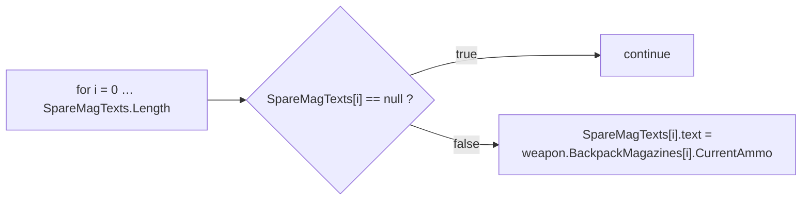
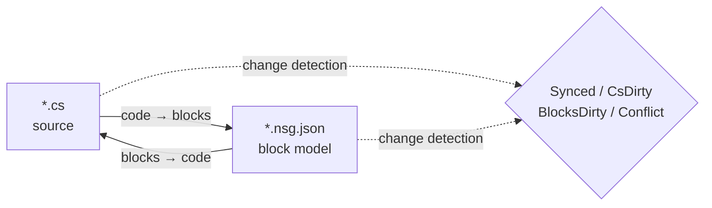

# NekoScriptGraph (NSG) — Quick Deploy & Handbook

**Version** 1.0.2 · **Unity** 2022.3+ · **Author** NekoAndreeva · **License** MIT · **Package** `com.nekoandreeva.nekoscriptgraph`

> Scratch-style visual programming for Unity that **never puts anything into your code.**
> NSG writes a block configuration file *next to* a script to make it editable as blocks, and translates in both directions. The generated `.cs` contains no trace of the plugin — delete the plugin folder and your scripts still compile.

---

## Table of Contents

**Part A — Quick Deploy**

1. [One-Click Global API](#1-one-click-global-api)
2. [Your First Block Program](#2-your-first-block-program)
3. [The 10-Minute Onboarding Path](#3-the-10-minute-onboarding-path)

**Part B — Handbook**

4. [Core Concepts](#4-core-concepts)
5. [Install & Requirements](#5-install--requirements)
6. [The Block Editor](#6-the-block-editor)
7. [Menu Reference](#7-menu-reference)
8. [API Blocks (Deep Dive)](#8-api-blocks-deep-dive)
9. [Languages & Adding One](#9-languages--adding-one)
10. [Sync, Canonical Form & Escape Ratio](#10-sync-canonical-form--escape-ratio)
11. [Architecture Health](#11-architecture-health)
12. [Localization](#12-localization)
13. [Agents & MCP](#13-agents--mcp)
14. [ProgramNeko Assistant (Optional)](#14-programneko-assistant-optional)
15. [Settings](#15-settings)
16. [Directory Layout](#16-directory-layout)
17. [Uninstall](#17-uninstall)
18. [Troubleshooting & FAQ](#18-troubleshooting--faq)
19. [Contact](#19-contact)

**Appendices**

- [A. Block Definition Schema](#appendix-a-block-definition-schema)
- [B. Language Descriptor Schema](#appendix-b-language-descriptor-schema)
- [C. Settings Keys](#appendix-c-settings-keys)

---
---

# PART A — QUICK DEPLOY

Get from "folder dropped in Assets" to "writing code with blocks" in about ten minutes, with almost no typing.

## 1. One-Click Global API

**The idea:** your project already contains hundreds of methods. NSG can read them and mint an **API block** for each one, so that every method you already wrote becomes a drag-and-drop block in the palette. New code then gets written by assembling *your own* project's vocabulary.

### 1.1 Do it

1. Confirm the plugin compiled (no red errors in the Console; Unity 2022.3+).
2. Menu: **`NekoScriptGraph ▸ Build API Library for Whole Project`**.
3. NSG counts the source files it will scan and shows a confirmation dialog:

   > *Build API library for the whole project — N source files → `Assets/NekoScriptGraph/Blocks/API`. Continue?*

4. Click **Continue**. On a large project this is thousands of blocks and takes a noticeable moment — that is expected, which is why the count is shown first.
5. When it finishes, the Console logs a summary and a dialog reports the totals:

   ```
   [NekoScriptGraph] API blocks: <generated> generated, <skipped> skipped.
   ```

6. The block library is **reloaded automatically**. Nothing else to do — the new blocks are live.

> **Scope.** The scan covers `Assets` for every registered language. C# uses `AssetDatabase` (`t:MonoScript`); C/C++/Rust/HLSL/etc. are walked on disk by file extension. `Dependencies/` and `.checkpoints/` are always excluded.

### 1.2 Just one folder instead

Working on a single subsystem? Select a folder in the Project window and use:

**`NekoScriptGraph ▸ Generate API Blocks for Selected Folder`**

Same machinery, smaller blast radius, much faster. This is the recommended first run — target the folder you actually want to script against.

### 1.3 What you get

One JSON file per eligible method, written to the folder in `apiOutputFolder` (default `Assets/NekoScriptGraph/Blocks/API`):

```
Blocks/API/api.DecalUtils.ProjectNormals.5.json
Blocks/API/api.DecalManager.GetSpawner.3.json
Blocks/API/api.GPUDecalUtils.UpdateDrawIndirectCommandBuffer.3.json
```

Naming scheme: `api.<Type>.<Method>.<arity>.json` — the **arity** (parameter count) is part of the ID so overloads coexist.

Inside the palette they land under the **API** category (`cat.api`), **sub-grouped by declaring type**:

| Palette group | Contains |
|---|---|
| `API` → `DecalUtils` | every eligible `DecalUtils` method |
| `API` → `DecalManager` | every eligible `DecalManager` method |
| `API` → *(free functions)* | C / HLSL top-level functions |

Use the palette search box to find one instantly by name.

### 1.4 The eligibility rule (know this before you wonder)

An **API block is generated only when** the method is:

| Requirement | Why |
|---|---|
| `public` | It is public API |
| No generics (`<…>` on the method or its return type) | No runtime type inference in a block |
| No `async` | No scheduler to await on |
| **No `ref` / `out` / `in` / `params` / `this`** parameters | Out-params would need extra sockets |
| **No default parameter values** (`=`) | Sockets are all required |
| No `where` constraints | Same as generics |
| Not a constructor | It is not a method call |

Anything failing these is silently **skipped** — that count is the "skipped" number in the summary.

### 1.5 Static vs instance — the one asymmetry

This is the single most important caveat in the whole API feature:

| Method kind | Block behavior | Reversibility |
|---|---|---|
| **`static`** | Matched by dotted call target + arity (`matchCall` + `matchArity`) | **Fully bidirectional** — code ⇄ blocks |
| **instance** | Gets an extra leading `target` socket: `{0}.Method({1}, …)` | **One-way** — prints correctly, but on import it re-reads as a generic call block |

> Rule of thumb: **static APIs make perfect blocks.** Instance methods still give you a correct, self-documenting call, but a block-only edit of an instance call will not round-trip back into a specifically recognisable block. Prefer `static` entry points for anything you intend to author in blocks.

Free functions (C, HLSL) have no owner type and are therefore treated as static — fully bidirectional.

### 1.6 Rebuild discipline

- **Re-run after refactors.** Renaming a method leaves a stale API block behind. Re-run the generator and delete orphans, or just delete `Blocks/API/` and regenerate from scratch.
- **Regeneration is idempotent.** IDs are deterministic; duplicates are counted as *skipped*, so re-running will not spam the folder.
- **It is safe to commit.** `Blocks/API/*.json` is data, not code. Committing it means teammates get your block vocabulary without re-scanning.

---

## 2. Your First Block Program

A concrete end-to-end walkthrough. We will rebuild a small piece of `CompassManager`-style logic — "print the magazine count, showing `--` for empty slots" — using API blocks.

### Step 1 — Put one file under management

1. Select a `.cs` file in the Project window.
2. **`NekoScriptGraph ▸ Take Selected Script Under Management`**.

   A file appears beside it:

   ```
   Assets/Scripts/ChrControl/CompassManager.cs
   Assets/Scripts/ChrControl/CompassManager.nsg.json   ← the block model
   ```

   (The `.nsg.json` is hidden in the Project window by default — that is a feature, not a bug. `Cmd/Ctrl+Shift+H` toggles it.)

### Step 2 — Open the editor

**`NekoScriptGraph ▸ Open Block Editor`**. The file opens as a tab.

### Step 3 — Find your blocks

Look at the right pane:

- **Palette search** — type `SpareMagTexts` or `Count` to filter.
- The **API** group holds the blocks minted in Part A.
- **Control / Expressions / Variables / Structure** hold the language blocks.

### Step 4 — Assemble

Drag blocks onto the canvas. The classic loop:



Every required socket that is left empty is flagged by **Architecture Health** as `danglingInput`.

### Step 5 — Write it back

Press **Generate** (or use the toolbar's generate button). NSG prints the source and reports one of:

| Status | Meaning |
|---|---|
| `Synced` | Code and block model agree |
| `Code changed` | The `.cs` moved ahead — re-import |
| `Blocks changed` | Blocks moved ahead — Generate to write them |
| `Conflict` | **Both** sides changed — you choose which wins |

### Step 6 — Confirm the code stayed clean

Open the `.cs`. It is ordinary C#. No attributes, no generated region, no plugin references. That is the whole point.

### Step 7 — Commit

Commit both the `.cs` and the `.nsg.json`. The block model is a normal project asset.

> **First write reformats.** If a method was not already in NSG's canonical form (missing braces, odd indentation, an equivalent-but-different spelling), the first *blocks → code* pass normalises it. Semantics are unchanged; formatting changes. You are warned in advance: *"N method(s) are not in canonical form…"*. To avoid surprise diffs, see [§10](#10-sync-canonical-form--escape-ratio).

---

## 3. The 10-Minute Onboarding Path

The condensed checklist. Print it, tape it to the monitor.

| # | Action | Where | ~Time |
|---|---|---|---|
| 1 | Drop the plugin into `Assets/` and let it compile | Unity | 1 min |
| 2 | Select a folder → **Generate API Blocks for Selected Folder** | Menu | 1 min |
| 3 | **Take Selected Folder Under Management** | Menu | 1 min |
| 4 | **Open Block Editor** | Menu | 10 s |
| 5 | Search the palette for one of your own methods | Editor | 1 min |
| 6 | Drag three blocks, connect them, leave one socket empty | Editor | 2 min |
| 7 | Open **Architecture Health** and read the `danglingInput` finding | Menu | 1 min |
| 8 | Fix it by dragging a block into the socket | Editor | 1 min |
| 9 | Press **Generate**, confirm status is `Synced` | Editor | 30 s |
| 10 | Open the `.cs` — verify it is clean C# | Editor | 20 s |
| 11 | Commit `.cs` + `.nsg.json` | Git | 30 s |
| 12 | *(Optional)* **MCP Bridge: Start** and point your agent at `http://127.0.0.1:8765/` | Menu + client | 2 min |

**The mental model in one line:** the `.cs` is the source of truth, the `.nsg.json` is a *lens* over it, and NSG keeps the lens and the source in agreement.

---
---

# PART B — HANDBOOK

## 4. Core Concepts

### 4.1 Managed vs free files

- **Free file** — an ordinary script with no `.nsg.json` beside it.
- **Managed file** — has a `.nsg.json`; it can be opened as blocks.

### 4.2 Only method bodies become blocks

The most important rule in NSG:

- `using`, type declarations, fields, attributes, and comments **outside method bodies** are preserved **verbatim** and survive both directions untouched.
- **Method bodies** are parsed into blocks.
- Anything the block model cannot express is preserved as a **raw snippet** and reported as a diagnostic (`NSG0002`). **Nothing is ever silently lost.**

### 4.3 The bidirectional sync model



| State | Meaning |
|---|---|
| `Synced` | Code and block model agree |
| `CsDirty` | The `.cs` changed; the model is behind |
| `BlocksDirty` | The blocks changed; the code has not been rewritten |
| `Conflict` | Both sides changed — you must choose the winner |
| `Unmanaged` | No block file |

NSG tracks **which side moved first**, so you always know whether pressing Generate would destroy your own work.

> The MCP/agent path is deliberately **one-way: code → blocks**. The agent writes ordinary source; the plugin re-parses and rebuilds the model.

---

## 5. Install & Requirements

1. Unity **2022.3** or newer.
2. Place the `NekoScriptGraph` folder under `Assets/` (or add it as a local package).
3. The whole package is scoped by an **Editor-only assembly definition** — it contributes **nothing** to a player build.

### Optional parts (each is removable as a unit)

| Folder | Purpose | If removed |
|---|---|---|
| `Dependencies/` | 9-slice rounded sprites | Falls back to plain rounded corners; package ~3.3 MB |
| `LanguageSupport/{c,cpp,go,hlsl,java,python,rust,swift}` | Non-C# languages | That language disappears; nothing else breaks |
| `ProgramNeko/` | Pixel cat assistant | Plugin works fine without her |
| `Locale/*` | UI translations | That locale falls back to English |

### Package size

≈ **4.2 MB** as shipped:

| Part | Size |
|---|---|
| `Editor/` — core, UI, C# engine, settings | ~1.4 MB |
| `Dependencies/Editor/Sprite/` — optional 9-slice sprites | ~0.86 MB |
| `Documents/` — this guide in 15 languages | ~0.7 MB |
| `Locale/` — 15 interface languages | ~0.7 MB |
| `LanguageSupport/` — eight drop-in languages | ~0.24 MB |
| `Blocks/` — built-in block library (regenerated on demand) | ~0.23 MB |
| `Extensions~/` — installable external-engine template | ~0.04 MB |

---

## 6. The Block Editor

A VS Code-style multi-tab window, minimum 980×600.

| Region | Contents |
|---|---|
| Tab bar | Several documents open at once |
| Canvas | The script as blocks — drag, connect, collapse, zoom, fit |
| Right pane | Block palette + search + presets; width is remembered |
| Bottom-left | Status text, undo/redo, assistant slot (only if installed) |
| Tool row | Reload library, Problems, Health, Checkpoints, Git, Sprites |

### 6.1 Two view modes

| View | Style | Best for |
|---|---|---|
| **Stack (Scratch)** | Vertical statement stacking | Teaching, linear logic |
| **Blueprint (UE)** | Node graph | Data flow and expression chains |

Switch with the **View** dropdown (`view.stack` / `view.blueprint`).

### 6.2 The palette

- Grouped by `categoryKey`, collapsible as a whole (`Collapse all` / `Expand all`).
- Letter indexes start collapsed; expand manually.
- The search field lives **outside** the block list on purpose — the list is rebuilt on every keystroke and would otherwise lose focus.
- You can drag an entire **preset** into the canvas, not just a single block.

**Built-in categories:**

| Key | Label | Contents |
|---|---|---|
| `cat.ctrl` | Control | `if`, `for`, `foreach`, `while`, `break`, `continue`, `return` |
| `cat.expr` | Expressions | binary, unary, call, cast, conditional, ident, index, literal, member, new, postfix |
| `cat.var` | Variables | locals & assignment |
| `cat.frame` | Structure | declarations |
| `cat.api` | API | generated API blocks (grouped by type) |
| `cat.macro` | Custom blocks | user presets |
| `cat.raw` | Escape hatch | raw snippets |

### 6.3 Checkpoints

There are **three named slots per script**, plus one **automatic slot**. All of them live
in `.checkpoints/`, which is **git-ignored** — they can never fight your repository
history.

| Slot | Filled by | Purpose |
|---|---|---|
| 1 / 2 / 3 | you | Named points you choose to keep |
| **auto** | the plugin | A safety net written **before every irreversible action** |

**The automatic slot is not a fourth named slot.** It cannot be chosen, named or
occupied by hand. It is written by the plugin itself, immediately before an operation
that cannot be undone, and it exists so that you never have to remember to make a
snapshot:

- **Import from code** — blocks are rebuilt from the file, so hand-assembled blocks are
  replaced. The previous model is snapshotted first.
- **Optimise blocks** — the optimiser edits your code. The snapshot is taken *before* the
  run, regardless of whether the run passes its own checks, because a point of return is
  exactly what you need when something goes wrong.
- **Release / unmanage** — the block file is deleted. The model is read from the file *before* it is deleted, so Release is recoverable too.

**When to take a named slot yourself**

- Before a large *blocks → code* write, if you have not committed in a while.
- Before a structural refactor across many methods — the automatic slot only keeps the
  **last** action, so a series of edits overwrites it each time.
- Before you hand the file to someone else, or before an agent session works on it.

**What the automatic slot is not.** It keeps one snapshot, not a history: the next
irreversible action replaces it. If you want a point you can come back to next week, take
a named slot — that is what they are for.

### 6.4 Hiding block files

`hideBlockFiles` defaults to `true`, so the Project window is not flooded with `.nsg.json`.

- Menu: **`Toggle Block Files Visibility`** — global hotkey `Cmd/Ctrl+Shift+H`.
- The hotkey is global: it works even with the plugin window closed.

### 6.5 Explain the selected block

`Cmd/Ctrl+Shift+E` (menu **`Explain Selected Block`**) asks the assistant to explain the current block. Also a global hotkey.

### 6.6 Reading a whole branch (1.0.3)

With the assistant installed, explaining a block no longer stops at "there are 3 blocks
inside" — it walks the block's children and describes them one by one: the branch body,
the `else` branch, and any block plugged into a value slot.

**The limits are deliberate:**

| Limit | Value | Why |
|---|---|---|
| Blocks per answer | 8 | A large method would otherwise be a wall of text and a cost on every click |
| Children per block | 6 | One node with twenty inputs would eat the whole budget |
| Depth | 3 | Deeper structure is not what "what is this block" asks |

**When it stops early it says so.** The remainder is counted and reported, and the
assistant asks you to select those blocks and explain them separately — the rest is not
silently dropped.

**Translations are data.** The tree sentences live in their own `tree.*` slot group, so a
locale without them still gets the block sentence, and adding a tree translation is a
`neko.json` edit. English, Simplified Chinese and Traditional Chinese ship translated.

**The explanation also reads the logic.** After the tree, the assistant says what the
block does to the data:

> *"So while `health > 0` holds, it changes `health`, `timer`, nya."*

| Part | Where it comes from |
|---|---|
| Condition | The socket named `cond`, rendered with its inputs filled in. `foreach` has no condition, so it uses `source` |
| Targets | The block's own `target` / `name` socket, plus the same from every statement in the branch or loop body — nested branches included |
| Actions | How many statements the body runs |

**It works for all eight languages with no per-language code.** The reader never looks at
syntax; it reads the `node` field (`while` / `for` / `foreach` / `if` / `assign` /
`localDecl` / `call` / `return` / `expr`) and the socket names (`cond`, `target`, `name`,
`source`) — both are data every language's blocks already carry. A new language gets the
logic reading as soon as its blocks use the same labels.

If a block changes nothing, it says so rather than staying silent, and the sentence is
keyed by kind (`logic.loop.*`, `logic.branch.*`, `logic.action.*`) so a locale can
translate each one separately. It does **not** attempt to explain *why* a block exists —
that would need a language model; it reports only what is visible in the graph.

### 6.7 How the next-block suggestion is ordered (1.0.3)

The suggestion strip at the end of a stack is ranked by three signals:

1. **Category prior** — declarations and control flow before idioms, generated API last.
2. **Already used in this method** — what the file uses is what it will use again.
3. **Transition scoring** — the graph is read for "block A followed by block B"
   (continuation, branch body, `else`). A candidate that already followed the current
   block in *this file* scores higher.

The third signal is data from the file itself, not a built-in dictionary: it adapts per
script and needs no training.

---

## 7. Menu Reference

> `[MenuItem]` captions are compile-time constants, so the **static English** name is what Unity ships; the localization layer substitutes translated labels on load and language change. `MCP Bridge` entries are intentionally English.

**Menu bar path**: every NekoWorks plugin shares **one** top-level slot and takes a submenu of its own, so installing more plugins never widens the menu bar.

```
NekoWorks
├── NSG   ← this plugin (NekoScriptGraph)
└── NDC   ← Neko Dynamic Collision
```

The table below lists the entries inside `NekoWorks → NSG`.

| Menu item | Purpose |
|---|---|
| `Open Block Editor` | Open the main window |
| `Problems` | Diagnostic list |
| `Assistant (ProgramNeko)` | Open the assistant; warns if not installed |
| `Explain Selected Block` `%#e` | Explain the selected block |
| `Architecture Health` | Open the health window |
| `Take Selected Script Under Management` | Manage one file |
| `Release Selected Script` | Unmanage one file |
| `Take Selected Folder Under Management` | Bulk manage |
| `Take Whole Project Under Management` | Manage everything |
| `Release Selected Folder` | Bulk release |
| `Release Whole Project` | Release everything |
| `Generate API Blocks for Selected Folder` | Folder-scoped API minting |
| `Build API Library for Whole Project` | One-click global API (Part A) |
| `Optimise Blocks` | Run the optimiser on the selected script (same run as the Health window, with the same gate and rollback) |
| `Reload Block Library` | Re-read `Blocks/` |
| `Export Default Block Library` | Write built-in blocks to `Blocks/` |
| `Generate ShaderLab Shell` | Emit the shader outer structure |
| `Self Test: Round Trip` | Round-trip consistency self-check |
| `Toggle Block Files Visibility` `%#h` | Show/hide `.nsg.json` |
| `Languages: Show Loaded` | Dump the language registry |
| `MCP Bridge: Start` / `Stop` / `Copy Client URL` | The MCP bridge |

---

## 8. API Blocks (Deep Dive)

Part A covered the workflow. This is the machinery.

### 8.1 What the generator emits

For each eligible method, one `NsgBlockDef`:

```jsonc
// Blocks/API/api.DecalUtils.ProjectNormals.5.json
{
  "id": "api.DecalUtils.ProjectNormals.5",
  "level": "high",
  "shape": "expression",                 // "statement" if return type is void
  "category": "DecalUtils",              // declaring type → palette sub-group
  "categoryKey": "cat.api",              // the "API" group
  "label": "DecalUtils.ProjectNormals({0}, {1}, {2}, {3}, {4})",
  "labelEn": "DecalUtils.ProjectNormals({0}, {1}, {2}, {3}, {4})",
  "labelRu": "DecalUtils.ProjectNormals({0}, {1}, {2}, {3}, {4})",
  "sockets": [
    { "name": "decalPosW", "kind": "expr", "required": true, "variadic": false, "choices": [] },
    { "name": "parents",   "kind": "expr", "required": true, "variadic": false, "choices": [] },
    { "name": "decalNorm", "kind": "expr", "required": true, "variadic": false, "choices": [] },
    { "name": "decalTform","kind": "expr", "required": true, "variadic": false, "choices": [] },
    { "name": "decalColor","kind": "expr", "required": true, "variadic": false, "choices": [] }
  ],
  "emit": "",
  "node": "call",
  "op": "",
  "color": "",
  "matchCall": "DecalUtils.ProjectNormals",  // dotted match target
  "matchArity": 5,                           // parameter count
  "builtin": true,
  "manual": "DecalUtils.ProjectNormals(decalPosW, parents, decalNorm, decalTform, decalColor) : Color[]",
  "variantGroup": "",
  "variantLabel": ""
}
```

Notes:

- **Socket names** are the real parameter names — the palette label is therefore self-documenting.
- **`manual`** carries the full qualified signature plus return type. It is the *escape hatch*: the manual form of the block.
- **Instance methods** get an extra leading socket named `target` (required), and the label becomes `{0}.Method({1}, …)` — hence the one-way caveat in §1.5.
- **Free functions** (C/HLSL) have no owner and are treated as `static`.

### 8.2 Determinism and deduplication

- The ID is `api.<QualifiedType>.<Method>.<arity>` — deterministic across runs.
- Duplicate IDs are counted as **skipped**, never written twice.
- Re-running after refactors will **not** remove orphans. Delete `Blocks/API/` and regenerate for a clean slate.

### 8.3 Multiple languages

`Build API Library for Whole Project` iterates the language registry and calls each engine's `GenerateApiBlocks`. C# goes through `AssetDatabase`; C-like languages walk the filesystem by profile extension, skipping `.checkpoints/` and `Dependencies/`. If a language engine fails to construct, that language is counted as failed and the rest continue.

### 8.4 Practical guidance

| Situation | Advice |
|---|---|
| You want blocks for a subsystem | Use the **folder** variant, not the project variant |
| You want bidirectional blocks | Expose a **`static`** entry point |
| You have `ref`/`out`/`params` APIs | They will be skipped — wrap them in a simple static method if you want blocks |
| Overloads collide in the palette | The **arity** is in the ID and the sockets disambiguate; search by name |
| You renamed a method | Regenerate; delete the orphaned JSON |

---

## 9. Languages & Adding One

`C` · `C++` · `C#` · `Go` · `HLSL` · `Java` · `Rust` · `Python` · `Swift`

- Every one translates **both ways**.
- **C# is built in** (`Editor/Languages/CSharp/`: Lexer, Parser, Printer, Splitter, CodeMap).
- The others are **drop-in folders**. Delete `LanguageSupport/<lang>/` and that language is gone from the plugin without breaking anything else.

### Adding a language

Create a folder with a descriptor plus an engine:

```jsonc
// LanguageSupport/python/python.language.json
{
  "apiVersion": 1,
  "id": "python",
  "displayName": "Python",
  "icon": "PYTHON",
  "extensions": [".py"],
  "blocksFolder": "blocks",
  "engineType": "NekoScriptGraph.Nsg_PythonLanguage",
  "author": "",
  "note": "Self-contained language: its own engine, sharing only the block skeleton."
}
```

Then implement the class named by `engineType` (parse, print, API-block generation) and add the language's `blocks/` folder. Use `Nsg_PythonLanguage`, `Nsg_CLanguage`, `Nsg_RustLanguage` etc. as reference implementations.

---

## 10. Sync, Canonical Form & Escape Ratio

### 10.1 Escape ratio

The share of **raw-snippet** blocks. It measures how much of the code is genuinely modelled as blocks.

- Gate on it with `maxEscapeRatio: 0` (MCP) to demand a *full* translation into blocks.
- Anything the parser cannot model is preserved verbatim and reported as **`NSG0002`**.

### 10.2 Canonical form

Code that has a single "standard spelling". The first *blocks → code* pass normalises:

- missing braces,
- inconsistent indentation,
- equivalent-but-different spellings.

The user-visible warning:

> *"N method(s) are not in canonical form (missing braces, inconsistent indentation, or multiple equivalent spellings). The first blocks → code pass will normalise them — semantics unchanged, formatting changes."*

### 10.3 The fixed point

Iterate until `canon(text) == text`. Once text is a fixed point, the document stays `Synced` and is never reformatted again. This is exactly what the agent loop in §13 does before writing to disk.

---

## 11. Architecture Health

Menu **`Architecture Health`** — with a script selected it analyses that file; otherwise it opens empty.

**Metrics:** block/statement count, method count, escape ratio (`escapes`), and a composite `score`.

**Checks:**

| Key | Meaning |
|---|---|
| `emptyBody` / `emptyMethod` | Empty body / empty method |
| `constantCondition` | Always-true or always-false condition |
| `cycle` | Call or dependency cycle |
| `danglingInput` | Required socket left unconnected |
| `duplicate` | Duplicated code |
| `escapeRatio` | High raw-snippet ratio |
| `expressionSize` | Oversized expression |
| `nesting` | Excessive nesting |
| `methodLength` | Method too long |
| `memberChain` | Long member chain (`a.b.c.d.e`) |
| `magicNumber` | Magic number |
| `placeholderName` / `shortName` | Placeholder / too-short names |
| `unusedLocal` | Unused local |
| `afterReturn` | Code after `return` |
| `leak` | Suspected leak |

**Fix actions:** `fixBreakLink`, `fixFillZero`, `fixAddRelease`, `fixApply`, `rerun`.

### 11.1 Optimising blocks (1.0.3)

The bottom of the Health window shows the registered passes and, when at least one
optimizer exists, an **`Optimise blocks`** button.

**What runs** — two passes, in registration order:

1. **`optimizer.constantcondition`** — folds `if (true) { … }` to `{ … }` and
   `if (false) { … }` to nothing. The condition must be a `true`/`false` literal
   (directly or through a literal block): a literal has no side effects, so taking the
   branch cannot change behaviour. Whatever followed the `if` is spliced onto the tail of
   the taken branch, and the orphaned literal is left for pass 2.
2. **`optimizer.deadcode`** — removes statements after `return` / `break` / `continue`
   in the same list, and nodes that nothing references any more (leftovers from
   editing).

**Why it is safe.** Reachability is walked from the method entry and stops at a
terminator: everything unmarked cannot execute under any input, so removing it cannot
change behaviour.

**The gate.** Optimisation edits your code, so it is never trusted on its own:

1. the model is deep-cloned before the run;
2. after the run every reference must resolve and the graph must be acyclic;
3. the model must render with **no more errors than before** (a file that was already
   imperfect is not rejected for staying imperfect);
4. the printed text must parse back without errors.

Any failure rolls the entire run back and the reason is shown under the button. The
button reports how many blocks were removed and across how many methods.

**Writes only on success.** Nothing is written to disk unless the run survived the gate
and actually changed something. The block editor is refreshed afterwards.

---

## 12. Localization

**15 UI locales:**

Simplified Chinese · Traditional Chinese · English · French · German · **Italian** · Russian · Spanish · Portuguese · Japanese · Korean · Polish · Turkish · Arabic · Hebrew

- **Arabic and Hebrew mirror the whole editor**: the palette moves to the left and blocks grow leftward (RTL).
- Unity's own menu bar stays English **by design**.
- Strings live in `Locale/<code>/strings.json`, sectioned by key (`ui`, `blocks`, …). Block vocabulary uses the `blocks` section, e.g. `c.assert` → `assert {0}`.

---

## 13. Agents & MCP

NSG ships an **MCP server that runs inside the Unity Editor**: JSON-RPC 2.0 over the MCP **Streamable HTTP** transport. **There is no side-car process and no extra runtime — no Node, no Python. The Editor *is* the server.**

```
MCP client ──HTTP POST JSON-RPC──▶ 127.0.0.1:8765 ──▶ Unity Editor
```

### 13.1 Start it

Menu **`NekoScriptGraph ▸ MCP Bridge: Start`**:

```
[NekoScriptGraph] MCP bridge listening on http://127.0.0.1:8765/
```

- Remembers it was on and **auto-restarts** after a domain reload or Editor restart.
- Stop with **`MCP Bridge: Stop`**; copy the URL with **`MCP Bridge: Copy Client URL`**.
- Verify by hand — no client required:

```bash
curl -s http://127.0.0.1:8765/ -d '{"jsonrpc":"2.0","id":1,"method":"tools/list"}'
```

A plain `GET /` returns a status page listing the server version, supported protocol revisions, and the available tools.

### 13.2 Point your client at it

Any Streamable HTTP MCP client works. Config shape varies slightly (`type` in some, `transport` in others, a bare `url` in a few):

```json
{
  "mcpServers": {
    "nekoscriptgraph": {
      "type": "http",
      "url": "http://127.0.0.1:8765/"
    }
  }
}
```

VS Code uses `servers` instead of `mcpServers`; the entry is otherwise the same.

If your client only speaks **stdio**, put an HTTP↔stdio proxy in front (e.g. `npx mcp-remote http://127.0.0.1:8765/`). That proxy is the client's business, not the plugin's.

> The legacy HTTP+SSE transport (`GET /sse`) is **not** implemented. The bridge serves Streamable HTTP, protocol revision `2025-03-26` and newer, and also accepts `2024-11-05` clients that POST to the same URL.

### 13.3 The seven tools

| Tool | Writes? | What it does |
|---|---|---|
| `nsg_writing_spec` | no | The canonical writing subset for a language, generated from the block library and the printer |
| `nsg_verify` | no | State of a file on disk: `Synced`, `CsDirty`, `BlocksDirty`, `Conflict`, `Unmanaged` |
| `nsg_plan` | no | Parse candidate code, report diagnostics, block counts, escape ratio, canonical? |
| `nsg_canon` | no | Canonical text — the fixed-point oracle |
| `nsg_apply` | **yes** | Rebuild the `.nsg.json` and write the canonical source |
| `nsg_list_managed` | no | Every `.nsg.json` under a folder |
| `nsg_release` | **yes** | Delete those `.nsg.json` files (clean uninstall) |

### 13.4 The intended loop — code → blocks

1. `nsg_writing_spec` once, to learn the subset for the language.
2. Edit the `.cs` (or just hold the text in the conversation).
3. `nsg_plan` — diagnostics, block counts, escape ratio. **Writes nothing, needs no compile**, so it is safe on code that does not build yet.
4. If `canonical` is false, call `nsg_canon` and iterate until `canon(text) == text`. That is the fixed point: once there, the document stays `Synced` and nothing gets reformatted later.
5. `nsg_apply` — writes the canonical `.cs` and the rebuilt `.nsg.json`.

Gate on escape ratio with `maxEscapeRatio: 0` to demand a full translation into blocks.

```json
{"jsonrpc":"2.0","id":1,"method":"tools/call","params":{
  "name":"nsg_plan",
  "arguments":{"file":"Assets/Scripts/CompassManager.cs","maxEscapeRatio":0.0}}}
```

`nsg_plan`, `nsg_canon` and `nsg_apply` also accept `source`, so the agent can validate text before it ever reaches disk:

```json
{"jsonrpc":"2.0","id":2,"method":"tools/call","params":{
  "name":"nsg_canon",
  "arguments":{"file":"Assets/Scripts/Foo.cs","source":"class Foo { void A(){ } }"}}}
```

### 13.5 Security

The bridge writes files into your project, so it is deliberately narrow:

- Binds to **`127.0.0.1` only** — never to a routable interface.
- Requests carrying an **`Origin`** header are refused with **`403`**. Browsers always send `Origin`; native MCP clients never do — so **no page open in your browser can reach the bridge**. If you really need a browser client, relax it with `Nsg_McpBridge.SetAllowOrigin(true)`.
- The server is **off until you start it**, and stops on quit.

### 13.6 Troubleshooting

| Symptom | Cause / fix |
|---|---|
| The Editor did not answer in time | The bridge marshals every call onto the main thread, and Unity does not run `EditorApplication.update` while compiling or reloading the domain. Requests sent during a recompile wait, then fail after **60 seconds**. Just retry |
| Port already in use | Another process holds `8765`. Change it with `Nsg_McpBridge.SetPort(n)`, or close the other listener |
| The tools are missing | Check that the plugin compiled — `Nsg_Json`, `Nsg_Mcp` and `Nsg_McpBridge` are ordinary Editor scripts needing no setup. `GET /` lists the tools currently offered |

### 13.7 Using it without MCP

The bridge is a plain JSON-RPC endpoint; the same operations are available with no protocol at all:

- **Headless / CI**

```bash
Unity -batchmode -quit -projectPath <project> \
      -executeMethod NekoScriptGraph.Nsg_AgentCli.Main \
      -nsgRequest req.json -nsgResponse resp.json
```

- **In code** — `Nsg_AgentApi.Run(request)`, plus `Nsg_Mcp.Handle(jsonString)` for the protocol layer alone.

---

## 14. ProgramNeko Assistant (Optional)

`ProgramNeko/` is an optional pixel-cat assistant. **Delete the whole folder and the plugin keeps working.**

- Menu **`Assistant (ProgramNeko)`** opens it. It is the *same* window as Problems: without her it is only an error list; with her, the cat sits on top and speaks below.
- `Cmd/Ctrl+Shift+E` asks her to explain the selected block.
- She has her own localization: `ProgramNeko/Locale/<code>/neko.json` (15 locales).
- Manifest: `ProgramNeko/programneko.json`.

---

## 15. Settings

`Assets/NekoScriptGraph/NekoScriptGraph.settings.json`:

```jsonc
{
  "viewMode": 0,                        // 0 = Stack (Scratch), 1 = Blueprint (UE)
  "hideBlockFiles": true,               // hide .nsg.json by default
  "useSprites": false,                  // 9-slice sprites
  "headerSprite": "block_header",
  "bodySprite": "block_body",
  "footerSprite": "block_footer",
  "exprSprite": "block_expr",
  "bodyIndent": 14,                     // body indent
  "cornerRadius": 6,
  "footerHeight": 10,
  "rightPaneWidth": 240.0,              // remembered after you drag it
  "presetPaneHeight": 200.0,
  "shaderPipeline": "auto",             // auto / ...
  "apiOutputFolder": "Assets/NekoScriptGraph/Blocks/API"
}
```

Presets (multi-block drag bundles) live in `.presets/presets.json`, `schemaVersion: 1`, each entry recording `name`, `createdAt`, `blockCount`, `languageId`, and a `nodes` array.

---

## 16. Directory Layout

```
NekoScriptGraph/
├─ Editor/
│  ├─ Core/                      engine core
│  │  ├─ Esketamine/             AST, parse/print, block library, diagnostics,
│  │  │                          settings, MCP, agent API, L10n, undo, checkpoints
│  │  └─ cstyle/                 C-style engine, shader pipeline, agent spec
│  ├─ Languages/CSharp/          lexer / parser / printer / splitter / code map
│  ├─ UI/                        main window, block view, blueprint view, health,
│  │                             error window, RTL, picker, name dialog
│  ├─ Nsg_Menu.cs                menu items
│  ├─ Nsg_McpBridge.cs           MCP HTTP bridge
│  ├─ Nsg_AgentCli.cs            headless CLI
│  └─ Nsg_SelfTest.cs            round-trip self test
├─ Blocks/                       built-in block library + API/*.json
├─ LanguageSupport/{c,cpp,go,hlsl,java,python,rust,swift}/
├─ Locale/{15 locales}/strings.json
├─ Dependencies/Editor/Sprite/   optional 9-slice sprites
├─ ProgramNeko/                  optional assistant
├─ .presets/presets.json
├─ NekoScriptGraph.settings.json
├─ MCP.md                        dedicated MCP chapter
└─ package.json                  com.nekoandreeva.nekoscriptgraph v1.0.2
```

---

## 17. Uninstall

Non-invasive, two paths:

1. **Menu** — `Release Selected Script` / `Release Selected Folder` / `Release Whole Project`, or the UI buttons **Release** / **Release All** / **Release Folder**.
2. Delete all `.nsg.json` files under the chosen folder or the whole project.

**Source files are never touched.** Afterwards the only thing left is the plugin folder itself — delete it and you are done.

---

## 18. Troubleshooting & FAQ

**Does the generated `.cs` contain plugin traces?**
No. Delete the plugin folder and the script still compiles.

**Why aren't `using`, fields or attributes turned into blocks?**
By design. Only method bodies participate in block translation; everything else is preserved verbatim in both directions.

**Why did my file get reformatted?**
It was not in canonical form. The first *blocks → code* pass normalises braces and indentation; semantics are unchanged. Iterate with `nsg_canon` to a fixed point first if you want zero formatting churn.

**Some statements became "raw snippets" — why?**
They are outside the writable subset for that language. NSG preserves them verbatim and reports `NSG0002` rather than dropping them. Use `maxEscapeRatio` to turn that into a hard gate.

**Why are `MCP Bridge` menu items in English?**
Intentional — Unity's menu bar does not participate in plugin localization, and mixing translated and untranslated entries is worse.

**Can I manage only one folder?**
Yes: **`Take Selected Folder Under Management`**.

**Too many block files cluttering the Project window?**
They are hidden by default; toggle with `Cmd/Ctrl+Shift+H`.

**My API blocks are stale after a rename.**
Regeneration does not prune orphans. Delete `Blocks/API/` and regenerate.

**An API block I expected is missing.**
The method failed eligibility — most commonly `ref`/`out`/`params`, a default parameter value, a generic, or `async`. See [§1.4](#14-the-eligibility-rule-know-this-before-you-wonder).

**An instance-method API block will not round-trip.**
Expected. Only `static` methods are fully bidirectional; instance methods carry a `target` socket and are one-way. See [§1.5](#15-static-vs-instance--the-one-asymmetry).

---

## 19. Contact

Author: **NekoAndreeva**

- Email: elenaandreevasvinolup@gmail.com
- WhatsApp: +852 5247 4163
- GitHub: `https://github.com/elenaandreevasvinolup-alt`

---
---

## Appendix A. Block Definition Schema

`Blocks/<id>.json` — one file per block.

| Field | Type | Notes |
|---|---|---|
| `id` | string | Unique, also the palette identity; `api.<Type>.<Method>.<arity>` for generated blocks |
| `level` | string | `high` (statement level) / other |
| `shape` | string | `control` · `statement` · `expression` |
| `category` | string | Display group; for API blocks it is the declaring type |
| `categoryKey` | string | Localization key of the group: `cat.ctrl`, `cat.expr`, `cat.var`, `cat.frame`, `cat.api`, `cat.macro`, `cat.raw` |
| `label` | string | Palette label with `{0}`, `{1}`… slots |
| `labelEn` / `labelRu` | string | Per-language labels |
| `sockets` | array | `{ name, kind, required, variadic, choices[] }` |
| `emit` | string | Custom emit template (empty = engine default) |
| `node` | string | AST node it maps to: `if`, `call`, `binary`, … |
| `op` | string | Operator, when relevant |
| `color` | string | Optional override |
| `matchCall` | string | Dotted call target to recognise on import |
| `matchArity` | int | Parameter count to match (`-1` = any) |
| `builtin` | bool | Shipped with the plugin |
| `manual` | string | Full manual form / signature, used in the block's manual entry |
| `variantGroup` / `variantLabel` | string | Variant grouping |

**Built-in statement/expression blocks:** `stmt.if`, `stmt.for`, `stmt.foreach`, `stmt.while`, `stmt.break`, `stmt.continue`, `stmt.return`, `stmt.localDecl`, `stmt.assign`, `stmt.expr`, `stmt.add`, `stmt.sub`, `stmt.mul`, `stmt.div`, `stmt.mod`, `stmt.raw`, and expressions `expr.binary`, `expr.unary`, `expr.call`, `expr.cast`, `expr.conditional`, `expr.ident`, `expr.index`, `expr.literal`, `expr.member`, `expr.new`, `expr.postfix`, `expr.raw`.

## Appendix B. Language Descriptor Schema

`LanguageSupport/<id>/<id>.language.json`:

| Field | Type | Notes |
|---|---|---|
| `apiVersion` | int | Currently `1` |
| `id` | string | `c`, `cpp`, `csharp`, `hlsl`, `java`, `python`, `rust` |
| `displayName` | string | Shown in the UI |
| `icon` | string | Badge text, e.g. `PYTHON` |
| `extensions` | string[] | e.g. `[".py"]` |
| `blocksFolder` | string | Relative block folder, e.g. `blocks` |
| `engineType` | string | Fully-qualified engine class, e.g. `NekoScriptGraph.Nsg_PythonLanguage` |
| `author` | string | Optional |
| `note` | string | Optional description |

## Appendix C. Settings Keys

See [§15](#15-settings). The only keys you are likely to change: `viewMode`, `hideBlockFiles`, `useSprites`, `apiOutputFolder`, `shaderPipeline`.

---

# Exporting This Document to PDF

No `pandoc`, `node`, or `npx` is currently installed on this machine. Options:

**A. Built-in macOS (zero install, fastest)**
Save the Markdown, render it to HTML (VS Code Markdown preview, or Typora), open it in Safari, then **File ▸ Print… (⌘P) ▸ PDF ▸ Save as PDF**.

**B. Homebrew + pandoc (best typography)**

```bash
brew install pandoc
brew install --cask basictex        # or mactex-no-gui
pandoc GUIDE.md -o NSG-GUIDE.pdf \
  --pdf-engine=xelatex \
  -V mainfont="Helvetica Neue" \
  -V monofont="Menlo" \
  -V geometry:margin=2cm \
  --toc --toc-depth=2 -N
```

**C. VS Code extension**
Install `Markdown PDF` (yzane) or `Markdown Preview Enhanced`, then right-click the file → **Markdown PDF: Export (pdf)**.
