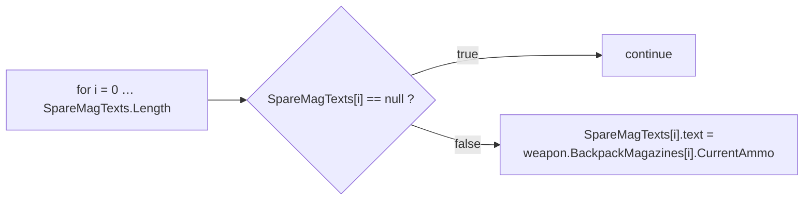
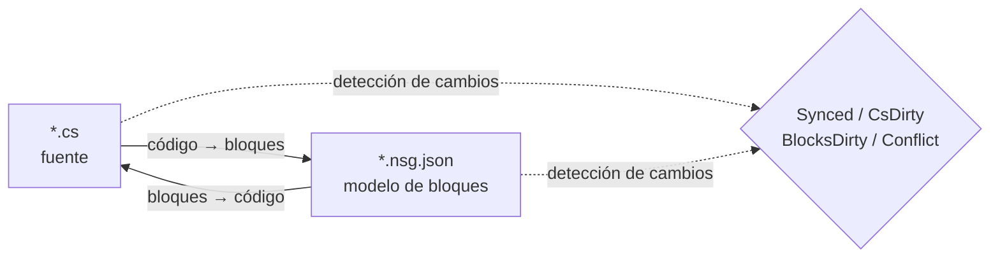

# NekoScriptGraph (NSG) — Despliegue rápido y manual

**Versión** 1.0.2 · **Unity** 2022.3+ · **Autor** NekoAndreeva · **Licencia** MIT · **Paquete** `com.nekoandreeva.nekoscriptgraph`

> Programación visual estilo Scratch para Unity que **nunca pone nada en tu código.**
> NSG escribe un archivo de configuración de bloques *junto a* un script para hacerlo editable como bloques, y traduce en ambas direcciones. El `.cs` generado no contiene ningún rastro del plugin: borra la carpeta del plugin y tus scripts seguirán compilando.

---

## Tabla de contenidos

**Parte A — Despliegue rápido**

1. [API global en un clic](#1-one-click-global-api)
2. [Tu primer programa de bloques](#2-your-first-block-program)
3. [La ruta de incorporación de 10 minutos](#3-the-10-minute-onboarding-path)

**Parte B — Manual**

4. [Conceptos básicos](#4-core-concepts)
5. [Instalación y requisitos](#5-install--requirements)
6. [El editor de bloques](#6-the-block-editor)
7. [Referencia de menús](#7-menu-reference)
8. [Bloques API (análisis detallado)](#8-api-blocks-deep-dive)
9. [Idiomas y añadir uno](#9-languages--adding-one)
10. [Sincronización, forma canónica y ratio de escape](#10-sync-canonical-form--escape-ratio)
11. [Salud de la arquitectura](#11-architecture-health)
12. [Localización](#12-localization)
13. [Agentes y MCP](#13-agents--mcp)
14. [Asistente GataPrograma (opcional)](#14-programneko-assistant-optional)
15. [Ajustes](#15-settings)
16. [Estructura de directorios](#16-directory-layout)
17. [Desinstalación](#17-uninstall)
18. [Solución de problemas y preguntas frecuentes](#18-troubleshooting--faq)
19. [Contacto](#19-contact)

**Apéndices**

- [A. Esquema de definición de bloques](#appendix-a-block-definition-schema)
- [B. Esquema del descriptor de idioma](#appendix-b-language-descriptor-schema)
- [C. Claves de ajustes](#appendix-c-settings-keys)

---
---

# PARTE A — DESPLIEGUE RÁPIDO

Pasa de «carpeta soltada en Assets» a «escribir código con bloques» en unos diez minutos, casi sin teclear.

<a id="1-one-click-global-api"></a>
## 1. API global en un clic

**La idea:** tu proyecto ya contiene cientos de métodos. NSG puede leerlos y acuñar un **bloque API** para cada uno, de modo que cada método que ya escribiste se convierte en un bloque arrastrable de la paleta. El código nuevo se escribe entonces ensamblando el vocabulario de *tu propio* proyecto.

### 1.1 Cómo hacerlo

1. Confirma que el plugin se ha compilado (sin errores en rojo en la consola; Unity 2022.3+).
2. Menú: **`NekoScriptGraph ▸ Build API Library for Whole Project`** — *Crear biblioteca API de todo el proyecto*.
3. NSG cuenta los archivos fuente que va a escanear y muestra un diálogo de confirmación:

   > *Crear la biblioteca API para todo el proyecto — N archivos fuente → `Assets/NekoScriptGraph/Blocks/API`. ¿Continuar?*

4. Haz clic en **Continuar**. En un proyecto grande esto son miles de bloques y tarda un momento perceptible; es lo esperado, y por eso se muestra antes el recuento.
5. Cuando termina, la consola registra un resumen y un diálogo informa de los totales:

   ```
   [NekoScriptGraph] API blocks: <generated> generated, <skipped> skipped.
   ```

6. La biblioteca de bloques se **recarga automáticamente**. No hay nada más que hacer: los nuevos bloques ya están activos.

> **Alcance.** El escaneo recorre `Assets` para cada idioma registrado. C# usa `AssetDatabase` (`t:MonoScript`); C/C++/Rust/HLSL/etc. se recorren en disco por extensión de archivo. `Dependencies/` y `.checkpoints/` siempre quedan excluidos.

### 1.2 En su lugar, solo una carpeta

¿Trabajas en un único subsistema? Selecciona una carpeta en la ventana Project y usa:

**`NekoScriptGraph ▸ Generate API Blocks for Selected Folder`** — *Generar bloques API de la carpeta seleccionada*

La misma maquinaria, un radio de acción menor y mucho más rápida. Es la primera ejecución recomendada: apunta a la carpeta contra la que realmente quieres programar.

### 1.3 Qué obtienes

Un archivo JSON por cada método elegible, escrito en la carpeta indicada por `apiOutputFolder` (por defecto `Assets/NekoScriptGraph/Blocks/API`):

```
Blocks/API/api.DecalUtils.ProjectNormals.5.json
Blocks/API/api.DecalManager.GetSpawner.3.json
Blocks/API/api.GPUDecalUtils.UpdateDrawIndirectCommandBuffer.3.json
```

Esquema de nombres: `api.<Type>.<Method>.<arity>.json` — la **aridad** (número de parámetros) forma parte del ID, de modo que las sobrecargas coexisten.

Dentro de la paleta aparecen bajo la categoría **API** (`cat.api`), **subagrupados por tipo declarante**:

| Grupo de la paleta | Contiene |
|---|---|
| `API` → `DecalUtils` | todos los métodos elegibles de `DecalUtils` |
| `API` → `DecalManager` | todos los métodos elegibles de `DecalManager` |
| `API` → *(funciones libres)* | funciones de nivel superior de C / HLSL |

Usa el cuadro de búsqueda de la paleta para encontrar uno al instante por su nombre.

<a id="14-the-eligibility-rule-know-this-before-you-wonder"></a>
### 1.4 La regla de elegibilidad (conócela antes de preguntarte)

Un **bloque API se genera solo cuando** el método cumple:

| Requisito | Por qué |
|---|---|
| `public` | Es API pública |
| Sin genéricos (`<…>` en el método o en su tipo de retorno) | Sin inferencia de tipos en tiempo de ejecución dentro de un bloque |
| Sin `async` | No hay planificador sobre el que esperar |
| **Sin** parámetros `ref` / `out` / `in` / `params` / `this` | Los parámetros de salida necesitarían ranuras adicionales |
| **Sin valores de parámetro por defecto** (`=`) | Todas las ranuras son obligatorias |
| Sin restricciones `where` | Igual que los genéricos |
| No es un constructor | No es una llamada a método |

Todo lo que incumpla esto se **omite** en silencio: ese recuento es el número de «skipped» del resumen.

<a id="15-static-vs-instance--the-one-asymmetry"></a>
### 1.5 Estático vs. instancia — la única asimetría

Esta es la advertencia más importante de toda la función de API:

| Tipo de método | Comportamiento del bloque | Reversibilidad |
|---|---|---|
| **`static`** | Se empareja por destino de llamada punteado + aridad (`matchCall` + `matchArity`) | **Totalmente bidireccional** — código ⇄ bloques |
| **instancia** | Recibe una ranura `target` adicional al principio: `{0}.Method({1}, …)` | **Unidireccional** — se imprime correctamente, pero al importar se relee como un bloque de llamada genérico |

> Regla práctica: **las API estáticas producen bloques perfectos.** Los métodos de instancia siguen dándote una llamada correcta y autodocumentada, pero una edición solo por bloques de una llamada de instancia no volverá a convertirse en un bloque específicamente reconocible. Prefiere puntos de entrada `static` para todo lo que pretendas escribir con bloques.

Las funciones libres (C, HLSL) no tienen tipo propietario y por tanto se tratan como estáticas: totalmente bidireccionales.

### 1.6 Disciplina de reconstrucción

- **Vuelve a ejecutar tras los refactors.** Renombrar un método deja atrás un bloque API obsoleto. Vuelve a ejecutar el generador y elimina los huérfanos, o simplemente borra `Blocks/API/` y regenera desde cero.
- **La regeneración es idempotente.** Los ID son deterministas; los duplicados se cuentan como *skipped*, así que volver a ejecutar no llenará la carpeta de basura.
- **Es seguro hacer commit.** `Blocks/API/*.json` son datos, no código. Hacer commit significa que tus compañeros obtienen tu vocabulario de bloques sin volver a escanear.

---

<a id="2-your-first-block-program"></a>
## 2. Tu primer programa de bloques

Un recorrido completo de principio a fin. Vamos a reconstruir una pequeña pieza de lógica al estilo `CompassManager` — «imprime el recuento del cargador, mostrando `--` para las ranuras vacías» — usando bloques API.

### Paso 1 — Poner un archivo bajo gestión

1. Selecciona un archivo `.cs` en la ventana Project.
2. **`NekoScriptGraph ▸ Take Selected Script Under Management`** — *Tomar el script seleccionado bajo gestión*.

   Aparece un archivo junto a él:

   ```
   Assets/Scripts/ChrControl/CompassManager.cs
   Assets/Scripts/ChrControl/CompassManager.nsg.json   ← el modelo de bloques
   ```

   (El `.nsg.json` está oculto en la ventana Project de forma predeterminada; eso es una característica, no un error. `Cmd/Ctrl+Shift+H` lo alterna.)

### Paso 2 — Abrir el editor

**`NekoScriptGraph ▸ Open Block Editor`** — *Abrir editor de bloques*. El archivo se abre como una pestaña.

### Paso 3 — Encontrar tus bloques

Mira el panel derecho:

- **Búsqueda en la paleta** — escribe `SpareMagTexts` o `Count` para filtrar.
- El grupo **API** contiene los bloques acuñados en la Parte A.
- **Control / Expressions / Variables / Structure** contienen los bloques del lenguaje.

### Paso 4 — Ensamblar

Arrastra bloques al lienzo. El bucle clásico:



Cada ranura obligatoria que se deje vacía es señalada por **Salud de la arquitectura** como `danglingInput`.

### Paso 5 — Escribirlo de vuelta

Pulsa **Generate** (o usa el botón de generación de la barra de herramientas). NSG imprime el código fuente e informa de uno de estos estados:

| Estado | Significado |
|---|---|
| `Synced` | El código y el modelo de bloques coinciden |
| `Code changed` | El `.cs` se adelantó — vuelve a importar |
| `Blocks changed` | Los bloques se adelantaron — usa Generate para escribirlos |
| `Conflict` | **Ambos** lados cambiaron — tú eliges cuál gana |

### Paso 6 — Confirmar que el código siguió limpio

Abre el `.cs`. Es C# corriente. Sin atributos, sin regiones generadas, sin referencias al plugin. Ese es el objetivo.

### Paso 7 — Hacer commit

Haz commit tanto del `.cs` como del `.nsg.json`. El modelo de bloques es un recurso normal del proyecto.

> **La primera escritura reformatea.** Si un método no estaba ya en la forma canónica de NSG (llaves ausentes, sangría irregular, una grafía equivalente pero distinta), la primera pasada *bloques → código* lo normaliza. La semántica no cambia; el formato sí. Se te avisa de antemano: *«N métodos no están en forma canónica…»*. Para evitar diffs inesperados, consulta el [§10](#10-sync-canonical-form--escape-ratio).

---

<a id="3-the-10-minute-onboarding-path"></a>
## 3. La ruta de incorporación de 10 minutos

La lista condensada. Imprímela y pégala en el monitor.

| # | Acción | Dónde | ~Tiempo |
|---|---|---|---|
| 1 | Suelta el plugin en `Assets/` y deja que se compile | Unity | 1 min |
| 2 | Selecciona una carpeta → **Generar bloques API de la carpeta seleccionada** | Menú | 1 min |
| 3 | **Tomar la carpeta seleccionada bajo gestión** | Menú | 1 min |
| 4 | **Abrir editor de bloques** | Menú | 10 s |
| 5 | Busca en la paleta uno de tus propios métodos | Editor | 1 min |
| 6 | Arrastra tres bloques, conéctalos y deja una ranura vacía | Editor | 2 min |
| 7 | Abre **Salud de la arquitectura** y lee el hallazgo `danglingInput` | Menú | 1 min |
| 8 | Corrígelo arrastrando un bloque a la ranura | Editor | 1 min |
| 9 | Pulsa **Generate** y confirma que el estado es `Synced` | Editor | 30 s |
| 10 | Abre el `.cs` — comprueba que es C# limpio | Editor | 20 s |
| 11 | Haz commit de `.cs` + `.nsg.json` | Git | 30 s |
| 12 | *(Opcional)* **MCP Bridge: Start** y apunta tu agente a `http://127.0.0.1:8765/` | Menú + cliente | 2 min |

**El modelo mental en una línea:** el `.cs` es la fuente de verdad, el `.nsg.json` es una *lente* sobre él, y NSG mantiene la lente y la fuente de acuerdo.

---
---

<a id="4-core-concepts"></a>
## 4. Conceptos básicos

### 4.1 Archivos gestionados vs. archivos libres

- **Archivo libre** — un script normal sin un `.nsg.json` contiguo.
- **Archivo gestionado** — tiene un `.nsg.json`; puede abrirse como bloques.

### 4.2 Solo los cuerpos de método se convierten en bloques

La regla más importante de NSG:

- `using`, las declaraciones de tipos, los campos, los atributos y los comentarios **fuera de los cuerpos de método** se conservan **literalmente** y sobreviven intactos en ambas direcciones.
- Los **cuerpos de método** se analizan en bloques.
- Todo lo que el modelo de bloques no puede expresar se conserva como un **fragmento sin procesar** y se informa como diagnóstico (`NSG0002`). **Nunca se pierde nada en silencio.**

### 4.3 El modelo de sincronización bidireccional



| Estado | Significado |
|---|---|
| `Synced` | El código y el modelo de bloques coinciden |
| `CsDirty` | El `.cs` cambió; el modelo se quedó atrás |
| `BlocksDirty` | Los bloques cambiaron; el código no se ha reescrito |
| `Conflict` | Ambos lados cambiaron — debes elegir el ganador |
| `Unmanaged` | Sin archivo de bloques |

NSG registra **qué lado se movió primero**, así siempre sabes si pulsar Generate destruiría tu propio trabajo.

> La ruta MCP/agente es deliberadamente **unidireccional: código → bloques**. El agente escribe código fuente normal; el plugin lo reanaliza y reconstruye el modelo.

---

<a id="5-install--requirements"></a>
## 5. Instalación y requisitos

1. Unity **2022.3** o posterior.
2. Coloca la carpeta `NekoScriptGraph` bajo `Assets/` (o añádela como paquete local).
3. Todo el paquete está delimitado por una **definición de ensamblado solo para el Editor**: no aporta **nada** a una compilación de jugador.

### Partes opcionales (cada una es removible como una unidad)

| Carpeta | Propósito | Si se elimina |
|---|---|---|
| `Dependencies/` | Sprites redondeados de 9 rebanadas | Recurre a esquinas redondeadas simples; el paquete pesa ~3,3 MB |
| `LanguageSupport/{c,cpp,go,hlsl,java,python,rust,swift}` | Idiomas distintos de C# | Ese idioma desaparece; nada más se rompe |
| `ProgramNeko/` | Asistente gato de píxeles | El plugin funciona bien sin ella |
| `Locale/*` | Traducciones de la interfaz | Ese idioma recurre al inglés |

### Tamaño del paquete

≈ **4,2 MB** tal como se distribuye:

| Parte | Tamaño |
|---|---|
| `Editor/` — núcleo, interfaz, motor de C#, ajustes | ~1,4 MB |
| `Dependencies/Editor/Sprite/` — sprites 9-slice opcionales | ~0,86 MB |
| `Documents/` — esta guía en 15 idiomas | ~0,7 MB |
| `Locale/` — 15 idiomas de interfaz | ~0,7 MB |
| `LanguageSupport/` — ocho idiomas de instalación directa | ~0,24 MB |
| `Blocks/` — biblioteca de bloques integrada (regenerada a demanda) | ~0,23 MB |
| `Extensions~/` — plantilla de motor externo instalable | ~0,04 MB |

---

<a id="6-the-block-editor"></a>
## 6. El editor de bloques

Una ventana multipestaña estilo VS Code, mínimo 980×600.

| Región | Contenido |
|---|---|
| Barra de pestañas | Varios documentos abiertos a la vez |
| Lienzo | El script como bloques — arrastrar, conectar, contraer, ampliar, ajustar |
| Panel derecho | Paleta de bloques + búsqueda + preajustes; se recuerda el ancho |
| Abajo a la izquierda | Texto de estado, deshacer/rehacer, hueco del asistente (solo si está instalado) |
| Fila de herramientas | Reload library, Problems, Health, Checkpoints, Git, Sprites |

### 6.1 Dos modos de vista

| Vista | Estilo | Ideal para |
|---|---|---|
| **Stack (Scratch)** | Apilado vertical de sentencias | Enseñanza, lógica lineal |
| **Blueprint (UE)** | Grafo de nodos | Flujo de datos y cadenas de expresiones |

Cambia con el desplegable **View** (`view.stack` / `view.blueprint`).

### 6.2 La paleta

- Agrupada por `categoryKey`, plegable como un todo (`Collapse all` / `Expand all`).
- Los índices alfabéticos empiezan plegados; desplégalos manualmente.
- El campo de búsqueda está **fuera** de la lista de bloques a propósito: la lista se reconstruye con cada pulsación de tecla y, de lo contrario, perdería el foco.
- Puedes arrastrar un **preajuste** entero al lienzo, no solo un bloque.

**Categorías integradas:**

| Clave | Etiqueta | Contenido |
|---|---|---|
| `cat.ctrl` | Control | `if`, `for`, `foreach`, `while`, `break`, `continue`, `return` |
| `cat.expr` | Expresiones | binario, unario, llamada, conversión, condicional, ident, índice, literal, miembro, new, postfijo |
| `cat.var` | Variables | locales y asignación |
| `cat.frame` | Estructura | declaraciones |
| `cat.api` | API | bloques API generados (agrupados por tipo) |
| `cat.macro` | Mis bloques | preajustes del usuario |
| `cat.raw` | Escape | fragmentos sin procesar |

### 6.3 Checkpoints

Las instantáneas integradas viven en `.checkpoints/`, que está **ignorado por git**: nunca puede pelearse con el historial de tu repositorio. Toma una antes de una gran escritura *bloques → código*.

### 6.4 Ocultar los archivos de bloques

`hideBlockFiles` es `true` por defecto, así la ventana Project no se inunda de `.nsg.json`.

- Menú: **`Toggle Block Files Visibility`** — atajo global `Cmd/Ctrl+Shift+H`.
- El atajo es global: funciona incluso con la ventana del plugin cerrada.

### 6.5 Explicar el bloque seleccionado

`Cmd/Ctrl+Shift+E` (menú **`Explain Selected Block`**) pide a la asistente que explique el bloque actual. También es un atajo global.

---

<a id="7-menu-reference"></a>
## 7. Referencia de menús

> Los títulos de `[MenuItem]` son constantes en tiempo de compilación, así que Unity distribuye el nombre **estático en inglés**; la capa de localización sustituye las etiquetas traducidas al cargar y al cambiar de idioma. Las entradas de `MCP Bridge` están en inglés a propósito.

| Elemento de menú | Propósito |
|---|---|
| `Open Block Editor` | Abrir la ventana principal |
| `Problems` | Lista de diagnósticos |
| `Assistant (ProgramNeko)` | Abrir la asistente; avisa si no está instalada |
| `Explain Selected Block` `%#e` | Explicar el bloque seleccionado |
| `Architecture Health` | Abrir la ventana de salud |
| `Take Selected Script Under Management` | Gestionar un archivo |
| `Release Selected Script` | Dejar de gestionar un archivo |
| `Take Selected Folder Under Management` | Gestión masiva |
| `Take Whole Project Under Management` | Gestionarlo todo |
| `Release Selected Folder` | Liberación masiva |
| `Release Whole Project` | Liberarlo todo |
| `Generate API Blocks for Selected Folder` | Acuñación de API limitada a una carpeta |
| `Build API Library for Whole Project` | API global en un clic (Parte A) |
| `Reload Block Library` | Releer `Blocks/` |
| `Export Default Block Library` | Escribir los bloques integrados en `Blocks/` |
| `Generate ShaderLab Shell` | Emitir la estructura externa del shader |
| `Self Test: Round Trip` | Autoprueba de consistencia de ida y vuelta |
| `Toggle Block Files Visibility` `%#h` | Mostrar/ocultar `.nsg.json` |
| `Languages: Show Loaded` | Volcar el registro de idiomas |
| `MCP Bridge: Start` / `Stop` / `Copy Client URL` | El puente MCP |

---

<a id="8-api-blocks-deep-dive"></a>
## 8. Bloques API (análisis detallado)

La Parte A cubrió el flujo de trabajo. Esto es la maquinaria.

### 8.1 Qué emite el generador

Por cada método elegible, un `NsgBlockDef`:

```jsonc
// Blocks/API/api.DecalUtils.ProjectNormals.5.json
{
  "id": "api.DecalUtils.ProjectNormals.5",
  "level": "high",
  "shape": "expression",                 // "statement" if return type is void
  "category": "DecalUtils",              // declaring type → palette sub-group
  "categoryKey": "cat.api",              // the "API" group
  "label": "DecalUtils.ProjectNormals({0}, {1}, {2}, {3}, {4})",
  "labelEn": "DecalUtils.ProjectNormals({0}, {1}, {2}, {3}, {4})",
  "labelRu": "DecalUtils.ProjectNormals({0}, {1}, {2}, {3}, {4})",
  "sockets": [
    { "name": "decalPosW", "kind": "expr", "required": true, "variadic": false, "choices": [] },
    { "name": "parents",   "kind": "expr", "required": true, "variadic": false, "choices": [] },
    { "name": "decalNorm", "kind": "expr", "required": true, "variadic": false, "choices": [] },
    { "name": "decalTform","kind": "expr", "required": true, "variadic": false, "choices": [] },
    { "name": "decalColor","kind": "expr", "required": true, "variadic": false, "choices": [] }
  ],
  "emit": "",
  "node": "call",
  "op": "",
  "color": "",
  "matchCall": "DecalUtils.ProjectNormals",  // dotted match target
  "matchArity": 5,                           // parameter count
  "builtin": true,
  "manual": "DecalUtils.ProjectNormals(decalPosW, parents, decalNorm, decalTform, decalColor) : Color[]",
  "variantGroup": "",
  "variantLabel": ""
}
```

Notas:

- **Los nombres de ranura** son los nombres reales de los parámetros; la etiqueta de la paleta es, por tanto, autodocumentada.
- **`manual`** lleva la firma completa cualificada más el tipo de retorno. Es la *válvula de escape*: la forma manual del bloque.
- **Los métodos de instancia** reciben una ranura adicional al principio llamada `target` (obligatoria), y la etiqueta pasa a ser `{0}.Method({1}, …)` — de ahí la advertencia de unidireccionalidad del §1.5.
- **Las funciones libres** (C/HLSL) no tienen propietario y se tratan como `static`.

### 8.2 Determinismo y deduplicación

- El ID es `api.<QualifiedType>.<Method>.<arity>` — determinista entre ejecuciones.
- Los ID duplicados se cuentan como **skipped** y nunca se escriben dos veces.
- Volver a ejecutar tras refactors **no** eliminará los huérfanos. Borra `Blocks/API/` y regenera para empezar de cero.

### 8.3 Varios idiomas

`Build API Library for Whole Project` recorre el registro de idiomas y llama al `GenerateApiBlocks` de cada motor. C# pasa por `AssetDatabase`; los lenguajes de estilo C recorren el sistema de archivos por la extensión del perfil, omitiendo `.checkpoints/` y `Dependencies/`. Si un motor de idioma no consigue construirse, ese idioma se cuenta como fallido y el resto continúa.

### 8.4 Orientación práctica

| Situación | Consejo |
|---|---|
| Quieres bloques para un subsistema | Usa la variante de **carpeta**, no la de proyecto |
| Quieres bloques bidireccionales | Expón un punto de entrada **`static`** |
| Tienes API con `ref`/`out`/`params` | Se omitirán: envuélvelas en un método estático simple si quieres bloques |
| Las sobrecargas chocan en la paleta | La **aridad** está en el ID y las ranuras desambiguán; busca por nombre |
| Renombraste un método | Regenera; borra el JSON huérfano |

---

<a id="9-languages--adding-one"></a>
## 9. Idiomas y añadir uno

`C` · `C++` · `C#` · `Go` · `HLSL` · `Java` · `Rust` · `Python` · `Swift`

- Todos traducen **en ambos sentidos**.
- **C# está integrado** (`Editor/Languages/CSharp/`: Lexer, Parser, Printer, Splitter, CodeMap).
- Los demás son **carpetas de instalación directa**. Borra `LanguageSupport/<lang>/` y ese idioma desaparece del plugin sin romper nada más.

### Añadir un idioma

Crea una carpeta con un descriptor y un motor:

```jsonc
// LanguageSupport/python/python.language.json
{
  "apiVersion": 1,
  "id": "python",
  "displayName": "Python",
  "icon": "PYTHON",
  "extensions": [".py"],
  "blocksFolder": "blocks",
  "engineType": "NekoScriptGraph.Nsg_PythonLanguage",
  "author": "",
  "note": "Self-contained language: its own engine, sharing only the block skeleton."
}
```

Luego implementa la clase indicada por `engineType` (analizar, imprimir, generación de bloques API) y añade la carpeta `blocks/` del idioma. Usa `Nsg_PythonLanguage`, `Nsg_CLanguage`, `Nsg_RustLanguage`, etc. como implementaciones de referencia.

---

<a id="10-sync-canonical-form--escape-ratio"></a>
## 10. Sincronización, forma canónica y ratio de escape

### 10.1 Ratio de escape

La proporción de bloques **de fragmento sin procesar**. Mide cuánto del código está realmente modelado como bloques.

- Contrólalo con `maxEscapeRatio: 0` (MCP) para exigir una traducción *completa* a bloques.
- Todo lo que el analizador no puede modelar se conserva literalmente y se informa como **`NSG0002`**.

### 10.2 Forma canónica

Código que tiene una única «grafía estándar». La primera pasada *bloques → código* normaliza:

- llaves ausentes,
- sangría incoherente,
- grafías equivalentes pero distintas.

La advertencia visible para el usuario:

> *«N métodos no están en forma canónica (faltan llaves, sangría incoherente o varias formas equivalentes). La primera pasada bloques → código los normalizará; la semántica no cambia pero el formato sí.»*

### 10.3 El punto fijo

Itera hasta que `canon(text) == text`. Una vez que el texto es un punto fijo, el documento se mantiene `Synced` y nunca vuelve a reformatearse. Esto es exactamente lo que hace el bucle de agente del §13 antes de escribir en disco.

---

<a id="11-architecture-health"></a>
## 11. Salud de la arquitectura

Menú **`Architecture Health`** — con un script seleccionado analiza ese archivo; de lo contrario se abre vacío.

**Métricas:** recuento de bloques/sentencias, recuento de métodos, ratio de escape (`escapes`) y una `score` compuesta.

**Comprobaciones:**

| Clave | Significado |
|---|---|
| `emptyBody` / `emptyMethod` | Cuerpo vacío / método vacío |
| `constantCondition` | Condición siempre verdadera o siempre falsa |
| `cycle` | Ciclo de llamadas o de dependencias |
| `danglingInput` | Ranura obligatoria sin conectar |
| `duplicate` | Código duplicado |
| `escapeRatio` | Ratio alto de fragmentos sin procesar |
| `expressionSize` | Expresión sobredimensionada |
| `nesting` | Anidamiento excesivo |
| `methodLength` | Método demasiado largo |
| `memberChain` | Cadena de miembros larga (`a.b.c.d.e`) |
| `magicNumber` | Número mágico |
| `placeholderName` / `shortName` | Nombres de marcador de posición / demasiado cortos |
| `unusedLocal` | Variable local sin usar |
| `afterReturn` | Código después de `return` |
| `leak` | Posible fuga |

**Acciones de corrección:** `fixBreakLink`, `fixFillZero`, `fixAddRelease`, `fixApply`, `rerun`.

---

<a id="12-localization"></a>
## 12. Localización

**15 idiomas de interfaz:**

Chino simplificado · Chino tradicional · Inglés · Francés · Alemán · **Italiano** · Ruso · Español · Portugués · Japonés · Coreano · Polaco · Turco · Árabe · Hebreo

- **El árabe y el hebreo reflejan todo el editor**: la paleta se mueve a la izquierda y los bloques crecen hacia la izquierda (RTL).
- La propia barra de menús de Unity permanece en inglés **por diseño**.
- Las cadenas viven en `Locale/<code>/strings.json`, seccionadas por clave (`ui`, `blocks`, …). El vocabulario de bloques usa la sección `blocks`, p. ej. `c.assert` → `assert {0}`.

---

<a id="13-agents--mcp"></a>
## 13. Agentes y MCP

NSG incluye un **servidor MCP que se ejecuta dentro del Editor de Unity**: JSON-RPC 2.0 sobre el transporte MCP **Streamable HTTP**. **No hay proceso auxiliar ni runtime adicional: ni Node, ni Python. El Editor *es* el servidor.**

```
MCP client ──HTTP POST JSON-RPC──▶ 127.0.0.1:8765 ──▶ Unity Editor
```

### 13.1 Iniciarlo

Menú **`NekoScriptGraph ▸ MCP Bridge: Start`**:

```
[NekoScriptGraph] MCP bridge listening on http://127.0.0.1:8765/
```

- Recuerda que estaba activo y **se reinicia automáticamente** tras una recarga de dominio o un reinicio del Editor.
- Detenlo con **`MCP Bridge: Stop`**; copia la URL con **`MCP Bridge: Copy Client URL`**.
- Verifícalo a mano, sin necesidad de cliente:

```bash
curl -s http://127.0.0.1:8765/ -d '{"jsonrpc":"2.0","id":1,"method":"tools/list"}'
```

Un simple `GET /` devuelve una página de estado con la versión del servidor, las revisiones de protocolo admitidas y las herramientas disponibles.

### 13.2 Apuntar tu cliente a él

Sirve cualquier cliente MCP Streamable HTTP. La forma de la configuración varía ligeramente (`type` en unos, `transport` en otros, una simple `url` en unos pocos):

```json
{
  "mcpServers": {
    "nekoscriptgraph": {
      "type": "http",
      "url": "http://127.0.0.1:8765/"
    }
  }
}
```

VS Code usa `servers` en lugar de `mcpServers`; por lo demás la entrada es la misma.

Si tu cliente solo habla **stdio**, pon delante un proxy HTTP↔stdio (p. ej. `npx mcp-remote http://127.0.0.1:8765/`). Ese proxy es cosa del cliente, no del plugin.

> El transporte heredado HTTP+SSE (`GET /sse`) **no** está implementado. El puente sirve Streamable HTTP, revisión de protocolo `2025-03-26` y posteriores, y también acepta clientes `2024-11-05` que hacen POST a la misma URL.

### 13.3 Las siete herramientas

| Herramienta | ¿Escribe? | Qué hace |
|---|---|---|
| `nsg_writing_spec` | no | El subconjunto canónico de escritura para un idioma, generado a partir de la biblioteca de bloques y la impresora |
| `nsg_verify` | no | Estado de un archivo en disco: `Synced`, `CsDirty`, `BlocksDirty`, `Conflict`, `Unmanaged` |
| `nsg_plan` | no | Analiza el código candidato, informa diagnósticos, recuentos de bloques, ratio de escape, ¿canónico? |
| `nsg_canon` | no | Texto canónico — el oráculo del punto fijo |
| `nsg_apply` | **sí** | Reconstruye el `.nsg.json` y escribe el código fuente canónico |
| `nsg_list_managed` | no | Todos los `.nsg.json` bajo una carpeta |
| `nsg_release` | **sí** | Elimina esos archivos `.nsg.json` (desinstalación limpia) |

### 13.4 El bucle previsto — código → bloques

1. `nsg_writing_spec` una vez, para aprender el subconjunto del idioma.
2. Edita el `.cs` (o simplemente mantén el texto en la conversación).
3. `nsg_plan` — diagnósticos, recuentos de bloques, ratio de escape. **No escribe nada y no necesita compilar**, así que es seguro sobre código que aún no compila.
4. Si `canonical` es falso, llama a `nsg_canon` e itera hasta que `canon(text) == text`. Ese es el punto fijo: una vez alcanzado, el documento se mantiene `Synced` y nada se reformatea después.
5. `nsg_apply` — escribe el `.cs` canónico y el `.nsg.json` reconstruido.

Controla el ratio de escape con `maxEscapeRatio: 0` para exigir una traducción completa a bloques.

```json
{"jsonrpc":"2.0","id":1,"method":"tools/call","params":{
  "name":"nsg_plan",
  "arguments":{"file":"Assets/Scripts/CompassManager.cs","maxEscapeRatio":0.0}}}
```

`nsg_plan`, `nsg_canon` y `nsg_apply` también aceptan `source`, de modo que el agente puede validar texto antes de que llegue siquiera al disco:

```json
{"jsonrpc":"2.0","id":2,"method":"tools/call","params":{
  "name":"nsg_canon",
  "arguments":{"file":"Assets/Scripts/Foo.cs","source":"class Foo { void A(){ } }"}}}
```

### 13.5 Seguridad

El puente escribe archivos en tu proyecto, así que es deliberadamente restrictivo:

- Se enlaza **solo a `127.0.0.1`**: nunca a una interfaz enrutable.
- Las peticiones que llevan una cabecera **`Origin`** se rechazan con **`403`**. Los navegadores siempre envían `Origin`; los clientes MCP nativos nunca lo hacen, así que **ninguna página abierta en tu navegador puede alcanzar el puente**. Si de verdad necesitas un cliente de navegador, relájalo con `Nsg_McpBridge.SetAllowOrigin(true)`.
- El servidor está **apagado hasta que lo inicias**, y se detiene al salir.

### 13.6 Solución de problemas

| Síntoma | Causa / solución |
|---|---|
| El Editor no respondió a tiempo | El puente canaliza cada llamada al hilo principal, y Unity no ejecuta `EditorApplication.update` mientras compila o recarga el dominio. Las peticiones enviadas durante una recompilación esperan y después fallan a los **60 segundos**. Simplemente reinténtalo |
| El puerto ya está en uso | Otro proceso ocupa `8765`. Cámbialo con `Nsg_McpBridge.SetPort(n)`, o cierra el otro listener |
| Faltan las herramientas | Comprueba que el plugin se compiló: `Nsg_Json`, `Nsg_Mcp` y `Nsg_McpBridge` son scripts de Editor normales que no necesitan configuración. `GET /` lista las herramientas ofrecidas actualmente |

### 13.7 Usarlo sin MCP

El puente es un simple endpoint JSON-RPC; las mismas operaciones están disponibles sin protocolo alguno:

- **Sin interfaz / CI**

```bash
Unity -batchmode -quit -projectPath <project> \
      -executeMethod NekoScriptGraph.Nsg_AgentCli.Main \
      -nsgRequest req.json -nsgResponse resp.json
```

- **En código** — `Nsg_AgentApi.Run(request)`, además de `Nsg_Mcp.Handle(jsonString)` solo para la capa de protocolo.

---

<a id="14-programneko-assistant-optional"></a>
## 14. Asistente GataPrograma (opcional)

`ProgramNeko/` es un asistente gato de píxeles opcional. **Borra la carpeta entera y el plugin sigue funcionando.**

- El menú **`Assistant (ProgramNeko)`** lo abre. Es la *misma* ventana que Problems: sin ella es solo una lista de errores; con ella, el gato se sienta encima y habla debajo.
- `Cmd/Ctrl+Shift+E` le pide que explique el bloque seleccionado.
- Tiene su propia localización: `ProgramNeko/Locale/<code>/neko.json` (15 idiomas).
- Manifiesto: `ProgramNeko/programneko.json`.

---

<a id="15-settings"></a>
## 15. Ajustes

`Assets/NekoScriptGraph/NekoScriptGraph.settings.json`:

```jsonc
{
  "viewMode": 0,                        // 0 = Stack (Scratch), 1 = Blueprint (UE)
  "hideBlockFiles": true,               // hide .nsg.json by default
  "useSprites": false,                  // 9-slice sprites
  "headerSprite": "block_header",
  "bodySprite": "block_body",
  "footerSprite": "block_footer",
  "exprSprite": "block_expr",
  "bodyIndent": 14,                     // body indent
  "cornerRadius": 6,
  "footerHeight": 10,
  "rightPaneWidth": 240.0,              // remembered after you drag it
  "presetPaneHeight": 200.0,
  "shaderPipeline": "auto",             // auto / ...
  "apiOutputFolder": "Assets/NekoScriptGraph/Blocks/API"
}
```

Los preajustes (paquetes de arrastre de varios bloques) viven en `.presets/presets.json`, `schemaVersion: 1`, y cada entrada registra `name`, `createdAt`, `blockCount`, `languageId` y un arreglo `nodes`.

---

<a id="16-directory-layout"></a>
## 16. Estructura de directorios

```
NekoScriptGraph/
├─ Editor/
│  ├─ Core/                      engine core
│  │  ├─ Esketamine/             AST, parse/print, block library, diagnostics,
│  │  │                          settings, MCP, agent API, L10n, undo, checkpoints
│  │  └─ cstyle/                 C-style engine, shader pipeline, agent spec
│  ├─ Languages/CSharp/          lexer / parser / printer / splitter / code map
│  ├─ UI/                        main window, block view, blueprint view, health,
│  │                             error window, RTL, picker, name dialog
│  ├─ Nsg_Menu.cs                menu items
│  ├─ Nsg_McpBridge.cs           MCP HTTP bridge
│  ├─ Nsg_AgentCli.cs            headless CLI
│  └─ Nsg_SelfTest.cs            round-trip self test
├─ Blocks/                       built-in block library + API/*.json
├─ LanguageSupport/{c,cpp,go,hlsl,java,python,rust,swift}/
├─ Locale/{15 locales}/strings.json
├─ Dependencies/Editor/Sprite/   optional 9-slice sprites
├─ ProgramNeko/                  optional assistant
├─ .presets/presets.json
├─ NekoScriptGraph.settings.json
├─ MCP.md                        dedicated MCP chapter
└─ package.json                  com.nekoandreeva.nekoscriptgraph v1.0.2
```

---

<a id="17-uninstall"></a>
## 17. Desinstalación

No invasiva, con dos caminos:

1. **Menú** — `Release Selected Script` / `Release Selected Folder` / `Release Whole Project`, o los botones de la interfaz **Release** / **Release All** / **Release Folder**.
2. Borra todos los archivos `.nsg.json` bajo la carpeta elegida o el proyecto entero.

**Los archivos fuente nunca se tocan.** Después, lo único que queda es la propia carpeta del plugin: bórrala y ya está.

---

<a id="18-troubleshooting--faq"></a>
## 18. Solución de problemas y preguntas frecuentes

**¿El `.cs` generado contiene rastros del plugin?**
No. Borra la carpeta del plugin y el script sigue compilando.

**¿Por qué `using`, los campos o los atributos no se convierten en bloques?**
Por diseño. Solo los cuerpos de método participan en la traducción a bloques; todo lo demás se conserva literalmente en ambas direcciones.

**¿Por qué se reformateó mi archivo?**
No estaba en forma canónica. La primera pasada *bloques → código* normaliza llaves y sangría; la semántica no cambia. Itera con `nsg_canon` hasta un punto fijo primero si quieres cero cambios de formato.

**Algunas sentencias se convirtieron en «fragmentos sin procesar»; ¿por qué?**
Están fuera del subconjunto escribible de ese idioma. NSG los conserva literalmente e informa `NSG0002` en lugar de descartarlos. Usa `maxEscapeRatio` para convertirlo en una barrera estricta.

**¿Por qué los elementos de menú de `MCP Bridge` están en inglés?**
Es intencionado: la barra de menús de Unity no participa en la localización del plugin, y mezclar entradas traducidas y no traducidas es peor.

**¿Puedo gestionar solo una carpeta?**
Sí: **`Take Selected Folder Under Management`** — *Tomar la carpeta seleccionada bajo gestión*.

**¿Demasiados archivos de bloques llenando la ventana Project?**
Están ocultos por defecto; altérnalo con `Cmd/Ctrl+Shift+H`.

**Mis bloques API quedaron obsoletos tras un renombrado.**
La regeneración no poda los huérfanos. Borra `Blocks/API/` y regenera.

**Falta un bloque API que esperaba.**
El método no pasó la elegibilidad — lo más común: `ref`/`out`/`params`, un valor de parámetro por defecto, un genérico o `async`. Consulta el [§1.4](#14-the-eligibility-rule-know-this-before-you-wonder).

**Un bloque API de método de instancia no hace ida y vuelta.**
Es lo esperado. Solo los métodos `static` son totalmente bidireccionales; los métodos de instancia llevan una ranura `target` y son unidireccionales. Consulta el [§1.5](#15-static-vs-instance--the-one-asymmetry).

---

<a id="19-contact"></a>
## 19. Contacto

Autor: **NekoAndreeva**

- Correo electrónico: elenaandreevasvinolup@gmail.com
- WhatsApp: +852 5247 4163
- GitHub: `https://github.com/elenaandreevasvinolup-alt`

---
---

<a id="appendix-a-block-definition-schema"></a>
## Apéndice A. Esquema de definición de bloques

`Blocks/<id>.json` — un archivo por bloque.

| Campo | Tipo | Notas |
|---|---|---|
| `id` | string | Único, también la identidad en la paleta; `api.<Type>.<Method>.<arity>` para los bloques generados |
| `level` | string | `high` (nivel de sentencia) / otro |
| `shape` | string | `control` · `statement` · `expression` |
| `category` | string | Grupo de visualización; para los bloques API es el tipo declarante |
| `categoryKey` | string | Clave de localización del grupo: `cat.ctrl`, `cat.expr`, `cat.var`, `cat.frame`, `cat.api`, `cat.macro`, `cat.raw` |
| `label` | string | Etiqueta de la paleta con ranuras `{0}`, `{1}`… |
| `labelEn` / `labelRu` | string | Etiquetas por idioma |
| `sockets` | array | `{ name, kind, required, variadic, choices[] }` |
| `emit` | string | Plantilla de emisión personalizada (vacío = la predeterminada del motor) |
| `node` | string | Nodo del AST al que se asigna: `if`, `call`, `binary`, … |
| `op` | string | Operador, cuando es relevante |
| `color` | string | Anulación opcional |
| `matchCall` | string | Destino de llamada punteado que reconocer al importar |
| `matchArity` | int | Número de parámetros que emparejar (`-1` = cualquiera) |
| `builtin` | bool | Se distribuye con el plugin |
| `manual` | string | Forma manual / firma completa, usada en la entrada manual del bloque |
| `variantGroup` / `variantLabel` | string | Agrupación de variantes |

**Bloques de sentencia/expresión integrados:** `stmt.if`, `stmt.for`, `stmt.foreach`, `stmt.while`, `stmt.break`, `stmt.continue`, `stmt.return`, `stmt.localDecl`, `stmt.assign`, `stmt.expr`, `stmt.add`, `stmt.sub`, `stmt.mul`, `stmt.div`, `stmt.mod`, `stmt.raw`, y las expresiones `expr.binary`, `expr.unary`, `expr.call`, `expr.cast`, `expr.conditional`, `expr.ident`, `expr.index`, `expr.literal`, `expr.member`, `expr.new`, `expr.postfix`, `expr.raw`.

<a id="appendix-b-language-descriptor-schema"></a>
## Apéndice B. Esquema del descriptor de idioma

`LanguageSupport/<id>/<id>.language.json`:

| Campo | Tipo | Notas |
|---|---|---|
| `apiVersion` | int | Actualmente `1` |
| `id` | string | `c`, `cpp`, `csharp`, `hlsl`, `java`, `python`, `rust` |
| `displayName` | string | Se muestra en la interfaz |
| `icon` | string | Texto de la insignia, p. ej. `PYTHON` |
| `extensions` | string[] | p. ej. `[".py"]` |
| `blocksFolder` | string | Carpeta de bloques relativa, p. ej. `blocks` |
| `engineType` | string | Clase de motor totalmente cualificada, p. ej. `NekoScriptGraph.Nsg_PythonLanguage` |
| `author` | string | Opcional |
| `note` | string | Descripción opcional |

<a id="appendix-c-settings-keys"></a>
## Apéndice C. Claves de ajustes

Consulta el [§15](#15-settings). Las únicas claves que probablemente cambies: `viewMode`, `hideBlockFiles`, `useSprites`, `apiOutputFolder`, `shaderPipeline`.

---

# Exportar este documento a PDF

Actualmente no hay `pandoc`, `node` ni `npx` instalados en esta máquina. Opciones:

**A. macOS integrado (cero instalación, la más rápida)**
Guarda el Markdown, renderízalo a HTML (vista previa de Markdown de VS Code, o Typora), ábrelo en Safari y luego **File ▸ Print… (⌘P) ▸ PDF ▸ Save as PDF**.

**B. Homebrew + pandoc (mejor tipografía)**

```bash
brew install pandoc
brew install --cask basictex        # or mactex-no-gui
pandoc GUIDE.md -o NSG-GUIDE.pdf \
  --pdf-engine=xelatex \
  -V mainfont="Helvetica Neue" \
  -V monofont="Menlo" \
  -V geometry:margin=2cm \
  --toc --toc-depth=2 -N
```

**C. Extensión de VS Code**
Instala `Markdown PDF` (yzane) o `Markdown Preview Enhanced`, y luego haz clic derecho en el archivo → **Markdown PDF: Export (pdf)**.
