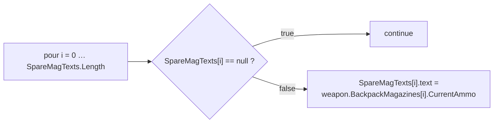
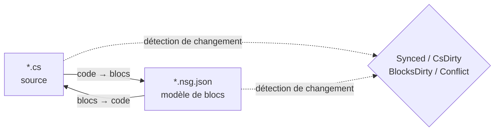

# NekoScriptGraph (NSG) — Déploiement rapide et manuel

**Version** 1.0.1 · **Unity** 2022.3+ · **Auteur** NekoAndreeva · **Licence** MIT · **Paquet** `com.nekoandreeva.nekoscriptgraph`

> Programmation visuelle à la Scratch pour Unity qui **ne met jamais rien dans votre code.**
> NSG écrit un fichier de configuration de blocs *à côté* d'un script pour le rendre éditable sous forme de blocs, et traduit dans les deux sens. Le `.cs` généré ne contient aucune trace du plugin — supprimez le dossier du plugin et vos scripts compilent toujours.

---

## Table des matières

**Partie A — Déploiement rapide**

1. [API globale en un clic](#1-one-click-global-api)
2. [Votre premier programme en blocs](#2-your-first-block-program)
3. [Le parcours d'intégration en 10 minutes](#3-the-10-minute-onboarding-path)

**Partie B — Manuel**

4. [Concepts fondamentaux](#4-core-concepts)
5. [Installation et prérequis](#5-install--requirements)
6. [L'éditeur de blocs](#6-the-block-editor)
7. [Référence des menus](#7-menu-reference)
8. [Blocs API (analyse approfondie)](#8-api-blocks-deep-dive)
9. [Langues et ajout d'une langue](#9-languages--adding-one)
10. [Synchronisation, forme canonique et taux d'échappement](#10-sync-canonical-form--escape-ratio)
11. [Santé de l'architecture](#11-architecture-health)
12. [Localisation](#12-localization)
13. [Agents et MCP](#13-agents--mcp)
14. [Assistant ProgramNeko (facultatif)](#14-programneko-assistant-optional)
15. [Réglages](#15-settings)
16. [Arborescence des dossiers](#16-directory-layout)
17. [Désinstallation](#17-uninstall)
18. [Dépannage et FAQ](#18-troubleshooting--faq)
19. [Contact](#19-contact)

**Annexes**

- [A. Schéma de définition d'un bloc](#appendix-a-block-definition-schema)
- [B. Schéma de descripteur de langue](#appendix-b-language-descriptor-schema)
- [C. Clés de réglages](#appendix-c-settings-keys)

---
---

# PARTIE A — DÉPLOIEMENT RAPIDE

Passez de « dossier déposé dans Assets » à « écriture de code avec des blocs » en une dizaine de minutes, presque sans taper au clavier.

<a id="1-one-click-global-api"></a>
## 1. API globale en un clic

**L'idée :** votre projet contient déjà des centaines de méthodes. NSG peut les lire et générer un **bloc API** pour chacune, de sorte que chaque méthode que vous avez déjà écrite devienne un bloc glisser-déposer dans la palette. Le nouveau code s'écrit alors en assemblant le vocabulaire de *votre propre* projet.

### 1.1 Comment faire

1. Confirmez que le plugin a compilé (aucune erreur rouge dans la Console ; Unity 2022.3+).
2. Menu : **`NekoScriptGraph ▸ Build API Library for Whole Project`** (Construire la bibliothèque API de tout le projet).
3. NSG compte les fichiers source qu'il va analyser et affiche une boîte de confirmation :

   > *Construire la bibliothèque API de tout le projet — N fichiers source → `Assets/NekoScriptGraph/Blocks/API`. Continuer ?*

4. Cliquez sur **Continue** (Continuer). Sur un gros projet, cela représente des milliers de blocs et prend un moment notable — c'est normal, d'où l'affichage préalable du décompte.
5. Une fois terminé, la Console journalise un résumé et une boîte de dialogue rapporte les totaux :

   ```
   [NekoScriptGraph] API blocks: <generated> generated, <skipped> skipped.
   ```

6. La bibliothèque de blocs est **rechargée automatiquement**. Rien d'autre à faire — les nouveaux blocs sont disponibles.

> **Portée.** L'analyse couvre `Assets` pour chaque langue enregistrée. Le C# utilise `AssetDatabase` (`t:MonoScript`) ; C/C++/Rust/HLSL/etc. sont parcourus sur le disque par extension de fichier. `Dependencies/` et `.checkpoints/` sont toujours exclus.

### 1.2 Un seul dossier à la place

Vous travaillez sur un seul sous-système ? Sélectionnez un dossier dans la fenêtre Project et utilisez :

**`NekoScriptGraph ▸ Generate API Blocks for Selected Folder`** (Générer les blocs API du dossier sélectionné)

Même mécanique, périmètre plus réduit, bien plus rapide. C'est la première exécution recommandée — ciblez le dossier contre lequel vous voulez réellement écrire des blocs.

### 1.3 Ce que vous obtenez

Un fichier JSON par méthode éligible, écrit dans le dossier indiqué par `apiOutputFolder` (par défaut `Assets/NekoScriptGraph/Blocks/API`) :

```
Blocks/API/api.DecalUtils.ProjectNormals.5.json
Blocks/API/api.DecalManager.GetSpawner.3.json
Blocks/API/api.GPUDecalUtils.UpdateDrawIndirectCommandBuffer.3.json
```

Schéma de nommage : `api.<Type>.<Method>.<arity>.json` — l'**arité** (nombre de paramètres) fait partie de l'identifiant, de sorte que les surcharges coexistent.

Dans la palette, ils se rangent sous la catégorie **API** (`cat.api`), **sous-groupés par type déclarant** :

| Groupe de palette | Contient |
|---|---|
| `API` → `DecalUtils` | chaque méthode éligible de `DecalUtils` |
| `API` → `DecalManager` | chaque méthode éligible de `DecalManager` |
| `API` → *(fonctions libres)* | fonctions de premier niveau C / HLSL |

Utilisez le champ de recherche de la palette pour en trouver un instantanément par son nom.

<a id="14-the-eligibility-rule-know-this-before-you-wonder"></a>
### 1.4 La règle d'éligibilité (à connaître avant de vous poser la question)

Un **bloc API n'est généré que si** la méthode est :

| Exigence | Pourquoi |
|---|---|
| `public` | C'est une API publique |
| Pas de génériques (`<…>` sur la méthode ou son type de retour) | Pas d'inférence de type à l'exécution dans un bloc |
| Pas d'`async` | Pas d'ordonnanceur sur lequel attendre |
| **Pas de paramètres `ref` / `out` / `in` / `params` / `this`** | Les paramètres de sortie exigeraient des sockets supplémentaires |
| **Pas de valeurs de paramètre par défaut** (`=`) | Tous les sockets sont obligatoires |
| Pas de contraintes `where` | Identique aux génériques |
| Pas un constructeur | Ce n'est pas un appel de méthode |

Tout ce qui échoue à ces critères est silencieusement **ignoré** — ce décompte est le nombre « skipped » du résumé.

<a id="15-static-vs-instance--the-one-asymmetry"></a>
### 1.5 Statique vs instance — la seule asymétrie

C'est la mise en garde la plus importante de toute la fonctionnalité API :

| Type de méthode | Comportement du bloc | Réversibilité |
|---|---|---|
| **`static`** | Reconnue par cible d'appel pointée + arité (`matchCall` + `matchArity`) | **Entièrement bidirectionnelle** — code ⇄ blocs |
| **instance** | Reçoit un socket `target` supplémentaire en tête : `{0}.Method({1}, …)` | **Unidirectionnelle** — s'imprime correctement, mais à l'import elle se relit comme un bloc d'appel générique |

> Règle empirique : **les API `static` font des blocs parfaits.** Les méthodes d'instance vous donnent malgré tout un appel correct et auto-documenté, mais une modification purement en blocs d'un appel d'instance ne fera pas d'aller-retour vers un bloc spécifiquement reconnaissable. Préférez les points d'entrée `static` pour tout ce que vous comptez écrire en blocs.

Les fonctions libres (C, HLSL) n'ont pas de type propriétaire et sont donc traitées comme statiques — entièrement bidirectionnelles.

### 1.6 Discipline de reconstruction

- **Relancez après les refactorisations.** Renommer une méthode laisse derrière elle un bloc API obsolète. Relancez le générateur et supprimez les orphelins, ou supprimez simplement `Blocks/API/` et régénérez de zéro.
- **La régénération est idempotente.** Les identifiants sont déterministes ; les doublons sont comptés comme *ignorés*, donc relancer ne va pas saturer le dossier.
- **Il n'y a aucun risque à valider.** `Blocks/API/*.json` est une donnée, pas du code. Le valider signifie que vos collègues récupèrent votre vocabulaire de blocs sans réanalyser le projet.

---

<a id="2-your-first-block-program"></a>
## 2. Votre premier programme en blocs

Une démonstration concrète de bout en bout. Nous allons reconstruire un petit morceau de logique à la `CompassManager` — « afficher le nombre de chargeurs en montrant `--` pour les emplacements vides » — à l'aide de blocs API.

### Étape 1 — Prendre un fichier en charge

1. Sélectionnez un fichier `.cs` dans la fenêtre Project.
2. **`NekoScriptGraph ▸ Take Selected Script Under Management`** (Prendre le script sélectionné en charge).

   Un fichier apparaît à côté :

   ```
   Assets/Scripts/ChrControl/CompassManager.cs
   Assets/Scripts/ChrControl/CompassManager.nsg.json   ← le modèle de blocs
   ```

   (Le `.nsg.json` est masqué par défaut dans la fenêtre Project — c'est une fonctionnalité, pas un bug. `Cmd/Ctrl+Shift+H` le bascule.)

### Étape 2 — Ouvrir l'éditeur

**`NekoScriptGraph ▸ Open Block Editor`** (Ouvrir l'éditeur de blocs). Le fichier s'ouvre dans un onglet.

### Étape 3 — Trouver vos blocs

Regardez le volet de droite :

- **Recherche dans la palette** — tapez `SpareMagTexts` ou `Count` pour filtrer.
- Le groupe **API** contient les blocs générés dans la partie A.
- **Contrôle / Expressions / Variables / Structure** contiennent les blocs de langage.

### Étape 4 — Assembler

Faites glisser des blocs sur le canevas. La boucle classique :



Tout socket obligatoire laissé vide est signalé par **Santé de l'architecture** (`Architecture Health`) comme `danglingInput`.

### Étape 5 — Réécrire dans le code

Appuyez sur **Generate** (Générer) (ou utilisez le bouton de génération de la barre d'outils). NSG imprime la source et rapporte l'un des états suivants :

| État | Signification |
|---|---|
| `Synced` | Le code et le modèle de blocs concordent |
| `Code changed` | Le `.cs` a évolué — réimportez |
| `Blocks changed` | Les blocs ont évolué — Générez pour les écrire |
| `Conflict` | **Les deux** côtés ont changé — c'est vous qui choisissez lequel l'emporte |

### Étape 6 — Vérifier que le code est resté propre

Ouvrez le `.cs`. C'est du C# ordinaire. Pas d'attributs, pas de région générée, aucune référence au plugin. C'est tout l'intérêt.

### Étape 7 — Valider

Validez à la fois le `.cs` et le `.nsg.json`. Le modèle de blocs est un asset de projet normal.

> **La première écriture reformate.** Si une méthode n'était pas déjà sous la forme canonique de NSG (accolades manquantes, indentation irrégulière, une écriture équivalente mais différente), la première passe *blocs → code* la normalise. La sémantique est inchangée ; le formatage change. Vous êtes prévenu à l'avance : *« N méthode(s) ne sont pas sous forme canonique… »*. Pour éviter des diffs inattendus, voir [§10](#10-sync-canonical-form--escape-ratio).

---

<a id="3-the-10-minute-onboarding-path"></a>
## 3. Le parcours d'intégration en 10 minutes

La liste condensée. Imprimez-la, scotchez-la sur le moniteur.

| # | Action | Où | ~Temps |
|---|---|---|---|
| 1 | Déposez le plugin dans `Assets/` et laissez-le compiler | Unity | 1 min |
| 2 | Sélectionnez un dossier → **Generate API Blocks for Selected Folder** | Menu | 1 min |
| 3 | **Take Selected Folder Under Management** | Menu | 1 min |
| 4 | **Open Block Editor** | Menu | 10 s |
| 5 | Cherchez dans la palette une de vos propres méthodes | Éditeur | 1 min |
| 6 | Faites glisser trois blocs, connectez-les, laissez un socket vide | Éditeur | 2 min |
| 7 | Ouvrez **Architecture Health** et lisez le constat `danglingInput` | Menu | 1 min |
| 8 | Corrigez-le en faisant glisser un bloc dans le socket | Éditeur | 1 min |
| 9 | Appuyez sur **Generate**, vérifiez que l'état est `Synced` | Éditeur | 30 s |
| 10 | Ouvrez le `.cs` — vérifiez que c'est du C# propre | Éditeur | 20 s |
| 11 | Validez `.cs` + `.nsg.json` | Git | 30 s |
| 12 | *(Facultatif)* **MCP Bridge: Start** et pointez votre agent vers `http://127.0.0.1:8765/` | Menu + client | 2 min |

**Le modèle mental en une ligne :** le `.cs` est la source de vérité, le `.nsg.json` est une *lentille* posée dessus, et NSG maintient la lentille et la source en accord.

---
---

# PARTIE B — MANUEL

<a id="4-core-concepts"></a>
## 4. Concepts fondamentaux

### 4.1 Fichiers gérés vs fichiers libres

- **Fichier libre** — un script ordinaire sans `.nsg.json` à côté de lui.
- **Fichier géré** — possède un `.nsg.json` ; il peut être ouvert sous forme de blocs.

### 4.2 Seuls les corps de méthode deviennent des blocs

La règle la plus importante de NSG :

- `using`, les déclarations de type, les champs, les attributs et les commentaires **en dehors des corps de méthode** sont préservés **tels quels** et traversent les deux sens sans être touchés.
- Les **corps de méthode** sont analysés en blocs.
- Tout ce que le modèle de blocs ne peut pas exprimer est préservé sous forme de **snippet brut** et signalé comme diagnostic (`NSG0002`). **Rien n'est jamais perdu silencieusement.**

### 4.3 Le modèle de synchronisation bidirectionnelle



| État | Signification |
|---|---|
| `Synced` | Le code et le modèle de blocs concordent |
| `CsDirty` | Le `.cs` a changé ; le modèle est en retard |
| `BlocksDirty` | Les blocs ont changé ; le code n'a pas été réécrit |
| `Conflict` | Les deux côtés ont changé — vous devez choisir le vainqueur |
| `Unmanaged` | Aucun fichier de blocs |

NSG suit **quel côté a bougé en premier**, de sorte que vous savez toujours si appuyer sur Generate détruirait votre propre travail.

> Le chemin MCP/agent est délibérément **unidirectionnel : code → blocs**. L'agent écrit du code source ordinaire ; le plugin réanalyse et reconstruit le modèle.

---

<a id="5-install--requirements"></a>
## 5. Installation et prérequis

1. Unity **2022.3** ou plus récent.
2. Placez le dossier `NekoScriptGraph` sous `Assets/` (ou ajoutez-le comme paquet local).
3. L'ensemble du paquet est encadré par une **définition d'assembly Editor uniquement** — il ne contribue **rien** à un build de joueur.

### Parties facultatives (chacune est retirable comme une unité)

| Dossier | Rôle | Si supprimé |
|---|---|---|
| `Dependencies/` | Sprites arrondis 9-slice | Retombe sur des coins arrondis simples ; paquet ~1,4 Mo |
| `LanguageSupport/{c,cpp,hlsl,java,python,rust}` | Langues non-C# | Cette langue disparaît ; rien d'autre ne casse |
| `ProgramNeko/` | Assistante chatte pixelisée | Le plugin fonctionne très bien sans elle |
| `Locale/*` | Traductions de l'interface | Cette locale retombe sur l'anglais |

### Taille du paquet

≈ **2,2 Mo** tel que livré :

| Partie | Taille |
|---|---|
| `Editor/` — cœur, UI, moteur C# | ~0,9 Mo |
| `Dependencies/Editor/Sprite/` — sprites 9-slice facultatifs | ~0,86 Mo |
| `Blocks/` — bibliothèque de blocs intégrée (régénérée à la demande) | ~0,23 Mo |
| `LanguageSupport/` — sept langues prêtes à l'emploi | ~0,21 Mo |

---

<a id="6-the-block-editor"></a>
## 6. L'éditeur de blocs

Une fenêtre multi-onglets à la VS Code, minimum 980×600.

| Région | Contenu |
|---|---|
| Barre d'onglets | Plusieurs documents ouverts simultanément |
| Canevas | Le script sous forme de blocs — glisser, connecter, replier, zoomer, ajuster |
| Volet droit | Palette de blocs + recherche + presets ; la largeur est mémorisée |
| En bas à gauche | Texte d'état, annuler/rétablir, emplacement de l'assistante (uniquement si installée) |
| Rangée d'outils | Recharger la bibliothèque, Problèmes, Santé, Points de contrôle, Git, Sprites |

### 6.1 Deux modes d'affichage

| Affichage | Style | Idéal pour |
|---|---|---|
| **Empiler (Scratch)** | Empilement vertical d'instructions | L'enseignement, la logique linéaire |
| **Blueprint (UE)** | Graphe de nœuds | Le flux de données et les chaînes d'expressions |

Basculez avec le menu déroulant **Affichage** (`view.stack` / `view.blueprint`).

### 6.2 La palette

- Groupée par `categoryKey`, repliable dans son ensemble (`Collapse all` / `Expand all`).
- Les index alphabétiques sont repliés au départ ; dépliez-les manuellement.
- Le champ de recherche est **en dehors** de la liste de blocs à dessein — la liste est reconstruite à chaque frappe et perdrait sinon le focus.
- Vous pouvez faire glisser un **preset** entier dans le canevas, pas seulement un bloc isolé.

**Catégories intégrées :**

| Clé | Libellé | Contenu |
|---|---|---|
| `cat.ctrl` | Contrôle | `if`, `for`, `foreach`, `while`, `break`, `continue`, `return` |
| `cat.expr` | Expressions | binaire, unaire, appel, conversion, conditionnel, ident, index, littéral, membre, new, postfixe |
| `cat.var` | Variables | locales et affectation |
| `cat.frame` | Structure | déclarations |
| `cat.api` | API | blocs API générés (groupés par type) |
| `cat.macro` | Mes blocs | presets utilisateur |
| `cat.raw` | Échappatoire | snippets bruts |

### 6.3 Points de contrôle

Les instantanés intégrés vivent dans `.checkpoints/`, qui est **ignoré par git** — il ne peut jamais entrer en conflit avec l'historique de votre dépôt. Prenez-en un avant une grosse écriture *blocs → code*.

### 6.4 Masquer les fichiers de blocs

`hideBlockFiles` vaut `true` par défaut, de sorte que la fenêtre Project n'est pas inondée de `.nsg.json`.

- Menu : **`Toggle Block Files Visibility`** — raccourci global `Cmd/Ctrl+Shift+H`.
- Le raccourci est global : il fonctionne même avec la fenêtre du plugin fermée.

### 6.5 Expliquer le bloc sélectionné

`Cmd/Ctrl+Shift+E` (menu **`Explain Selected Block`**) demande à l'assistante d'expliquer le bloc courant. C'est aussi un raccourci global.

---

<a id="7-menu-reference"></a>
## 7. Référence des menus

> Les libellés de `[MenuItem]` sont des constantes de compilation, donc c'est le nom **anglais statique** que Unity livre ; la couche de localisation substitue les libellés traduits au chargement et au changement de langue. Les entrées `MCP Bridge` sont volontairement en anglais.

| Entrée de menu | Rôle |
|---|---|
| `Open Block Editor` | Ouvrir la fenêtre principale |
| `Problems` | Liste des diagnostics |
| `Assistant (ProgramNeko)` | Ouvrir l'assistante ; avertit si elle n'est pas installée |
| `Explain Selected Block` `%#e` | Expliquer le bloc sélectionné |
| `Architecture Health` | Ouvrir la fenêtre de santé |
| `Take Selected Script Under Management` | Prendre un fichier en charge |
| `Release Selected Script` | Libérer un fichier |
| `Take Selected Folder Under Management` | Gestion en masse |
| `Take Whole Project Under Management` | Tout gérer |
| `Release Selected Folder` | Libération en masse |
| `Release Whole Project` | Tout libérer |
| `Generate API Blocks for Selected Folder` | Génération d'API limitée à un dossier |
| `Build API Library for Whole Project` | API globale en un clic (partie A) |
| `Reload Block Library` | Relire `Blocks/` |
| `Export Default Block Library` | Écrire les blocs intégrés dans `Blocks/` |
| `Generate ShaderLab Shell` | Émettre la structure externe du shader |
| `Self Test: Round Trip` | Auto-contrôle de cohérence aller-retour |
| `Toggle Block Files Visibility` `%#h` | Afficher/masquer les `.nsg.json` |
| `Languages: Show Loaded` | Afficher le registre des langues |
| `MCP Bridge: Start` / `Stop` / `Copy Client URL` | Le pont MCP |

---

<a id="8-api-blocks-deep-dive"></a>
## 8. Blocs API (analyse approfondie)

La partie A a couvert le flux de travail. Voici la mécanique.

### 8.1 Ce que le générateur émet

Pour chaque méthode éligible, un `NsgBlockDef` :

```jsonc
// Blocks/API/api.DecalUtils.ProjectNormals.5.json
{
  "id": "api.DecalUtils.ProjectNormals.5",
  "level": "high",
  "shape": "expression",                 // "statement" if return type is void
  "category": "DecalUtils",              // declaring type → palette sub-group
  "categoryKey": "cat.api",              // the "API" group
  "label": "DecalUtils.ProjectNormals({0}, {1}, {2}, {3}, {4})",
  "labelEn": "DecalUtils.ProjectNormals({0}, {1}, {2}, {3}, {4})",
  "labelRu": "DecalUtils.ProjectNormals({0}, {1}, {2}, {3}, {4})",
  "sockets": [
    { "name": "decalPosW", "kind": "expr", "required": true, "variadic": false, "choices": [] },
    { "name": "parents",   "kind": "expr", "required": true, "variadic": false, "choices": [] },
    { "name": "decalNorm", "kind": "expr", "required": true, "variadic": false, "choices": [] },
    { "name": "decalTform","kind": "expr", "required": true, "variadic": false, "choices": [] },
    { "name": "decalColor","kind": "expr", "required": true, "variadic": false, "choices": [] }
  ],
  "emit": "",
  "node": "call",
  "op": "",
  "color": "",
  "matchCall": "DecalUtils.ProjectNormals",  // dotted match target
  "matchArity": 5,                           // parameter count
  "builtin": true,
  "manual": "DecalUtils.ProjectNormals(decalPosW, parents, decalNorm, decalTform, decalColor) : Color[]",
  "variantGroup": "",
  "variantLabel": ""
}
```

Notes :

- Les **noms de sockets** sont les vrais noms de paramètres — le libellé de la palette est donc auto-documenté.
- **`manual`** porte la signature qualifiée complète plus le type de retour. C'est l'*échappatoire* : la forme manuelle du bloc.
- Les **méthodes d'instance** reçoivent un socket `target` supplémentaire en tête (obligatoire), et le libellé devient `{0}.Method({1}, …)` — d'où la mise en garde sur l'unidirectionnalité au §1.5.
- Les **fonctions libres** (C/HLSL) n'ont pas de propriétaire et sont traitées comme `static`.

### 8.2 Déterminisme et déduplication

- L'identifiant est `api.<QualifiedType>.<Method>.<arity>` — déterministe d'une exécution à l'autre.
- Les identifiants en double sont comptés comme **ignorés**, jamais écrits deux fois.
- Relancer après des refactorisations n'**enlèvera pas** les orphelins. Supprimez `Blocks/API/` et régénérez pour repartir de zéro.

### 8.3 Langues multiples

`Build API Library for Whole Project` itère sur le registre des langues et appelle le `GenerateApiBlocks` de chaque moteur. Le C# passe par `AssetDatabase` ; les langages de type C parcourent le système de fichiers par extension de profil, en ignorant `.checkpoints/` et `Dependencies/`. Si un moteur de langue ne parvient pas à se construire, cette langue est comptée comme en échec et les autres continuent.

### 8.4 Conseils pratiques

| Situation | Conseil |
|---|---|
| Vous voulez des blocs pour un sous-système | Utilisez la variante **dossier**, pas la variante projet |
| Vous voulez des blocs bidirectionnels | Exposez un point d'entrée **`static`** |
| Vous avez des API `ref`/`out`/`params` | Elles seront ignorées — encapsulez-les dans une méthode statique simple si vous voulez des blocs |
| Les surcharges entrent en collision dans la palette | L'**arité** figure dans l'identifiant et les sockets lèvent l'ambiguïté ; cherchez par nom |
| Vous avez renommé une méthode | Régénérez ; supprimez le JSON orphelin |

---

<a id="9-languages--adding-one"></a>
## 9. Langues et ajout d'une langue

`C` · `C++` · `C#` · `Go` · `HLSL` · `Java` · `Rust` · `Python`

- Chacune traduit **dans les deux sens**.
- **Le C# est intégré** (`Editor/Languages/CSharp/` : Lexer, Parser, Printer, Splitter, CodeMap).
- Les autres sont des **dossiers prêts à l'emploi**. Supprimez `LanguageSupport/<lang>/` et cette langue disparaît du plugin sans rien casser d'autre.

### Ajouter une langue

Créez un dossier avec un descripteur et un moteur :

```jsonc
// LanguageSupport/python/python.language.json
{
  "apiVersion": 1,
  "id": "python",
  "displayName": "Python",
  "icon": "PYTHON",
  "extensions": [".py"],
  "blocksFolder": "blocks",
  "engineType": "NekoScriptGraph.Nsg_PythonLanguage",
  "author": "",
  "note": "Self-contained language: its own engine, sharing only the block skeleton."
}
```

Implémentez ensuite la classe nommée par `engineType` (analyse, impression, génération de blocs API) et ajoutez le dossier `blocks/` de la langue. Utilisez `Nsg_PythonLanguage`, `Nsg_CLanguage`, `Nsg_RustLanguage` etc. comme implémentations de référence.

---

<a id="10-sync-canonical-form--escape-ratio"></a>
## 10. Synchronisation, forme canonique et taux d'échappement

### 10.1 Taux d'échappement

La part de blocs **snippet brut**. Elle mesure quelle portion du code est réellement modélisée sous forme de blocs.

- Conditionnez-la avec `maxEscapeRatio: 0` (MCP) pour exiger une traduction *complète* en blocs.
- Tout ce que l'analyseur ne peut pas modéliser est préservé tel quel et signalé comme **`NSG0002`**.

### 10.2 Forme canonique

Du code qui possède une unique « écriture standard ». La première passe *blocs → code* normalise :

- les accolades manquantes,
- l'indentation irrégulière,
- les écritures équivalentes mais différentes.

L'avertissement visible par l'utilisateur :

> *« N méthode(s) ne sont pas sous forme canonique (accolades manquantes, indentation incohérente ou plusieurs écritures équivalentes). Le premier « Blocs → Code » les normalisera ; la sémantique est inchangée mais le format change. »*

### 10.3 Le point fixe

Itérez jusqu'à `canon(text) == text`. Une fois que le texte est un point fixe, le document reste `Synced` et n'est plus jamais reformaté. C'est exactement ce que fait la boucle d'agent du §13 avant d'écrire sur le disque.

---

<a id="11-architecture-health"></a>
## 11. Santé de l'architecture

Menu **`Architecture Health`** — avec un script sélectionné, il analyse ce fichier ; sinon il s'ouvre vide.

**Métriques :** nombre de blocs/instructions, nombre de méthodes, taux d'échappement (`escapes`) et un `score` composite.

**Contrôles :**

| Clé | Signification |
|---|---|
| `emptyBody` / `emptyMethod` | Corps vide / méthode vide |
| `constantCondition` | Condition toujours vraie ou toujours fausse |
| `cycle` | Cycle d'appels ou de dépendances |
| `danglingInput` | Socket obligatoire laissé non connecté |
| `duplicate` | Code dupliqué |
| `escapeRatio` | Ratio élevé de snippets bruts |
| `expressionSize` | Expression surdimensionnée |
| `nesting` | Imbrication excessive |
| `methodLength` | Méthode trop longue |
| `memberChain` | Longue chaîne de membres (`a.b.c.d.e`) |
| `magicNumber` | Nombre magique |
| `placeholderName` / `shortName` | Noms d'espace réservé / trop courts |
| `unusedLocal` | Locale inutilisée |
| `afterReturn` | Code après `return` |
| `leak` | Fuite suspectée |

**Actions de correction :** `fixBreakLink`, `fixFillZero`, `fixAddRelease`, `fixApply`, `rerun`.

---

<a id="12-localization"></a>
## 12. Localisation

**15 locales d'interface :**

Chinois simplifié · Chinois traditionnel · Anglais · Français · Allemand · **Italien** · Russe · Espagnol · Portugais · Japonais · Coréen · Polonais · Turc · Arabe · Hébreu

- **L'arabe et l'hébreu reflètent tout l'éditeur** : la palette passe à gauche et les blocs poussent vers la gauche (RTL).
- La barre de menus d'Unity reste en anglais **à dessein**.
- Les chaînes vivent dans `Locale/<code>/strings.json`, sectionnées par clé (`ui`, `blocks`, …). Le vocabulaire des blocs utilise la section `blocks`, par ex. `c.assert` → `assert {0}`.

---

<a id="13-agents--mcp"></a>
## 13. Agents et MCP

NSG embarque un **serveur MCP qui tourne à l'intérieur de l'éditeur Unity** : JSON-RPC 2.0 sur le transport MCP **Streamable HTTP**. **Il n'y a ni processus annexe ni runtime supplémentaire — pas de Node, pas de Python. L'éditeur *est* le serveur.**

```
MCP client ──HTTP POST JSON-RPC──▶ 127.0.0.1:8765 ──▶ Unity Editor
```

### 13.1 Le démarrer

Menu **`NekoScriptGraph ▸ MCP Bridge: Start`** :

```
[NekoScriptGraph] MCP bridge listening on http://127.0.0.1:8765/
```

- Mémorise qu'il était actif et **redémarre automatiquement** après un rechargement de domaine ou un redémarrage de l'éditeur.
- Arrêtez-le avec **`MCP Bridge: Stop`** ; copiez l'URL avec **`MCP Bridge: Copy Client URL`**.
- Vérifiez à la main — aucun client requis :

```bash
curl -s http://127.0.0.1:8765/ -d '{"jsonrpc":"2.0","id":1,"method":"tools/list"}'
```

Un simple `GET /` renvoie une page d'état listant la version du serveur, les révisions de protocole prises en charge et les outils disponibles.

### 13.2 Pointer votre client dessus

N'importe quel client MCP Streamable HTTP fonctionne. La forme de la configuration varie légèrement (`type` chez certains, `transport` chez d'autres, une simple `url` chez quelques-uns) :

```json
{
  "mcpServers": {
    "nekoscriptgraph": {
      "type": "http",
      "url": "http://127.0.0.1:8765/"
    }
  }
}
```

VS Code utilise `servers` au lieu de `mcpServers` ; l'entrée est sinon identique.

Si votre client ne parle que **stdio**, placez un proxy HTTP↔stdio devant (par ex. `npx mcp-remote http://127.0.0.1:8765/`). Ce proxy est l'affaire du client, pas celle du plugin.

> Le transport hérité HTTP+SSE (`GET /sse`) n'est **pas** implémenté. Le pont sert du Streamable HTTP, révision de protocole `2025-03-26` et plus récentes, et accepte aussi les clients `2024-11-05` qui font un POST vers la même URL.

### 13.3 Les sept outils

| Outil | Écrit ? | Ce qu'il fait |
|---|---|---|
| `nsg_writing_spec` | non | Le sous-ensemble d'écriture canonique pour une langue, généré depuis la bibliothèque de blocs et l'imprimeur |
| `nsg_verify` | non | État d'un fichier sur le disque : `Synced`, `CsDirty`, `BlocksDirty`, `Conflict`, `Unmanaged` |
| `nsg_plan` | non | Analyse le code candidat, rapporte les diagnostics, le nombre de blocs, le taux d'échappement, la canonicité ? |
| `nsg_canon` | non | Texte canonique — l'oracle du point fixe |
| `nsg_apply` | **oui** | Reconstruit le `.nsg.json` et écrit la source canonique |
| `nsg_list_managed` | non | Chaque `.nsg.json` sous un dossier |
| `nsg_release` | **oui** | Supprime ces fichiers `.nsg.json` (désinstallation propre) |

### 13.4 La boucle prévue — code → blocs

1. `nsg_writing_spec` une fois, pour apprendre le sous-ensemble de la langue.
2. Modifiez le `.cs` (ou gardez simplement le texte dans la conversation).
3. `nsg_plan` — diagnostics, nombre de blocs, taux d'échappement. **N'écrit rien, ne nécessite aucune compilation**, c'est donc sûr sur du code qui ne compile pas encore.
4. Si `canonical` est faux, appelez `nsg_canon` et itérez jusqu'à ce que `canon(text) == text`. C'est le point fixe : une fois atteint, le document reste `Synced` et rien n'est reformaté par la suite.
5. `nsg_apply` — écrit le `.cs` canonique et le `.nsg.json` reconstruit.

Conditionnez sur le taux d'échappement avec `maxEscapeRatio: 0` pour exiger une traduction complète en blocs.

```json
{"jsonrpc":"2.0","id":1,"method":"tools/call","params":{
  "name":"nsg_plan",
  "arguments":{"file":"Assets/Scripts/CompassManager.cs","maxEscapeRatio":0.0}}}
```

`nsg_plan`, `nsg_canon` et `nsg_apply` acceptent aussi `source`, de sorte que l'agent peut valider du texte avant même qu'il n'atteigne le disque :

```json
{"jsonrpc":"2.0","id":2,"method":"tools/call","params":{
  "name":"nsg_canon",
  "arguments":{"file":"Assets/Scripts/Foo.cs","source":"class Foo { void A(){ } }"}}}
```

### 13.5 Sécurité

Le pont écrit des fichiers dans votre projet, il est donc délibérément cloisonné :

- Se lie à **`127.0.0.1` uniquement** — jamais à une interface routable.
- Les requêtes portant un en-tête **`Origin`** sont refusées avec **`403`**. Les navigateurs envoient toujours `Origin` ; les clients MCP natifs jamais — ainsi **aucune page ouverte dans votre navigateur ne peut atteindre le pont**. Si vous avez vraiment besoin d'un client navigateur, assouplissez-le avec `Nsg_McpBridge.SetAllowOrigin(true)`.
- Le serveur est **désactivé tant que vous ne le démarrez pas**, et s'arrête à la fermeture.

### 13.6 Dépannage

| Symptôme | Cause / correctif |
|---|---|
| L'éditeur n'a pas répondu à temps | Le pont marshale chaque appel sur le thread principal, et Unity n'exécute pas `EditorApplication.update` pendant la compilation ou le rechargement de domaine. Les requêtes envoyées pendant une recompilation attendent, puis échouent au bout de **60 secondes**. Il suffit de réessayer |
| Port déjà utilisé | Un autre processus occupe `8765`. Changez-le avec `Nsg_McpBridge.SetPort(n)`, ou fermez l'autre écouteur |
| Les outils sont manquants | Vérifiez que le plugin a compilé — `Nsg_Json`, `Nsg_Mcp` et `Nsg_McpBridge` sont des scripts Editor ordinaires qui n'exigent aucune configuration. `GET /` liste les outils actuellement proposés |

### 13.7 L'utiliser sans MCP

Le pont est un simple point d'accès JSON-RPC ; les mêmes opérations sont disponibles sans aucun protocole :

- **Sans interface / CI**

```bash
Unity -batchmode -quit -projectPath <project> \
      -executeMethod NekoScriptGraph.Nsg_AgentCli.Main \
      -nsgRequest req.json -nsgResponse resp.json
```

- **Dans le code** — `Nsg_AgentApi.Run(request)`, plus `Nsg_Mcp.Handle(jsonString)` pour la seule couche de protocole.

---

<a id="14-programneko-assistant-optional"></a>
## 14. Assistant ProgramNeko (facultatif)

`ProgramNeko/` est une assistante chatte pixelisée facultative. **Supprimez tout le dossier et le plugin continue de fonctionner.**

- Menu **`Assistant (ProgramNeko)`** l'ouvre. C'est la *même* fenêtre que Problems : sans elle, ce n'est qu'une liste d'erreurs ; avec elle, la chatte s'assoit au-dessus et parle en dessous.
- `Cmd/Ctrl+Shift+E` lui demande d'expliquer le bloc sélectionné.
- Elle a sa propre localisation : `ProgramNeko/Locale/<code>/neko.json` (15 locales).
- Manifeste : `ProgramNeko/programneko.json`.

---

<a id="15-settings"></a>
## 15. Réglages

`Assets/NekoScriptGraph/NekoScriptGraph.settings.json` :

```jsonc
{
  "viewMode": 0,                        // 0 = Stack (Scratch), 1 = Blueprint (UE)
  "hideBlockFiles": true,               // hide .nsg.json by default
  "useSprites": false,                  // 9-slice sprites
  "headerSprite": "block_header",
  "bodySprite": "block_body",
  "footerSprite": "block_footer",
  "exprSprite": "block_expr",
  "bodyIndent": 14,                     // body indent
  "cornerRadius": 6,
  "footerHeight": 10,
  "rightPaneWidth": 240.0,              // remembered after you drag it
  "presetPaneHeight": 200.0,
  "shaderPipeline": "auto",             // auto / ...
  "apiOutputFolder": "Assets/NekoScriptGraph/Blocks/API"
}
```

Les presets (groupes multi-blocs à faire glisser) vivent dans `.presets/presets.json`, `schemaVersion: 1`, chaque entrée enregistrant `name`, `createdAt`, `blockCount`, `languageId` et un tableau `nodes`.

---

<a id="16-directory-layout"></a>
## 16. Arborescence des dossiers

```
NekoScriptGraph/
├─ Editor/
│  ├─ Core/                      engine core
│  │  ├─ Esketamine/             AST, parse/print, block library, diagnostics,
│  │  │                          settings, MCP, agent API, L10n, undo, checkpoints
│  │  └─ cstyle/                 C-style engine, shader pipeline, agent spec
│  ├─ Languages/CSharp/          lexer / parser / printer / splitter / code map
│  ├─ UI/                        main window, block view, blueprint view, health,
│  │                             error window, RTL, picker, name dialog
│  ├─ Nsg_Menu.cs                menu items
│  ├─ Nsg_McpBridge.cs           MCP HTTP bridge
│  ├─ Nsg_AgentCli.cs            headless CLI
│  └─ Nsg_SelfTest.cs            round-trip self test
├─ Blocks/                       built-in block library + API/*.json
├─ LanguageSupport/{c,cpp,hlsl,java,python,rust}/
├─ Locale/{15 locales}/strings.json
├─ Dependencies/Editor/Sprite/   optional 9-slice sprites
├─ ProgramNeko/                  optional assistant
├─ .presets/presets.json
├─ NekoScriptGraph.settings.json
├─ MCP.md                        dedicated MCP chapter
└─ package.json                  com.nekoandreeva.nekoscriptgraph v1.0.1
```

---

<a id="17-uninstall"></a>
## 17. Désinstallation

Non invasive, deux chemins :

1. **Menu** — `Release Selected Script` / `Release Selected Folder` / `Release Whole Project`, ou les boutons de l'interface **Release** / **Release All** / **Release Folder**.
2. Supprimez tous les fichiers `.nsg.json` sous le dossier choisi ou dans tout le projet.

**Les fichiers source ne sont jamais touchés.** Ensuite, la seule chose qui reste est le dossier du plugin lui-même — supprimez-le et c'est fini.

---

<a id="18-troubleshooting--faq"></a>
## 18. Dépannage et FAQ

**Le `.cs` généré contient-il des traces du plugin ?**
Non. Supprimez le dossier du plugin et le script compile toujours.

**Pourquoi `using`, les champs ou les attributs ne deviennent-ils pas des blocs ?**
Par conception. Seuls les corps de méthode participent à la traduction en blocs ; tout le reste est préservé tel quel dans les deux sens.

**Pourquoi mon fichier a-t-il été reformaté ?**
Il n'était pas sous forme canonique. La première passe *blocs → code* normalise les accolades et l'indentation ; la sémantique est inchangée. Itérez avec `nsg_canon` jusqu'à un point fixe d'abord si vous ne voulez aucun remaniement de formatage.

**Certaines instructions sont devenues des « snippets bruts » — pourquoi ?**
Elles sont hors du sous-ensemble inscriptible pour cette langue. NSG les préserve telles quelles et signale `NSG0002` plutôt que de les supprimer. Utilisez `maxEscapeRatio` pour en faire une barrière stricte.

**Pourquoi les entrées de menu `MCP Bridge` sont-elles en anglais ?**
Volontairement — la barre de menus d'Unity ne participe pas à la localisation du plugin, et mélanger entrées traduites et non traduites est pire.

**Puis-je gérer un seul dossier ?**
Oui : **`Take Selected Folder Under Management`** (Prendre le dossier sélectionné en charge).

**Trop de fichiers de blocs encombrent la fenêtre Project ?**
Ils sont masqués par défaut ; basculez avec `Cmd/Ctrl+Shift+H`.

**Mes blocs API sont obsolètes après un renommage.**
La régénération n'élague pas les orphelins. Supprimez `Blocks/API/` et régénérez.

**Un bloc API que j'attendais est manquant.**
La méthode a échoué à l'éligibilité — le plus souvent `ref`/`out`/`params`, une valeur de paramètre par défaut, un générique ou `async`. Voir [§1.4](#14-the-eligibility-rule-know-this-before-you-wonder).

**Un bloc API de méthode d'instance ne fait pas d'aller-retour.**
Attendu. Seules les méthodes `static` sont entièrement bidirectionnelles ; les méthodes d'instance portent un socket `target` et sont unidirectionnelles. Voir [§1.5](#15-static-vs-instance--the-one-asymmetry).

---

<a id="19-contact"></a>
## 19. Contact

Auteur : **NekoAndreeva**

- E-mail : elenaandreevasvinolup@gmail.com
- WhatsApp : +852 5247 4163
- GitHub : `https://github.com/elenaandreevasvinolup-alt`

---
---

<a id="appendix-a-block-definition-schema"></a>
## Annexe A. Schéma de définition d'un bloc

`Blocks/<id>.json` — un fichier par bloc.

| Champ | Type | Remarques |
|---|---|---|
| `id` | string | Unique, également l'identité dans la palette ; `api.<Type>.<Method>.<arity>` pour les blocs générés |
| `level` | string | `high` (niveau instruction) / autre |
| `shape` | string | `control` · `statement` · `expression` |
| `category` | string | Groupe d'affichage ; pour les blocs API, c'est le type déclarant |
| `categoryKey` | string | Clé de localisation du groupe : `cat.ctrl`, `cat.expr`, `cat.var`, `cat.frame`, `cat.api`, `cat.macro`, `cat.raw` |
| `label` | string | Libellé de palette avec des emplacements `{0}`, `{1}`… |
| `labelEn` / `labelRu` | string | Libellés par langue |
| `sockets` | array | `{ name, kind, required, variadic, choices[] }` |
| `emit` | string | Modèle d'émission personnalisé (vide = défaut du moteur) |
| `node` | string | Nœud AST auquel il correspond : `if`, `call`, `binary`, … |
| `op` | string | Opérateur, le cas échéant |
| `color` | string | Remplacement facultatif |
| `matchCall` | string | Cible d'appel pointée à reconnaître à l'import |
| `matchArity` | int | Nombre de paramètres à faire correspondre (`-1` = n'importe lequel) |
| `builtin` | bool | Livré avec le plugin |
| `manual` | string | Forme manuelle complète / signature, utilisée dans l'entrée manuelle du bloc |
| `variantGroup` / `variantLabel` | string | Regroupement de variantes |

**Blocs d'instruction/expression intégrés :** `stmt.if`, `stmt.for`, `stmt.foreach`, `stmt.while`, `stmt.break`, `stmt.continue`, `stmt.return`, `stmt.localDecl`, `stmt.assign`, `stmt.expr`, `stmt.add`, `stmt.sub`, `stmt.mul`, `stmt.div`, `stmt.mod`, `stmt.raw`, et les expressions `expr.binary`, `expr.unary`, `expr.call`, `expr.cast`, `expr.conditional`, `expr.ident`, `expr.index`, `expr.literal`, `expr.member`, `expr.new`, `expr.postfix`, `expr.raw`.

<a id="appendix-b-language-descriptor-schema"></a>
## Annexe B. Schéma de descripteur de langue

`LanguageSupport/<id>/<id>.language.json` :

| Champ | Type | Remarques |
|---|---|---|
| `apiVersion` | int | Actuellement `1` |
| `id` | string | `c`, `cpp`, `csharp`, `hlsl`, `java`, `python`, `rust` |
| `displayName` | string | Affiché dans l'interface |
| `icon` | string | Texte du badge, par ex. `PYTHON` |
| `extensions` | string[] | par ex. `[".py"]` |
| `blocksFolder` | string | Dossier de blocs relatif, par ex. `blocks` |
| `engineType` | string | Classe de moteur pleinement qualifiée, par ex. `NekoScriptGraph.Nsg_PythonLanguage` |
| `author` | string | Facultatif |
| `note` | string | Description facultative |

<a id="appendix-c-settings-keys"></a>
## Annexe C. Clés de réglages

Voir [§15](#15-settings). Les seules clés que vous êtes susceptible de modifier : `viewMode`, `hideBlockFiles`, `useSprites`, `apiOutputFolder`, `shaderPipeline`.

---

# Exporter ce document en PDF

`pandoc`, `node` ou `npx` n'est actuellement pas installé sur cette machine. Options :

**A. Intégré à macOS (zéro installation, le plus rapide)**
Enregistrez le Markdown, rendez-le en HTML (aperçu Markdown de VS Code, ou Typora), ouvrez-le dans Safari, puis **Fichier ▸ Imprimer… (⌘P) ▸ PDF ▸ Enregistrer au format PDF**.

**B. Homebrew + pandoc (meilleure typographie)**

```bash
brew install pandoc
brew install --cask basictex        # or mactex-no-gui
pandoc GUIDE.md -o NSG-GUIDE.pdf \
  --pdf-engine=xelatex \
  -V mainfont="Helvetica Neue" \
  -V monofont="Menlo" \
  -V geometry:margin=2cm \
  --toc --toc-depth=2 -N
```

**C. Extension VS Code**
Installez `Markdown PDF` (yzane) ou `Markdown Preview Enhanced`, puis faites un clic droit sur le fichier → **Markdown PDF: Export (pdf)**.
