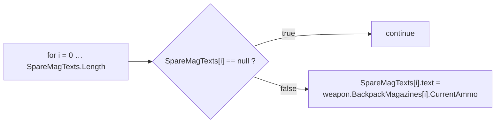
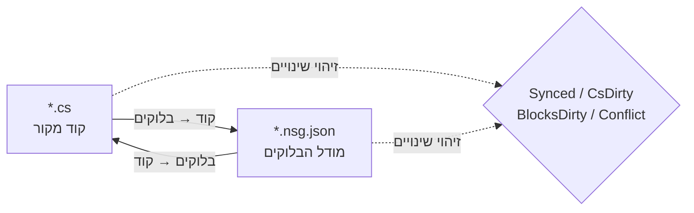

# NekoScriptGraph (NSG) — פריסה מהירה ומדריך

**גרסה** 1.0.2 · **Unity** 2022.3+ · **מחבר** NekoAndreeva · **רישיון** MIT · **חבילה** `com.nekoandreeva.nekoscriptgraph`

> תכנות חזותי בסגנון Scratch ל-Unity ש**לעולם אינו מכניס דבר אל תוך הקוד שלך.**
> NSG כותב קובץ הגדרת בלוקים *לצד* הסקריפט כדי לאפשר לערוך אותו כבלוקים, ומתרגם בשני הכיוונים. קובץ ה-`.cs` שנוצר אינו מכיל שום זכר לתוסף — מחק את תיקיית התוסף והסקריפטים שלך עדיין יתקמפלו.

---

## תוכן העניינים

**חלק א׳ — פריסה מהירה**

1. [API גלובלי בלחיצה אחת](#1-one-click-global-api)
2. [תוכנית הבלוקים הראשונה שלך](#2-your-first-block-program)
3. [מסלול חניכה ב-10 דקות](#3-the-10-minute-onboarding-path)

**חלק ב׳ — מדריך**

4. [מושגי יסוד](#4-core-concepts)
5. [התקנה ודרישות](#5-install--requirements)
6. [עורך הבלוקים](#6-the-block-editor)
7. [מדריך התפריטים](#7-menu-reference)
8. [בלוקי API (צלילה לעומק)](#8-api-blocks-deep-dive)
9. [שפות והוספת שפה](#9-languages--adding-one)
10. [סנכרון, צורה קנונית ויחס בריחה](#10-sync-canonical-form--escape-ratio)
11. [בריאות הארכיטקטורה](#11-architecture-health)
12. [לוקליזציה](#12-localization)
13. [סוכנים ו-MCP](#13-agents--mcp)
14. [העוזר חתולת התוכנה (אופציונלי)](#14-programneko-assistant-optional)
15. [הגדרות](#15-settings)
16. [פריסת תיקיות](#16-directory-layout)
17. [הסרה](#17-uninstall)
18. [פתרון תקלות ושאלות נפוצות](#18-troubleshooting--faq)
19. [יצירת קשר](#19-contact)

**נספחים**

- [A. סכמת הגדרת בלוק](#appendix-a-block-definition-schema)
- [B. סכמת מתאר שפה](#appendix-b-language-descriptor-schema)
- [C. מפתחות הגדרות](#appendix-c-settings-keys)

---
---

# חלק א׳ — פריסה מהירה

מעבר מ„תיקייה שהושלכה אל `Assets`” אל „כתיבת קוד עם בלוקים” בכעשר דקות, כמעט בלי להקליד.

<a id="1-one-click-global-api"></a>
## 1. API גלובלי בלחיצה אחת

**הרעיון:** הפרויקט שלך כבר מכיל מאות מתודות. NSG יכול לקרוא אותן ולהנפיק **בלוק API** לכל אחת מהן, כך שכל מתודה שכבר כתבת הופכת לבלוק בגרירה ובשחרור בפלטה. קוד חדש נכתב אז באמצעות הרכבת אוצר המילים של הפרויקט *שלך*.

### 1.1 איך עושים זאת

1. ודא שהתוסף קומפל (אין שגיאות אדומות ב-Console; Unity 2022.3+).
2. תפריט: **`NekoScriptGraph ▸ Build API Library for Whole Project`** (בנה ספריית API לכל הפרויקט).
3. NSG סופר את קובצי המקור שיסרוק ומציג תיבת אישור:

   > *בניית ספריית API עבור כל הפרויקט — N קובצי מקור → `Assets/NekoScriptGraph/Blocks/API`. להמשיך?*

4. לחץ **Continue** (המשך). בפרויקט גדול מדובר באלפי בלוקים וזה לוקח רגע מורגש — זה צפוי, ולכן המספר מוצג תחילה.
5. כשזה מסתיים, ה-Console רושם סיכום ותיבת דו-שיח מדווחת את הסכומים:

   ```
   [NekoScriptGraph] API blocks: <generated> generated, <skipped> skipped.
   ```

6. ספריית הבלוקים **נטענת מחדש אוטומטית**. אין דבר נוסף לעשות — הבלוקים החדשים פעילים.

> **היקף.** הסריקה מכסה את `Assets` עבור כל שפה רשומה. C# משתמשת ב-`AssetDatabase` (`t:MonoScript`); C/C++/Rust/HLSL/וכו׳ נסרקים על הדיסק לפי סיומת קובץ. `Dependencies/` ו-`.checkpoints/` תמיד מוחרגים.

### 1.2 רק תיקייה אחת במקום

עובדים על תת-מערכת אחת? בחר תיקייה בחלון הפרויקט והשתמש ב:

**`NekoScriptGraph ▸ Generate API Blocks for Selected Folder`** (צור בלוקי API לתיקייה הנבחרת)

אותה מכונה, רדיוס פגיעה קטן יותר, והרבה יותר מהר. זו ההרצה הראשונה המומלצת — כוון לתיקייה שעבורה אתה באמת רוצה לכתוב סקריפטים.

### 1.3 מה מקבלים

קובץ JSON אחד לכל מתודה זכאית, הנכתב לתיקייה שב-`apiOutputFolder` (ברירת מחדל `Assets/NekoScriptGraph/Blocks/API`):

```
Blocks/API/api.DecalUtils.ProjectNormals.5.json
Blocks/API/api.DecalManager.GetSpawner.3.json
Blocks/API/api.GPUDecalUtils.UpdateDrawIndirectCommandBuffer.3.json
```

סכמת שמות: `api.<Type>.<Method>.<arity>.json` — ה**אריטי** (מספר הפרמטרים) הוא חלק מה-ID כדי שחתימות כפולות (`overloads`) יוכלו להתקיים זו לצד זו.

בתוך הפלטה הם מופיעים תחת קטגוריית **API** (`cat.api`), **מקובצים לפי הטיפוס המצהיר**:

| קבוצת פלטה | מכיל |
|---|---|
| `API` → `DecalUtils` | כל מתודת `DecalUtils` זכאית |
| `API` → `DecalManager` | כל מתודת `DecalManager` זכאית |
| `API` → *(פונקציות חופשיות)* | פונקציות ברמה העליונה ב-C / HLSL |

השתמש בתיבת החיפוש בפלטה כדי למצוא אחד באופן מיידי לפי שם.

<a id="14-the-eligibility-rule-know-this-before-you-wonder"></a>
### 1.4 כלל הזכאות (דע זאת לפני שתתהו)

**בלוק API נוצר רק כאשר** המתודה:

| דרישה | מדוע |
|---|---|
| `public` | זהו API ציבורי |
| ללא ג׳נריים (`<…>` על המתודה או על טיפוס ההחזרה שלה) | אין הסקת טיפוסים בזמן ריצה בתוך בלוק |
| ללא `async` | אין מתזמן (scheduler) להמתין עליו |
| **ללא פרמטרים `ref` / `out` / `in` / `params` / `this`** | פרמטרי פלט היו דורשים שקעים נוספים |
| **ללא ערכי ברירת מחדל לפרמטרים** (`=`) | כל השקעים נדרשים |
| ללא אילוצי `where` | זהה לג׳נריים |
| אינה בנאי | זו אינה קריאת מתודה |

כל דבר שנכשל בתנאים אלה **מדולג** בשקט — זה המספר „skipped” בסיכום.

<a id="15-static-vs-instance--the-one-asymmetry"></a>
### 1.5 static מול instance — האסימטריה היחידה

זו ההסתייגות החשובה ביותר בכל תכונת ה-API:

| סוג מתודה | התנהגות הבלוק | הפיכות |
|---|---|---|
| **`static`** | מותאמת לפי מטרת קריאה מנוקדת + אריטי (`matchCall` + `matchArity`) | **דו-כיוונית לחלוטין** — קוד ⇄ בלוקים |
| **instance** | מקבלת שקע `target` מוביל נוסף: `{0}.Method({1}, …)` | **חד-כיוונית** — מודפסת נכון, אך בייבוא היא נקראת מחדש כבלוק קריאה גנרי |

> כלל אצבע: **ממשקי API סטטיים יוצרים בלוקים מושלמים.** מתודות instance עדיין נותנות לך קריאה נכונה ומתעדת את עצמה, אך עריכה של קריאת instance רק דרך בלוקים לא תחזור לבלוק שניתן לזהות באופן ספציפי. העדף נקודות כניסה `static` לכל דבר שאתה מתכוון לכתוב בבלוקים.

לפונקציות חופשיות (C, HLSL) אין טיפוס בעלים ולכן הן מטופלות כ-`static` — דו-כיווניות מלאה.

### 1.6 משמעת בנייה מחדש

- **הרץ מחדש אחרי ריפקטורים.** שינוי שם של מתודה משאיר בלוק API מיושן מאחור. הרץ את המחולל מחדש ומחק יתומים, או שפשוט מחק את `Blocks/API/` וחולל מאפס.
- **חילול מחדש הוא אידמפוטנטי.** המזהים דטרמיניסטיים; כפילויות נספרות כ*מדולגות*, כך שהרצה חוזרת לא תציף את התיקייה.
- **בטוח לבצע קומיט.** `Blocks/API/*.json` הוא נתונים, לא קוד. ביצוע קומיט אומר שבני הצוות מקבלים את אוצר המילים של הבלוקים שלך בלי לסרוק מחדש.

---

<a id="2-your-first-block-program"></a>
## 2. תוכנית הבלוקים הראשונה שלך

הדגמה מלאה מקצה לקצה. נבנה מחדש חלק קטן מהלוגיקה בסגנון `CompassManager` — „הדפס את מספר המחסניות, עם `--` עבור תאים ריקים” — באמצעות בלוקי API.

### שלב 1 — העבר קובץ אחד לניהול

1. בחר קובץ `.cs` בחלון הפרויקט.
2. **`NekoScriptGraph ▸ Take Selected Script Under Management`** (קח לניהול).

   קובץ מופיע לצידו:

   ```
   Assets/Scripts/ChrControl/CompassManager.cs
   Assets/Scripts/ChrControl/CompassManager.nsg.json   ← the block model
   ```

   (קובץ ה-`.nsg.json` מוסתר כברירת מחדל בחלון הפרויקט — זו תכונה, לא באג. `Cmd/Ctrl+Shift+H` מחליף את מצב ההסתרה.)

### שלב 2 — פתח את העורך

**`NekoScriptGraph ▸ Open Block Editor`** (פתח את עורך הבלוקים). הקובץ נפתח כלשונית.

### שלב 3 — מצא את הבלוקים שלך

הבט בחלונית הימנית:

- **חיפוש בפלטה** — הקלד `SpareMagTexts` או `Count` כדי לסנן.
- קבוצת **API** מכילה את הבלוקים שהונפקו בחלק א׳.
- **בקרה / ביטויים / משתנים / מבנה** מכילות את בלוקי השפה.

### שלב 4 — הרכב

גרור בלוקים אל הקנבס. הלולאה הקלאסית:



כל שקע נדרש שנותר ריק מסומן על ידי **בריאות הארכיטקטורה** כ-`danglingInput`.

### שלב 5 — כתוב חזרה

לחץ **Generate** — „בלוקים → קוד” (או השתמש בכפתור היצירה בסרגל הכלים). NSG מדפיס את קוד המקור ומדווח על אחד מהמצבים הבאים:

| מצב | משמעות |
|---|---|
| `Synced` | הקוד ומודל הבלוקים תואמים |
| `Code changed` | ה-`.cs` התקדם — ייבא מחדש |
| `Blocks changed` | הבלוקים התקדמו — לחץ Generate כדי לכתוב אותם |
| `Conflict` | **שני** הצדדים השתנו — אתה בוחר מי מנצח |

### שלב 6 — ודא שהקוד נשאר נקי

פתח את ה-`.cs`. זהו C# רגיל. אין מאפיינים (`attributes`), אין אזור `generated`, אין הפניות לתוסף. זו כל המטרה.

### שלב 7 — בצע קומיט

בצע קומיט גם ל-`.cs` וגם ל-`.nsg.json`. מודל הבלוקים הוא נכס פרויקט רגיל.

> **הכתיבה הראשונה מעצבת מחדש.** אם מתודה לא הייתה כבר בצורה הקנונית של NSG (סוגריים חסרים, הזחה מוזרה, או איות שקול אך שונה), המעבר הראשון *בלוקים → קוד* מנרמל אותה. הסמנטיקה לא משתנה; התצורה משתנה. מזהירים אותך מראש: *„N מתודות אינן בצורה הקנונית…”*. כדי להימנע מדיפים מפתיעים, ראה [§10](#10-sync-canonical-form--escape-ratio).

---

<a id="3-the-10-minute-onboarding-path"></a>
## 3. מסלול חניכה ב-10 דקות

הצ׳קליסט המרוכז. הדפס אותו והדבק אותו על המסך.

| # | פעולה | איפה | ~זמן |
|---|---|---|---|
| 1 | השלך את התוסף אל `Assets/` ותן לו להתקמפל | Unity | דקה |
| 2 | בחר תיקייה → **Generate API Blocks for Selected Folder** | תפריט | דקה |
| 3 | **Take Selected Folder Under Management** | תפריט | דקה |
| 4 | **Open Block Editor** | תפריט | 10 ש׳ |
| 5 | חפש בפלטה אחר אחת מהמתודות שלך | עורך | דקה |
| 6 | גרור שלושה בלוקים, חבר אותם, השאר שקע אחד ריק | עורך | 2 דק׳ |
| 7 | פתח **Architecture Health** וקרא את ממצא ה-`danglingInput` | תפריט | דקה |
| 8 | תקן זאת בגרירת בלוק אל תוך השקע | עורך | דקה |
| 9 | לחץ **Generate**, וודא שהמצב הוא `Synced` | עורך | 30 ש׳ |
| 10 | פתח את ה-`.cs` — וודא שזה C# נקי | עורך | 20 ש׳ |
| 11 | בצע קומיט ל-`.cs` + `.nsg.json` | Git | 30 ש׳ |
| 12 | *(אופציונלי)* **MCP Bridge: Start** והפנה את הסוכן שלך אל `http://127.0.0.1:8765/` | תפריט + לקוח | 2 דק׳ |

**המודל המנטלי בשורה אחת:** ה-`.cs` הוא מקור האמת, ה-`.nsg.json` הוא *עדשה* שמעליו, ו-NSG שומר על התאמה בין העדשה למקור.

---
---
# חלק ב׳ — מדריך

<a id="4-core-concepts"></a>
## 4. מושגי יסוד

### 4.1 קבצים מנוהלים מול קבצים חופשיים

- **קובץ חופשי** — סקריפט רגיל בלי `.nsg.json` לצידו.
- **קובץ מנוהל** — יש לו `.nsg.json`; ניתן לפותחו כבלוקים.

### 4.2 רק גופי מתודות הופכים לבלוקים

החוק החשוב ביותר ב-NSG:

- `using`, הצהרות טיפוסים, שדות, מאפיינים (`attributes`) והערות **מחוץ לגופי מתודות** נשמרים **מילה במילה** ושורדים את שני הכיוונים בלי שינוי.
- **גופי מתודות** מנותחים לבלוקים.
- כל דבר שמודל הבלוקים אינו יכול לבטא נשמר כ**קטע גולמי** ומדווח כאבחנה (`NSG0002`). **שום דבר לעולם לא הולך לאיבוד בשקט.**

### 4.3 מודל הסנכרון הדו-כיווני



| מצב | משמעות |
|---|---|
| `Synced` | הקוד ומודל הבלוקים תואמים |
| `CsDirty` | ה-`.cs` השתנה; המודל מפגר מאחור |
| `BlocksDirty` | הבלוקים השתנו; הקוד טרם נכתב מחדש |
| `Conflict` | שני הצדדים השתנו — עליך לבחור את המנצח |
| `Unmanaged` | אין קובץ בלוקים |

NSG עוקב אחר **איזה צד זז ראשון**, כך שתמיד תדע אם לחיצה על Generate תהרוס את העבודה שלך.

> מסלול ה-MCP/סוכן הוא בכוונה **חד-כיווני: קוד → בלוקים**. הסוכן כותב קוד מקור רגיל; התוסף מנתח מחדש ובונה את המודל מחדש.

---

<a id="5-install--requirements"></a>
## 5. התקנה ודרישות

1. Unity **2022.3** ומעלה.
2. הנח את תיקיית `NekoScriptGraph` תחת `Assets/` (או הוסף אותה כחבילה מקומית).
3. החבילה כולה מוגבלת ב**הגדרת assembly של Editor בלבד** — היא אינה תורמת **דבר** לבניית player.

### חלקים אופציונליים (כל אחד מהם ניתן להסרה כיחידה שלמה)

| תיקייה | מטרה | אם תוסר |
|---|---|---|
| `Dependencies/` | ספרייטים מעוגלים 9-slice | נסוג לפינות מעוגלות רגילות; החבילה ~3.3 MB |
| `LanguageSupport/{c,cpp,go,hlsl,java,python,rust,swift}` | שפות שאינן C# | השפה הזו נעלמת; שום דבר אחר לא נשבר |
| `ProgramNeko/` | עוזרת חתול פיקסלית | התוסף עובד היטב בלעדיה |
| `Locale/*` | תרגומי ממשק | הלוקאל הזה נסוג לאנגלית |

### גודל החבילה

≈ **4.2 MB** כפי שהיא נשלחת:

| חלק | גודל |
|---|---|
| `Editor/` — ליבה, ממשק, מנוע C#, הגדרות | ~1.4 MB |
| `Dependencies/Editor/Sprite/` — ספרייטים אופציונליים 9-slice | ~0.86 MB |
| `Documents/` — המדריך הזה ב-15 שפות | ~0.7 MB |
| `Locale/` — 15 שפות ממשק | ~0.7 MB |
| `LanguageSupport/` — שמונה שפות להוספה | ~0.24 MB |
| `Blocks/` — ספריית בלוקים מובנית (נוצרת מחדש לפי דרישה) | ~0.23 MB |
| `Extensions~/` — תבנית מנוע חיצוני להתקנה | ~0.04 MB |

---

<a id="6-the-block-editor"></a>
## 6. עורך הבלוקים

חלון בעל לשוניות מרובות בסגנון VS Code, בגודל מינימלי 980×600.

| אזור | תוכן |
|---|---|
| שורת הלשוניות | מספר מסמכים פתוחים בעת ובעונה אחת |
| קנבס | הסקריפט כבלוקים — גרירה, חיבור, כיווץ, זום, התאמה |
| חלונית ימנית | פלטת בלוקים + חיפוש + פריסטים; הרוחב נשמר בזיכרון |
| שמאל-תחתון | טקסט מצב, בטל/בצע שוב, משבצת עוזר (רק אם מותקן) |
| שורת הכלים | טעינת ספרייה מחדש, בעיות, בריאות, נקודות שמירה, Git, ספרייטים |

### 6.1 שני מצבי תצוגה

| תצוגה | סגנון | מתאים במיוחד ל |
|---|---|---|
| **מחסנית (Scratch)** | ערימת פקודות אנכית | הוראה, לוגיקה לינארית |
| **Blueprint (UE)** | גרף צמתים | זרימת נתונים ושרשראות ביטויים |

החלף באמצעות התפריט הנפתח **תצוגה** (`View`) — `view.stack` / `view.blueprint`.

### 6.2 הפלטה

- מקובצת לפי `categoryKey`, ניתנת לכיווץ כקבוצה שלמה (`כווץ הכול` / `הרחב הכול`).
- אינדקסי אותיות מתחילים מכווצים; הרחב ידנית.
- שדה החיפוש נמצא **מחוץ** לרשימת הבלוקים בכוונה — הרשימה נבנית מחדש בכל הקלדה ואחרת הייתה מאבדת את המיקוד.
- ניתן לגרור **פריסט** שלם אל הקנבס, לא רק בלוק בודד.

**קטגוריות מובנות:**

| מפתח | תווית | תוכן |
|---|---|---|
| `cat.ctrl` | בקרה | `if`, `for`, `foreach`, `while`, `break`, `continue`, `return` |
| `cat.expr` | ביטויים | binary, unary, call, cast, conditional, ident, index, literal, member, new, postfix |
| `cat.var` | משתנים | משתנים מקומיים והשמה |
| `cat.frame` | מבנה | הצהרות |
| `cat.api` | API | בלוקי API שנוצרו (מקובצים לפי טיפוס) |
| `cat.macro` | הבלוקים שלי | פריסטים של המשתמש |
| `cat.raw` | יציאת חירום | קטעים גולמיים |

### 6.3 נקודות שמירה

תמונות מצב מובנות נמצאות ב-`.checkpoints/`, ש**מוחרג מ-git** — הן לעולם אינן יכולות להתנגש בהיסטוריית המאגר שלך. קח נקודת שמירה לפני כתיבה גדולה של *בלוקים → קוד*.

### 6.4 הסתרת קובצי בלוקים

`hideBlockFiles` מוגדר כברירת מחדל ל-`true`, כך שחלון הפרויקט אינו מוצף בקובצי `.nsg.json`.

- תפריט: **`Toggle Block Files Visibility`** — קיצור גלובלי `Cmd/Ctrl+Shift+H`.
- הקיצור הוא גלובלי: הוא עובד גם כשחלון התוסף סגור.

### 6.5 הסבר הבלוק הנבחר

`Cmd/Ctrl+Shift+E` (תפריט **`Explain Selected Block`**) מבקש מהעוזר להסביר את הבלוק הנוכחי. גם זה קיצור גלובלי.

---

<a id="7-menu-reference"></a>
## 7. מדריך התפריטים

> הכיתובים של `[MenuItem]` הם קבועים בזמן קומפילציה, ולכן **השם האנגלי הסטטי** הוא מה ש-Unity מציגה; שכבת הלוקליזציה מחליפה תוויות מתורגמות בעת הטעינה ובשינוי שפה. רשומות `MCP Bridge` נשארות באנגלית בכוונה.

| פריט תפריט | מטרה |
|---|---|
| `Open Block Editor` | פתח את החלון הראשי |
| `Problems` | רשימת אבחנות |
| `Assistant (ProgramNeko)` | פתח את העוזר; מזהיר אם אינו מותקן |
| `Explain Selected Block` `%#e` | הסבר את הבלוק הנבחר |
| `Architecture Health` | פתח את חלון הבריאות |
| `Take Selected Script Under Management` | נהל קובץ אחד |
| `Release Selected Script` | שחרר קובץ אחד מניהול |
| `Take Selected Folder Under Management` | ניהול בכמות גדולה |
| `Take Whole Project Under Management` | נהל הכול |
| `Release Selected Folder` | שחרור מרוכז |
| `Release Whole Project` | שחרר הכול |
| `Generate API Blocks for Selected Folder` | הנפקת API בהיקף תיקייה |
| `Build API Library for Whole Project` | API גלובלי בלחיצה אחת (חלק א׳) |
| `Reload Block Library` | קרא מחדש את `Blocks/` |
| `Export Default Block Library` | כתוב את הבלוקים המובנים אל `Blocks/` |
| `Generate ShaderLab Shell` | הנפק את המבנה החיצוני של השיידר |
| `Self Test: Round Trip` | בדיקה עצמית של עקביות דו-כיוונית |
| `Toggle Block Files Visibility` `%#h` | הצג/הסתר `.nsg.json` |
| `Languages: Show Loaded` | הצג את רישום השפות |
| `MCP Bridge: Start` / `Stop` / `Copy Client URL` | גשר ה-MCP |

---

<a id="8-api-blocks-deep-dive"></a>
## 8. בלוקי API (צלילה לעומק)

חלק א׳ כיסה את זרימת העבודה. זהו המנגנון.

### 8.1 מה המחולל מפיק

עבור כל מתודה זכאית, `NsgBlockDef` אחד:

```jsonc
// Blocks/API/api.DecalUtils.ProjectNormals.5.json
{
  "id": "api.DecalUtils.ProjectNormals.5",
  "level": "high",
  "shape": "expression",                 // "statement" if return type is void
  "category": "DecalUtils",              // declaring type → palette sub-group
  "categoryKey": "cat.api",              // the "API" group
  "label": "DecalUtils.ProjectNormals({0}, {1}, {2}, {3}, {4})",
  "labelEn": "DecalUtils.ProjectNormals({0}, {1}, {2}, {3}, {4})",
  "labelRu": "DecalUtils.ProjectNormals({0}, {1}, {2}, {3}, {4})",
  "sockets": [
    { "name": "decalPosW", "kind": "expr", "required": true, "variadic": false, "choices": [] },
    { "name": "parents",   "kind": "expr", "required": true, "variadic": false, "choices": [] },
    { "name": "decalNorm", "kind": "expr", "required": true, "variadic": false, "choices": [] },
    { "name": "decalTform","kind": "expr", "required": true, "variadic": false, "choices": [] },
    { "name": "decalColor","kind": "expr", "required": true, "variadic": false, "choices": [] }
  ],
  "emit": "",
  "node": "call",
  "op": "",
  "color": "",
  "matchCall": "DecalUtils.ProjectNormals",  // dotted match target
  "matchArity": 5,                           // parameter count
  "builtin": true,
  "manual": "DecalUtils.ProjectNormals(decalPosW, parents, decalNorm, decalTform, decalColor) : Color[]",
  "variantGroup": "",
  "variantLabel": ""
}
```

הערות:

- **שמות השקעים** הם שמות הפרמטרים האמיתיים — לכן תווית הפלטה מתעדת את עצמה.
- **`manual`** נושא את החתימה המלאה המרובעת בתוספת טיפוס ההחזרה. זו *יציאת החירום*: הצורה הידנית של הבלוק.
- **מתודות instance** מקבלות שקע מוביל נוסף בשם `target` (נדרש), והתווית הופכת ל-`{0}.Method({1}, …)` — ומכאן הסתייגות החד-כיווניות ב-§1.5.
- **פונקציות חופשיות** (C/HLSL) אין להן בעלים והן מטופלות כ-`static`.

### 8.2 דטרמיניזם וסינון כפילויות

- ה-ID הוא `api.<QualifiedType>.<Method>.<arity>` — דטרמיניסטי בין הרצות.
- מזהים כפולים נספרים כ**מדולגים**, ולעולם אינם נכתבים פעמיים.
- הרצה מחדש אחרי ריפקטורים **לא** תסיר יתומים. מחק את `Blocks/API/` וחולל מחדש ללוח נקי.

### 8.3 מספר שפות

`Build API Library for Whole Project` עובר על רישום השפות וקורא ל-`GenerateApiBlocks` של כל מנוע. C# עוברת דרך `AssetDatabase`; שפות בסגנון C סורקות את מערכת הקבצים לפי סיומת הפרופיל, ומדלגות על `.checkpoints/` ו-`Dependencies/`. אם מנוע של שפה נכשל להיבנות, השפה הזו נספרת כנכשלה והשאר ממשיכות.

### 8.4 הנחיות מעשיות

| מצב | עצה |
|---|---|
| אתה רוצה בלוקים עבור תת-מערכת | השתמש בווריאנט ה**תיקייה**, לא בווריאנט הפרויקט |
| אתה רוצה בלוקים דו-כיווניים | חשוף נקודת כניסה **`static`** |
| יש לך ממשקי API עם `ref`/`out`/`params` | הם ידולגו — עטוף אותם במתודה static פשוטה אם אתה רוצה בלוקים |
| חתימות כפולות מתנגשות בפלטה | ה**אריטי** נמצא ב-ID והשקעים מבדילים ביניהם; חפש לפי שם |
| שינית שם של מתודה | חולל מחדש; מחק את קובץ ה-JSON היתום |

---

<a id="9-languages--adding-one"></a>
## 9. שפות והוספת שפה

`C` · `C++` · `C#` · `Go` · `HLSL` · `Java` · `Rust` · `Python` · `Swift`

- כל אחת מתרגמת **בשני הכיוונים**.
- **C# מובנית** (`Editor/Languages/CSharp/`: Lexer, Parser, Printer, Splitter, CodeMap).
- האחרות הן **תיקיות להוספה**. מחק `LanguageSupport/<lang>/` והשפה הזו נעלמת מהתוסף בלי לשבור שום דבר אחר.

### הוספת שפה

צור תיקייה עם מתאר בתוספת מנוע:

```jsonc
// LanguageSupport/python/python.language.json
{
  "apiVersion": 1,
  "id": "python",
  "displayName": "Python",
  "icon": "PYTHON",
  "extensions": [".py"],
  "blocksFolder": "blocks",
  "engineType": "NekoScriptGraph.Nsg_PythonLanguage",
  "author": "",
  "note": "Self-contained language: its own engine, sharing only the block skeleton."
}
```

לאחר מכן ממש את המחלקה הנקראת על ידי `engineType` (ניתוח, הדפסה, יצירת בלוקי API) והוסף את תיקיית ה-`blocks/` של השפה. השתמש ב-`Nsg_PythonLanguage`, `Nsg_CLanguage`, `Nsg_RustLanguage` וכו׳ כמימושים לדוגמה.

---

<a id="10-sync-canonical-form--escape-ratio"></a>
## 10. סנכרון, צורה קנונית ויחס בריחה

### 10.1 יחס בריחה

החלק של בלוקי **קטעים גולמיים**. הוא מודד כמה מהקוד ממודל באמת כבלוקים.

- סנן עליו עם `maxEscapeRatio: 0` (MCP) כדי לדרוש תרגום *מלא* לבלוקים.
- כל דבר שהמנתח אינו יכול למדל נשמר מילה במילה ומדווח כ-**`NSG0002`**.

### 10.2 צורה קנונית

קוד שיש לו „איות תקני” יחיד. המעבר הראשון של *בלוקים → קוד* מנרמל:

- סוגריים חסרים,
- הזחה לא עקבית,
- איותים שקולים אך שונים.

האזהרה הגלויה למשתמש:

> *„N מתודות אינן בצורה הקנונית (סוגריים חסרים, הזחה לא עקבית, או איותים שקולים מרובים). המעבר הראשון של בלוקים → קוד ינרמל אותן — הסמנטיקה לא משתנה, התצורה משתנה.”*

### 10.3 נקודת השבת

חזור ופעל עד ש-`canon(text) == text`. ברגע שהטקסט הוא נקודת שבת, המסמך נשאר `Synced` ולעולם אינו מעצב מחדש שוב. זה בדיוק מה שלולאת הסוכן ב-§13 עושה לפני הכתיבה לדיסק.

---

<a id="11-architecture-health"></a>
## 11. בריאות הארכיטקטורה

תפריט **`Architecture Health`** — כשסקריפט נבחר הוא מנתח את הקובץ הזה; אחרת הוא נפתח ריק.

**מדדים:** מספר בלוקים/פקודות, מספר מתודות, יחס בריחה (`escapes`), וציון מורכב `score`.

**בדיקות:**

| מפתח | משמעות |
|---|---|
| `emptyBody` / `emptyMethod` | גוף ריק / מתודה ריקה |
| `constantCondition` | תנאי שתמיד אמת או תמיד שקר |
| `cycle` | מעגל קריאות או תלויות |
| `danglingInput` | שקע נדרש שנותר לא מחובר |
| `duplicate` | קוד כפול |
| `escapeRatio` | שיעור קטעים גולמיים גבוה |
| `expressionSize` | ביטוי גדול מדי |
| `nesting` | קינון מוגזם |
| `methodLength` | מתודה ארוכה מדי |
| `memberChain` | שרשרת איברים ארוכה (`a.b.c.d.e`) |
| `magicNumber` | מספר קסום |
| `placeholderName` / `shortName` | שמות ממלאי מקום / קצרים מדי |
| `unusedLocal` | משתנה מקומי שאינו בשימוש |
| `afterReturn` | קוד אחרי `return` |
| `leak` | חשד לדליפה |

**פעולות תיקון:** `fixBreakLink`, `fixFillZero`, `fixAddRelease`, `fixApply`, `rerun`.

---

<a id="12-localization"></a>
## 12. לוקליזציה

**15 לוקאלים לממשק:**

סינית מפושטת · סינית מסורתית · אנגלית · צרפתית · גרמנית · **איטלקית** · רוסית · ספרדית · פורטוגזית · יפנית · קוריאנית · פולנית · טורקית · ערבית · עברית

- **ערבית ועברית משקפות את כל העורך**: הפלטה עוברת לשמאל והבלוקים גדלים שמאלה (RTL).
- שורת התפריטים של Unity עצמה נשארת באנגלית **מבחינת תכנון**.
- המחרוזות נמצאות ב-`Locale/<code>/strings.json`, מחולקות למקטעים לפי מפתח (`ui`, `blocks`, …). אוצר המילים של הבלוקים משתמש במקטע `blocks`, למשל `c.assert` → `assert {0}`.

---

<a id="13-agents--mcp"></a>
## 13. סוכנים ו-MCP

NSG מגיעה עם **שרת MCP שרץ בתוך עורך Unity**: JSON-RPC 2.0 מעל תעבורת ה-**Streamable HTTP** של MCP. **אין תהליך צד ואין סביבת ריצה נוספת — לא Node, לא Python. העורך *הוא* השרת.**

```
MCP client ──HTTP POST JSON-RPC──▶ 127.0.0.1:8765 ──▶ Unity Editor
```

### 13.1 הפעלה

תפריט **`NekoScriptGraph ▸ MCP Bridge: Start`**:

```
[NekoScriptGraph] MCP bridge listening on http://127.0.0.1:8765/
```

- זוכר שהיה פעיל ו**מופעל מחדש אוטומטית** אחרי טעינה מחדש של ה-domain או הפעלה מחדש של העורך.
- עצור עם **`MCP Bridge: Stop`**; העתק את הכתובת עם **`MCP Bridge: Copy Client URL`**.
- אמת ידנית — ללא צורך בלקוח:

```bash
curl -s http://127.0.0.1:8765/ -d '{"jsonrpc":"2.0","id":1,"method":"tools/list"}'
```

בקשת `GET /` פשוטה מחזירה דף מצב המפרט את גרסת השרת, מהדורות הפרוטוקול הנתמכות, והכלים הזמינים.

### 13.2 הפניית הלקוח שלך אליו

כל לקוח MCP מסוג Streamable HTTP עובד. צורת התצורה משתנה במעט (`type` באחדים, `transport` באחרים, `url` בלבד בכמה):

```json
{
  "mcpServers": {
    "nekoscriptgraph": {
      "type": "http",
      "url": "http://127.0.0.1:8765/"
    }
  }
}
```

VS Code משתמש ב-`servers` במקום `mcpServers`; הרשומה זהה מלבד זאת.

אם הלקוח שלך מדבר רק **stdio**, הצב לפניו פרוקסי HTTP↔stdio (למשל `npx mcp-remote http://127.0.0.1:8765/`). הפרוקסי הזה הוא עניינו של הלקוח, לא של התוסף.

> תעבורת HTTP+SSE הישנה (`GET /sse`) **אינה** ממומשת. הגשר מגיש Streamable HTTP, מהדורת פרוטוקול `2025-03-26` ומעלה, וכן מקבל לקוחות `2024-11-05` ששולחים POST לאותה כתובת.

### 13.3 שבעת הכלים

| כלי | כותב? | מה הוא עושה |
|---|---|---|
| `nsg_writing_spec` | לא | תת-הקבוצה הקנונית לכתיבה עבור שפה, נוצרת מספריית הבלוקים והמדפיס |
| `nsg_verify` | לא | מצב של קובץ על הדיסק: `Synced`, `CsDirty`, `BlocksDirty`, `Conflict`, `Unmanaged` |
| `nsg_plan` | לא | ניתוח קוד מועמד, דיווח אבחנות, מספרי בלוקים, יחס בריחה, קנוני? |
| `nsg_canon` | לא | טקסט קנוני — אורקל נקודת השבת |
| `nsg_apply` | **כן** | בנייה מחדש של ה-`.nsg.json` וכתיבת קוד המקור הקנוני |
| `nsg_list_managed` | לא | כל קובץ `.nsg.json` תחת תיקייה |
| `nsg_release` | **כן** | מחיקת קובצי ה-`.nsg.json` האלה (הסרה נקייה) |

### 13.4 הלולאה המיועדת — קוד → בלוקים

1. `nsg_writing_spec` פעם אחת, כדי ללמוד את תת-הקבוצה עבור השפה.
2. ערוך את ה-`.cs` (או פשוט החזק את הטקסט בשיחה).
3. `nsg_plan` — אבחנות, מספרי בלוקים, יחס בריחה. **לא כותב דבר, ואינו דורש קומפילציה**, ולכן הוא בטוח על קוד שעדיין לא נבנה.
4. אם `canonical` הוא false, קרא ל-`nsg_canon` וחזור עד ש-`canon(text) == text`. זו נקודת השבת: ברגע שמגיעים אליה, המסמך נשאר `Synced` ושום דבר לא מעצב מחדש לאחר מכן.
5. `nsg_apply` — כותב את ה-`.cs` הקנוני ואת ה-`.nsg.json` הבנוי מחדש.

סנן לפי יחס בריחה עם `maxEscapeRatio: 0` כדי לדרוש תרגום מלא לבלוקים.

```json
{"jsonrpc":"2.0","id":1,"method":"tools/call","params":{
  "name":"nsg_plan",
  "arguments":{"file":"Assets/Scripts/CompassManager.cs","maxEscapeRatio":0.0}}}
```

`nsg_plan`, `nsg_canon` ו-`nsg_apply` מקבלים גם `source`, כך שהסוכן יכול לוודא טקסט לפני שהוא בכלל מגיע לדיסק:

```json
{"jsonrpc":"2.0","id":2,"method":"tools/call","params":{
  "name":"nsg_canon",
  "arguments":{"file":"Assets/Scripts/Foo.cs","source":"class Foo { void A(){ } }"}}}
```

### 13.5 אבטחה

הגשר כותב קבצים אל תוך הפרויקט שלך, ולכן הוא צר בכוונה:

- מאזין ל-**`127.0.0.1` בלבד** — לעולם לא לממשק שניתן לניתוב.
- בקשות שנושאות כותרת **`Origin`** נדחות עם **`403`**. דפדפנים תמיד שולחים `Origin`; לקוחות MCP מקוריים לעולם לא — כך ש**אף דף פתוח בדפדפן שלך אינו יכול להגיע לגשר**. אם אתה ממש צריך לקוח דפדפן, הרפה זאת עם `Nsg_McpBridge.SetAllowOrigin(true)`.
- השרת **כבוי עד שאתה מפעיל אותו**, ונעצר עם היציאה.

### 13.6 פתרון תקלות

| סימפטום | סיבה / תיקון |
|---|---|
| העורך לא ענה בזמן | הגשר ממיר כל קריאה לתור על ה-thread הראשי, ו-Unity אינה מריצה `EditorApplication.update` בזמן קומפילציה או טעינה מחדש של ה-domain. בקשות שנשלחות בזמן קומפילציה מחדש ממתינות, ואז נכשלות אחרי **60 שניות**. פשוט נסה שוב |
| הפורט כבר בשימוש | תהליך אחר מחזיק ב-`8765`. שנה אותו עם `Nsg_McpBridge.SetPort(n)`, או סגור את המאזין האחר |
| הכלים חסרים | בדוק שהתוסף קומפל — `Nsg_Json`, `Nsg_Mcp` ו-`Nsg_McpBridge` הם סקריפטים רגילים של Editor שאינם דורשים הגדרה. `GET /` מפרט את הכלים המוצעים כעת |

### 13.7 שימוש בו בלי MCP

הגשר הוא נקודת קצה רגילה של JSON-RPC; אותן פעולות זמינות בלי שום פרוטוקול:

- **Headless / CI**

```bash
Unity -batchmode -quit -projectPath <project> \
      -executeMethod NekoScriptGraph.Nsg_AgentCli.Main \
      -nsgRequest req.json -nsgResponse resp.json
```

- **בקוד** — `Nsg_AgentApi.Run(request)`, ובנוסף `Nsg_Mcp.Handle(jsonString)` עבור שכבת הפרוטוקול בלבד.

---

<a id="14-programneko-assistant-optional"></a>
## 14. העוזר חתולת התוכנה (אופציונלי)

`ProgramNeko/` הוא עוזר חתול פיקסלי אופציונלי. **מחק את כל התיקייה והתוסף ממשיך לעבוד.**

- תפריט **`Assistant (ProgramNeko)`** פותח אותו. זהו החלון ה*זהה* לזה של Problems: בלעדיה הוא רק רשימת שגיאות; איתה, החתול יושב למעלה ומדבר למטה.
- `Cmd/Ctrl+Shift+E` מבקש ממנה להסביר את הבלוק הנבחר.
- יש לה לוקליזציה משלה: `ProgramNeko/Locale/<code>/neko.json` (15 לוקאלים).
- מניפסט: `ProgramNeko/programneko.json`.

---

<a id="15-settings"></a>
## 15. הגדרות

`Assets/NekoScriptGraph/NekoScriptGraph.settings.json`:

```jsonc
{
  "viewMode": 0,                        // 0 = Stack (Scratch), 1 = Blueprint (UE)
  "hideBlockFiles": true,               // hide .nsg.json by default
  "useSprites": false,                  // 9-slice sprites
  "headerSprite": "block_header",
  "bodySprite": "block_body",
  "footerSprite": "block_footer",
  "exprSprite": "block_expr",
  "bodyIndent": 14,                     // body indent
  "cornerRadius": 6,
  "footerHeight": 10,
  "rightPaneWidth": 240.0,              // remembered after you drag it
  "presetPaneHeight": 200.0,
  "shaderPipeline": "auto",             // auto / ...
  "apiOutputFolder": "Assets/NekoScriptGraph/Blocks/API"
}
```

פריסטים (צרורות גרירה מרובות-בלוקים) נמצאים ב-`.presets/presets.json`, עם `schemaVersion: 1`, כאשר כל רשומה מתעדת `name`, `createdAt`, `blockCount`, `languageId`, ומערך `nodes`.

---

<a id="16-directory-layout"></a>
## 16. פריסת תיקיות

```
NekoScriptGraph/
├─ Editor/
│  ├─ Core/                      engine core
│  │  ├─ Esketamine/             AST, parse/print, block library, diagnostics,
│  │  │                          settings, MCP, agent API, L10n, undo, checkpoints
│  │  └─ cstyle/                 C-style engine, shader pipeline, agent spec
│  ├─ Languages/CSharp/          lexer / parser / printer / splitter / code map
│  ├─ UI/                        main window, block view, blueprint view, health,
│  │                             error window, RTL, picker, name dialog
│  ├─ Nsg_Menu.cs                menu items
│  ├─ Nsg_McpBridge.cs           MCP HTTP bridge
│  ├─ Nsg_AgentCli.cs            headless CLI
│  └─ Nsg_SelfTest.cs            round-trip self test
├─ Blocks/                       built-in block library + API/*.json
├─ LanguageSupport/{c,cpp,go,hlsl,java,python,rust,swift}/
├─ Locale/{15 locales}/strings.json
├─ Dependencies/Editor/Sprite/   optional 9-slice sprites
├─ ProgramNeko/                  optional assistant
├─ .presets/presets.json
├─ NekoScriptGraph.settings.json
├─ MCP.md                        dedicated MCP chapter
└─ package.json                  com.nekoandreeva.nekoscriptgraph v1.0.2
```

---

<a id="17-uninstall"></a>
## 17. הסרה

לא פולשנית, בשני מסלולים:

1. **תפריט** — `Release Selected Script` / `Release Selected Folder` / `Release Whole Project`, או כפתורי הממשק **Release** / **Release All** / **Release Folder**.
2. מחק את כל קובצי ה-`.nsg.json` תחת התיקייה הנבחרת או הפרויקט כולו.

**קובצי המקור לעולם אינם נגעים.** לאחר מכן הדבר היחיד שנותר הוא תיקיית התוסף עצמה — מחק אותה וסיימת.

---

<a id="18-troubleshooting--faq"></a>
## 18. פתרון תקלות ושאלות נפוצות

**האם ה-`.cs` שנוצר מכיל עקבות של התוסף?**
לא. מחק את תיקיית התוסף והסקריפט עדיין יתקמפל.

**מדוע `using`, שדות או מאפיינים אינם הופכים לבלוקים?**
מבחינת תכנון. רק גופי מתודות משתתפים בתרגום לבלוקים; כל השאר נשמר מילה במילה בשני הכיוונים.

**מדוע הקובץ שלי עוצב מחדש?**
הוא לא היה בצורה הקנונית. המעבר הראשון *בלוקים → קוד* מנרמל סוגריים והזחה; הסמנטיקה לא משתנה. חזור עם `nsg_canon` עד לנקודת שבת תחילה אם אתה רוצה אפס שינויים בתצורה.

**כמה פקודות הפכו ל„קטעים גולמיים” — מדוע?**
הן מחוץ לתת-הקבוצה הניתנת לכתיבה עבור השפה הזו. NSG שומר אותן מילה במילה ומדווח `NSG0002` במקום להפיל אותן. השתמש ב-`maxEscapeRatio` כדי להפוך זאת לשער קשיח.

**מדוע פריטי התפריט של `MCP Bridge` באנגלית?**
בכוונה — שורת התפריטים של Unity אינה משתתפת בלוקליזציה של התוסף, וערבוב רשומות מתורגמות ולא מתורגמות גרוע יותר.

**האם אני יכול לנהל תיקייה אחת בלבד?**
כן: **`Take Selected Folder Under Management`**.

**יותר מדי קובצי בלוקים מעמיסים על חלון הפרויקט?**
הם מוסתרים כברירת מחדל; החלף עם `Cmd/Ctrl+Shift+H`.

**בלוקי ה-API שלי מיושנים אחרי שינוי שם.**
חילול מחדש אינו גוזם יתומים. מחק את `Blocks/API/` וחולל מחדש.

**בלוק API שציפיתי לו חסר.**
המתודה נכשלה בזכאות — לרוב `ref`/`out`/`params`, ערך ברירת מחדל לפרמטר, ג׳נרי, או `async`. ראה [§1.4](#14-the-eligibility-rule-know-this-before-you-wonder).

**בלוק API של מתודת instance אינו חוזר לסיבוב מלא.**
צפוי. רק מתודות `static` הן דו-כיווניות לחלוטין; מתודות instance נושאות שקע `target` והן חד-כיווניות. ראה [§1.5](#15-static-vs-instance--the-one-asymmetry).

---

<a id="19-contact"></a>
## 19. יצירת קשר

מחבר: **NekoAndreeva**

- דוא״ל: elenaandreevasvinolup@gmail.com
- WhatsApp: +852 5247 4163
- GitHub: `https://github.com/elenaandreevasvinolup-alt`

---
---
<a id="appendix-a-block-definition-schema"></a>
## נספח A. סכמת הגדרת בלוק

`Blocks/<id>.json` — קובץ אחד לכל בלוק.

| שדה | טיפוס | הערות |
|---|---|---|
| `id` | string | ייחודי, וגם זהות הפלטה; `api.<Type>.<Method>.<arity>` עבור בלוקים שנוצרו |
| `level` | string | `high` (רמת פקודה) / אחר |
| `shape` | string | `control` · `statement` · `expression` |
| `category` | string | קבוצת תצוגה; עבור בלוקי API זהו הטיפוס המצהיר |
| `categoryKey` | string | מפתח הלוקליזציה של הקבוצה: `cat.ctrl`, `cat.expr`, `cat.var`, `cat.frame`, `cat.api`, `cat.macro`, `cat.raw` |
| `label` | string | תווית הפלטה עם משבצות `{0}`, `{1}`… |
| `labelEn` / `labelRu` | string | תוויות לפי שפה |
| `sockets` | array | `{ name, kind, required, variadic, choices[] }` |
| `emit` | string | תבנית emit מותאמת (ריק = ברירת המחדל של המנוע) |
| `node` | string | צומת ה-AST שאליו הוא ממופה: `if`, `call`, `binary`, … |
| `op` | string | אופרטור, כשזה רלוונטי |
| `color` | string | עקיפה אופציונלית |
| `matchCall` | string | מטרת קריאה מנוקדת לזיהוי בעת הייבוא |
| `matchArity` | int | מספר הפרמטרים להתאמה (`-1` = כל אחד) |
| `builtin` | bool | נשלח יחד עם התוסף |
| `manual` | string | הצורה/החתימה הידנית המלאה, בשימוש בערך ה-manual של הבלוק |
| `variantGroup` / `variantLabel` | string | קיבוץ וריאנטים |

**בלוקי פקודה/ביטוי מובנים:** `stmt.if`, `stmt.for`, `stmt.foreach`, `stmt.while`, `stmt.break`, `stmt.continue`, `stmt.return`, `stmt.localDecl`, `stmt.assign`, `stmt.expr`, `stmt.add`, `stmt.sub`, `stmt.mul`, `stmt.div`, `stmt.mod`, `stmt.raw`, וביטויים `expr.binary`, `expr.unary`, `expr.call`, `expr.cast`, `expr.conditional`, `expr.ident`, `expr.index`, `expr.literal`, `expr.member`, `expr.new`, `expr.postfix`, `expr.raw`.

<a id="appendix-b-language-descriptor-schema"></a>
## נספח B. סכמת מתאר שפה

`LanguageSupport/<id>/<id>.language.json`:

| שדה | טיפוס | הערות |
|---|---|---|
| `apiVersion` | int | כרגע `1` |
| `id` | string | `c`, `cpp`, `csharp`, `hlsl`, `java`, `python`, `rust` |
| `displayName` | string | מוצג בממשק |
| `icon` | string | טקסט תג, למשל `PYTHON` |
| `extensions` | string[] | למשל `[".py"]` |
| `blocksFolder` | string | תיקיית בלוקים יחסית, למשל `blocks` |
| `engineType` | string | מחלקת מנוע מרובעת, למשל `NekoScriptGraph.Nsg_PythonLanguage` |
| `author` | string | אופציונלי |
| `note` | string | תיאור אופציונלי |

<a id="appendix-c-settings-keys"></a>
## נספח C. מפתחות הגדרות

ראה [§15](#15-settings). המפתחות היחידים שסביר שתשנה: `viewMode`, `hideBlockFiles`, `useSprites`, `apiOutputFolder`, `shaderPipeline`.

---

# ייצוא המסמך הזה ל-PDF

`pandoc`, `node` או `npx` אינם מותקנים כרגע במכונה הזו. אפשרויות:

**A. מובנה ב-macOS (אפס התקנה, הכי מהיר)**
שמור את ה-Markdown, רנדר אותו ל-HTML (תצוגה מקדימה של Markdown ב-VS Code, או Typora), פתח אותו ב-Safari, ואז **File ▸ Print… (⌘P) ▸ PDF ▸ Save as PDF**.

**B. Homebrew + pandoc (הטיפוגרפיה הטובה ביותר)**

```bash
brew install pandoc
brew install --cask basictex        # or mactex-no-gui
pandoc GUIDE.md -o NSG-GUIDE.pdf \
  --pdf-engine=xelatex \
  -V mainfont="Helvetica Neue" \
  -V monofont="Menlo" \
  -V geometry:margin=2cm \
  --toc --toc-depth=2 -N
```

**C. תוסף VS Code**
התקן `Markdown PDF` (yzane) או `Markdown Preview Enhanced`, ואז לחץ ימני על הקובץ → **Markdown PDF: Export (pdf)**.
