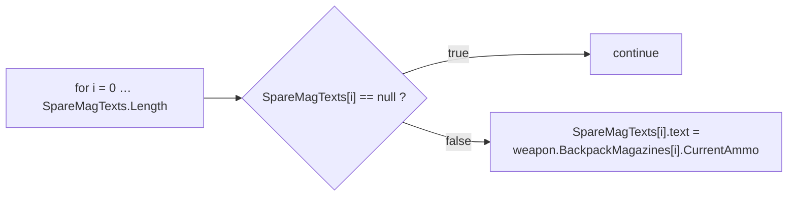
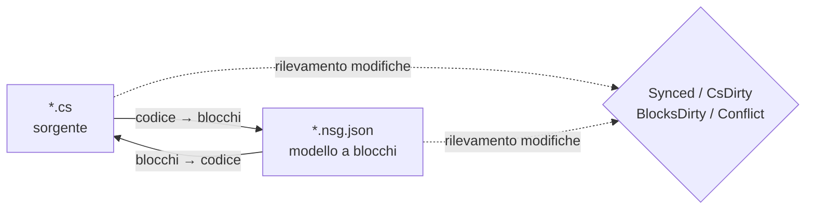

# NekoScriptGraph (NSG) — Guida rapida al deployment e manuale

**Versione** 1.0.2 · **Unity** 2022.3+ · **Autore** NekoAndreeva · **Licenza** MIT · **Pacchetto** `com.nekoandreeva.nekoscriptgraph`

> Programmazione visuale in stile Scratch per Unity che **non mette mai nulla nel tuo codice.**
> NSG scrive un file di configurazione dei blocchi *accanto* a uno script per renderlo modificabile come blocchi, e traduce in entrambe le direzioni. Il `.cs` generato non contiene alcuna traccia del plugin — elimina la cartella del plugin e i tuoi script continueranno a compilare.

---

## Indice

**Parte A — Deployment rapido**

1. [API globale con un clic](#1-one-click-global-api)
2. [Il tuo primo programma a blocchi](#2-your-first-block-program)
3. [Percorso di avvio in 10 minuti](#3-the-10-minute-onboarding-path)

**Parte B — Manuale**

4. [Concetti fondamentali](#4-core-concepts)
5. [Installazione e requisiti](#5-install--requirements)
6. [L'editor a blocchi](#6-the-block-editor)
7. [Riferimento dei menu](#7-menu-reference)
8. [Blocchi API (approfondimento)](#8-api-blocks-deep-dive)
9. [Linguaggi e come aggiungerne uno](#9-languages--adding-one)
10. [Sincronizzazione, forma canonica e rapporto di fuga](#10-sync-canonical-form--escape-ratio)
11. [Salute dell'architettura](#11-architecture-health)
12. [Localizzazione](#12-localization)
13. [Agenti e MCP](#13-agents--mcp)
14. [Assistente GattaProgramma (opzionale)](#14-programneko-assistant-optional)
15. [Impostazioni](#15-settings)
16. [Struttura delle directory](#16-directory-layout)
17. [Disinstallazione](#17-uninstall)
18. [Risoluzione dei problemi e FAQ](#18-troubleshooting--faq)
19. [Contatti](#19-contact)

**Appendici**

- [A. Schema di definizione di un blocco](#appendix-a-block-definition-schema)
- [B. Schema del descrittore di linguaggio](#appendix-b-language-descriptor-schema)
- [C. Chiavi delle impostazioni](#appendix-c-settings-keys)

---
---

# PARTE A — DEPLOYMENT RAPIDO

Passa da "cartella copiata in Assets" a "scrivere codice con i blocchi" in circa dieci minuti, quasi senza digitare.

<a id="1-one-click-global-api"></a>
## 1. API globale con un clic

**L'idea:** il tuo progetto contiene già centinaia di metodi. NSG può leggerli e coniare un **blocco API** per ciascuno, così che ogni metodo già scritto diventi un blocco trascinabile nella palette. Il nuovo codice viene poi scritto assemblando il vocabolario *del tuo stesso* progetto.

### 1.1 Come si fa

1. Verifica che il plugin sia stato compilato (nessun errore rosso nella Console; Unity 2022.3+).
2. Menu: **`NekoScriptGraph ▸ Build API Library for Whole Project`** — Crea libreria API dell'intero progetto.
3. NSG conta i file sorgente che analizzerà e mostra una finestra di conferma:

   > *Crea la libreria API per l'intero progetto — N file sorgente → `Assets/NekoScriptGraph/Blocks/API`. Continuare?*

4. Fai clic su **Continua**. Su un progetto grande si tratta di migliaia di blocchi e richiede un momento perceptibile — è previsto, ed è per questo che il conteggio viene mostrato prima.
5. Al termine, la Console registra un riepilogo e una finestra riporta i totali:

   ```
   [NekoScriptGraph] API blocks: <generated> generated, <skipped> skipped.
   ```

6. La libreria di blocchi viene **ricaricata automaticamente**. Non c'è altro da fare — i nuovi blocchi sono già attivi.

> **Ambito.** La scansione copre `Assets` per ogni linguaggio registrato. C# usa `AssetDatabase` (`t:MonoScript`); C/C++/Rust/HLSL/ecc. vengono percorsi su disco per estensione di file. `Dependencies/` e `.checkpoints/` sono sempre esclusi.

### 1.2 Oppure una sola cartella

Lavori su un singolo sottosistema? Seleziona una cartella nella finestra Project e usa:

**`NekoScriptGraph ▸ Generate API Blocks for Selected Folder`** — Genera blocchi API per la cartella selezionata

Stessa macchina, raggio d'azione minore, molto più veloce. È la prima esecuzione consigliata: scegli come bersaglio la cartella su cui vuoi davvero scrivere script.

### 1.3 Cosa ottieni

Un file JSON per ogni metodo ammissibile, scritto nella cartella indicata da `apiOutputFolder` (predefinita `Assets/NekoScriptGraph/Blocks/API`):

```
Blocks/API/api.DecalUtils.ProjectNormals.5.json
Blocks/API/api.DecalManager.GetSpawner.3.json
Blocks/API/api.GPUDecalUtils.UpdateDrawIndirectCommandBuffer.3.json
```

Schema di denominazione: `api.<Type>.<Method>.<arity>.json` — l'**arity** (numero di parametri) fa parte dell'ID, così gli overload possono coesistere.

Nella palette finiscono sotto la categoria **API** (`cat.api`), **raggruppate per tipo dichiarante**:

| Gruppo della palette | Contiene |
|---|---|
| `API` → `DecalUtils` | ogni metodo ammissibile di `DecalUtils` |
| `API` → `DecalManager` | ogni metodo ammissibile di `DecalManager` |
| `API` → *(funzioni libere)* | funzioni di primo livello C / HLSL |

Usa il campo di ricerca della palette per trovarne uno all'istante per nome.

<a id="14-the-eligibility-rule-know-this-before-you-wonder"></a>
### 1.4 La regola di ammissibilità (da sapere prima di chiedersi perché)

Un **blocco API viene generato solo quando** il metodo è:

| Requisito | Perché |
|---|---|
| `public` | È API pubblica |
| Senza generici (`<…>` sul metodo o sul suo tipo di ritorno) | Nessuna inferenza di tipo a runtime in un blocco |
| Senza `async` | Nessuno scheduler su cui attendere |
| **Senza parametri `ref` / `out` / `in` / `params` / `this`** | I parametri di output richiederebbero socket aggiuntivi |
| **Senza valori predefiniti dei parametri** (`=`) | Tutti i socket sono obbligatori |
| Senza vincoli `where` | Come per i generici |
| Non un costruttore | Non è una chiamata a metodo |

Tutto ciò che non soddisfa questi requisiti viene **saltato** in silenzio — quel conteggio è il numero di "skipped" nel riepilogo.

<a id="15-static-vs-instance--the-one-asymmetry"></a>
### 1.5 Statico vs istanza — l'unica asimmetria

Questa è l'avvertenza più importante dell'intera funzionalità API:

| Tipo di metodo | Comportamento del blocco | Reversibilità |
|---|---|---|
| **`static`** | Riconosciuto tramite destinazione di chiamata puntata + arity (`matchCall` + `matchArity`) | **Pienamente bidirezionale** — codice ⇄ blocchi |
| **istanza** | Riceve un socket `target` aggiuntivo in testa: `{0}.Method({1}, …)` | **Monodirezionale** — stampa correttamente, ma all'importazione viene riletto come blocco di chiamata generica |

> Regola pratica: **le API `static` producono blocchi perfetti.** I metodi di istanza offrono comunque una chiamata corretta e autodocumentante, ma una modifica fatta solo con i blocchi su una chiamata di istanza non tornerà indietro come blocco specificamente riconoscibile. Preferisci punti d'ingresso `static` per tutto ciò che intendi scrivere a blocchi.

Le funzioni libere (C, HLSL) non hanno un tipo proprietario e sono quindi trattate come statiche — pienamente bidirezionali.

### 1.6 Disciplina di rigenerazione

- **Riesegui dopo i refactoring.** Rinominare un metodo lascia dietro di sé un blocco API obsoleto. Riesegui il generatore ed elimina gli orfani, oppure elimina semplicemente `Blocks/API/` e rigenera da zero.
- **La rigenerazione è idempotente.** Gli ID sono deterministici; i duplicati sono contati come *skipped*, quindi rieseguire non riempirà di spazzatura la cartella.
- **Puoi committarla senza rischi.** `Blocks/API/*.json` è dati, non codice. Committarla significa che i compagni di squadra ottengono il tuo vocabolario di blocchi senza dover rieseguire la scansione.

---

<a id="2-your-first-block-program"></a>
## 2. Il tuo primo programma a blocchi

Una guida concreta end-to-end. Ricostruiremo un piccolo pezzo di logica in stile `CompassManager` — "stampa il conteggio dei caricatori, mostrando `--` per gli slot vuoti" — usando i blocchi API.

### Passo 1 — Metti un file in gestione

1. Seleziona un file `.cs` nella finestra Project.
2. **`NekoScriptGraph ▸ Take Selected Script Under Management`** — Prendi in gestione lo script selezionato.

   Accanto ad esso compare un file:

   ```
   Assets/Scripts/ChrControl/CompassManager.cs
   Assets/Scripts/ChrControl/CompassManager.nsg.json   ← the block model
   ```

   (Il `.nsg.json` è nascosto nella finestra Project per impostazione predefinita — è una funzionalità, non un bug. `Cmd/Ctrl+Shift+H` lo mostra/nasconde.)

### Passo 2 — Apri l'editor

**`NekoScriptGraph ▸ Open Block Editor`** — Apri editor blocchi. Il file si apre come scheda.

### Passo 3 — Trova i tuoi blocchi

Guarda il pannello di destra:

- **Ricerca nella palette** — digita `SpareMagTexts` o `Count` per filtrare.
- Il gruppo **API** contiene i blocchi coniati nella Parte A.
- **Control / Expressions / Variables / Structure** contengono i blocchi di linguaggio.

### Passo 4 — Assembla

Trascina i blocchi sulla tela. Il ciclo classico:



Ogni socket obbligatorio lasciato vuoto viene segnalato da **Salute dell'architettura** come `danglingInput`.

### Passo 5 — Riscrivilo nel codice

Premi **Genera** (o usa il pulsante di generazione nella barra strumenti). NSG stampa il sorgente e riporta uno dei seguenti stati:

| Stato | Significato |
|---|---|
| `Synced` | Codice e modello a blocchi concordano |
| `Code changed` | Il `.cs` è più avanti — reimporta |
| `Blocks changed` | I blocchi sono più avanti — Genera per scriverli |
| `Conflict` | **Entrambi** i lati sono cambiati — scegli tu chi vince |

### Passo 6 — Conferma che il codice è rimasto pulito

Apri il `.cs`. È normale C#. Nessun attributo, nessuna regione generata, nessun riferimento al plugin. È esattamente questo il punto.

### Passo 7 — Commit

Committa sia il `.cs` sia il `.nsg.json`. Il modello a blocchi è una normale risorsa di progetto.

> **La prima scrittura riformatta.** Se un metodo non era già nella forma canonica di NSG (parentesi mancanti, indentazione strana, una scrittura equivalente ma diversa), la prima passata *blocchi → codice* lo normalizza. La semantica non cambia; cambia la formattazione. Sei avvisato in anticipo: *"N method(s) are not in canonical form…"*. Per evitare diff inattesi, vedi [§10](#10-sync-canonical-form--escape-ratio).

---

<a id="3-the-10-minute-onboarding-path"></a>
## 3. Percorso di avvio in 10 minuti

La checklist condensata. Stampala e attaccala al monitor.

| # | Azione | Dove | ~Tempo |
|---|---|---|---|
| 1 | Copia il plugin in `Assets/` e lascia che compili | Unity | 1 min |
| 2 | Seleziona una cartella → **Genera blocchi API per la cartella selezionata** | Menu | 1 min |
| 3 | **Prendi in gestione la cartella selezionata** | Menu | 1 min |
| 4 | **Apri editor blocchi** | Menu | 10 s |
| 5 | Cerca nella palette uno dei tuoi metodi | Editor | 1 min |
| 6 | Trascina tre blocchi, collegali, lascia un socket vuoto | Editor | 2 min |
| 7 | Apri **Salute dell'architettura** e leggi la segnalazione `danglingInput` | Menu | 1 min |
| 8 | Risolvi trascinando un blocco nel socket | Editor | 1 min |
| 9 | Premi **Genera**, verifica che lo stato sia `Synced` | Editor | 30 s |
| 10 | Apri il `.cs` — verifica che sia C# pulito | Editor | 20 s |
| 11 | Committa `.cs` + `.nsg.json` | Git | 30 s |
| 12 | *(Opzionale)* **MCP Bridge: Start** e punta il tuo agente su `http://127.0.0.1:8765/` | Menu + client | 2 min |

**Il modello mentale in una riga:** il `.cs` è la fonte di verità, il `.nsg.json` è una *lente* su di esso, e NSG mantiene la lente e la fonte concordi.

---
---

# PARTE B — MANUALE

<a id="4-core-concepts"></a>
## 4. Concetti fondamentali

### 4.1 File gestiti e file liberi

- **File libero** — uno script ordinario senza alcun `.nsg.json` accanto.
- **File gestito** — ha un `.nsg.json`; può essere aperto come blocchi.

### 4.2 Solo i corpi dei metodi diventano blocchi

La regola più importante di NSG:

- `using`, dichiarazioni di tipo, campi, attributi e commenti **al di fuori dei corpi dei metodi** sono preservati **alla lettera** e sopravvivono intatti in entrambe le direzioni.
- I **corpi dei metodi** vengono analizzati e convertiti in blocchi.
- Tutto ciò che il modello a blocchi non riesce a esprimere è preservato come **frammento grezzo** (`raw snippet`) e segnalato come diagnostica (`NSG0002`). **Nulla viene mai perso in silenzio.**

### 4.3 Il modello di sincronizzazione bidirezionale



| Stato | Significato |
|---|---|
| `Synced` | Codice e modello a blocchi concordano |
| `CsDirty` | Il `.cs` è cambiato; il modello è indietro |
| `BlocksDirty` | I blocchi sono cambiati; il codice non è stato riscritto |
| `Conflict` | Entrambi i lati sono cambiati — devi scegliere il vincitore |
| `Unmanaged` | Nessun file di blocchi |

NSG tiene traccia di **quale lato si è mosso per primo**, così sai sempre se premere Genera distruggerebbe il tuo lavoro.

> Il percorso MCP/agente è deliberatamente **monodirezionale: codice → blocchi**. L'agente scrive sorgente ordinario; il plugin ri-analizza e ricostruisce il modello.

---

<a id="5-install--requirements"></a>
## 5. Installazione e requisiti

1. Unity **2022.3** o versioni successive.
2. Metti la cartella `NekoScriptGraph` sotto `Assets/` (oppure aggiungila come pacchetto locale).
3. L'intero pacchetto è delimitato da una **assembly definition di sola Editor** — non contribuisce **in alcun modo** alla build del player.

### Parti opzionali (ciascuna è rimovibile come unità)

| Cartella | Scopo | Se rimossa |
|---|---|---|
| `Dependencies/` | Sprite arrotondati 9-slice | Ripiega su angoli arrotondati semplici; pacchetto ~3,3 MB |
| `LanguageSupport/{c,cpp,go,hlsl,java,python,rust,swift}` | Linguaggi non-C# | Quel linguaggio scompare; nient'altro si rompe |
| `ProgramNeko/` | Assistente gatto pixel | Il plugin funziona bene anche senza di lei |
| `Locale/*` | Traduzioni dell'interfaccia | Quel locale ripiega sull'inglese |

### Dimensione del pacchetto

≈ **4,2 MB** così come viene distribuito:

| Parte | Dimensione |
|---|---|
| `Editor/` — core, UI, motore C#, impostazioni | ~1,4 MB |
| `Dependencies/Editor/Sprite/` — sprite 9-slice opzionali | ~0,86 MB |
| `Documents/` — questa guida in 15 lingue | ~0,7 MB |
| `Locale/` — 15 lingue dell'interfaccia | ~0,7 MB |
| `LanguageSupport/` — otto linguaggi aggiuntivi | ~0,24 MB |
| `Blocks/` — libreria di blocchi integrata (rigenerata su richiesta) | ~0,23 MB |
| `Extensions~/` — modello di motore esterno installabile | ~0,04 MB |

---

<a id="6-the-block-editor"></a>
## 6. L'editor a blocchi

Una finestra multi-scheda in stile VS Code, minimo 980×600.

| Regione | Contenuto |
|---|---|
| Barra delle schede | Più documenti aperti contemporaneamente |
| Tela | Lo script come blocchi — trascina, collega, comprimi, zoom, adatta |
| Pannello destro | Palette dei blocchi + ricerca + preset; la larghezza viene ricordata |
| In basso a sinistra | Testo di stato, annulla/ripeti, slot dell'assistente (solo se installato) |
| Riga strumenti | Ricarica libreria, Problemi, Salute, Punti di salvataggio, Git, Sprite |

### 6.1 Due modalità di visualizzazione

| Vista | Stile | Ideale per |
|---|---|---|
| **Pila (Scratch)** | Impilamento verticale delle istruzioni | Insegnamento, logica lineare |
| **Blueprint (UE)** | Grafo di nodi | Flusso di dati e catene di espressioni |

Si cambia con il menu a discesa **Vista** (`view.stack` / `view.blueprint`).

### 6.2 La palette

- Raggruppata per `categoryKey`, comprimibile nel suo insieme (`Comprimi tutto` / `Espandi tutto`).
- Gli indici alfabetici partono compressi; espandili manualmente.
- Il campo di ricerca è **fuori** dall'elenco dei blocchi di proposito — l'elenco viene ricostruito a ogni tasto premuto e altrimenti perderebbe il focus.
- Puoi trascinare un intero **preset** nella tela, non solo un singolo blocco.

**Categorie integrate:**

| Chiave | Etichetta | Contenuto |
|---|---|---|
| `cat.ctrl` | Controllo | `if`, `for`, `foreach`, `while`, `break`, `continue`, `return` |
| `cat.expr` | Espressioni | binary, unary, call, cast, conditional, ident, index, literal, member, new, postfix |
| `cat.var` | Variabili | variabili locali e assegnazione |
| `cat.frame` | Struttura | dichiarazioni |
| `cat.api` | API | blocchi API generati (raggruppati per tipo) |
| `cat.macro` | I miei blocchi | preset dell'utente |
| `cat.raw` | Via di fuga | frammenti grezzi |

### 6.3 Punti di salvataggio

Gli snapshot integrati vivono in `.checkpoints/`, che è **ignorato da git** — non può mai entrare in conflitto con la cronologia del tuo repository. Creane uno prima di una grande scrittura *blocchi → codice*.

### 6.4 Nascondere i file dei blocchi

`hideBlockFiles` è `true` per impostazione predefinita, così la finestra Project non viene inondata di `.nsg.json`.

- Menu: **`Toggle Block Files Visibility`** — scorciatoia globale `Cmd/Ctrl+Shift+H`.
- La scorciatoia è globale: funziona anche con la finestra del plugin chiusa.

### 6.5 Spiegare il blocco selezionato

`Cmd/Ctrl+Shift+E` (menu **`Explain Selected Block`**) chiede all'assistente di spiegare il blocco corrente. Anch'essa è una scorciatoia globale.

---

<a id="7-menu-reference"></a>
## 7. Riferimento dei menu

> Le didascalie di `[MenuItem]` sono costanti a tempo di compilazione, quindi il nome **statico in inglese** è quello che Unity distribuisce; il livello di localizzazione sostituisce le etichette tradotte al caricamento e al cambio di lingua. Le voci di `MCP Bridge` sono intenzionalmente in inglese.

| Voce di menu | Scopo |
|---|---|
| `Open Block Editor` — Apri editor blocchi | Apre la finestra principale |
| `Problems` — Problemi | Elenco delle diagnostiche |
| `Assistant (ProgramNeko)` — Assistente (ProgramNeko) | Apre l'assistente; avvisa se non è installato |
| `Explain Selected Block` `%#e` — Spiega blocco selezionato | Spiega il blocco selezionato |
| `Architecture Health` — Salute dell'architettura | Apre la finestra di salute |
| `Take Selected Script Under Management` — Prendi in gestione lo script selezionato | Gestisce un file |
| `Release Selected Script` — Rilascia lo script selezionato | Smonta un file dalla gestione |
| `Take Selected Folder Under Management` — Prendi in gestione la cartella selezionata | Gestione in blocco |
| `Take Whole Project Under Management` — Prendi in gestione l'intero progetto | Gestisce tutto |
| `Release Selected Folder` — Rilascia la cartella selezionata | Rilascio in blocco |
| `Release Whole Project` — Rilascia l'intero progetto | Rilascia tutto |
| `Generate API Blocks for Selected Folder` — Genera blocchi API per la cartella selezionata | Coniazione API limitata alla cartella |
| `Build API Library for Whole Project` — Crea libreria API dell'intero progetto | API globale con un clic (Parte A) |
| `Reload Block Library` — Ricarica libreria blocchi | Rilegge `Blocks/` |
| `Export Default Block Library` — Esporta libreria predefinita | Scrive i blocchi integrati in `Blocks/` |
| `Generate ShaderLab Shell` — Genera guscio ShaderLab | Emette la struttura esterna dello shader |
| `Self Test: Round Trip` — Autotest: andata e ritorno | Autoverifica di coerenza andata/ritorno |
| `Toggle Block Files Visibility` `%#h` — Mostra/nascondi file dei blocchi | Mostra/nasconde i `.nsg.json` |
| `Languages: Show Loaded` — Lingue: mostra caricate | Elenca il registro dei linguaggi |
| `MCP Bridge: Start` / `Stop` / `Copy Client URL` | Il bridge MCP |

---

<a id="8-api-blocks-deep-dive"></a>
## 8. Blocchi API (approfondimento)

La Parte A ha coperto il flusso di lavoro. Questa è la macchina.

### 8.1 Cosa emette il generatore

Per ogni metodo ammissibile, un `NsgBlockDef`:

```jsonc
// Blocks/API/api.DecalUtils.ProjectNormals.5.json
{
  "id": "api.DecalUtils.ProjectNormals.5",
  "level": "high",
  "shape": "expression",                 // "statement" if return type is void
  "category": "DecalUtils",              // declaring type → palette sub-group
  "categoryKey": "cat.api",              // the "API" group
  "label": "DecalUtils.ProjectNormals({0}, {1}, {2}, {3}, {4})",
  "labelEn": "DecalUtils.ProjectNormals({0}, {1}, {2}, {3}, {4})",
  "labelRu": "DecalUtils.ProjectNormals({0}, {1}, {2}, {3}, {4})",
  "sockets": [
    { "name": "decalPosW", "kind": "expr", "required": true, "variadic": false, "choices": [] },
    { "name": "parents",   "kind": "expr", "required": true, "variadic": false, "choices": [] },
    { "name": "decalNorm", "kind": "expr", "required": true, "variadic": false, "choices": [] },
    { "name": "decalTform","kind": "expr", "required": true, "variadic": false, "choices": [] },
    { "name": "decalColor","kind": "expr", "required": true, "variadic": false, "choices": [] }
  ],
  "emit": "",
  "node": "call",
  "op": "",
  "color": "",
  "matchCall": "DecalUtils.ProjectNormals",  // dotted match target
  "matchArity": 5,                           // parameter count
  "builtin": true,
  "manual": "DecalUtils.ProjectNormals(decalPosW, parents, decalNorm, decalTform, decalColor) : Color[]",
  "variantGroup": "",
  "variantLabel": ""
}
```

Note:

- I **nomi dei socket** sono i veri nomi dei parametri — l'etichetta nella palette è quindi autodocumentante.
- **`manual`** porta la firma completa qualificata più il tipo di ritorno. È la *via di fuga*: la forma manuale del blocco.
- I **metodi di istanza** ricevono un socket aggiuntivo in testa chiamato `target` (obbligatorio), e l'etichetta diventa `{0}.Method({1}, …)` — da qui l'avvertenza sulla monodirezionalità al §1.5.
- Le **funzioni libere** (C/HLSL) non hanno un proprietario e sono trattate come `static`.

### 8.2 Determinismo e deduplicazione

- L'ID è `api.<QualifiedType>.<Method>.<arity>` — deterministico tra esecuzioni.
- Gli ID duplicati sono contati come **skipped** e non vengono mai scritti due volte.
- Rieseguire dopo un refactoring **non** rimuoverà gli orfani. Elimina `Blocks/API/` e rigenera per ripartire da zero.

### 8.3 Linguaggi multipli

`Build API Library for Whole Project` itera sul registro dei linguaggi e chiama il `GenerateApiBlocks` di ogni motore. C# passa per `AssetDatabase`; i linguaggi di tipo C percorrono il filesystem per estensione del profilo, saltando `.checkpoints/` e `Dependencies/`. Se un motore di linguaggio non riesce a essere costruito, quel linguaggio viene contato come fallito e gli altri continuano.

### 8.4 Indicazioni pratiche

| Situazione | Consiglio |
|---|---|
| Vuoi blocchi per un sottosistema | Usa la variante della **cartella**, non quella dell'intero progetto |
| Vuoi blocchi bidirezionali | Esponi un punto d'ingresso **`static`** |
| Hai API con `ref`/`out`/`params` | Verranno saltate — avvolgile in un semplice metodo statico se vuoi dei blocchi |
| Gli overload si scontrano nella palette | L'**arity** è nell'ID e i socket disambiguano; cerca per nome |
| Hai rinominato un metodo | Rigenera; elimina il JSON orfano |

---

<a id="9-languages--adding-one"></a>
## 9. Linguaggi e come aggiungerne uno

`C` · `C++` · `C#` · `Go` · `HLSL` · `Java` · `Rust` · `Python` · `Swift`

- Ognuno traduce **in entrambe le direzioni**.
- **C# è integrato** (`Editor/Languages/CSharp/`: Lexer, Parser, Printer, Splitter, CodeMap).
- Gli altri sono **cartelle aggiuntive**. Elimina `LanguageSupport/<lang>/` e quel linguaggio scompare dal plugin senza rompere nient'altro.

### Aggiungere un linguaggio

Crea una cartella con un descrittore più un motore:

```jsonc
// LanguageSupport/python/python.language.json
{
  "apiVersion": 1,
  "id": "python",
  "displayName": "Python",
  "icon": "PYTHON",
  "extensions": [".py"],
  "blocksFolder": "blocks",
  "engineType": "NekoScriptGraph.Nsg_PythonLanguage",
  "author": "",
  "note": "Self-contained language: its own engine, sharing only the block skeleton."
}
```

Poi implementa la classe indicata da `engineType` (analisi, stampa, generazione dei blocchi API) e aggiungi la cartella `blocks/` del linguaggio. Usa `Nsg_PythonLanguage`, `Nsg_CLanguage`, `Nsg_RustLanguage` ecc. come implementazioni di riferimento.

---

<a id="10-sync-canonical-form--escape-ratio"></a>
## 10. Sincronizzazione, forma canonica e rapporto di fuga

### 10.1 Rapporto di fuga

La quota di blocchi **raw-snippet**. Misura quanto del codice è realmente modellato come blocchi.

- Usalo come gate con `maxEscapeRatio: 0` (MCP) per pretendere una traduzione *completa* in blocchi.
- Tutto ciò che il parser non riesce a modellare viene preservato alla lettera e segnalato come **`NSG0002`**.

### 10.2 Forma canonica

Codice che ha un'unica "grafia standard". La prima passata *blocchi → codice* normalizza:

- parentesi mancanti,
- indentazione incoerente,
- scritture equivalenti ma diverse.

L'avviso visibile all'utente:

> *"{0} metodi non sono in forma canonica (parentesi mancanti, indentazione incoerente o più scritture equivalenti). Il primo «Blocchi → Codice» li normalizzerà; la semantica non cambia, il formato sì."*

### 10.3 Il punto fisso

Itera finché `canon(text) == text`. Una volta che il testo è un punto fisso, il documento resta `Synced` e non viene mai più riformattato. È esattamente ciò che fa il ciclo dell'agente al §13 prima di scrivere su disco.

---

<a id="11-architecture-health"></a>
## 11. Salute dell'architettura

Menu **`Architecture Health`** — con uno script selezionato analizza quel file; altrimenti si apre vuoto.

**Metriche:** numero di blocchi/istruzioni, numero di metodi, rapporto di fuga (`escapes`) e un `score` composito.

**Controlli:**

| Chiave | Significato |
|---|---|
| `emptyBody` / `emptyMethod` | Corpo vuoto / metodo vuoto |
| `constantCondition` | Condizione sempre vera o sempre falsa |
| `cycle` | Ciclo di chiamate o di dipendenze |
| `danglingInput` | Socket obbligatorio lasciato non collegato |
| `duplicate` | Codice duplicato |
| `escapeRatio` | Alto rapporto di frammenti grezzi |
| `expressionSize` | Espressione sovradimensionata |
| `nesting` | Annidamento eccessivo |
| `methodLength` | Metodo troppo lungo |
| `memberChain` | Catena di membri lunga (`a.b.c.d.e`) |
| `magicNumber` | Numero magico |
| `placeholderName` / `shortName` | Nomi segnaposto / troppo corti |
| `unusedLocal` | Variabile locale non usata |
| `afterReturn` | Codice dopo `return` |
| `leak` | Sospetta perdita |

**Azioni di correzione:** `fixBreakLink`, `fixFillZero`, `fixAddRelease`, `fixApply`, `rerun`.

---

<a id="12-localization"></a>
## 12. Localizzazione

**15 localizzazioni dell'interfaccia:**

Cinese semplificato · Cinese tradizionale · Inglese · Francese · Tedesco · **Italiano** · Russo · Spagnolo · Portoghese · Giapponese · Coreano · Polacco · Turco · Arabo · Ebraico

- **L'arabo e l'ebraico rispecchiano l'intero editor**: la palette si sposta a sinistra e i blocchi crescono verso sinistra (RTL).
- La barra dei menu di Unity resta in inglese **per scelta progettuale**.
- Le stringhe vivono in `Locale/<code>/strings.json`, suddivise per chiave (`ui`, `blocks`, …). Il vocabolario dei blocchi usa la sezione `blocks`, ad esempio `c.assert` → `asserzione {0}`.

---

<a id="13-agents--mcp"></a>
## 13. Agenti e MCP

NSG include un **server MCP che gira dentro l'Editor di Unity**: JSON-RPC 2.0 sul trasporto MCP **Streamable HTTP**. **Non c'è alcun processo side-car né runtime aggiuntivo — niente Node, niente Python. L'Editor *è* il server.**

```
MCP client ──HTTP POST JSON-RPC──▶ 127.0.0.1:8765 ──▶ Unity Editor
```

### 13.1 Avviarlo

Menu **`NekoScriptGraph ▸ MCP Bridge: Start`**:

```
[NekoScriptGraph] MCP bridge listening on http://127.0.0.1:8765/
```

- Ricorda che era attivo e si **riavvia automaticamente** dopo un reload del dominio o un riavvio dell'Editor.
- Fermalo con **`MCP Bridge: Stop`**; copia l'URL con **`MCP Bridge: Copy Client URL`**.
- Verificalo a mano — non serve alcun client:

```bash
curl -s http://127.0.0.1:8765/ -d '{"jsonrpc":"2.0","id":1,"method":"tools/list"}'
```

Una semplice `GET /` restituisce una pagina di stato che elenca la versione del server, le revisioni di protocollo supportate e gli strumenti disponibili.

### 13.2 Punta il tuo client su di esso

Qualsiasi client MCP Streamable HTTP funziona. La forma della configurazione varia leggermente (`type` in alcuni, `transport` in altri, un semplice `url` in pochi):

```json
{
  "mcpServers": {
    "nekoscriptgraph": {
      "type": "http",
      "url": "http://127.0.0.1:8765/"
    }
  }
}
```

VS Code usa `servers` invece di `mcpServers`; per il resto la voce è identica.

Se il tuo client parla solo **stdio**, metti davanti un proxy HTTP↔stdio (ad esempio `npx mcp-remote http://127.0.0.1:8765/`). Quel proxy è affare del client, non del plugin.

> Il trasporto legacy HTTP+SSE (`GET /sse`) **non** è implementato. Il bridge serve Streamable HTTP, revisione di protocollo `2025-03-26` e successive, e accetta anche client `2024-11-05` che fanno POST sullo stesso URL.

### 13.3 I sette strumenti

| Strumento | Scrive? | Cosa fa |
|---|---|---|
| `nsg_writing_spec` | no | Il sottoinsieme canonico di scrittura per un linguaggio, generato dalla libreria di blocchi e dal printer |
| `nsg_verify` | no | Stato di un file su disco: `Synced`, `CsDirty`, `BlocksDirty`, `Conflict`, `Unmanaged` |
| `nsg_plan` | no | Analizza il codice candidato, riporta diagnostiche, conteggi dei blocchi, rapporto di fuga, canonico? |
| `nsg_canon` | no | Testo canonico — l'oracolo del punto fisso |
| `nsg_apply` | **sì** | Ricostruisce il `.nsg.json` e scrive il sorgente canonico |
| `nsg_list_managed` | no | Ogni `.nsg.json` sotto una cartella |
| `nsg_release` | **sì** | Elimina quei file `.nsg.json` (disinstallazione pulita) |

### 13.4 Il ciclo previsto — codice → blocchi

1. `nsg_writing_spec` una volta, per imparare il sottoinsieme del linguaggio.
2. Modifica il `.cs` (oppure tieni semplicemente il testo nella conversazione).
3. `nsg_plan` — diagnostiche, conteggi dei blocchi, rapporto di fuga. **Non scrive nulla, non richiede compilazione**, quindi è sicuro su codice che non compila ancora.
4. Se `canonical` è falso, chiama `nsg_canon` e itera finché `canon(text) == text`. Quello è il punto fisso: una volta raggiunto, il documento resta `Synced` e nulla viene riformattato in seguito.
5. `nsg_apply` — scrive il `.cs` canonico e il `.nsg.json` ricostruito.

Usa il rapporto di fuga come gate con `maxEscapeRatio: 0` per pretendere una traduzione completa in blocchi.

```json
{"jsonrpc":"2.0","id":1,"method":"tools/call","params":{
  "name":"nsg_plan",
  "arguments":{"file":"Assets/Scripts/CompassManager.cs","maxEscapeRatio":0.0}}}
```

`nsg_plan`, `nsg_canon` e `nsg_apply` accettano anche `source`, così l'agente può convalidare il testo prima che arrivi su disco:

```json
{"jsonrpc":"2.0","id":2,"method":"tools/call","params":{
  "name":"nsg_canon",
  "arguments":{"file":"Assets/Scripts/Foo.cs","source":"class Foo { void A(){ } }"}}}
```

### 13.5 Sicurezza

Il bridge scrive file dentro il tuo progetto, quindi è deliberatamente ristretto:

- Si lega **solo a `127.0.0.1`** — mai a un'interfaccia instradabile.
- Le richieste che portano un header **`Origin`** vengono rifiutate con **`403`**. I browser inviano sempre `Origin`; i client MCP nativi mai — quindi **nessuna pagina aperta nel tuo browser può raggiungere il bridge**. Se hai davvero bisogno di un client browser, allenta il vincolo con `Nsg_McpBridge.SetAllowOrigin(true)`.
- Il server è **spento finché non lo avvii tu**, e si ferma all'uscita.

### 13.6 Risoluzione dei problemi

| Sintomo | Causa / soluzione |
|---|---|
| L'Editor non ha risposto in tempo | Il bridge incanala ogni chiamata sul thread principale, e Unity non esegue `EditorApplication.update` mentre compila o ricarica il dominio. Le richieste inviate durante una ricompilazione attendono, poi falliscono dopo **60 secondi**. Riprova e basta |
| Porta già in uso | Un altro processo occupa `8765`. Cambiala con `Nsg_McpBridge.SetPort(n)`, oppure chiudi l'altro listener |
| Gli strumenti mancano | Verifica che il plugin sia stato compilato — `Nsg_Json`, `Nsg_Mcp` e `Nsg_McpBridge` sono normali script Editor che non richiedono configurazione. `GET /` elenca gli strumenti attualmente offerti |

### 13.7 Usarlo senza MCP

Il bridge è un semplice endpoint JSON-RPC; le stesse operazioni sono disponibili senza alcun protocollo:

- **Headless / CI**

```bash
Unity -batchmode -quit -projectPath <project> \
      -executeMethod NekoScriptGraph.Nsg_AgentCli.Main \
      -nsgRequest req.json -nsgResponse resp.json
```

- **Nel codice** — `Nsg_AgentApi.Run(request)`, più `Nsg_Mcp.Handle(jsonString)` per il solo livello di protocollo.

---

<a id="14-programneko-assistant-optional"></a>
## 14. Assistente GattaProgramma (opzionale)

`ProgramNeko/` è un assistente gatto pixel opzionale. **Elimina l'intera cartella e il plugin continua a funzionare.**

- Il menu **`Assistant (ProgramNeko)`** lo apre. È la *stessa* finestra di Problemi: senza di lei è solo un elenco di errori; con lei, il gatto siede in alto e parla in basso.
- `Cmd/Ctrl+Shift+E` le chiede di spiegare il blocco selezionato.
- Ha una localizzazione propria: `ProgramNeko/Locale/<code>/neko.json` (15 localizzazioni).
- Manifest: `ProgramNeko/programneko.json`.

---

<a id="15-settings"></a>
## 15. Impostazioni

`Assets/NekoScriptGraph/NekoScriptGraph.settings.json`:

```jsonc
{
  "viewMode": 0,                        // 0 = Stack (Scratch), 1 = Blueprint (UE)
  "hideBlockFiles": true,               // hide .nsg.json by default
  "useSprites": false,                  // 9-slice sprites
  "headerSprite": "block_header",
  "bodySprite": "block_body",
  "footerSprite": "block_footer",
  "exprSprite": "block_expr",
  "bodyIndent": 14,                     // body indent
  "cornerRadius": 6,
  "footerHeight": 10,
  "rightPaneWidth": 240.0,              // remembered after you drag it
  "presetPaneHeight": 200.0,
  "shaderPipeline": "auto",             // auto / ...
  "apiOutputFolder": "Assets/NekoScriptGraph/Blocks/API"
}
```

I preset (bundle multi-blocco trascinabili) vivono in `.presets/presets.json`, `schemaVersion: 1`, e ogni voce registra `name`, `createdAt`, `blockCount`, `languageId` e un array `nodes`.

---

<a id="16-directory-layout"></a>
## 16. Struttura delle directory

```
NekoScriptGraph/
├─ Editor/
│  ├─ Core/                      engine core
│  │  ├─ Esketamine/             AST, parse/print, block library, diagnostics,
│  │  │                          settings, MCP, agent API, L10n, undo, checkpoints
│  │  └─ cstyle/                 C-style engine, shader pipeline, agent spec
│  ├─ Languages/CSharp/          lexer / parser / printer / splitter / code map
│  ├─ UI/                        main window, block view, blueprint view, health,
│  │                             error window, RTL, picker, name dialog
│  ├─ Nsg_Menu.cs                menu items
│  ├─ Nsg_McpBridge.cs           MCP HTTP bridge
│  ├─ Nsg_AgentCli.cs            headless CLI
│  └─ Nsg_SelfTest.cs            round-trip self test
├─ Blocks/                       built-in block library + API/*.json
├─ LanguageSupport/{c,cpp,go,hlsl,java,python,rust,swift}/
├─ Locale/{15 locales}/strings.json
├─ Dependencies/Editor/Sprite/   optional 9-slice sprites
├─ ProgramNeko/                  optional assistant
├─ .presets/presets.json
├─ NekoScriptGraph.settings.json
├─ MCP.md                        dedicated MCP chapter
└─ package.json                  com.nekoandreeva.nekoscriptgraph v1.0.2
```

---

<a id="17-uninstall"></a>
## 17. Disinstallazione

Non invasiva, due percorsi:

1. **Menu** — `Release Selected Script` / `Release Selected Folder` / `Release Whole Project` (Rilascia lo script selezionato / Rilascia la cartella selezionata / Rilascia l'intero progetto), oppure i pulsanti dell'interfaccia **Rilascia** / **Rilascia tutto** / **Rilascia cartella**.
2. Elimina tutti i file `.nsg.json` sotto la cartella scelta o l'intero progetto.

**I file sorgente non vengono mai toccati.** Dopodiché l'unica cosa rimasta è la cartella del plugin stessa — eliminala e hai finito.

---

<a id="18-troubleshooting--faq"></a>
## 18. Risoluzione dei problemi e FAQ

**Il `.cs` generato contiene tracce del plugin?**
No. Elimina la cartella del plugin e lo script compila ancora.

**Perché `using`, campi o attributi non vengono trasformati in blocchi?**
Per scelta progettuale. Solo i corpi dei metodi partecipano alla traduzione in blocchi; tutto il resto è preservato alla lettera in entrambe le direzioni.

**Perché il mio file è stato riformattato?**
Non era in forma canonica. La prima passata *blocchi → codice* normalizza parentesi e indentazione; la semantica non cambia. Itera con `nsg_canon` fino a un punto fisso se vuoi zero variazioni di formato.

**Alcune istruzioni sono diventate "raw snippets" — perché?**
Sono fuori dal sottoinsieme scrivibile per quel linguaggio. NSG le preserva alla lettera e riporta `NSG0002` invece di scartarle. Usa `maxEscapeRatio` per trasformarlo in un gate rigido.

**Perché le voci di menu `MCP Bridge` sono in inglese?**
Intenzionale — la barra dei menu di Unity non partecipa alla localizzazione del plugin, e mescolare voci tradotte e non tradotte è peggio.

**Posso gestire una sola cartella?**
Sì: **`Take Selected Folder Under Management`** — Prendi in gestione la cartella selezionata.

**Troppi file di blocchi che ingombrano la finestra Project?**
Sono nascosti per impostazione predefinita; mostra/nascondili con `Cmd/Ctrl+Shift+H`.

**I miei blocchi API sono obsoleti dopo una rinomina.**
La rigenerazione non elimina gli orfani. Elimina `Blocks/API/` e rigenera.

**Manca un blocco API che mi aspettavo.**
Il metodo non ha superato l'ammissibilità — più comunemente `ref`/`out`/`params`, un valore predefinito di un parametro, un generico o `async`. Vedi [§1.4](#14-the-eligibility-rule-know-this-before-you-wonder).

**Un blocco API di un metodo di istanza non fa andata e ritorno.**
Previsto. Solo i metodi `static` sono pienamente bidirezionali; i metodi di istanza portano un socket `target` e sono monodirezionali. Vedi [§1.5](#15-static-vs-instance--the-one-asymmetry).

---

<a id="19-contact"></a>
## 19. Contatti

Autore: **NekoAndreeva**

- Email: elenaandreevasvinolup@gmail.com
- WhatsApp: +852 5247 4163
- GitHub: `https://github.com/elenaandreevasvinolup-alt`

---
---

<a id="appendix-a-block-definition-schema"></a>
## Appendice A. Schema di definizione di un blocco

`Blocks/<id>.json` — un file per blocco.

| Campo | Tipo | Note |
|---|---|---|
| `id` | string | Unico, è anche l'identità nella palette; `api.<Type>.<Method>.<arity>` per i blocchi generati |
| `level` | string | `high` (livello istruzione) / altro |
| `shape` | string | `control` · `statement` · `expression` |
| `category` | string | Gruppo di visualizzazione; per i blocchi API è il tipo dichiarante |
| `categoryKey` | string | Chiave di localizzazione del gruppo: `cat.ctrl`, `cat.expr`, `cat.var`, `cat.frame`, `cat.api`, `cat.macro`, `cat.raw` |
| `label` | string | Etichetta della palette con slot `{0}`, `{1}`… |
| `labelEn` / `labelRu` | string | Etichette per lingua |
| `sockets` | array | `{ name, kind, required, variadic, choices[] }` |
| `emit` | string | Template di emissione personalizzato (vuoto = predefinito del motore) |
| `node` | string | Nodo AST a cui mappa: `if`, `call`, `binary`, … |
| `op` | string | Operatore, quando pertinente |
| `color` | string | Override opzionale |
| `matchCall` | string | Destinazione di chiamata puntata da riconoscere all'importazione |
| `matchArity` | int | Numero di parametri da far corrispondere (`-1` = qualsiasi) |
| `builtin` | bool | Distribuito con il plugin |
| `manual` | string | Forma manuale completa / firma, usata nella voce manuale del blocco |
| `variantGroup` / `variantLabel` | string | Raggruppamento delle varianti |

**Blocchi integrati di istruzione/espressione:** `stmt.if`, `stmt.for`, `stmt.foreach`, `stmt.while`, `stmt.break`, `stmt.continue`, `stmt.return`, `stmt.localDecl`, `stmt.assign`, `stmt.expr`, `stmt.add`, `stmt.sub`, `stmt.mul`, `stmt.div`, `stmt.mod`, `stmt.raw`, e le espressioni `expr.binary`, `expr.unary`, `expr.call`, `expr.cast`, `expr.conditional`, `expr.ident`, `expr.index`, `expr.literal`, `expr.member`, `expr.new`, `expr.postfix`, `expr.raw`.

<a id="appendix-b-language-descriptor-schema"></a>
## Appendice B. Schema del descrittore di linguaggio

`LanguageSupport/<id>/<id>.language.json`:

| Campo | Tipo | Note |
|---|---|---|
| `apiVersion` | int | Attualmente `1` |
| `id` | string | `c`, `cpp`, `csharp`, `hlsl`, `java`, `python`, `rust` |
| `displayName` | string | Mostrato nell'interfaccia |
| `icon` | string | Testo del badge, ad esempio `PYTHON` |
| `extensions` | string[] | ad esempio `[".py"]` |
| `blocksFolder` | string | Cartella dei blocchi relativa, ad esempio `blocks` |
| `engineType` | string | Classe del motore completamente qualificata, ad esempio `NekoScriptGraph.Nsg_PythonLanguage` |
| `author` | string | Opzionale |
| `note` | string | Descrizione opzionale |

<a id="appendix-c-settings-keys"></a>
## Appendice C. Chiavi delle impostazioni

Vedi [§15](#15-settings). Le uniche chiavi che probabilmente cambierai: `viewMode`, `hideBlockFiles`, `useSprites`, `apiOutputFolder`, `shaderPipeline`.

---

# Esportare questo documento in PDF

Su questa macchina al momento non è installato alcun `pandoc`, `node` o `npx`. Opzioni:

**A. Integrato in macOS (zero installazioni, il più rapido)**
Salva il Markdown, rendilo in HTML (anteprima Markdown di VS Code, oppure Typora), aprilo in Safari, poi **File ▸ Stampa… (⌘P) ▸ PDF ▸ Salva come PDF**.

**B. Homebrew + pandoc (migliore tipografia)**

```bash
brew install pandoc
brew install --cask basictex        # or mactex-no-gui
pandoc GUIDE.md -o NSG-GUIDE.pdf \
  --pdf-engine=xelatex \
  -V mainfont="Helvetica Neue" \
  -V monofont="Menlo" \
  -V geometry:margin=2cm \
  --toc --toc-depth=2 -N
```

**C. Estensione di VS Code**
Installa `Markdown PDF` (yzane) o `Markdown Preview Enhanced`, poi fai clic destro sul file → **Markdown PDF: Export (pdf)**.
