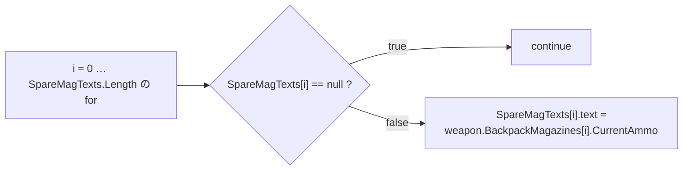
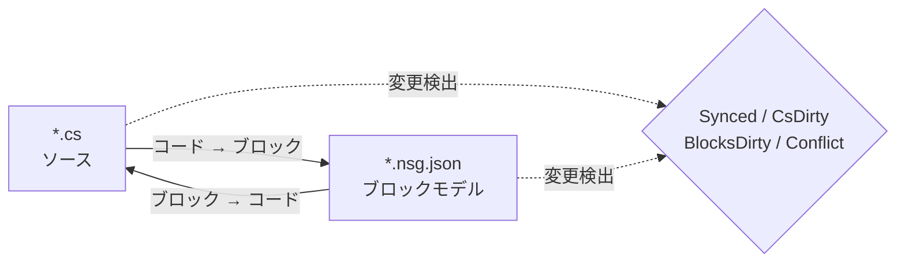

# NekoScriptGraph (NSG) — クイックデプロイ & ハンドブック

**バージョン** 1.0.2 · **Unity** 2022.3+ · **作者** NekoAndreeva · **ライセンス** MIT · **パッケージ** `com.nekoandreeva.nekoscriptgraph`

> Unity 向けの Scratch スタイルのビジュアルプログラミング。**コードには何も書き込みません。**
> NSG はスクリプトの*隣に*ブロック設定ファイルを書き出してブロックとして編集できるようにし、双方向に変換します。生成される `.cs` にはプラグインの痕跡が一切ありません — プラグインフォルダーを削除してもスクリプトはそのままコンパイルできます。

---

## 目次

**Part A — クイックデプロイ**

1. [ワンクリックのグローバル API](#1-one-click-global-api)
2. [はじめてのブロックプログラム](#2-your-first-block-program)
3. [10 分でわかるオンボーディング手順](#3-the-10-minute-onboarding-path)

**Part B — ハンドブック**

4. [中核となる考え方](#4-core-concepts)
5. [インストールと要件](#5-install--requirements)
6. [ブロックエディター](#6-the-block-editor)
7. [メニューリファレンス](#7-menu-reference)
8. [API ブロック（詳細）](#8-api-blocks-deep-dive)
9. [対応言語と追加方法](#9-languages--adding-one)
10. [同期・正規形・エスケープ率](#10-sync-canonical-form--escape-ratio)
11. [アーキテクチャ健全性](#11-architecture-health)
12. [ローカライズ](#12-localization)
13. [エージェントと MCP](#13-agents--mcp)
14. [プログラムねこ アシスタント（任意）](#14-programneko-assistant-optional)
15. [設定](#15-settings)
16. [ディレクトリ構成](#16-directory-layout)
17. [アンインストール](#17-uninstall)
18. [トラブルシューティング & FAQ](#18-troubleshooting--faq)
19. [連絡先](#19-contact)

**付録**

- [A. ブロック定義スキーマ](#appendix-a-block-definition-schema)
- [B. 言語記述子スキーマ](#appendix-b-language-descriptor-schema)
- [C. 設定キー](#appendix-c-settings-keys)

---
---

# PART A — クイックデプロイ

「Assets にフォルダーを入れた」状態から「ブロックでコードを書く」状態まで、ほとんどタイピングせずに約 10 分で到達します。

<a id="1-one-click-global-api"></a>
## 1. ワンクリックのグローバル API

**考え方:** あなたのプロジェクトには、すでに何百ものメソッドがあります。NSG はそれらを読み取り、1 つにつき 1 つの **API ブロック**を生成します。そうすれば、すでに書いたすべてのメソッドが、パレット上のドラッグ&ドロップできるブロックになります。新しいコードは、*あなた自身の*プロジェクトの語彙を組み立てて書けるようになります。

### 1.1 実行する

1. プラグインがコンパイルされたことを確認します（Console に赤いエラーがないこと。Unity 2022.3+）。
2. メニュー: **`NekoScriptGraph ▸ Build API Library for Whole Project`**（**プロジェクト全体の API ライブラリを構築**）。
3. NSG はスキャン対象のソースファイル数を数え、確認ダイアログを表示します:

   > *プロジェクト全体の API ライブラリを構築します — N 個のソースファイル → `Assets/NekoScriptGraph/Blocks/API`。続行しますか？*

4. **続行**をクリックします。大規模なプロジェクトでは数千個のブロックになり、目に見えて時間がかかります — これは想定内であり、だからこそ先に件数を表示しています。
5. 完了すると、Console にサマリーが記録され、ダイアログに合計が表示されます:

   ```
   [NekoScriptGraph] API blocks: <generated> generated, <skipped> skipped.
   ```

6. ブロックライブラリは**自動的に再読み込み**されます。ほかにすることはありません — 新しいブロックはすぐに使えます。

> **対象範囲。** スキャンは `Assets` を登録済みのすべての言語について対象にします。C# は `AssetDatabase`（`t:MonoScript`）を使います。C/C++/Rust/HLSL などはファイル拡張子でディスク上を走査します。`Dependencies/` と `.checkpoints/` は常に除外されます。

### 1.2 1 つのフォルダーだけを対象にする

1 つのサブシステムだけを扱っていますか？ Project ウィンドウでフォルダーを選択し、次を使います:

**`NekoScriptGraph ▸ Generate API Blocks for Selected Folder`**（**選択フォルダーの API ブロックを生成**）

同じ仕組みのまま、影響範囲が狭く、ずっと高速です。これが推奨される最初の実行です — 実際にスクリプトから扱いたいフォルダーを対象にしてください。

### 1.3 得られるもの

対象条件を満たすメソッド 1 つにつき 1 つの JSON ファイルが、`apiOutputFolder` のフォルダー（既定は `Assets/NekoScriptGraph/Blocks/API`）に書き出されます:

```
Blocks/API/api.DecalUtils.ProjectNormals.5.json
Blocks/API/api.DecalManager.GetSpawner.3.json
Blocks/API/api.GPUDecalUtils.UpdateDrawIndirectCommandBuffer.3.json
```

命名規則: `api.<Type>.<Method>.<arity>.json` — **アリティ**（引数の個数）が ID の一部なので、オーバーロードが共存できます。

パレット内では、**API** カテゴリ（`cat.api`）の下に、**宣言型ごとのサブグループ**として並びます:

| パレットのグループ | 内容 |
|---|---|
| `API` → `DecalUtils` | 対象条件を満たすすべての `DecalUtils` メソッド |
| `API` → `DecalManager` | 対象条件を満たすすべての `DecalManager` メソッド |
| `API` → *(フリー関数)* | C / HLSL のトップレベル関数 |

パレットの検索ボックスを使えば、名前で即座に見つけられます。

<a id="14-the-eligibility-rule-know-this-before-you-wonder"></a>
### 1.4 対象になる条件（疑問に思う前に知っておく）

**API ブロックが生成されるのは**、メソッドが次の条件を満たす場合だけです:

| 要件 | 理由 |
|---|---|
| `public` | パブリック API だから |
| ジェネリックがない（メソッドまたは戻り値型に `<…>` がない） | ブロック内に実行時の型推論はないため |
| `async` ではない | await するスケジューラーがないため |
| **`ref` / `out` / `in` / `params` / `this` パラメーターがない** | out パラメーターには追加のソケットが必要になるため |
| **既定値のあるパラメーターがない**（`=`） | ソケットはすべて必須だから |
| `where` 制約がない | ジェネリックと同じ理由 |
| コンストラクターではない | メソッド呼び出しではないため |

これらに反するものは黙って**スキップ**されます — その件数がサマリーの "skipped" の数値です。

<a id="15-static-vs-instance--the-one-asymmetry"></a>
### 1.5 static と instance — 唯一の非対称性

これは API 機能全体で最も重要な注意点です:

| メソッドの種類 | ブロックの挙動 | 可逆性 |
|---|---|---|
| **`static`** | ドット付き呼び出し対象 + アリティで照合（`matchCall` + `matchArity`） | **完全に双方向** — コード ⇄ ブロック |
| **instance** | 先頭に余分な `target` ソケットが付く: `{0}.Method({1}, …)` | **一方向** — 正しく出力されますが、インポート時には汎用の呼び出しブロックとして読み直されます |

> 目安: **static な API は完璧なブロックになります。** instance メソッドでも正しく自己文書化された呼び出しにはなりますが、instance 呼び出しをブロックだけで編集しても、固有に認識できるブロックとして往復して戻ることはありません。ブロックで書くつもりのものには `static` のエントリーポイントを優先してください。

フリー関数（C、HLSL）は所有型を持たないため static として扱われます — 完全に双方向です。

### 1.6 再生成の作法

- **リファクタリング後は再実行します。** メソッド名を変更すると、古い API ブロックが残ります。ジェネレーターを再実行して孤立ファイルを削除するか、`Blocks/API/` を削除して最初から生成し直します。
- **再生成は冪等です。** ID は決定的で、重複は*スキップ*として数えられるため、再実行してもフォルダーが肥大化しません。
- **コミットしても安全です。** `Blocks/API/*.json` はコードではなくデータです。コミットすれば、チームメイトは再スキャンなしでブロックの語彙を手に入れられます。

---

<a id="2-your-first-block-program"></a>
## 2. はじめてのブロックプログラム

具体的なエンドツーエンドのチュートリアルです。API ブロックを使って `CompassManager` 風のロジックの小さな一部 — 「マガジン数を表示し、空のスロットには `--` を表示する」 — を組み直します。

### ステップ 1 — ファイルを 1 つ管理下に置く

1. Project ウィンドウで `.cs` ファイルを選択します。
2. **`NekoScriptGraph ▸ Take Selected Script Under Management`**（**選択したスクリプトを管理下に置く**）。

   その隣にファイルが現れます:

   ```
   Assets/Scripts/ChrControl/CompassManager.cs
   Assets/Scripts/ChrControl/CompassManager.nsg.json   ← the block model
   ```

   （`.nsg.json` は既定で Project ウィンドウでは非表示です — これは仕様でありバグではありません。`Cmd/Ctrl+Shift+H` で切り替えられます。）

### ステップ 2 — エディターを開く

**`NekoScriptGraph ▸ Open Block Editor`**（**ブロックエディターを開く**）。ファイルがタブとして開きます。

### ステップ 3 — ブロックを見つける

右ペインを見ます:

- **パレット検索** — `SpareMagTexts` か `Count` と入力して絞り込みます。
- **API** グループには Part A で生成したブロックが入っています。
- **制御 / 式 / 変数 / 構造**（Control / Expressions / Variables / Structure）には言語ブロックが入っています。

### ステップ 4 — 組み立てる

ブロックをキャンバスにドラッグします。定番のループ:



空のまま残された必須ソケットは、**アーキテクチャ健全性**によって `danglingInput` として指摘されます。

### ステップ 5 — 書き戻す

**Generate** を押します（またはツールバーの生成ボタンを使います）。NSG はソースを出力し、次のいずれかを報告します:

| 状態 | 意味 |
|---|---|
| `Synced` | コードとブロックモデルが一致している |
| `Code changed` | `.cs` が先行して変更された — 再インポートが必要 |
| `Blocks changed` | ブロックが先行して変更された — Generate で書き出す |
| `Conflict` | **両方**が変更された — どちらを優先するか選択する |

### ステップ 6 — コードがきれいなままか確認する

`.cs` を開きます。ごく普通の C# です。属性も、生成されたリージョンも、プラグインへの参照もありません。これが要点のすべてです。

### ステップ 7 — コミットする

`.cs` と `.nsg.json` の両方をコミットします。ブロックモデルは通常のプロジェクトアセットです。

> **初回の書き出しでは整形されます。** メソッドがすでに NSG の正規形になっていない場合（ブレースの欠落、不揃いなインデント、等価だが異なる書き方）、最初の*ブロック → コード*のパスで正規化されます。意味は変わりませんが、書式が変わります。事前に警告されます: *「N 個のメソッドが正規形ではありません…」*。予期しない差分を避けるには、[§10](#10-sync-canonical-form--escape-ratio) を参照してください。

---

<a id="3-the-10-minute-onboarding-path"></a>
## 3. 10 分でわかるオンボーディング手順

凝縮したチェックリストです。印刷してモニターに貼ってください。

| # | 操作 | 場所 | 目安時間 |
|---|---|---|---|
| 1 | プラグインを `Assets/` に置き、コンパイルさせる | Unity | 1 分 |
| 2 | フォルダーを選択 → **Generate API Blocks for Selected Folder** | メニュー | 1 分 |
| 3 | **Take Selected Folder Under Management** | メニュー | 1 分 |
| 4 | **Open Block Editor** | メニュー | 10 秒 |
| 5 | パレットで自分のメソッドの 1 つを検索する | エディター | 1 分 |
| 6 | ブロックを 3 つドラッグして接続し、ソケットを 1 つ空のままにする | エディター | 2 分 |
| 7 | **Architecture Health** を開き、`danglingInput` の指摘を読む | メニュー | 1 分 |
| 8 | ソケットにブロックをドラッグして修正する | エディター | 1 分 |
| 9 | **Generate** を押し、状態が `Synced` であることを確認する | エディター | 30 秒 |
| 10 | `.cs` を開き、きれいな C# であることを確認する | エディター | 20 秒 |
| 11 | `.cs` + `.nsg.json` をコミットする | Git | 30 秒 |
| 12 | *（任意）* **MCP Bridge: Start** を実行し、エージェントを `http://127.0.0.1:8765/` に向ける | メニュー + クライアント | 2 分 |

**一文で表すメンタルモデル:** `.cs` が唯一の正であり、`.nsg.json` はそれに重ねた*レンズ*であり、NSG はレンズとソースの一致を保ち続けます。

---
---

# PART B — ハンドブック

<a id="4-core-concepts"></a>
## 4. 中核となる考え方

### 4.1 管理下のファイルとフリーのファイル

- **フリーファイル（free file）** — 隣に `.nsg.json` がない、通常のスクリプト。
- **管理下のファイル（managed file）** — `.nsg.json` を持ち、ブロックとして開けるファイル。

### 4.2 ブロックになるのはメソッド本体だけ

NSG で最も重要なルール:

- **メソッド本体の外**にある `using`、型宣言、フィールド、属性、コメントは**そのまま**保存され、双方向とも手つかずで維持されます。
- **メソッド本体**はブロックに解析されます。
- ブロックモデルで表現できないものは**生スニペット（raw snippet）**として保存され、診断（`NSG0002`）として報告されます。**何かが黙って失われることは決してありません。**

### 4.3 双方向同期モデル



| 状態 | 意味 |
|---|---|
| `Synced` | コードとブロックモデルが一致している |
| `CsDirty` | `.cs` が変更された。モデルが遅れている |
| `BlocksDirty` | ブロックが変更された。コードがまだ書き換えられていない |
| `Conflict` | 両方が変更された — どちらを優先するか選ぶ必要がある |
| `Unmanaged` | ブロックファイルがない |

NSG は**どちら側が先に動いたか**を追跡するので、Generate を押すと自分の作業が壊れるかどうかを常に把握できます。

> MCP／エージェントの経路は意図的に**一方向: コード → ブロック**です。エージェントは普通のソースを書き、プラグインが再解析してモデルを再構築します。

---

<a id="5-install--requirements"></a>
## 5. インストールと要件

1. Unity **2022.3** 以降。
2. `NekoScriptGraph` フォルダーを `Assets/` の下に置きます（またはローカルパッケージとして追加します）。
3. パッケージ全体は **Editor 専用のアセンブリ定義**でスコープされているため、プレイヤービルドには**何も**寄与しません。

### 任意の構成要素（それぞれ単位で削除可能）

| フォルダー | 目的 | 削除した場合 |
|---|---|---|
| `Dependencies/` | 9 スライスの角丸スプライト | 単純な角丸にフォールバック。パッケージは約 3.3 MB |
| `LanguageSupport/{c,cpp,go,hlsl,java,python,rust,swift}` | C# 以外の言語 | その言語が消えるだけで、ほかは壊れない |
| `ProgramNeko/` | ピクセル猫のアシスタント | 彼女なしでもプラグインは問題なく動作する |
| `Locale/*` | UI の翻訳 | そのロケールは英語にフォールバック |

### パッケージサイズ

出荷時で約 **4.2 MB**:

| 部分 | サイズ |
|---|---|
| `Editor/` — コア、UI、C# エンジン、設定 | 約 1.4 MB |
| `Dependencies/Editor/Sprite/` — 任意の 9 スライススプライト | 約 0.86 MB |
| `Documents/` — 15 言語のこのガイド | 約 0.7 MB |
| `Locale/` — 15 の UI 言語 | 約 0.7 MB |
| `LanguageSupport/` — 8 つのドロップイン言語 | 約 0.24 MB |
| `Blocks/` — 組み込みブロックライブラリ（必要時に再生成） | 約 0.23 MB |
| `Extensions~/` — インストール可能な外部エンジンのテンプレート | 約 0.04 MB |

---

<a id="6-the-block-editor"></a>
## 6. ブロックエディター

VS Code 風のマルチタブウィンドウで、最小 980×600 です。

| 領域 | 内容 |
|---|---|
| タブバー | 複数のドキュメントを同時に開ける |
| キャンバス | スクリプトをブロックとして表示 — ドラッグ、接続、折りたたみ、ズーム、フィット |
| 右ペイン | ブロックパレット + 検索 + プリセット。幅は記憶される |
| 左下 | ステータステキスト、元に戻す／やり直す、アシスタントスロット（インストール時のみ） |
| ツール行 | ライブラリ再読込、問題、健全性、チェックポイント、Git、スプライト |

### 6.1 2 つの表示モード

| 表示 | スタイル | 向いている用途 |
|---|---|---|
| **スタック（Scratch）** | 縦方向の文の積み重ね | 教育、線形なロジック |
| **ブループリント（UE）** | ノードグラフ | データフローと式の連鎖 |

**表示**ドロップダウン（`view.stack` / `view.blueprint`）で切り替えます。

### 6.2 パレット

- `categoryKey` でグループ化され、まとめて折りたたみ可能（`Collapse all` / `Expand all`）。
- 頭文字インデックスは折りたたまれた状態で始まります。手動で展開してください。
- 検索フィールドは意図的にブロックリストの**外**にあります — リストはキー入力ごとに再構築されるため、中にあるとフォーカスを失ってしまうからです。
- 単一のブロックだけでなく、**プリセット**全体をキャンバスにドラッグできます。

**組み込みカテゴリ:**

| キー | ラベル | 内容 |
|---|---|---|
| `cat.ctrl` | 制御 | `if`、`for`、`foreach`、`while`、`break`、`continue`、`return` |
| `cat.expr` | 式 | binary、unary、call、cast、conditional、ident、index、literal、member、new、postfix |
| `cat.var` | 変数 | ローカル変数と代入 |
| `cat.frame` | 構造 | 宣言 |
| `cat.api` | API | 生成された API ブロック（型ごとにグループ化） |
| `cat.macro` | マイブロック | ユーザープリセット |
| `cat.raw` | エスケープハッチ | 生スニペット |

### 6.3 チェックポイント

組み込みのスナップショットは `.checkpoints/` にあり、これは **git 管理外**です — リポジトリの履歴と衝突することは決してありません。大規模な*ブロック → コード*の書き出しの前に取得してください。

### 6.4 ブロックファイルの非表示

`hideBlockFiles` の既定値は `true` なので、Project ウィンドウが `.nsg.json` であふれることはありません。

- メニュー: **`Toggle Block Files Visibility`** — グローバルホットキー `Cmd/Ctrl+Shift+H`。
- ホットキーはグローバルです。プラグインのウィンドウを閉じていても機能します。

### 6.5 選択したブロックの説明

`Cmd/Ctrl+Shift+E`（メニュー **`Explain Selected Block`**）で、アシスタントに現在のブロックの説明を求めます。これもグローバルホットキーです。

---

<a id="7-menu-reference"></a>
## 7. メニューリファレンス

> `[MenuItem]` のキャプションはコンパイル時定数なので、Unity が出荷するのは**静的な英語**の名前です。ローカライズ層が読み込み時と言語変更時に翻訳済みラベルへ差し替えます。`MCP Bridge` の項目は意図的に英語のままです。

| メニュー項目 | 目的 |
|---|---|
| `Open Block Editor`（ブロックエディターを開く） | メインウィンドウを開く |
| `Problems`（問題） | 診断リスト |
| `Assistant (ProgramNeko)`（アシスタント (ProgramNeko)） | アシスタントを開く。未インストールなら警告する |
| `Explain Selected Block` `%#e`（選択したブロックを説明） | 選択中のブロックを説明する |
| `Architecture Health`（アーキテクチャ健全性） | 健全性ウィンドウを開く |
| `Take Selected Script Under Management`（選択したスクリプトを管理下に置く） | 1 つのファイルを管理下に置く |
| `Release Selected Script`（選択したスクリプトの管理を解除） | 1 つのファイルの管理を解除する |
| `Take Selected Folder Under Management`（選択したフォルダーを管理下に置く） | 一括で管理下に置く |
| `Take Whole Project Under Management`（プロジェクト全体を管理下に置く） | すべてを管理下に置く |
| `Release Selected Folder`（選択したフォルダーの管理を解除） | 一括で解除する |
| `Release Whole Project`（プロジェクト全体の管理を解除） | すべてを解除する |
| `Generate API Blocks for Selected Folder`（選択フォルダーの API ブロックを生成） | フォルダー単位の API 生成 |
| `Build API Library for Whole Project`（プロジェクト全体の API ライブラリを構築） | ワンクリックのグローバル API（Part A） |
| `Reload Block Library`（ブロックライブラリを再読込） | `Blocks/` を読み直す |
| `Export Default Block Library`（既定のブロックライブラリを書き出す） | 組み込みブロックを `Blocks/` に書き出す |
| `Generate ShaderLab Shell`（ShaderLab の外殻を生成） | シェーダーの外側の構造を出力する |
| `Self Test: Round Trip`（セルフテスト: 往復変換） | 往復変換の整合性セルフチェック |
| `Toggle Block Files Visibility` `%#h`（ブロックファイルの表示を切り替え） | `.nsg.json` の表示／非表示 |
| `Languages: Show Loaded`（言語: 読み込み済みを表示） | 言語レジストリを出力する |
| `MCP Bridge: Start` / `Stop` / `Copy Client URL` | MCP ブリッジ |

---

<a id="8-api-blocks-deep-dive"></a>
## 8. API ブロック（詳細）

Part A でワークフローを扱いました。ここではその仕組みを説明します。

### 8.1 ジェネレーターが出力するもの

対象条件を満たすメソッドごとに 1 つの `NsgBlockDef`:

```jsonc
// Blocks/API/api.DecalUtils.ProjectNormals.5.json
{
  "id": "api.DecalUtils.ProjectNormals.5",
  "level": "high",
  "shape": "expression",                 // "statement" if return type is void
  "category": "DecalUtils",              // declaring type → palette sub-group
  "categoryKey": "cat.api",              // the "API" group
  "label": "DecalUtils.ProjectNormals({0}, {1}, {2}, {3}, {4})",
  "labelEn": "DecalUtils.ProjectNormals({0}, {1}, {2}, {3}, {4})",
  "labelRu": "DecalUtils.ProjectNormals({0}, {1}, {2}, {3}, {4})",
  "sockets": [
    { "name": "decalPosW", "kind": "expr", "required": true, "variadic": false, "choices": [] },
    { "name": "parents",   "kind": "expr", "required": true, "variadic": false, "choices": [] },
    { "name": "decalNorm", "kind": "expr", "required": true, "variadic": false, "choices": [] },
    { "name": "decalTform","kind": "expr", "required": true, "variadic": false, "choices": [] },
    { "name": "decalColor","kind": "expr", "required": true, "variadic": false, "choices": [] }
  ],
  "emit": "",
  "node": "call",
  "op": "",
  "color": "",
  "matchCall": "DecalUtils.ProjectNormals",  // dotted match target
  "matchArity": 5,                           // parameter count
  "builtin": true,
  "manual": "DecalUtils.ProjectNormals(decalPosW, parents, decalNorm, decalTform, decalColor) : Color[]",
  "variantGroup": "",
  "variantLabel": ""
}
```

注記:

- **ソケット名**は実際のパラメーター名です — したがってパレットのラベルは自己文書化されています。
- **`manual`** には完全修飾されたシグネチャと戻り値型が入ります。これは*エスケープハッチ*、つまりブロックのマニュアル形式です。
- **instance メソッド**には先頭に `target` という追加ソケット（必須）が付き、ラベルは `{0}.Method({1}, …)` になります — これが §1.5 の一方向の注意点の理由です。
- **フリー関数**（C/HLSL）は所有者を持たず、`static` として扱われます。

### 8.2 決定性と重複排除

- ID は `api.<QualifiedType>.<Method>.<arity>` で、実行間で決定的です。
- 重複した ID は**スキップ**として数えられ、二度書き出されることはありません。
- リファクタリング後の再実行で孤立ファイルは**削除されません**。まっさらな状態にしたい場合は `Blocks/API/` を削除して再生成してください。

### 8.3 複数言語

`Build API Library for Whole Project` は言語レジストリを反復し、各エンジンの `GenerateApiBlocks` を呼び出します。C# は `AssetDatabase` を通り、C 系の言語はプロファイルの拡張子に従ってファイルシステムを走査し、`.checkpoints/` と `Dependencies/` をスキップします。言語エンジンの構築に失敗した場合、その言語は失敗として数えられ、残りは続行します。

### 8.4 実践的な指針

| 状況 | 助言 |
|---|---|
| サブシステム用のブロックが欲しい | プロジェクト全体ではなく**フォルダー**版を使う |
| 双方向のブロックが欲しい | **`static`** のエントリーポイントを公開する |
| `ref`/`out`/`params` の API がある | スキップされます — ブロックが欲しければ単純な static メソッドで包む |
| パレットでオーバーロードが衝突する | **アリティ**が ID に含まれ、ソケットで区別できます。名前で検索してください |
| メソッド名を変更した | 再生成し、孤立した JSON を削除する |

---

<a id="9-languages--adding-one"></a>
## 9. 対応言語と追加方法

`C` · `C++` · `C#` · `Go` · `HLSL` · `Java` · `Rust` · `Python` · `Swift`

- どれも**双方向**に変換します。
- **C# は組み込み**です（`Editor/Languages/CSharp/`: Lexer、Parser、Printer、Splitter、CodeMap）。
- それ以外は**ドロップインのフォルダー**です。`LanguageSupport/<lang>/` を削除すると、ほかを壊すことなくその言語がプラグインから消えます。

### 言語を追加する

記述子とエンジンを含むフォルダーを作成します:

```jsonc
// LanguageSupport/python/python.language.json
{
  "apiVersion": 1,
  "id": "python",
  "displayName": "Python",
  "icon": "PYTHON",
  "extensions": [".py"],
  "blocksFolder": "blocks",
  "engineType": "NekoScriptGraph.Nsg_PythonLanguage",
  "author": "",
  "note": "Self-contained language: its own engine, sharing only the block skeleton."
}
```

次に `engineType` で指定したクラスを実装し（解析、出力、API ブロック生成）、その言語の `blocks/` フォルダーを追加します。参照実装として `Nsg_PythonLanguage`、`Nsg_CLanguage`、`Nsg_RustLanguage` などを活用してください。

---

<a id="10-sync-canonical-form--escape-ratio"></a>
## 10. 同期・正規形・エスケープ率

### 10.1 エスケープ率

**生スニペット**ブロックの割合です。コードのどれだけが本当にブロックとしてモデル化されているかを測ります。

- `maxEscapeRatio: 0`（MCP）でゲートすれば、ブロックへの*完全な*変換を要求できます。
- パーサーがモデル化できないものはそのまま保存され、**`NSG0002`** として報告されます。

### 10.2 正規形

「標準的な書き方」が 1 つに定まるコードのことです。最初の*ブロック → コード*のパスで次が正規化されます:

- ブレースの欠落、
- 不揃いなインデント、
- 等価だが異なる書き方。

ユーザーに表示される警告:

> *「N 個のメソッドが正規形ではありません（括弧の欠落、不揃いなインデント、等価な複数の書き方）。最初の「ブロック → コード」で正規化されます。意味は変わりませんが書式は変わります。」*

### 10.3 不動点

`canon(text) == text` になるまで反復します。テキストが不動点になれば、そのドキュメントは `Synced` のままで、二度と再整形されません。まさに §13 のエージェントループがディスクに書き込む前に行っていることです。

---

<a id="11-architecture-health"></a>
## 11. アーキテクチャ健全性

メニュー **`Architecture Health`**（**アーキテクチャ健全性**）— スクリプトを選択していればそのファイルを解析し、そうでなければ空の状態で開きます。

**指標:** ブロック／文の数、メソッド数、エスケープ率（`escapes`）、および複合的な `score`。

**チェック:**

| キー | 意味 |
|---|---|
| `emptyBody` / `emptyMethod` | 空の本体／空のメソッド |
| `constantCondition` | 常に真または常に偽の条件 |
| `cycle` | 呼び出しまたは依存の循環 |
| `danglingInput` | 必須ソケットが未接続 |
| `duplicate` | 重複したコード |
| `escapeRatio` | 生スニペットの割合が高い |
| `expressionSize` | 式が大きすぎる |
| `nesting` | ネストが深すぎる |
| `methodLength` | メソッドが長すぎる |
| `memberChain` | 長いメンバーチェーン（`a.b.c.d.e`） |
| `magicNumber` | マジックナンバー |
| `placeholderName` / `shortName` | プレースホルダー名／短すぎる名前 |
| `unusedLocal` | 未使用のローカル変数 |
| `afterReturn` | `return` の後のコード |
| `leak` | リークの疑い |

**修正アクション:** `fixBreakLink`、`fixFillZero`、`fixAddRelease`、`fixApply`、`rerun`。

---

<a id="12-localization"></a>
## 12. ローカライズ

**15 の UI ロケール:**

簡体字中国語 · 繁体字中国語 · 英語 · フランス語 · ドイツ語 · **イタリア語** · ロシア語 · スペイン語 · ポルトガル語 · 日本語 · 韓国語 · ポーランド語 · トルコ語 · アラビア語 · ヘブライ語

- **アラビア語とヘブライ語ではエディター全体がミラーリングされます**: パレットが左に移動し、ブロックは左方向に伸びます（RTL）。
- Unity 自体のメニューバーは**仕様として**英語のままです。
- 文字列は `Locale/<code>/strings.json` にあり、キー（`ui`、`blocks`、…）でセクション分けされています。ブロックの語彙は `blocks` セクションを使います（例: `c.assert` → `assert {0}`）。

---

<a id="13-agents--mcp"></a>
## 13. エージェントと MCP

NSG には **Unity Editor 内で動作する MCP サーバー**が同梱されています: MCP の **Streamable HTTP** トランスポート上の JSON-RPC 2.0 です。**サイドカーのプロセスも追加のランタイムもありません — Node も Python も不要です。Editor 自体がサーバーです。**

```
MCP client ──HTTP POST JSON-RPC──▶ 127.0.0.1:8765 ──▶ Unity Editor
```

### 13.1 起動する

メニュー **`NekoScriptGraph ▸ MCP Bridge: Start`**:

```
[NekoScriptGraph] MCP bridge listening on http://127.0.0.1:8765/
```

- 以前に有効だったことを記憶し、ドメインリロードや Editor の再起動後に**自動で再起動**します。
- 停止は **`MCP Bridge: Stop`**、URL のコピーは **`MCP Bridge: Copy Client URL`**。
- 手動で確認できます — クライアントは不要です:

```bash
curl -s http://127.0.0.1:8765/ -d '{"jsonrpc":"2.0","id":1,"method":"tools/list"}'
```

素の `GET /` は、サーバーのバージョン、対応するプロトコルリビジョン、利用可能なツールを一覧するステータスページを返します。

### 13.2 クライアントから接続する

Streamable HTTP 対応の MCP クライアントならどれでも動作します。設定の形は少しずつ異なります（あるものは `type`、あるものは `transport`、少数は素の `url`）:

```json
{
  "mcpServers": {
    "nekoscriptgraph": {
      "type": "http",
      "url": "http://127.0.0.1:8765/"
    }
  }
}
```

VS Code は `mcpServers` ではなく `servers` を使いますが、それ以外のエントリーは同じです。

クライアントが **stdio** しか話せない場合は、HTTP↔stdio のプロキシを前に置きます（例: `npx mcp-remote http://127.0.0.1:8765/`）。そのプロキシはクライアント側の都合であり、プラグインの関与するところではありません。

> レガシーの HTTP+SSE トランスポート（`GET /sse`）は**実装していません**。ブリッジは Streamable HTTP、プロトコルリビジョン `2025-03-26` 以降を提供し、同じ URL に POST する `2024-11-05` のクライアントも受け付けます。

### 13.3 7 つのツール

| ツール | 書き込み? | 動作 |
|---|---|---|
| `nsg_writing_spec` | なし | その言語の正規の記述サブセット。ブロックライブラリとプリンターから生成される |
| `nsg_verify` | なし | ディスク上のファイルの状態: `Synced`、`CsDirty`、`BlocksDirty`、`Conflict`、`Unmanaged` |
| `nsg_plan` | なし | 候補コードを解析し、診断、ブロック数、エスケープ率、正規形かどうかを報告する |
| `nsg_canon` | なし | 正規のテキスト — 不動点のオラクル |
| `nsg_apply` | **あり** | `.nsg.json` を再構築し、正規のソースを書き込む |
| `nsg_list_managed` | なし | フォルダー配下のすべての `.nsg.json` |
| `nsg_release` | **あり** | それらの `.nsg.json` を削除する（きれいなアンインストール） |

### 13.4 想定されたループ — コード → ブロック

1. `nsg_writing_spec` を一度呼び、その言語のサブセットを把握します。
2. `.cs` を編集します（またはテキストを会話の中に保持しておくだけでもかまいません）。
3. `nsg_plan` — 診断、ブロック数、エスケープ率。**何も書き込まず、コンパイルも不要**なので、まだビルドが通らないコードでも安全です。
4. `canonical` が false なら、`nsg_canon` を呼び、`canon(text) == text` になるまで反復します。これが不動点です。一度そこに達すれば、ドキュメントは `Synced` のままで、後から何かが再整形されることはありません。
5. `nsg_apply` — 正規の `.cs` と再構築された `.nsg.json` を書き込みます。

エスケープ率を `maxEscapeRatio: 0` でゲートすると、ブロックへの完全な変換を要求できます。

```json
{"jsonrpc":"2.0","id":1,"method":"tools/call","params":{
  "name":"nsg_plan",
  "arguments":{"file":"Assets/Scripts/CompassManager.cs","maxEscapeRatio":0.0}}}
```

`nsg_plan`、`nsg_canon`、`nsg_apply` は `source` も受け取るので、エージェントはテキストがディスクに届く前に検証できます:

```json
{"jsonrpc":"2.0","id":2,"method":"tools/call","params":{
  "name":"nsg_canon",
  "arguments":{"file":"Assets/Scripts/Foo.cs","source":"class Foo { void A(){ } }"}}}
```

### 13.5 セキュリティ

ブリッジはプロジェクトにファイルを書き込むため、意図的に範囲を絞っています:

- **`127.0.0.1` にのみ**バインドします — ルーティング可能なインターフェースには決してバインドしません。
- **`Origin`** ヘッダーを持つリクエストは **`403`** で拒否されます。ブラウザーは常に `Origin` を送り、ネイティブの MCP クライアントは決して送らないため、**ブラウザーで開いたどのページからもブリッジには到達できません**。どうしてもブラウザーから使いたい場合は、`Nsg_McpBridge.SetAllowOrigin(true)` で緩められます。
- サーバーは**自分で起動するまでオフ**で、終了時に停止します。

### 13.6 トラブルシューティング

| 症状 | 原因／対処 |
|---|---|
| Editor が時間内に応答しなかった | ブリッジはすべての呼び出しをメインスレッドにマーシャリングしますが、Unity はコンパイル中やドメインリロード中に `EditorApplication.update` を実行しません。再コンパイル中に送られたリクエストは待機し、**60 秒**後に失敗します。そのまま再試行してください |
| ポートがすでに使用されている | 別のプロセスが `8765` を占有しています。`Nsg_McpBridge.SetPort(n)` で変更するか、もう一方のリスナーを閉じてください |
| ツールが見当たらない | プラグインがコンパイルされたか確認してください — `Nsg_Json`、`Nsg_Mcp`、`Nsg_McpBridge` は設定不要の普通の Editor スクリプトです。`GET /` は現在提供されているツールを一覧します |

### 13.7 MCP なしで使う

ブリッジは素の JSON-RPC エンドポイントです。同じ操作はプロトコルをまったく使わずにも利用できます:

- **ヘッドレス／CI**

```bash
Unity -batchmode -quit -projectPath <project> \
      -executeMethod NekoScriptGraph.Nsg_AgentCli.Main \
      -nsgRequest req.json -nsgResponse resp.json
```

- **コード内** — `Nsg_AgentApi.Run(request)`、およびプロトコル層だけなら `Nsg_Mcp.Handle(jsonString)`。

---

<a id="14-programneko-assistant-optional"></a>
## 14. プログラムねこ アシスタント（任意）

`ProgramNeko/` は任意のピクセル猫アシスタントです。**フォルダーごと削除してもプラグインは動作し続けます。**

- メニュー **`Assistant (ProgramNeko)`** で開きます。これは問題ウィンドウと*同じ*ウィンドウです。彼女がいなければ単なるエラーリストですが、いれば猫が上に座り、下で話します。
- `Cmd/Ctrl+Shift+E` で、選択中のブロックの説明を彼女に求めます。
- 彼女は独自のローカライズを持っています: `ProgramNeko/Locale/<code>/neko.json`（15 ロケール）。
- マニフェスト: `ProgramNeko/programneko.json`。

---

<a id="15-settings"></a>
## 15. 設定

`Assets/NekoScriptGraph/NekoScriptGraph.settings.json`:

```jsonc
{
  "viewMode": 0,                        // 0 = Stack (Scratch), 1 = Blueprint (UE)
  "hideBlockFiles": true,               // hide .nsg.json by default
  "useSprites": false,                  // 9-slice sprites
  "headerSprite": "block_header",
  "bodySprite": "block_body",
  "footerSprite": "block_footer",
  "exprSprite": "block_expr",
  "bodyIndent": 14,                     // body indent
  "cornerRadius": 6,
  "footerHeight": 10,
  "rightPaneWidth": 240.0,              // remembered after you drag it
  "presetPaneHeight": 200.0,
  "shaderPipeline": "auto",             // auto / ...
  "apiOutputFolder": "Assets/NekoScriptGraph/Blocks/API"
}
```

プリセット（複数ブロックのドラッグ用バンドル）は `.presets/presets.json` にあり、`schemaVersion: 1`、各エントリーは `name`、`createdAt`、`blockCount`、`languageId`、および `nodes` 配列を記録します。

---

<a id="16-directory-layout"></a>
## 16. ディレクトリ構成

```
NekoScriptGraph/
├─ Editor/
│  ├─ Core/                      engine core
│  │  ├─ Esketamine/             AST, parse/print, block library, diagnostics,
│  │  │                          settings, MCP, agent API, L10n, undo, checkpoints
│  │  └─ cstyle/                 C-style engine, shader pipeline, agent spec
│  ├─ Languages/CSharp/          lexer / parser / printer / splitter / code map
│  ├─ UI/                        main window, block view, blueprint view, health,
│  │                             error window, RTL, picker, name dialog
│  ├─ Nsg_Menu.cs                menu items
│  ├─ Nsg_McpBridge.cs           MCP HTTP bridge
│  ├─ Nsg_AgentCli.cs            headless CLI
│  └─ Nsg_SelfTest.cs            round-trip self test
├─ Blocks/                       built-in block library + API/*.json
├─ LanguageSupport/{c,cpp,go,hlsl,java,python,rust,swift}/
├─ Locale/{15 locales}/strings.json
├─ Dependencies/Editor/Sprite/   optional 9-slice sprites
├─ ProgramNeko/                  optional assistant
├─ .presets/presets.json
├─ NekoScriptGraph.settings.json
├─ MCP.md                        dedicated MCP chapter
└─ package.json                  com.nekoandreeva.nekoscriptgraph v1.0.2
```

---

<a id="17-uninstall"></a>
## 17. アンインストール

非侵襲的で、2 つの方法があります:

1. **メニュー** — `Release Selected Script` / `Release Selected Folder` / `Release Whole Project`、または UI の **Release** / **Release All** / **Release Folder** ボタン。
2. 選択したフォルダーまたはプロジェクト全体の下にあるすべての `.nsg.json` を削除します。

**ソースファイルには一切触れません。** 後に残るのはプラグインフォルダー自体だけです — それを削除すれば完了です。

---

<a id="18-troubleshooting--faq"></a>
## 18. トラブルシューティング & FAQ

**生成された `.cs` にプラグインの痕跡は含まれますか？**
いいえ。プラグインフォルダーを削除してもスクリプトはコンパイルできます。

**`using`、フィールド、属性がブロックにならないのはなぜですか？**
仕様です。ブロック変換に関与するのはメソッド本体だけで、それ以外は双方向ともそのまま維持されます。

**ファイルが再整形されたのはなぜですか？**
正規形ではなかったためです。最初の*ブロック → コード*のパスでブレースとインデントが正規化されます。意味は変わりません。書式の変動をゼロにしたい場合は、先に `nsg_canon` で不動点まで反復してください。

**一部の文が「生スニペット」になったのはなぜですか？**
それらはその言語の書き込み可能なサブセットの外にあります。NSG はそれらを捨てずにそのまま保存し、`NSG0002` として報告します。`maxEscapeRatio` を使えば、それを厳格なゲートにできます。

**`MCP Bridge` のメニュー項目が英語なのはなぜですか？**
意図的です — Unity のメニューバーはプラグインのローカライズに参加せず、翻訳済みと未翻訳の項目が混在するほうが悪いからです。

**1 つのフォルダーだけを管理できますか？**
はい: **`Take Selected Folder Under Management`**（**選択したフォルダーを管理下に置く**）。

**ブロックファイルが多すぎて Project ウィンドウが散らかります。**
既定では非表示です。`Cmd/Ctrl+Shift+H` で切り替えられます。

**名前を変更したら API ブロックが古くなりました。**
再生成しても孤立ファイルは削除されません。`Blocks/API/` を削除して再生成してください。

**期待していた API ブロックがありません。**
そのメソッドは対象条件を満たしていません — 最も多いのは `ref`/`out`/`params`、既定値のあるパラメーター、ジェネリック、`async` です。[§1.4](#14-the-eligibility-rule-know-this-before-you-wonder) を参照してください。

**instance メソッドの API ブロックが往復しません。**
想定どおりです。完全に双方向なのは `static` メソッドだけです。instance メソッドは `target` ソケットを持ち、一方向です。[§1.5](#15-static-vs-instance--the-one-asymmetry) を参照してください。

---

<a id="19-contact"></a>
## 19. 連絡先

作者: **NekoAndreeva**

- メール: elenaandreevasvinolup@gmail.com
- WhatsApp: +852 5247 4163
- GitHub: `https://github.com/elenaandreevasvinolup-alt`

---
---

<a id="appendix-a-block-definition-schema"></a>
## 付録 A. ブロック定義スキーマ

`Blocks/<id>.json` — ブロック 1 つにつき 1 ファイル。

| フィールド | 型 | 備考 |
|---|---|---|
| `id` | string | 一意で、パレット上の識別子でもある。生成ブロックでは `api.<Type>.<Method>.<arity>` |
| `level` | string | `high`（文レベル）／その他 |
| `shape` | string | `control` · `statement` · `expression` |
| `category` | string | 表示グループ。API ブロックでは宣言型 |
| `categoryKey` | string | グループのローカライズキー: `cat.ctrl`、`cat.expr`、`cat.var`、`cat.frame`、`cat.api`、`cat.macro`、`cat.raw` |
| `label` | string | `{0}`、`{1}`… のスロットを持つパレットラベル |
| `labelEn` / `labelRu` | string | 言語別ラベル |
| `sockets` | array | `{ name, kind, required, variadic, choices[] }` |
| `emit` | string | カスタム出力テンプレート（空 = エンジンの既定） |
| `node` | string | 対応する AST ノード: `if`、`call`、`binary`、… |
| `op` | string | 該当する場合の演算子 |
| `color` | string | 任意の上書き |
| `matchCall` | string | インポート時に認識するドット付き呼び出し対象 |
| `matchArity` | int | 照合する引数の個数（`-1` = 任意） |
| `builtin` | bool | プラグインに同梱 |
| `manual` | string | 完全なマニュアル形式／シグネチャ。ブロックのマニュアル項目で使われる |
| `variantGroup` / `variantLabel` | string | バリアントのグループ化 |

**組み込みの文／式ブロック:** `stmt.if`、`stmt.for`、`stmt.foreach`、`stmt.while`、`stmt.break`、`stmt.continue`、`stmt.return`、`stmt.localDecl`、`stmt.assign`、`stmt.expr`、`stmt.add`、`stmt.sub`、`stmt.mul`、`stmt.div`、`stmt.mod`、`stmt.raw`、および式 `expr.binary`、`expr.unary`、`expr.call`、`expr.cast`、`expr.conditional`、`expr.ident`、`expr.index`、`expr.literal`、`expr.member`、`expr.new`、`expr.postfix`、`expr.raw`。

<a id="appendix-b-language-descriptor-schema"></a>
## 付録 B. 言語記述子スキーマ

`LanguageSupport/<id>/<id>.language.json`:

| フィールド | 型 | 備考 |
|---|---|---|
| `apiVersion` | int | 現在は `1` |
| `id` | string | `c`、`cpp`、`csharp`、`hlsl`、`java`、`python`、`rust` |
| `displayName` | string | UI に表示される |
| `icon` | string | バッジのテキスト（例: `PYTHON`） |
| `extensions` | string[] | 例: `[".py"]` |
| `blocksFolder` | string | 相対的なブロックフォルダー（例: `blocks`） |
| `engineType` | string | 完全修飾されたエンジンクラス（例: `NekoScriptGraph.Nsg_PythonLanguage`） |
| `author` | string | 任意 |
| `note` | string | 任意の説明 |

<a id="appendix-c-settings-keys"></a>
## 付録 C. 設定キー

[§15](#15-settings) を参照してください。変更する可能性が高いキーは `viewMode`、`hideBlockFiles`、`useSprites`、`apiOutputFolder`、`shaderPipeline` だけです。

---

# このドキュメントを PDF に書き出す

このマシンには現在 `pandoc`、`node`、`npx` のいずれもインストールされていません。選択肢:

**A. macOS 標準機能（インストール不要、最速）**
Markdown を保存し、HTML にレンダリングして（VS Code の Markdown プレビュー、または Typora）、Safari で開き、**ファイル ▸ プリント…（⌘P）▸ PDF ▸ PDF として保存**。

**B. Homebrew + pandoc（最高のタイポグラフィ）**

```bash
brew install pandoc
brew install --cask basictex        # or mactex-no-gui
pandoc GUIDE.md -o NSG-GUIDE.pdf \
  --pdf-engine=xelatex \
  -V mainfont="Helvetica Neue" \
  -V monofont="Menlo" \
  -V geometry:margin=2cm \
  --toc --toc-depth=2 -N
```

**C. VS Code 拡張機能**
`Markdown PDF`（yzane）または `Markdown Preview Enhanced` をインストールし、ファイルを右クリック → **Markdown PDF: Export (pdf)**。
