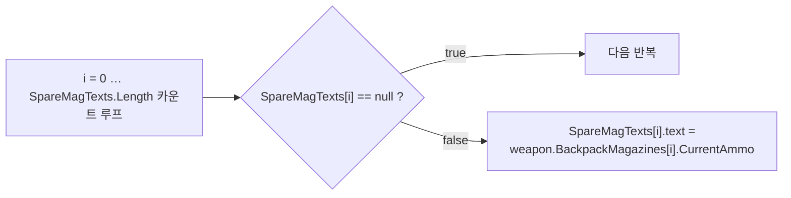
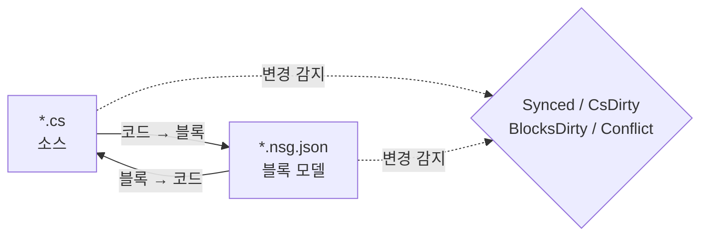

# NekoScriptGraph (NSG) — 빠른 배포 및 핸드북

**버전** 1.0.1 · **Unity** 2022.3+ · **제작자** NekoAndreeva · **라이선스** MIT · **패키지** `com.nekoandreeva.nekoscriptgraph`

> 코드에 **무엇도 집어넣지 않는** Unity용 Scratch 스타일 비주얼 프로그래밍입니다.
> NSG는 스크립트 *옆에* 블록 설정 파일을 작성해 블록으로 편집할 수 있게 하고, 양방향으로 변환합니다. 생성된 `.cs`에는 플러그인의 흔적이 전혀 없습니다 — 플러그인 폴더를 삭제해도 스크립트는 그대로 컴파일됩니다.

---

## 목차

**파트 A — 빠른 배포**

1. [원클릭 전역 API](#1-one-click-global-api)
2. [첫 번째 블록 프로그램](#2-your-first-block-program)
3. [10분 온보딩 경로](#3-the-10-minute-onboarding-path)

**파트 B — 핸드북**

4. [핵심 개념](#4-core-concepts)
5. [설치 및 요구 사항](#5-install--requirements)
6. [블록 편집기](#6-the-block-editor)
7. [메뉴 참조](#7-menu-reference)
8. [API 블록(심층 분석)](#8-api-blocks-deep-dive)
9. [언어 및 언어 추가](#9-languages--adding-one)
10. [동기화, 정규형 및 탈출 비율](#10-sync-canonical-form--escape-ratio)
11. [아키텍처 건전성](#11-architecture-health)
12. [지역화](#12-localization)
13. [에이전트 및 MCP](#13-agents--mcp)
14. [ProgramNeko 어시스턴트(선택 사항)](#14-programneko-assistant-optional)
15. [설정](#15-settings)
16. [디렉터리 구조](#16-directory-layout)
17. [제거](#17-uninstall)
18. [문제 해결 및 FAQ](#18-troubleshooting--faq)
19. [연락처](#19-contact)

**부록**

- [A. 블록 정의 스키마](#appendix-a-block-definition-schema)
- [B. 언어 설명자 스키마](#appendix-b-language-descriptor-schema)
- [C. 설정 키](#appendix-c-settings-keys)

---
---

# 파트 A — 빠른 배포

"Assets에 폴더를 넣은 상태"에서 "블록으로 코드를 작성하는 상태"까지 약 10분이면 도달합니다. 타이핑은 거의 필요 없습니다.

<a id="1-one-click-global-api"></a>
## 1. 원클릭 전역 API

**아이디어:** 프로젝트에는 이미 수백 개의 메서드가 들어 있습니다. NSG는 이를 읽어 각 메서드마다 **API 블록**을 만들어 주므로, 이미 작성한 모든 메서드가 팔레트에서 드래그 앤 드롭할 수 있는 블록이 됩니다. 그러면 새 코드는 *자신의* 프로젝트 어휘를 조립해 작성하게 됩니다.

### 1.1 실행하기

1. 플러그인이 컴파일되었는지 확인합니다(Console에 빨간 오류가 없어야 하며, Unity 2022.3+).
2. 메뉴: **`NekoScriptGraph ▸ Build API Library for Whole Project`**(`NekoScriptGraph ▸ 프로젝트 전체 API 라이브러리 구축`).
3. NSG가 스캔할 소스 파일 수를 세고 확인 대화상자를 표시합니다:

   > *프로젝트 전체의 API 라이브러리를 구축합니다 — 소스 파일 N개 → `Assets/NekoScriptGraph/Blocks/API`. 계속할까요?*

4. **Continue**를 클릭합니다. 대규모 프로젝트에서는 블록이 수천 개라 눈에 띄게 시간이 걸립니다 — 이는 예상된 동작이며, 그래서 개수를 먼저 보여 줍니다.
5. 완료되면 Console에 요약이 기록되고 대화상자에 총계가 보고됩니다:

   ```
   [NekoScriptGraph] API blocks: <generated> generated, <skipped> skipped.
   ```

6. 블록 라이브러리가 **자동으로 다시 불러와집니다**. 그 밖에 할 일은 없습니다 — 새 블록이 바로 사용 가능합니다.

> **범위.** 스캔은 등록된 모든 언어에 대해 `Assets`를 대상으로 합니다. C#은 `AssetDatabase`(`t:MonoScript`)를 사용하고, C/C++/Rust/HLSL 등은 파일 확장자로 디스크를 순회합니다. `Dependencies/`와 `.checkpoints/`는 항상 제외됩니다.

### 1.2 폴더 하나만 대상으로

하나의 하위 시스템만 작업 중인가요? Project 창에서 폴더를 선택한 뒤 다음을 사용합니다:

**`NekoScriptGraph ▸ Generate API Blocks for Selected Folder`**(`NekoScriptGraph ▸ 선택한 폴더의 API 블록 생성`)

동일한 구조이지만 영향 범위가 작고 훨씬 빠릅니다. 처음 실행할 때 권장하는 방법이며, 실제로 스크립트 대상으로 삼고 싶은 폴더를 지정합니다.

### 1.3 결과물

조건을 충족하는 메서드마다 JSON 파일 하나가 `apiOutputFolder` 폴더(기본값 `Assets/NekoScriptGraph/Blocks/API`)에 생성됩니다:

```
Blocks/API/api.DecalUtils.ProjectNormals.5.json
Blocks/API/api.DecalManager.GetSpawner.3.json
Blocks/API/api.GPUDecalUtils.UpdateDrawIndirectCommandBuffer.3.json
```

명명 규칙: `api.<Type>.<Method>.<arity>.json` — **arity**(매개변수 개수)가 ID의 일부이므로 오버로드가 공존할 수 있습니다.

팔레트에서는 **API** 범주(`cat.api`) 아래에 **선언 형식별로 하위 그룹화**되어 나타납니다:

| 팔레트 그룹 | 포함 내용 |
|---|---|
| `API` → `DecalUtils` | 조건을 충족하는 모든 `DecalUtils` 메서드 |
| `API` → `DecalManager` | 조건을 충족하는 모든 `DecalManager` 메서드 |
| `API` → *(자유 함수)* | C / HLSL 최상위 함수 |

팔레트 검색 상자를 사용하면 이름으로 즉시 하나를 찾을 수 있습니다.

<a id="14-the-eligibility-rule-know-this-before-you-wonder"></a>
### 1.4 생성 조건 규칙(궁금해하기 전에 알아 두세요)

**API 블록은** 메서드가 다음 조건을 모두 만족할 때**만** 생성됩니다:

| 요구 사항 | 이유 |
|---|---|
| `public` | 공용 API이기 때문 |
| 제네릭 없음(메서드나 반환 형식에 `<…>` 없음) | 블록에는 런타임 형식 추론이 없음 |
| `async` 없음 | await할 스케줄러가 없음 |
| **`ref` / `out` / `in` / `params` / `this` 매개변수 없음** | out 매개변수는 추가 소켓이 필요함 |
| **기본 매개변수 값 없음**(`=`) | 소켓은 모두 필수임 |
| `where` 제약 조건 없음 | 제네릭과 동일 |
| 생성자가 아님 | 메서드 호출이 아니기 때문 |

이 조건을 충족하지 못하는 항목은 조용히 **건너뜁니다** — 그 개수가 요약의 "skipped" 숫자입니다.

<a id="15-static-vs-instance--the-one-asymmetry"></a>
### 1.5 static과 인스턴스 — 유일한 비대칭

API 기능 전체에서 가장 중요한 주의 사항입니다:

| 메서드 종류 | 블록 동작 | 가역성 |
|---|---|---|
| **`static`** | 점 표기 호출 대상 + arity로 매칭(`matchCall` + `matchArity`) | **완전 양방향** — 코드 ⇄ 블록 |
| **인스턴스** | 앞에 `target` 소켓이 하나 추가됨: `{0}.Method({1}, …)` | **단방향** — 출력은 정확하지만, 가져올 때 일반 호출 블록으로 다시 읽힘 |

> 경험 규칙: **static API는 완벽한 블록이 됩니다.** 인스턴스 메서드도 정확하고 자기 설명적인 호출을 제공하지만, 인스턴스 호출을 블록에서만 편집하면 특별히 인식 가능한 블록으로 왕복되지 않습니다. 블록으로 작성할 의도가 있는 대상에는 `static` 진입점을 사용하는 편이 좋습니다.

자유 함수(C, HLSL)는 소유 형식이 없으므로 static으로 취급됩니다 — 완전 양방향입니다.

### 1.6 재생성 규율

- **리팩터링 후에는 다시 실행하세요.** 메서드 이름을 바꾸면 오래된 API 블록이 남습니다. 생성기를 다시 실행하고 고아 항목을 삭제하거나, `Blocks/API/`를 삭제하고 처음부터 다시 생성하세요.
- **재생성은 멱등적입니다.** ID는 결정적이며 중복은 *건너뜀*으로 집계되므로, 다시 실행해도 폴더가 지저분해지지 않습니다.
- **커밋해도 안전합니다.** `Blocks/API/*.json`은 코드가 아니라 데이터입니다. 커밋하면 팀원이 다시 스캔하지 않고도 당신의 블록 어휘를 얻게 됩니다.

---

<a id="2-your-first-block-program"></a>
## 2. 첫 번째 블록 프로그램

구체적인 전체 흐름 안내입니다. API 블록을 사용해 `CompassManager` 스타일 로직의 일부 — "탄창 개수를 출력하되 빈 슬롯은 `--`로 표시" — 를 다시 만들어 봅니다.

### 1단계 — 파일 하나를 관리 대상으로 지정

1. Project 창에서 `.cs` 파일을 선택합니다.
2. **`NekoScriptGraph ▸ Take Selected Script Under Management`**(`NekoScriptGraph ▸ 선택한 스크립트 관리 대상으로 지정`).

   옆에 파일이 하나 나타납니다:

   ```
   Assets/Scripts/ChrControl/CompassManager.cs
   Assets/Scripts/ChrControl/CompassManager.nsg.json   ← the block model
   ```

   (`.nsg.json`은 기본적으로 Project 창에서 숨겨집니다 — 버그가 아니라 기능입니다. `Cmd/Ctrl+Shift+H`로 전환할 수 있습니다.)

### 2단계 — 편집기 열기

**`NekoScriptGraph ▸ Open Block Editor`**(`NekoScriptGraph ▸ 블록 편집기 열기`). 파일이 탭으로 열립니다.

### 3단계 — 블록 찾기

오른쪽 창을 봅니다:

- **팔레트 검색** — `SpareMagTexts` 또는 `Count`를 입력해 필터링합니다.
- **API** 그룹에는 파트 A에서 생성한 블록이 들어 있습니다.
- **제어 / 식 / 변수 / 구조**에는 언어 블록이 들어 있습니다.

### 4단계 — 조립하기

블록을 캔버스로 끌어다 놓습니다. 고전적인 루프:



비워 둔 필수 소켓은 모두 **아키텍처 건전성**에서 `danglingInput`으로 표시됩니다.

### 5단계 — 코드로 되돌리기

**Generate**를 누릅니다(또는 도구 모음의 generate 버튼을 사용합니다). NSG가 소스를 출력하고 다음 중 하나를 보고합니다:

| 상태 | 의미 |
|---|---|
| `Synced` | 코드와 블록 모델이 일치함 |
| `Code changed` | `.cs`가 먼저 변경됨 — 다시 가져오기 |
| `Blocks changed` | 블록이 먼저 변경됨 — Generate로 기록 |
| `Conflict` | **양쪽** 모두 변경됨 — 어느 쪽을 우선할지 직접 선택 |

### 6단계 — 코드가 깨끗한지 확인

`.cs`를 엽니다. 평범한 C#입니다. 특성도, 생성된 영역도, 플러그인 참조도 없습니다. 바로 그것이 핵심입니다.

### 7단계 — 커밋

`.cs`와 `.nsg.json`을 모두 커밋합니다. 블록 모델은 일반적인 프로젝트 에셋입니다.

> **최초 기록 시 서식이 바뀝니다.** 메서드가 이미 NSG의 정규형이 아니라면(중괄호 누락, 이상한 들여쓰기, 동등하지만 다른 표기), 첫 *블록 → 코드* 변환에서 정규화됩니다. 의미는 그대로이고 서식만 바뀝니다. 미리 경고가 표시됩니다: *"N개 메서드가 정규형이 아닙니다…"*. 예상치 못한 diff를 피하려면 [§10](#10-sync-canonical-form--escape-ratio)을 참고하세요.

---

<a id="3-the-10-minute-onboarding-path"></a>
## 3. 10분 온보딩 경로

간추린 체크리스트입니다. 인쇄해서 모니터에 붙여 두세요.

| # | 작업 | 위치 | 예상 시간 |
|---|---|---|---|
| 1 | `Assets/`에 플러그인을 넣고 컴파일되도록 둔다 | Unity | 1분 |
| 2 | 폴더 선택 → **Generate API Blocks for Selected Folder** | 메뉴 | 1분 |
| 3 | **Take Selected Folder Under Management** | 메뉴 | 1분 |
| 4 | **Open Block Editor** | 메뉴 | 10초 |
| 5 | 팔레트에서 자신의 메서드 하나를 검색한다 | 편집기 | 1분 |
| 6 | 블록 세 개를 끌어 연결하고 소켓 하나를 비워 둔다 | 편집기 | 2분 |
| 7 | **Architecture Health**를 열고 `danglingInput` 결과를 읽는다 | 메뉴 | 1분 |
| 8 | 소켓에 블록을 끌어다 놓아 수정한다 | 편집기 | 1분 |
| 9 | **Generate**를 눌러 상태가 `Synced`인지 확인한다 | 편집기 | 30초 |
| 10 | `.cs`를 열어 깨끗한 C#인지 확인한다 | 편집기 | 20초 |
| 11 | `.cs` + `.nsg.json`을 커밋한다 | Git | 30초 |
| 12 | *(선택 사항)* **MCP Bridge: Start**를 실행하고 에이전트를 `http://127.0.0.1:8765/`로 연결한다 | 메뉴 + 클라이언트 | 2분 |

**한 줄로 된 사고 모델:** `.cs`는 진실의 원천이고, `.nsg.json`은 그 위의 *렌즈*이며, NSG는 렌즈와 원본을 일치시켜 유지합니다.

---
---
# 파트 B — 핸드북

<a id="4-core-concepts"></a>
## 4. 핵심 개념

### 4.1 관리 파일과 자유 파일

- **자유 파일** — 옆에 `.nsg.json`이 없는 일반 스크립트입니다.
- **관리 파일** — `.nsg.json`이 있으며 블록으로 열 수 있습니다.

### 4.2 메서드 본문만 블록이 됩니다

NSG에서 가장 중요한 규칙입니다:

- `using`, 형식 선언, 필드, 특성, 그리고 **메서드 본문 밖**의 주석은 **그대로** 보존되며 양방향 변환에서 변경 없이 유지됩니다.
- **메서드 본문**은 블록으로 파싱됩니다.
- 블록 모델이 표현할 수 없는 것은 **원시 조각**으로 보존되고 진단(`NSG0002`)으로 보고됩니다. **무엇도 조용히 사라지지 않습니다.**

### 4.3 양방향 동기화 모델



| 상태 | 의미 |
|---|---|
| `Synced` | 코드와 블록 모델이 일치함 |
| `CsDirty` | `.cs`가 변경됨, 모델이 뒤처짐 |
| `BlocksDirty` | 블록이 변경됨, 코드가 아직 다시 작성되지 않음 |
| `Conflict` | 양쪽 모두 변경됨 — 어느 쪽이 이길지 직접 선택해야 함 |
| `Unmanaged` | 블록 파일 없음 |

NSG는 **어느 쪽이 먼저 움직였는지** 추적하므로, Generate를 눌렀을 때 자신의 작업이 사라지게 되는지 항상 알 수 있습니다.

> MCP/에이전트 경로는 의도적으로 **단방향, 즉 코드 → 블록**입니다. 에이전트는 평범한 소스를 작성하고, 플러그인이 다시 파싱해 모델을 재구축합니다.

---

<a id="5-install--requirements"></a>
## 5. 설치 및 요구 사항

1. Unity **2022.3** 이상.
2. `NekoScriptGraph` 폴더를 `Assets/` 아래에 둡니다(또는 로컬 패키지로 추가합니다).
3. 패키지 전체는 **에디터 전용 어셈블리 정의**로 한정됩니다 — 플레이어 빌드에는 **아무것도** 포함되지 않습니다.

### 선택 구성 요소(각각 단위로 제거 가능)

| 폴더 | 용도 | 제거할 경우 |
|---|---|---|
| `Dependencies/` | 9-slice 둥근 스프라이트 | 일반 둥근 모서리로 대체되며 패키지 약 1.4 MB |
| `LanguageSupport/{c,cpp,hlsl,java,python,rust}` | C# 이외 언어 | 해당 언어가 사라지고 다른 것은 깨지지 않음 |
| `ProgramNeko/` | 픽셀 고양이 어시스턴트 | 없어도 플러그인은 정상 동작 |
| `Locale/*` | UI 번역 | 해당 로케일이 영어로 대체됨 |

### 패키지 크기

배포 기준 ≈ **2.2 MB**:

| 구성 | 크기 |
|---|---|
| `Editor/` — 코어, UI, C# 엔진 | ~0.9 MB |
| `Dependencies/Editor/Sprite/` — 선택적 9-slice 스프라이트 | ~0.86 MB |
| `Blocks/` — 내장 블록 라이브러리(요청 시 재생성) | ~0.23 MB |
| `LanguageSupport/` — 바로 넣는 일곱 개 언어 | ~0.21 MB |

---

<a id="6-the-block-editor"></a>
## 6. 블록 편집기

VS Code 스타일의 다중 탭 창이며 최소 크기는 980×600입니다.

| 영역 | 내용 |
|---|---|
| 탭 바 | 여러 문서를 동시에 열기 |
| 캔버스 | 스크립트를 블록으로 표시 — 드래그, 연결, 접기, 확대/축소, 맞춤 |
| 오른쪽 창 | 블록 팔레트 + 검색 + 프리셋, 너비가 기억됨 |
| 왼쪽 아래 | 상태 텍스트, 실행 취소/다시 실행, 어시스턴트 슬롯(설치된 경우에만) |
| 도구 행 | 라이브러리 다시 불러오기, 문제, 건전성, 체크포인트, Git, 스프라이트 |

### 6.1 두 가지 보기 모드

| 보기 | 스타일 | 적합한 용도 |
|---|---|---|
| **스택(Scratch)** | 세로로 문장 쌓기 | 교육, 선형 로직 |
| **블루프린트(UE)** | 노드 그래프 | 데이터 흐름과 식 체인 |

**보기**(View) 드롭다운(`view.stack` / `view.blueprint`)으로 전환합니다.

### 6.2 팔레트

- `categoryKey`로 그룹화되며 전체를 접을 수 있습니다(`Collapse all` / `Expand all`).
- 문자 색인은 접힌 상태로 시작하며 수동으로 펼칩니다.
- 검색 필드는 의도적으로 블록 목록 **바깥**에 있습니다 — 목록은 키 입력마다 다시 만들어지므로, 그렇지 않으면 포커스를 잃게 됩니다.
- 블록 하나뿐 아니라 **프리셋** 전체를 캔버스로 끌어다 놓을 수 있습니다.

**내장 범주:**

| 키 | 레이블 | 내용 |
|---|---|---|
| `cat.ctrl` | 제어 | `if`, `for`, `foreach`, `while`, `break`, `continue`, `return` |
| `cat.expr` | 식 | binary, unary, call, cast, conditional, ident, index, literal, member, new, postfix |
| `cat.var` | 변수 | 지역 변수 및 대입 |
| `cat.frame` | 구조 | 선언 |
| `cat.api` | API | 생성된 API 블록(형식별 그룹) |
| `cat.macro` | 내 블록 | 사용자 프리셋 |
| `cat.raw` | 탈출구 | 원시 조각 |

### 6.3 체크포인트

내장 스냅샷은 `.checkpoints/`에 있으며 **git에서 무시**됩니다 — 저장소 기록과 절대 충돌할 수 없습니다. 큰 *블록 → 코드* 기록 전에 하나 만들어 두세요.

### 6.4 블록 파일 숨기기

`hideBlockFiles`의 기본값은 `true`이므로 Project 창이 `.nsg.json`으로 넘치지 않습니다.

- 메뉴: **`Toggle Block Files Visibility`**(블록 파일 표시/숨기기) — 전역 단축키 `Cmd/Ctrl+Shift+H`.
- 이 단축키는 전역이며 플러그인 창이 닫혀 있어도 동작합니다.

### 6.5 선택한 블록 설명

`Cmd/Ctrl+Shift+E`(메뉴 **`Explain Selected Block`**, 선택한 블록 설명)는 어시스턴트에게 현재 블록을 설명해 달라고 요청합니다. 역시 전역 단축키입니다.

---

<a id="7-menu-reference"></a>
## 7. 메뉴 참조

> `[MenuItem]` 캡션은 컴파일 시점 상수이므로 Unity에는 **정적인 영어** 이름이 그대로 들어갑니다. 지역화 계층이 로드 시점과 언어 변경 시점에 번역된 레이블로 대체합니다. `MCP Bridge` 항목은 의도적으로 영어입니다.

| 메뉴 항목 | 용도 |
|---|---|
| `Open Block Editor`(블록 편집기 열기) | 기본 창 열기 |
| `Problems`(문제) | 진단 목록 |
| `Assistant (ProgramNeko)`(어시스턴트) | 어시스턴트 열기, 설치되어 있지 않으면 경고 |
| `Explain Selected Block`(선택한 블록 설명) `%#e` | 선택한 블록 설명 |
| `Architecture Health`(아키텍처 건전성) | 건전성 창 열기 |
| `Take Selected Script Under Management`(선택한 스크립트 관리 대상으로 지정) | 파일 하나 관리 |
| `Release Selected Script`(선택한 스크립트 관리 해제) | 파일 하나 관리 해제 |
| `Take Selected Folder Under Management`(선택한 폴더 관리 대상으로 지정) | 일괄 관리 |
| `Take Whole Project Under Management`(프로젝트 전체를 관리 대상으로 지정) | 전체 관리 |
| `Release Selected Folder`(선택한 폴더의 블록 설정 해제) | 일괄 해제 |
| `Release Whole Project`(프로젝트 전체의 블록 설정 해제) | 전체 해제 |
| `Generate API Blocks for Selected Folder`(선택한 폴더의 API 블록 생성) | 폴더 범위 API 생성 |
| `Build API Library for Whole Project`(프로젝트 전체 API 라이브러리 구축) | 원클릭 전역 API(파트 A) |
| `Reload Block Library`(블록 라이브러리 다시 불러오기) | `Blocks/` 다시 읽기 |
| `Export Default Block Library`(기본 블록 라이브러리 내보내기) | 내장 블록을 `Blocks/`에 쓰기 |
| `Generate ShaderLab Shell`(ShaderLab 셸 생성) | 셰이더 외곽 구조 생성 |
| `Self Test: Round Trip`(자체 테스트: 왕복 변환) | 왕복 일관성 자체 검사 |
| `Toggle Block Files Visibility`(블록 파일 표시/숨기기) `%#h` | `.nsg.json` 표시/숨기기 |
| `Languages: Show Loaded`(언어: 로드된 항목 표시) | 언어 레지스트리 덤프 |
| `MCP Bridge: Start` / `Stop` / `Copy Client URL` | MCP 브리지 |

---

<a id="8-api-blocks-deep-dive"></a>
## 8. API 블록(심층 분석)

파트 A에서는 워크플로를 다뤘습니다. 여기서는 내부 구조를 설명합니다.

### 8.1 생성기가 출력하는 것

조건을 충족하는 메서드마다 `NsgBlockDef` 하나:

```jsonc
// Blocks/API/api.DecalUtils.ProjectNormals.5.json
{
  "id": "api.DecalUtils.ProjectNormals.5",
  "level": "high",
  "shape": "expression",                 // "statement" if return type is void
  "category": "DecalUtils",              // declaring type → palette sub-group
  "categoryKey": "cat.api",              // the "API" group
  "label": "DecalUtils.ProjectNormals({0}, {1}, {2}, {3}, {4})",
  "labelEn": "DecalUtils.ProjectNormals({0}, {1}, {2}, {3}, {4})",
  "labelRu": "DecalUtils.ProjectNormals({0}, {1}, {2}, {3}, {4})",
  "sockets": [
    { "name": "decalPosW", "kind": "expr", "required": true, "variadic": false, "choices": [] },
    { "name": "parents",   "kind": "expr", "required": true, "variadic": false, "choices": [] },
    { "name": "decalNorm", "kind": "expr", "required": true, "variadic": false, "choices": [] },
    { "name": "decalTform","kind": "expr", "required": true, "variadic": false, "choices": [] },
    { "name": "decalColor","kind": "expr", "required": true, "variadic": false, "choices": [] }
  ],
  "emit": "",
  "node": "call",
  "op": "",
  "color": "",
  "matchCall": "DecalUtils.ProjectNormals",  // dotted match target
  "matchArity": 5,                           // parameter count
  "builtin": true,
  "manual": "DecalUtils.ProjectNormals(decalPosW, parents, decalNorm, decalTform, decalColor) : Color[]",
  "variantGroup": "",
  "variantLabel": ""
}
```

참고 사항:

- **소켓 이름**은 실제 매개변수 이름입니다 — 따라서 팔레트 레이블이 자기 설명적입니다.
- **`manual`**에는 정규화된 전체 시그니처와 반환 형식이 들어 있습니다. 이것이 *탈출구*, 즉 블록의 수동 형식입니다.
- **인스턴스 메서드**에는 앞에 `target`(필수) 소켓이 하나 추가되고 레이블이 `{0}.Method({1}, …)`가 됩니다 — 그래서 §1.5의 단방향 주의 사항이 있습니다.
- **자유 함수**(C/HLSL)는 소유자가 없어 `static`으로 취급됩니다.

### 8.2 결정성과 중복 제거

- ID는 `api.<QualifiedType>.<Method>.<arity>`이며 실행할 때마다 결정적입니다.
- 중복 ID는 **건너뜀**으로 집계되고 두 번 기록되지 않습니다.
- 리팩터링 후 다시 실행해도 고아 항목은 **제거되지 않습니다**. 깨끗한 상태를 원하면 `Blocks/API/`를 삭제하고 다시 생성하세요.

### 8.3 여러 언어

`Build API Library for Whole Project`는 언어 레지스트리를 순회하며 각 엔진의 `GenerateApiBlocks`를 호출합니다. C#은 `AssetDatabase`를 거치고, C 계열 언어는 프로필 확장자로 파일 시스템을 순회하며 `.checkpoints/`와 `Dependencies/`를 건너뜁니다. 언어 엔진 생성에 실패하면 그 언어는 실패로 집계되고 나머지는 계속 진행됩니다.

### 8.4 실용 지침

| 상황 | 권장 사항 |
|---|---|
| 하위 시스템용 블록을 원한다 | 프로젝트 변형이 아니라 **폴더** 변형을 사용한다 |
| 양방향 블록을 원한다 | **`static`** 진입점을 노출한다 |
| `ref`/`out`/`params` API가 있다 | 건너뜁니다 — 블록을 원하면 간단한 static 메서드로 감싼다 |
| 팔레트에서 오버로드가 충돌한다 | ID에 **arity**가 있고 소켓이 구분해 주므로 이름으로 검색한다 |
| 메서드 이름을 바꿨다 | 다시 생성하고 고아 JSON을 삭제한다 |

---

<a id="9-languages--adding-one"></a>
## 9. 언어 및 언어 추가

`C` · `C++` · `C#` · `Go` · `HLSL` · `Java` · `Rust` · `Python`

- 모두 **양방향**으로 변환합니다.
- **C#은 내장**입니다(`Editor/Languages/CSharp/`: Lexer, Parser, Printer, Splitter, CodeMap).
- 나머지는 **바로 넣는 폴더**입니다. `LanguageSupport/<lang>/`를 삭제하면 다른 것은 깨지지 않은 채 플러그인에서 해당 언어만 사라집니다.

### 언어 추가하기

설명자와 엔진이 있는 폴더를 만듭니다:

```jsonc
// LanguageSupport/python/python.language.json
{
  "apiVersion": 1,
  "id": "python",
  "displayName": "Python",
  "icon": "PYTHON",
  "extensions": [".py"],
  "blocksFolder": "blocks",
  "engineType": "NekoScriptGraph.Nsg_PythonLanguage",
  "author": "",
  "note": "Self-contained language: its own engine, sharing only the block skeleton."
}
```

그런 다음 `engineType`으로 지정한 클래스(파싱, 출력, API 블록 생성)를 구현하고 해당 언어의 `blocks/` 폴더를 추가합니다. `Nsg_PythonLanguage`, `Nsg_CLanguage`, `Nsg_RustLanguage` 등을 참고 구현으로 사용하세요.

---

<a id="10-sync-canonical-form--escape-ratio"></a>
## 10. 동기화, 정규형 및 탈출 비율

### 10.1 탈출 비율

**원시 조각** 블록의 비중입니다. 코드 중 얼마나 많은 부분이 실제로 블록으로 모델링되었는지를 측정합니다.

- MCP에서 `maxEscapeRatio: 0`으로 게이트를 걸면 블록으로의 *완전한* 변환을 요구할 수 있습니다.
- 파서가 모델링할 수 없는 것은 그대로 보존되고 **`NSG0002`**로 보고됩니다.

### 10.2 정규형

하나의 "표준 표기"만 존재하는 코드입니다. 첫 *블록 → 코드* 변환에서 다음을 정규화합니다:

- 중괄호 누락,
- 들여쓰기 불일치,
- 동등하지만 다른 표기.

사용자에게 표시되는 경고:

> *"N개 메서드가 정규형이 아닙니다(중괄호 누락, 들여쓰기 불일치 또는 동등한 여러 표기). 첫 블록 → 코드 변환에서 정규화됩니다 — 의미는 그대로이고 서식만 바뀝니다."*

### 10.3 고정점

`canon(text) == text`가 될 때까지 반복합니다. 텍스트가 고정점이 되면 문서는 `Synced`로 유지되고 다시는 재서식화되지 않습니다. §13의 에이전트 루프가 디스크에 쓰기 전에 하는 일이 정확히 이것입니다.

---

<a id="11-architecture-health"></a>
## 11. 아키텍처 건전성

메뉴 **`Architecture Health`**(아키텍처 건전성) — 스크립트를 선택한 상태라면 그 파일을 분석하고, 그렇지 않으면 빈 상태로 열립니다.

**지표:** 블록/문장 개수, 메서드 개수, 탈출 비율(`escapes`), 그리고 종합 `score`.

**검사:**

| 키 | 의미 |
|---|---|
| `emptyBody` / `emptyMethod` | 빈 본문 / 빈 메서드 |
| `constantCondition` | 항상 참이거나 항상 거짓인 조건 |
| `cycle` | 호출 또는 의존성 순환 |
| `danglingInput` | 연결되지 않은 필수 소켓 |
| `duplicate` | 중복 코드 |
| `escapeRatio` | 원시 조각 비율이 높음 |
| `expressionSize` | 식이 지나치게 큼 |
| `nesting` | 과도한 중첩 |
| `methodLength` | 메서드가 너무 김 |
| `memberChain` | 긴 멤버 체인(`a.b.c.d.e`) |
| `magicNumber` | 매직 넘버 |
| `placeholderName` / `shortName` | 자리 표시자 / 너무 짧은 이름 |
| `unusedLocal` | 사용되지 않는 지역 변수 |
| `afterReturn` | `return` 이후의 코드 |
| `leak` | 누수 의심 |

**수정 동작:** `fixBreakLink`, `fixFillZero`, `fixAddRelease`, `fixApply`, `rerun`.

---

<a id="12-localization"></a>
## 12. 지역화

**15개 UI 로케일:**

중국어 간체 · 중국어 번체 · 영어 · 프랑스어 · 독일어 · **이탈리아어** · 러시아어 · 스페인어 · 포르투갈어 · 일본어 · 한국어 · 폴란드어 · 터키어 · 아랍어 · 히브리어

- **아랍어와 히브리어는 편집기 전체를 좌우 반전**합니다: 팔레트가 왼쪽으로 이동하고 블록이 왼쪽으로 자랍니다(RTL).
- Unity 자체 메뉴 바는 **의도적으로** 영어로 유지됩니다.
- 문자열은 `Locale/<code>/strings.json`에 있으며 키(`ui`, `blocks` 등)로 구획됩니다. 블록 어휘는 `blocks` 구획을 사용합니다. 예: `c.assert` → `assert {0}`.

---

<a id="13-agents--mcp"></a>
## 13. 에이전트 및 MCP

NSG에는 **Unity 에디터 안에서 실행되는 MCP 서버**가 포함되어 있습니다: MCP **Streamable HTTP** 전송을 통한 JSON-RPC 2.0입니다. **사이드카 프로세스도, 추가 런타임도 없습니다 — Node도 Python도 필요 없습니다. 에디터가 곧 서버입니다.**

```
MCP client ──HTTP POST JSON-RPC──▶ 127.0.0.1:8765 ──▶ Unity Editor
```

### 13.1 시작하기

메뉴 **`NekoScriptGraph ▸ MCP Bridge: Start`**:

```
[NekoScriptGraph] MCP bridge listening on http://127.0.0.1:8765/
```

- 켜져 있었다는 사실을 기억하고 도메인 리로드나 에디터 재시작 후 **자동으로 다시 시작**합니다.
- **`MCP Bridge: Stop`**으로 중지하고, **`MCP Bridge: Copy Client URL`**로 URL을 복사합니다.
- 클라이언트 없이 직접 확인:

```bash
curl -s http://127.0.0.1:8765/ -d '{"jsonrpc":"2.0","id":1,"method":"tools/list"}'
```

단순한 `GET /`는 서버 버전, 지원되는 프로토콜 리비전, 사용 가능한 도구를 나열하는 상태 페이지를 반환합니다.

### 13.2 클라이언트 연결

Streamable HTTP MCP 클라이언트라면 무엇이든 동작합니다. 설정 형태는 조금씩 다릅니다(어떤 것은 `type`, 어떤 것은 `transport`, 몇몇은 `url`만 사용):

```json
{
  "mcpServers": {
    "nekoscriptgraph": {
      "type": "http",
      "url": "http://127.0.0.1:8765/"
    }
  }
}
```

VS Code는 `mcpServers` 대신 `servers`를 사용하며, 항목 내용은 그 외에 동일합니다.

클라이언트가 **stdio**만 지원한다면 앞에 HTTP↔stdio 프록시를 두세요(예: `npx mcp-remote http://127.0.0.1:8765/`). 그 프록시는 플러그인이 아니라 클라이언트의 몫입니다.

> 레거시 HTTP+SSE 전송(`GET /sse`)은 **구현되어 있지 않습니다**. 브리지는 Streamable HTTP, 프로토콜 리비전 `2025-03-26` 이상을 제공하며, 같은 URL로 POST하는 `2024-11-05` 클라이언트도 받아들입니다.

### 13.3 일곱 개의 도구

| 도구 | 기록 여부 | 하는 일 |
|---|---|---|
| `nsg_writing_spec` | 아니오 | 블록 라이브러리와 프린터에서 생성되는, 해당 언어의 정규 작성 하위 집합 |
| `nsg_verify` | 아니오 | 디스크상 파일의 상태: `Synced`, `CsDirty`, `BlocksDirty`, `Conflict`, `Unmanaged` |
| `nsg_plan` | 아니오 | 후보 코드를 파싱하고 진단, 블록 개수, 탈출 비율, 정규형 여부를 보고 |
| `nsg_canon` | 아니오 | 정규 텍스트 — 고정점 오라클 |
| `nsg_apply` | **예** | `.nsg.json`을 재구축하고 정규 소스를 기록 |
| `nsg_list_managed` | 아니오 | 폴더 아래의 모든 `.nsg.json` |
| `nsg_release` | **예** | 해당 `.nsg.json` 파일 삭제(깨끗한 제거) |

### 13.4 의도된 루프 — 코드 → 블록

1. `nsg_writing_spec`을 한 번 호출해 해당 언어의 하위 집합을 파악합니다.
2. `.cs`를 편집합니다(또는 대화 안에 텍스트만 들고 있어도 됩니다).
3. `nsg_plan` — 진단, 블록 개수, 탈출 비율. **아무것도 기록하지 않고 컴파일도 필요 없으므로** 아직 빌드되지 않는 코드에도 안전합니다.
4. `canonical`이 false이면 `nsg_canon`을 호출하고 `canon(text) == text`가 될 때까지 반복합니다. 그것이 고정점이며, 일단 도달하면 문서는 `Synced`로 유지되고 나중에 아무것도 재서식화되지 않습니다.
5. `nsg_apply` — 정규 `.cs`와 재구축된 `.nsg.json`을 기록합니다.

`maxEscapeRatio: 0`으로 탈출 비율에 게이트를 걸면 블록으로의 완전한 변환을 요구할 수 있습니다.

```json
{"jsonrpc":"2.0","id":1,"method":"tools/call","params":{
  "name":"nsg_plan",
  "arguments":{"file":"Assets/Scripts/CompassManager.cs","maxEscapeRatio":0.0}}}
```

`nsg_plan`, `nsg_canon`, `nsg_apply`는 `source`도 받으므로, 에이전트가 텍스트가 디스크에 도달하기 전에 검증할 수 있습니다:

```json
{"jsonrpc":"2.0","id":2,"method":"tools/call","params":{
  "name":"nsg_canon",
  "arguments":{"file":"Assets/Scripts/Foo.cs","source":"class Foo { void A(){ } }"}}}
```

### 13.5 보안

브리지는 프로젝트에 파일을 기록하므로 의도적으로 범위를 좁혀 두었습니다:

- **`127.0.0.1`에만** 바인딩하며 라우팅 가능한 인터페이스에는 절대 바인딩하지 않습니다.
- **`Origin`** 헤더가 있는 요청은 **`403`**으로 거부됩니다. 브라우저는 항상 `Origin`을 보내고 네이티브 MCP 클라이언트는 절대 보내지 않습니다 — 따라서 **브라우저에 열려 있는 어떤 페이지도 브리지에 접근할 수 없습니다**. 정말로 브라우저 클라이언트가 필요하면 `Nsg_McpBridge.SetAllowOrigin(true)`로 완화하세요.
- 서버는 **직접 시작하기 전까지 꺼져 있고**, 종료 시 멈춥니다.

### 13.6 문제 해결

| 증상 | 원인 / 해결 |
|---|---|
| 에디터가 제때 응답하지 않음 | 브리지는 모든 호출을 메인 스레드로 모으는데, Unity는 컴파일 중이거나 도메인을 리로드하는 동안 `EditorApplication.update`를 실행하지 않습니다. 재컴파일 중에 보낸 요청은 대기하다가 **60초** 후 실패합니다. 그냥 다시 시도하세요 |
| 포트가 이미 사용 중 | 다른 프로세스가 `8765`를 점유하고 있습니다. `Nsg_McpBridge.SetPort(n)`으로 변경하거나 다른 리스너를 닫으세요 |
| 도구가 없음 | 플러그인이 컴파일되었는지 확인하세요 — `Nsg_Json`, `Nsg_Mcp`, `Nsg_McpBridge`는 별도 설정이 필요 없는 평범한 에디터 스크립트입니다. `GET /`가 현재 제공되는 도구를 나열합니다 |

### 13.7 MCP 없이 사용하기

브리지는 평범한 JSON-RPC 엔드포인트이며, 프로토콜 없이도 같은 작업을 사용할 수 있습니다:

- **헤드리스 / CI**

```bash
Unity -batchmode -quit -projectPath <project> \
      -executeMethod NekoScriptGraph.Nsg_AgentCli.Main \
      -nsgRequest req.json -nsgResponse resp.json
```

- **코드에서** — `Nsg_AgentApi.Run(request)`, 그리고 프로토콜 계층만 필요하면 `Nsg_Mcp.Handle(jsonString)`.

---

<a id="14-programneko-assistant-optional"></a>
## 14. ProgramNeko 어시스턴트(선택 사항)

`ProgramNeko/`는 선택적인 픽셀 고양이 어시스턴트입니다. **폴더 전체를 삭제해도 플러그인은 계속 동작합니다.**

- 메뉴 **`Assistant (ProgramNeko)`**로 엽니다. 문제 창과 *같은* 창입니다: 그녀가 없으면 오류 목록일 뿐이고, 있으면 고양이가 위에 앉아 아래에서 말합니다.
- `Cmd/Ctrl+Shift+E`로 선택한 블록에 대한 설명을 요청합니다.
- 그녀만의 지역화가 있습니다: `ProgramNeko/Locale/<code>/neko.json`(15개 로케일).
- 매니페스트: `ProgramNeko/programneko.json`.

---

<a id="15-settings"></a>
## 15. 설정

`Assets/NekoScriptGraph/NekoScriptGraph.settings.json`:

```jsonc
{
  "viewMode": 0,                        // 0 = Stack (Scratch), 1 = Blueprint (UE)
  "hideBlockFiles": true,               // hide .nsg.json by default
  "useSprites": false,                  // 9-slice sprites
  "headerSprite": "block_header",
  "bodySprite": "block_body",
  "footerSprite": "block_footer",
  "exprSprite": "block_expr",
  "bodyIndent": 14,                     // body indent
  "cornerRadius": 6,
  "footerHeight": 10,
  "rightPaneWidth": 240.0,              // remembered after you drag it
  "presetPaneHeight": 200.0,
  "shaderPipeline": "auto",             // auto / ...
  "apiOutputFolder": "Assets/NekoScriptGraph/Blocks/API"
}
```

프리셋(여러 블록 드래그 묶음)은 `.presets/presets.json`에 있으며 `schemaVersion: 1`이고, 각 항목은 `name`, `createdAt`, `blockCount`, `languageId`, 그리고 `nodes` 배열을 기록합니다.

---

<a id="16-directory-layout"></a>
## 16. 디렉터리 구조

```
NekoScriptGraph/
├─ Editor/
│  ├─ Core/                      engine core
│  │  ├─ Esketamine/             AST, parse/print, block library, diagnostics,
│  │  │                          settings, MCP, agent API, L10n, undo, checkpoints
│  │  └─ cstyle/                 C-style engine, shader pipeline, agent spec
│  ├─ Languages/CSharp/          lexer / parser / printer / splitter / code map
│  ├─ UI/                        main window, block view, blueprint view, health,
│  │                             error window, RTL, picker, name dialog
│  ├─ Nsg_Menu.cs                menu items
│  ├─ Nsg_McpBridge.cs           MCP HTTP bridge
│  ├─ Nsg_AgentCli.cs            headless CLI
│  └─ Nsg_SelfTest.cs            round-trip self test
├─ Blocks/                       built-in block library + API/*.json
├─ LanguageSupport/{c,cpp,hlsl,java,python,rust}/
├─ Locale/{15 locales}/strings.json
├─ Dependencies/Editor/Sprite/   optional 9-slice sprites
├─ ProgramNeko/                  optional assistant
├─ .presets/presets.json
├─ NekoScriptGraph.settings.json
├─ MCP.md                        dedicated MCP chapter
└─ package.json                  com.nekoandreeva.nekoscriptgraph v1.0.1
```

---

<a id="17-uninstall"></a>
## 17. 제거

비침습적이며 두 가지 방법이 있습니다:

1. **메뉴** — `Release Selected Script` / `Release Selected Folder` / `Release Whole Project`, 또는 UI 버튼 **Release** / **Release All** / **Release Folder**.
2. 선택한 폴더 또는 프로젝트 전체에서 모든 `.nsg.json` 파일을 삭제합니다.

**소스 파일은 절대 건드리지 않습니다.** 그 후 남는 것은 플러그인 폴더 자체뿐입니다 — 삭제하면 끝입니다.

---

<a id="18-troubleshooting--faq"></a>
## 18. 문제 해결 및 FAQ

**생성된 `.cs`에 플러그인 흔적이 남나요?**
아니요. 플러그인 폴더를 삭제해도 스크립트는 여전히 컴파일됩니다.

**`using`, 필드, 특성은 왜 블록이 되지 않나요?**
의도된 설계입니다. 메서드 본문만 블록 변환에 참여하며, 나머지는 양방향 모두에서 그대로 보존됩니다.

**파일 서식이 왜 바뀌었나요?**
정규형이 아니었기 때문입니다. 첫 *블록 → 코드* 변환에서 중괄호와 들여쓰기를 정규화하며, 의미는 그대로입니다. 서식 변경이 전혀 없기를 원한다면 먼저 `nsg_canon`으로 고정점까지 반복하세요.

**일부 문장이 "원시 조각"이 되었습니다 — 왜인가요?**
해당 언어에서 작성 가능한 하위 집합 밖이기 때문입니다. NSG는 이를 삭제하지 않고 그대로 보존하고 `NSG0002`로 보고합니다. `maxEscapeRatio`를 사용하면 이를 강제 게이트로 만들 수 있습니다.

**`MCP Bridge` 메뉴 항목은 왜 영어인가요?**
의도적입니다 — Unity 메뉴 바는 플러그인 지역화에 참여하지 않으며, 번역된 항목과 번역되지 않은 항목을 섞는 것이 더 나쁩니다.

**폴더 하나만 관리할 수 있나요?**
예: **`Take Selected Folder Under Management`**(선택한 폴더 관리 대상으로 지정).

**Project 창에 블록 파일이 너무 많아 어수선한가요?**
기본적으로 숨겨져 있습니다. `Cmd/Ctrl+Shift+H`로 전환하세요.

**이름을 바꾼 뒤 API 블록이 오래되었습니다.**
재생성은 고아 항목을 정리하지 않습니다. `Blocks/API/`를 삭제하고 다시 생성하세요.

**기대했던 API 블록이 없습니다.**
해당 메서드가 생성 조건을 충족하지 못했습니다 — 가장 흔한 원인은 `ref`/`out`/`params`, 기본 매개변수 값, 제네릭, `async`입니다. [§1.4](#14-the-eligibility-rule-know-this-before-you-wonder)를 참고하세요.

**인스턴스 메서드 API 블록이 왕복되지 않습니다.**
예상된 동작입니다. `static` 메서드만 완전 양방향이고, 인스턴스 메서드는 `target` 소켓을 가지므로 단방향입니다. [§1.5](#15-static-vs-instance--the-one-asymmetry)를 참고하세요.

---

<a id="19-contact"></a>
## 19. 연락처

제작자: **NekoAndreeva**

- 이메일: elenaandreevasvinolup@gmail.com
- WhatsApp: +852 5247 4163
- GitHub: `https://github.com/elenaandreevasvinolup-alt`

---
---

<a id="appendix-a-block-definition-schema"></a>
## 부록 A. 블록 정의 스키마

`Blocks/<id>.json` — 블록 하나당 파일 하나입니다.

| 필드 | 형식 | 비고 |
|---|---|---|
| `id` | string | 고유하며 팔레트 정체성이기도 함, 생성된 블록은 `api.<Type>.<Method>.<arity>` |
| `level` | string | `high`(문장 수준) / 그 외 |
| `shape` | string | `control` · `statement` · `expression` |
| `category` | string | 표시 그룹, API 블록에서는 선언 형식 |
| `categoryKey` | string | 그룹의 지역화 키: `cat.ctrl`, `cat.expr`, `cat.var`, `cat.frame`, `cat.api`, `cat.macro`, `cat.raw` |
| `label` | string | `{0}`, `{1}`… 슬롯이 있는 팔레트 레이블 |
| `labelEn` / `labelRu` | string | 언어별 레이블 |
| `sockets` | array | `{ name, kind, required, variadic, choices[] }` |
| `emit` | string | 사용자 지정 출력 템플릿(비어 있으면 엔진 기본값) |
| `node` | string | 매핑되는 AST 노드: `if`, `call`, `binary`, … |
| `op` | string | 해당되는 경우 연산자 |
| `color` | string | 선택적 재정의 |
| `matchCall` | string | 가져올 때 인식할 점 표기 호출 대상 |
| `matchArity` | int | 매칭할 매개변수 개수(`-1` = 아무거나) |
| `builtin` | bool | 플러그인과 함께 제공됨 |
| `manual` | string | 전체 수동 형식 / 시그니처, 블록의 수동 항목에 사용됨 |
| `variantGroup` / `variantLabel` | string | 변형 그룹화 |

**내장 문장/식 블록:** `stmt.if`, `stmt.for`, `stmt.foreach`, `stmt.while`, `stmt.break`, `stmt.continue`, `stmt.return`, `stmt.localDecl`, `stmt.assign`, `stmt.expr`, `stmt.add`, `stmt.sub`, `stmt.mul`, `stmt.div`, `stmt.mod`, `stmt.raw`, 그리고 식 `expr.binary`, `expr.unary`, `expr.call`, `expr.cast`, `expr.conditional`, `expr.ident`, `expr.index`, `expr.literal`, `expr.member`, `expr.new`, `expr.postfix`, `expr.raw`.

<a id="appendix-b-language-descriptor-schema"></a>
## 부록 B. 언어 설명자 스키마

`LanguageSupport/<id>/<id>.language.json`:

| 필드 | 형식 | 비고 |
|---|---|---|
| `apiVersion` | int | 현재 `1` |
| `id` | string | `c`, `cpp`, `csharp`, `hlsl`, `java`, `python`, `rust` |
| `displayName` | string | UI에 표시됨 |
| `icon` | string | 배지 텍스트, 예: `PYTHON` |
| `extensions` | string[] | 예: `[".py"]` |
| `blocksFolder` | string | 상대 블록 폴더, 예: `blocks` |
| `engineType` | string | 정규화된 엔진 클래스, 예: `NekoScriptGraph.Nsg_PythonLanguage` |
| `author` | string | 선택 사항 |
| `note` | string | 선택적 설명 |

<a id="appendix-c-settings-keys"></a>
## 부록 C. 설정 키

[§15](#15-settings)를 참고하세요. 변경할 가능성이 있는 키는 `viewMode`, `hideBlockFiles`, `useSprites`, `apiOutputFolder`, `shaderPipeline`뿐입니다.

---

# 이 문서를 PDF로 내보내기

현재 이 컴퓨터에는 `pandoc`, `node`, `npx`가 설치되어 있지 않습니다. 선택지:

**A. macOS 내장(설치 불필요, 가장 빠름)**
Markdown을 저장하고 HTML로 렌더링한 뒤(VS Code Markdown 미리 보기 또는 Typora), Safari에서 열고 **File ▸ Print…(⌘P) ▸ PDF ▸ Save as PDF**(파일 ▸ 프린트… ▸ PDF ▸ PDF로 저장)를 선택합니다.

**B. Homebrew + pandoc(최고의 타이포그래피)**

```bash
brew install pandoc
brew install --cask basictex        # or mactex-no-gui
pandoc GUIDE.md -o NSG-GUIDE.pdf \
  --pdf-engine=xelatex \
  -V mainfont="Helvetica Neue" \
  -V monofont="Menlo" \
  -V geometry:margin=2cm \
  --toc --toc-depth=2 -N
```

**C. VS Code 확장**
`Markdown PDF`(yzane) 또는 `Markdown Preview Enhanced`를 설치한 뒤 파일을 마우스 오른쪽 버튼으로 클릭 → **Markdown PDF: Export (pdf)**를 선택합니다.
