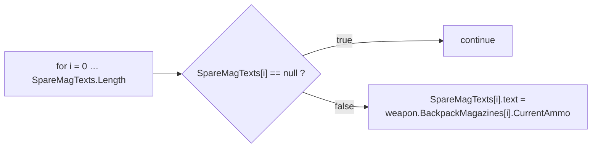
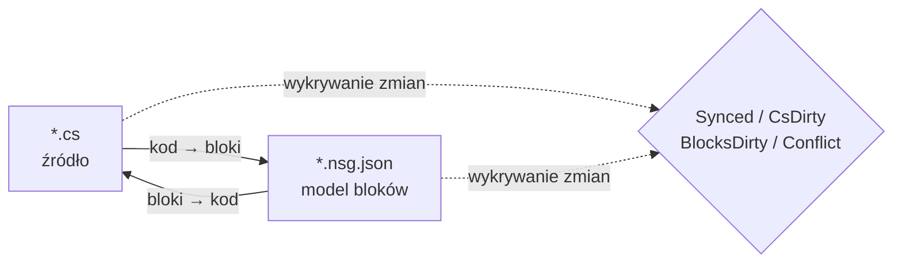

# NekoScriptGraph (NSG) — Szybkie wdrożenie i podręcznik

**Wersja** 1.0.2 · **Unity** 2022.3+ · **Autor** NekoAndreeva · **Licencja** MIT · **Pakiet** `com.nekoandreeva.nekoscriptgraph`

> Wizualne programowanie w stylu Scratch dla Unity, które **nigdy nie wpisuje niczego do twojego kodu.**
> NSG zapisuje plik konfiguracji bloków *obok* skryptu, aby można go było edytować jako bloki, i tłumaczy w obie strony. Wygenerowany `.cs` nie zawiera żadnego śladu wtyczki — usuń folder wtyczki, a skrypty nadal się kompilują.

---

## Spis treści

**Część A — Szybkie wdrożenie**

1. [Globalne API jednym kliknięciem](#1-one-click-global-api)
2. [Twój pierwszy program z bloków](#2-your-first-block-program)
3. [Ścieżka wdrożenia w 10 minut](#3-the-10-minute-onboarding-path)

**Część B — Podręcznik**

4. [Podstawowe pojęcia](#4-core-concepts)
5. [Instalacja i wymagania](#5-install--requirements)
6. [Edytor bloków](#6-the-block-editor)
7. [Opis menu](#7-menu-reference)
8. [Bloki API (szczegółowo)](#8-api-blocks-deep-dive)
9. [Języki i dodawanie nowego](#9-languages--adding-one)
10. [Synchronizacja, forma kanoniczna i współczynnik ucieczki](#10-sync-canonical-form--escape-ratio)
11. [Zdrowie architektury](#11-architecture-health)
12. [Lokalizacja](#12-localization)
13. [Agenci i MCP](#13-agents--mcp)
14. [Asystent KotkaProgram (opcjonalny)](#14-programneko-assistant-optional)
15. [Ustawienia](#15-settings)
16. [Struktura katalogów](#16-directory-layout)
17. [Odinstalowanie](#17-uninstall)
18. [Rozwiązywanie problemów i FAQ](#18-troubleshooting--faq)
19. [Kontakt](#19-contact)

**Załączniki**

- [A. Schemat definicji bloku](#appendix-a-block-definition-schema)
- [B. Schemat deskryptora języka](#appendix-b-language-descriptor-schema)
- [C. Klucze ustawień](#appendix-c-settings-keys)

---
---

# CZĘŚĆ A — SZYBKIE WDROŻENIE

Przejdź od „folderu wrzuconego do Assets" do „pisania kodu blokami" w około dziesięć minut, niemal bez pisania na klawiaturze.

<a id="1-one-click-global-api"></a>
## 1. Globalne API jednym kliknięciem

**Idea:** twój projekt zawiera już setki metod. NSG może je odczytać i wybić **blok API** dla każdej z nich, dzięki czemu każda napisana przez ciebie metoda staje się blokiem do przeciągania w palecie. Nowy kod powstaje wtedy przez składanie słownika *twojego własnego* projektu.

### 1.1 Jak to zrobić

1. Upewnij się, że wtyczka się skompilowała (brak czerwonych błędów w konsoli; Unity 2022.3+).
2. Menu: **`NekoScriptGraph ▸ Build API Library for Whole Project`**.
3. NSG zlicza pliki źródłowe, które przeskanuje, i pokazuje okno potwierdzenia:

   > *Zbudować bibliotekę API dla całego projektu — N plików źródłowych → `Assets/NekoScriptGraph/Blocks/API`. Kontynuować?*

4. Kliknij **Kontynuuj**. W dużym projekcie to tysiące bloków i zajmuje to zauważalną chwilę — to oczekiwane, dlatego najpierw pokazywana jest liczba.
5. Gdy operacja się zakończy, konsola zapisuje podsumowanie, a okno dialogowe podaje sumy:

   ```
   [NekoScriptGraph] API blocks: <generated> generated, <skipped> skipped.
   ```

6. Biblioteka bloków jest **wczytywana ponownie automatycznie**. Nic więcej nie trzeba robić — nowe bloki są gotowe do użycia.

> **Zakres.** Skanowanie obejmuje `Assets` dla każdego zarejestrowanego języka. C# korzysta z `AssetDatabase` (`t:MonoScript`); C/C++/Rust/HLSL/etc. są przeszukiwane na dysku według rozszerzenia pliku. `Dependencies/` i `.checkpoints/` są zawsze wyłączone.

### 1.2 Albo tylko jeden folder

Pracujesz nad jednym podsystemem? Wybierz folder w oknie Project i użyj:

**`NekoScriptGraph ▸ Generate API Blocks for Selected Folder`**

Ten sam mechanizm, mniejszy zasięg, znacznie szybciej. To zalecane pierwsze uruchomienie — wskaż folder, przeciwko któremu faktycznie chcesz pisać skrypty.

### 1.3 Co otrzymujesz

Jeden plik JSON na każdą kwalifikującą się metodę, zapisany w folderze z `apiOutputFolder` (domyślnie `Assets/NekoScriptGraph/Blocks/API`):

```
Blocks/API/api.DecalUtils.ProjectNormals.5.json
Blocks/API/api.DecalManager.GetSpawner.3.json
Blocks/API/api.GPUDecalUtils.UpdateDrawIndirectCommandBuffer.3.json
```

Schemat nazewnictwa: `api.<Type>.<Method>.<arity>.json` — **liczba argumentów** (liczba parametrów) jest częścią identyfikatora, więc przeciążenia współistnieją.

W palecie trafiają do kategorii **API** (`cat.api`), **pogrupowane według typu deklarującego**:

| Grupa palety | Zawartość |
|---|---|
| `API` → `DecalUtils` | każda kwalifikująca się metoda `DecalUtils` |
| `API` → `DecalManager` | każda kwalifikująca się metoda `DecalManager` |
| `API` → *(wolne funkcje)* | funkcje najwyższego poziomu C / HLSL |

Użyj pola wyszukiwania w palecie, aby natychmiast znaleźć blok po nazwie.

<a id="14-the-eligibility-rule-know-this-before-you-wonder"></a>
### 1.4 Reguła kwalifikowalności (poznaj ją, zanim się zdziwisz)

**Blok API jest generowany tylko wtedy, gdy** metoda:

| Warunek | Dlaczego |
|---|---|
| `public` | To publiczne API |
| Brak typów generycznych (`<…>` w metodzie lub jej typie zwracanym) | W bloku nie ma wnioskowania typów w czasie działania |
| Brak `async` | Brak harmonogramu, na którym można czekać |
| **Brak parametrów `ref` / `out` / `in` / `params` / `this`** | Parametry wyjściowe wymagałyby dodatkowych gniazd |
| **Brak domyślnych wartości parametrów** (`=`) | Wszystkie gniazda są wymagane |
| Brak ograniczeń `where` | To samo co typy generyczne |
| Nie jest konstruktorem | To nie jest wywołanie metody |

Wszystko, co nie spełnia tych warunków, jest po cichu **pomijane** — ta liczba to wartość „skipped" w podsumowaniu.

<a id="15-static-vs-instance--the-one-asymmetry"></a>
### 1.5 Statyczne a instancja — jedyna asymetria

To najważniejsze zastrzeżenie w całej funkcji API:

| Rodzaj metody | Zachowanie bloku | Odwracalność |
|---|---|---|
| **`static`** | Dopasowanie po kropkowanym celu wywołania + liczbie argumentów (`matchCall` + `matchArity`) | **W pełni dwukierunkowa** — kod ⇄ bloki |
| **instancja** | Otrzymuje dodatkowe wiodące gniazdo `target`: `{0}.Method({1}, …)` | **Jednokierunkowa** — drukuje się poprawnie, ale przy imporcie odczytuje się ponownie jako ogólny blok wywołania |

> Zasada praktyczna: **statyczne API tworzą doskonałe bloki.** Metody instancji nadal dają poprawne, samodokumentujące się wywołanie, ale edycja wywołania instancji wyłącznie blokami nie wróci jako konkretnie rozpoznawalny blok. Dla wszystkiego, co zamierzasz tworzyć w blokach, preferuj punkty wejścia `static`.

Wolne funkcje (C, HLSL) nie mają typu właściciela i dlatego są traktowane jak statyczne — w pełni dwukierunkowe.

### 1.6 Dyscyplina odbudowywania

- **Uruchamiaj ponownie po refaktoryzacjach.** Zmiana nazwy metody pozostawia nieaktualny blok API. Uruchom generator ponownie i usuń sieroty albo po prostu usuń `Blocks/API/` i wygeneruj wszystko od zera.
- **Ponowne generowanie jest idempotentne.** Identyfikatory są deterministyczne; duplikaty są liczone jako *pominięte*, więc ponowne uruchomienie nie zaśmieci folderu.
- **Można to bezpiecznie zatwierdzać w Git.** `Blocks/API/*.json` to dane, nie kod. Zatwierdzenie ich oznacza, że współpracownicy otrzymują twój słownik bloków bez ponownego skanowania.

---

<a id="2-your-first-block-program"></a>
## 2. Twój pierwszy program z bloków

Konkretny pełny przykład krok po kroku. Odtworzymy niewielki fragment logiki w stylu `CompassManager` — „wypisz liczbę magazynków, pokazując `--` dla pustych miejsc" — używając bloków API.

### Krok 1 — Przejmij jeden plik pod zarządzanie

1. Wybierz plik `.cs` w oknie Project.
2. **`NekoScriptGraph ▸ Take Selected Script Under Management`**.

   Obok niego pojawia się plik:

   ```
   Assets/Scripts/ChrControl/CompassManager.cs
   Assets/Scripts/ChrControl/CompassManager.nsg.json   ← the block model
   ```

   (Plik `.nsg.json` jest domyślnie ukryty w oknie Project — to funkcja, nie błąd. `Cmd/Ctrl+Shift+H` przełącza jego widoczność.)

### Krok 2 — Otwórz edytor

**`NekoScriptGraph ▸ Open Block Editor`**. Plik otwiera się jako karta.

### Krok 3 — Znajdź swoje bloki

Spójrz na prawy panel:

- **Wyszukiwanie w palecie** — wpisz `SpareMagTexts` lub `Count`, aby filtrować.
- Grupa **API** zawiera bloki wybite w części A.
- **Sterowanie / Wyrażenia / Zmienne / Struktura** zawierają bloki języka.

### Krok 4 — Złóż program

Przeciągnij bloki na kanwę. Klasyczna pętla:



Każde wymagane gniazdo pozostawione puste jest oznaczane przez **Zdrowie architektury** jako `danglingInput`.

### Krok 5 — Zapisz zmiany z powrotem

Naciśnij **Generate** (albo użyj przycisku generowania na pasku narzędzi). NSG wypisuje źródło i zgłasza jeden z poniższych stanów:

| Stan | Znaczenie |
|---|---|
| `Synced` | Kod i model bloków są zgodne |
| `Code changed` | Plik `.cs` wyprzedził model — zaimportuj ponownie |
| `Blocks changed` | Bloki wyprzedziły kod — użyj Generate, aby je zapisać |
| `Conflict` | Zmieniły się **obie** strony — ty wybierasz, która wygrywa |

### Krok 6 — Potwierdź, że kod pozostał czysty

Otwórz `.cs`. To zwykły C#. Bez atrybutów, bez generowanego regionu, bez odwołań do wtyczki. I o to właśnie chodzi.

### Krok 7 — Zatwierdź w Git

Zatwierdź zarówno `.cs`, jak i `.nsg.json`. Model bloków to zwykły zasób projektu.

> **Pierwszy zapis reformatuje kod.** Jeśli metoda nie była już w kanonicznej formie NSG (brakujące nawiasy, nietypowe wcięcia, równoważny, ale inny zapis), pierwsze przejście *Blocks → Kod* ją normalizuje. Semantyka się nie zmienia; zmienia się formatowanie. Ostrzegamy z wyprzedzeniem: *„N metod nie jest w formie kanonicznej…"*. Aby uniknąć niespodziewanych różnic, zobacz [§10](#10-sync-canonical-form--escape-ratio).

---

<a id="3-the-10-minute-onboarding-path"></a>
## 3. Ścieżka wdrożenia w 10 minut

Skrócona lista kontrolna. Wydrukuj ją i przyklej na monitorze.

| # | Czynność | Gdzie | ~Czas |
|---|---|---|---|
| 1 | Wrzuć wtyczkę do `Assets/` i pozwól jej się skompilować | Unity | 1 min |
| 2 | Wybierz folder → **Generate API Blocks for Selected Folder** | Menu | 1 min |
| 3 | **Take Selected Folder Under Management** | Menu | 1 min |
| 4 | **Open Block Editor** | Menu | 10 s |
| 5 | Przeszukaj paletę w poszukiwaniu jednej ze swoich metod | Edytor | 1 min |
| 6 | Przeciągnij trzy bloki, połącz je, pozostaw jedno gniazdo puste | Edytor | 2 min |
| 7 | Otwórz **Architecture Health** i odczytaj wykryty problem `danglingInput` | Menu | 1 min |
| 8 | Napraw to, przeciągając blok do gniazda | Edytor | 1 min |
| 9 | Naciśnij **Generate** i potwierdź, że stan to `Synced` | Edytor | 30 s |
| 10 | Otwórz `.cs` — sprawdź, że to czysty C# | Edytor | 20 s |
| 11 | Zatwierdź `.cs` + `.nsg.json` | Git | 30 s |
| 12 | *(Opcjonalnie)* **MCP Bridge: Start** i skieruj swojego agenta na `http://127.0.0.1:8765/` | Menu + klient | 2 min |

**Model mentalny w jednym zdaniu:** `.cs` to źródło prawdy, `.nsg.json` to *soczewka* nałożona na nie, a NSG utrzymuje zgodność soczewki ze źródłem.

---
---
# CZĘŚĆ B — PODRĘCZNIK

<a id="4-core-concepts"></a>
## 4. Podstawowe pojęcia

### 4.1 Pliki zarządzane i wolne

- **Plik wolny** — zwykły skrypt bez pliku `.nsg.json` obok.
- **Plik zarządzany** — ma plik `.nsg.json`; można go otworzyć jako bloki.

### 4.2 Tylko ciała metod stają się blokami

Najważniejsza reguła w NSG:

- `using`, deklaracje typów, pola, atrybuty i komentarze **poza ciałami metod** są zachowywane **dosłownie** i przechodzą w obie strony bez zmian.
- **Ciała metod** są parsowane na bloki.
- Wszystko, czego model bloków nie potrafi wyrazić, jest zachowywane jako **surowy fragment** i zgłaszane jako diagnostyka (`NSG0002`). **Nic nigdy nie ginie po cichu.**

### 4.3 Dwukierunkowy model synchronizacji



| Stan | Znaczenie |
|---|---|
| `Synced` | Kod i model bloków są zgodne |
| `CsDirty` | Plik `.cs` się zmienił; model pozostaje w tyle |
| `BlocksDirty` | Bloki się zmieniły; kod nie został przepisany |
| `Conflict` | Zmieniły się obie strony — musisz wybrać zwycięzcę |
| `Unmanaged` | Brak pliku bloków |

NSG śledzi, **która strona zmieniła się pierwsza**, więc zawsze wiesz, czy naciśnięcie Generate zniszczyłoby twoją własną pracę.

> Ścieżka MCP/agent jest celowo **jednokierunkowa: kod → bloki**. Agent pisze zwykłe źródło; wtyczka ponownie je parsuje i odbudowuje model.

---

<a id="5-install--requirements"></a>
## 5. Instalacja i wymagania

1. Unity **2022.3** lub nowsze.
2. Umieść folder `NekoScriptGraph` pod `Assets/` (albo dodaj go jako pakiet lokalny).
3. Cały pakiet jest objęty **definicją zestawu tylko dla edytora** — nie wnosi **niczego** do builda gracza.

### Części opcjonalne (każdą można usunąć jako całość)

| Folder | Przeznaczenie | Po usunięciu |
|---|---|---|
| `Dependencies/` | zaokrąglone sprite'y 9-slice | Wraca do zwykłych zaokrąglonych narożników; pakiet ~3,3 MB |
| `LanguageSupport/{c,cpp,go,hlsl,java,python,rust,swift}` | języki inne niż C# | Ten język znika; nic więcej się nie psuje |
| `ProgramNeko/` | Asystentka-pixelowa kotka | Wtyczka działa dobrze bez niej |
| `Locale/*` | Tłumaczenia interfejsu | Ten język wraca do angielskiego |

### Rozmiar pakietu

≈ **4,2 MB** w wersji dostarczanej:

| Część | Rozmiar |
|---|---|
| `Editor/` — rdzeń, UI, silnik C#, ustawienia | ~1,4 MB |
| `Dependencies/Editor/Sprite/` — opcjonalne sprite'y 9-slice | ~0,86 MB |
| `Documents/` — ten przewodnik w 15 językach | ~0,7 MB |
| `Locale/` — 15 języków interfejsu | ~0,7 MB |
| `LanguageSupport/` — osiem języków typu drop-in | ~0,24 MB |
| `Blocks/` — wbudowana biblioteka bloków (regenerowana na żądanie) | ~0,23 MB |
| `Extensions~/` — szablon zewnętrznego silnika do zainstalowania | ~0,04 MB |

---

<a id="6-the-block-editor"></a>
## 6. Edytor bloków

Okno wielokartowe w stylu VS Code, minimalny rozmiar 980×600.

| Obszar | Zawartość |
|---|---|
| Pasek kart | Kilka dokumentów otwartych jednocześnie |
| Kanwa | Skrypt jako bloki — przeciągaj, łącz, zwijaj, powiększaj, dopasuj |
| Prawy panel | Paleta bloków + wyszukiwanie + presety; szerokość jest zapamiętywana |
| Lewy dolny | Tekst stanu, cofnij/ponów, miejsce asystentki (tylko jeśli zainstalowana) |
| Pasek narzędzi | Wczytaj ponownie bibliotekę, Problemy, Zdrowie, Punkty zapisu, Git, Sprite'y |

### 6.1 Dwa tryby widoku

| Widok | Styl | Najlepszy do |
|---|---|---|
| **Stos (Scratch)** | Pionowe układanie instrukcji | Nauki, logika liniowa |
| **Blueprint (UE)** | Graf węzłów | Przepływ danych i łańcuchy wyrażeń |

Przełączaj listą rozwijaną **Widok** (`view.stack` / `view.blueprint`).

### 6.2 Paleta

- Grupowana według `categoryKey`, zwijana jako całość (`Collapse all` / `Expand all`).
- Indeksy literowe startują zwinięte; rozwiń je ręcznie.
- Pole wyszukiwania znajduje się **poza** listą bloków celowo — lista jest odbudowywana przy każdym naciśnięciu klawisza i w przeciwnym razie traciłaby fokus.
- Możesz przeciągnąć do kanwy cały **preset**, nie tylko pojedynczy blok.

**Wbudowane kategorie:**

| Klucz | Etykieta | Zawartość |
|---|---|---|
| `cat.ctrl` | Sterowanie | `if`, `for`, `foreach`, `while`, `break`, `continue`, `return` |
| `cat.expr` | Wyrażenia | binary, unary, call, cast, conditional, ident, index, literal, member, new, postfix |
| `cat.var` | Zmienne | zmienne lokalne i przypisania |
| `cat.frame` | Struktura | deklaracje |
| `cat.api` | API | wygenerowane bloki API (grupowane według typu) |
| `cat.macro` | Moje bloki | presety użytkownika |
| `cat.raw` | Wyjście awaryjne | surowe fragmenty |

### 6.3 Punkty zapisu

Wbudowane migawki znajdują się w `.checkpoints/`, który jest **ignorowany przez Git** — nigdy nie może wejść w konflikt z historią twojego repozytorium. Zrób jedną przed dużym zapisem *bloki → kod*.

### 6.4 Ukrywanie plików bloków

`hideBlockFiles` ma domyślnie wartość `true`, więc okno Project nie jest zalewane plikami `.nsg.json`.

- Menu: **`Toggle Block Files Visibility`** — globalny skrót `Cmd/Ctrl+Shift+H`.
- Skrót jest globalny: działa nawet przy zamkniętym oknie wtyczki.

### 6.5 Wyjaśnianie wybranego bloku

`Cmd/Ctrl+Shift+E` (menu **`Explain Selected Block`**) prosi asystentkę o wyjaśnienie bieżącego bloku. Również skrót globalny.

---

<a id="7-menu-reference"></a>
## 7. Opis menu

> Podpisy `[MenuItem]` są stałymi czasu kompilacji, więc Unity dostarcza **statyczną angielską** nazwę; warstwa lokalizacji podmienia przetłumaczone etykiety przy wczytywaniu i zmianie języka. Wpisy `MCP Bridge` są celowo po angielsku.

| Pozycja menu | Przeznaczenie |
|---|---|
| `Open Block Editor` | Otwórz okno główne |
| `Problems` | Lista diagnostyki |
| `Assistant (ProgramNeko)` | Otwórz asystentkę; ostrzega, jeśli nie jest zainstalowana |
| `Explain Selected Block` `%#e` | Wyjaśnij wybrany blok |
| `Architecture Health` | Otwórz okno zdrowia |
| `Take Selected Script Under Management` | Przejmij jeden plik pod zarządzanie |
| `Release Selected Script` | Zwolnij z zarządzania jeden plik |
| `Take Selected Folder Under Management` | Zarządzanie zbiorcze |
| `Take Whole Project Under Management` | Zarządzaj wszystkim |
| `Release Selected Folder` | Zwolnij zbiorczo |
| `Release Whole Project` | Zwolnij wszystko |
| `Generate API Blocks for Selected Folder` | Wybijanie API w zakresie folderu |
| `Build API Library for Whole Project` | Globalne API jednym kliknięciem (część A) |
| `Reload Block Library` | Wczytaj ponownie `Blocks/` |
| `Export Default Block Library` | Zapisz wbudowane bloki do `Blocks/` |
| `Generate ShaderLab Shell` | Wygeneruj zewnętrzną strukturę shadera |
| `Self Test: Round Trip` | Autokontrola spójności w obie strony |
| `Toggle Block Files Visibility` `%#h` | Pokaż/ukryj `.nsg.json` |
| `Languages: Show Loaded` | Zrzut rejestru języków |
| `MCP Bridge: Start` / `Stop` / `Copy Client URL` | Mostek MCP |

---

<a id="8-api-blocks-deep-dive"></a>
## 8. Bloki API (szczegółowo)

Część A omawiała przebieg pracy. Tutaj opisujemy mechanizm.

### 8.1 Co emituje generator

Dla każdej kwalifikującej się metody jeden `NsgBlockDef`:

```jsonc
// Blocks/API/api.DecalUtils.ProjectNormals.5.json
{
  "id": "api.DecalUtils.ProjectNormals.5",
  "level": "high",
  "shape": "expression",                 // "statement" if return type is void
  "category": "DecalUtils",              // declaring type → palette sub-group
  "categoryKey": "cat.api",              // the "API" group
  "label": "DecalUtils.ProjectNormals({0}, {1}, {2}, {3}, {4})",
  "labelEn": "DecalUtils.ProjectNormals({0}, {1}, {2}, {3}, {4})",
  "labelRu": "DecalUtils.ProjectNormals({0}, {1}, {2}, {3}, {4})",
  "sockets": [
    { "name": "decalPosW", "kind": "expr", "required": true, "variadic": false, "choices": [] },
    { "name": "parents",   "kind": "expr", "required": true, "variadic": false, "choices": [] },
    { "name": "decalNorm", "kind": "expr", "required": true, "variadic": false, "choices": [] },
    { "name": "decalTform","kind": "expr", "required": true, "variadic": false, "choices": [] },
    { "name": "decalColor","kind": "expr", "required": true, "variadic": false, "choices": [] }
  ],
  "emit": "",
  "node": "call",
  "op": "",
  "color": "",
  "matchCall": "DecalUtils.ProjectNormals",  // dotted match target
  "matchArity": 5,                           // parameter count
  "builtin": true,
  "manual": "DecalUtils.ProjectNormals(decalPosW, parents, decalNorm, decalTform, decalColor) : Color[]",
  "variantGroup": "",
  "variantLabel": ""
}
```

Uwagi:

- **Nazwy gniazd** to prawdziwe nazwy parametrów — etykieta palety jest więc samodokumentująca.
- **`manual`** zawiera pełną kwalifikowaną sygnaturę oraz typ zwracany. To *wyjście awaryjne*: ręczna forma bloku.
- **Metody instancji** otrzymują dodatkowe wiodące gniazdo o nazwie `target` (wymagane), a etykieta przyjmuje postać `{0}.Method({1}, …)` — stąd zastrzeżenie o jednokierunkowości w §1.5.
- **Wolne funkcje** (C/HLSL) nie mają właściciela i są traktowane jak `static`.

### 8.2 Determinizm i deduplikacja

- Identyfikator to `api.<QualifiedType>.<Method>.<arity>` — deterministyczny między uruchomieniami.
- Zduplikowane identyfikatory są liczone jako **pominięte**, nigdy nie są zapisywane dwukrotnie.
- Ponowne uruchomienie po refaktoryzacjach **nie** usuwa sierot. Usuń `Blocks/API/` i wygeneruj ponownie, aby uzyskać czysty stan.

### 8.3 Wiele języków

`Build API Library for Whole Project` iteruje po rejestrze języków i wywołuje `GenerateApiBlocks` każdego silnika. C# przechodzi przez `AssetDatabase`; języki typu C przeszukują system plików według rozszerzenia z profilu, pomijając `.checkpoints/` i `Dependencies/`. Jeśli silnika języka nie uda się utworzyć, ten język jest liczony jako nieudany, a pozostałe kontynuują.

### 8.4 Wskazówki praktyczne

| Sytuacja | Rada |
|---|---|
| Chcesz bloki dla podsystemu | Użyj wariantu **folderowego**, nie projektowego |
| Chcesz bloków dwukierunkowych | Udostępnij punkt wejścia **`static`** |
| Masz API z `ref`/`out`/`params` | Zostaną pominięte — opakuj je w prostą statyczną metodę, jeśli chcesz bloki |
| Przeciążenia kolidują w palecie | **Liczba argumentów** jest w identyfikatorze, a gniazda je rozróżniają; szukaj po nazwie |
| Zmieniłeś nazwę metody | Wygeneruj ponownie; usuń osierocony JSON |

---

<a id="9-languages--adding-one"></a>
## 9. Języki i dodawanie nowego

`C` · `C++` · `C#` · `Go` · `HLSL` · `Java` · `Rust` · `Python` · `Swift`

- Każdy tłumaczy **w obie strony**.
- **C# jest wbudowany** (`Editor/Languages/CSharp/`: Lexer, Parser, Printer, Splitter, CodeMap).
- Pozostałe to **foldery typu drop-in**. Usuń `LanguageSupport/<lang>/`, a ten język zniknie z wtyczki, nie psując niczego innego.

### Dodawanie języka

Utwórz folder z deskryptorem oraz silnikiem:

```jsonc
// LanguageSupport/python/python.language.json
{
  "apiVersion": 1,
  "id": "python",
  "displayName": "Python",
  "icon": "PYTHON",
  "extensions": [".py"],
  "blocksFolder": "blocks",
  "engineType": "NekoScriptGraph.Nsg_PythonLanguage",
  "author": "",
  "note": "Self-contained language: its own engine, sharing only the block skeleton."
}
```

Następnie zaimplementuj klasę wskazaną przez `engineType` (parsowanie, drukowanie, generowanie bloków API) i dodaj folder `blocks/` tego języka. Użyj `Nsg_PythonLanguage`, `Nsg_CLanguage`, `Nsg_RustLanguage` itd. jako implementacji referencyjnych.

---

<a id="10-sync-canonical-form--escape-ratio"></a>
## 10. Synchronizacja, forma kanoniczna i współczynnik ucieczki

### 10.1 Współczynnik ucieczki

Udział bloków **surowych fragmentów**. Mierzy, jaka część kodu jest rzeczywiście modelowana jako bloki.

- Ustaw na nią bramkę za pomocą `maxEscapeRatio: 0` (MCP), aby wymusić *pełne* przetłumaczenie na bloki.
- Wszystko, czego parser nie potrafi zamodelować, jest zachowywane dosłownie i zgłaszane jako **`NSG0002`**.

### 10.2 Forma kanoniczna

Kod, który ma jeden „standardowy zapis". Pierwsze przejście *blocks → code* normalizuje:

- brakujące nawiasy,
- niespójne wcięcia,
- równoważne, ale różne zapisy.

Ostrzeżenie widoczne dla użytkownika:

> *„N metod nie jest w formie kanonicznej (brakujące nawiasy, niespójne wcięcia lub wiele równoważnych zapisów). Pierwsze przejście blocks → code je znormalizuje — semantyka bez zmian, formatowanie się zmieni."*

### 10.3 Punkt stały

Iteruj, aż `canon(text) == text`. Gdy tekst jest punktem stałym, dokument pozostaje `Synced` i nigdy więcej nie jest reformatowany. Dokładnie to robi pętla agenta z §13 przed zapisem na dysk.

---

<a id="11-architecture-health"></a>
## 11. Zdrowie architektury

Menu **`Architecture Health`** — gdy wybrano skrypt, analizuje ten plik; w przeciwnym razie otwiera się puste.

**Metryki:** liczba bloków/instrukcji, liczba metod, współczynnik ucieczki (`escapes`) oraz zbiorczy `score`.

**Kontrole:**

| Klucz | Znaczenie |
|---|---|
| `emptyBody` / `emptyMethod` | Puste ciało / pusta metoda |
| `constantCondition` | Warunek zawsze prawdziwy lub zawsze fałszywy |
| `cycle` | Cykl wywołań lub zależności |
| `danglingInput` | Wymagane gniazdo pozostawione niepodłączone |
| `duplicate` | Zduplikowany kod |
| `escapeRatio` | Wysoki udział surowych fragmentów |
| `expressionSize` | Zbyt duże wyrażenie |
| `nesting` | Nadmierne zagnieżdżenie |
| `methodLength` | Metoda zbyt długa |
| `memberChain` | Długi łańcuch dostępu (`a.b.c.d.e`) |
| `magicNumber` | Magiczna liczba |
| `placeholderName` / `shortName` | Nazwy zastępcze / zbyt krótkie |
| `unusedLocal` | Nieużywana zmienna lokalna |
| `afterReturn` | Kod po `return` |
| `leak` | Podejrzenie wycieku |

**Akcje naprawcze:** `fixBreakLink`, `fixFillZero`, `fixAddRelease`, `fixApply`, `rerun`.

---

<a id="12-localization"></a>
## 12. Lokalizacja

**15 języków interfejsu:**

Chiński uproszczony · Chiński tradycyjny · Angielski · Francuski · Niemiecki · **Włoski** · Rosyjski · Hiszpański · Portugalski · Japoński · Koreański · Polski · Turecki · Arabski · Hebrajski

- **Arabski i hebrajski odbijają cały edytor**: paleta przesuwa się na lewo, a bloki rosną w lewo (RTL).
- Pasek menu samego Unity pozostaje angielski **celowo**.
- Łańcuchy tekstowe znajdują się w `Locale/<code>/strings.json`, podzielone według klucza (`ui`, `blocks`, …). Słownik bloków używa sekcji `blocks`, np. `c.assert` → `assert {0}`.

---

<a id="13-agents--mcp"></a>
## 13. Agenci i MCP

NSG dostarcza **serwer MCP, który działa wewnątrz edytora Unity**: JSON-RPC 2.0 przez transport MCP **Streamable HTTP**. **Nie ma procesu towarzyszącego ani dodatkowego środowiska uruchomieniowego — ani Node, ani Pythona. Edytor *jest* serwerem.**

```
MCP client ──HTTP POST JSON-RPC──▶ 127.0.0.1:8765 ──▶ Unity Editor
```

### 13.1 Uruchom go

Menu **`NekoScriptGraph ▸ MCP Bridge: Start`**:

```
[NekoScriptGraph] MCP bridge listening on http://127.0.0.1:8765/
```

- Pamięta, że był włączony, i **wznawia się automatycznie** po przeładowaniu domeny lub restarcie edytora.
- Zatrzymaj za pomocą **`MCP Bridge: Stop`**; skopiuj adres URL za pomocą **`MCP Bridge: Copy Client URL`**.
- Sprawdź ręcznie — klient nie jest potrzebny:

```bash
curl -s http://127.0.0.1:8765/ -d '{"jsonrpc":"2.0","id":1,"method":"tools/list"}'
```

Zwykłe `GET /` zwraca stronę stanu z listą wersji serwera, obsługiwanych rewizji protokołu i dostępnych narzędzi.

### 13.2 Skieruj na niego swojego klienta

Każdy klient MCP obsługujący Streamable HTTP zadziała. Kształt konfiguracji różni się nieznacznie (`type` u niektórych, `transport` u innych, sam `url` w kilku):

```json
{
  "mcpServers": {
    "nekoscriptgraph": {
      "type": "http",
      "url": "http://127.0.0.1:8765/"
    }
  }
}
```

VS Code używa `servers` zamiast `mcpServers`; poza tym wpis jest taki sam.

Jeśli twój klient obsługuje tylko **stdio**, postaw przed nim proxy HTTP↔stdio (np. `npx mcp-remote http://127.0.0.1:8765/`). To proxy należy do klienta, nie do wtyczki.

> Starszy transport HTTP+SSE (`GET /sse`) **nie** jest zaimplementowany. Mostek obsługuje Streamable HTTP, rewizję protokołu `2025-03-26` i nowsze, a także akceptuje klientów `2024-11-05`, którzy wysyłają POST pod ten sam adres URL.

### 13.3 Siedem narzędzi

| Narzędzie | Zapisuje? | Co robi |
|---|---|---|
| `nsg_writing_spec` | nie | Kanoniczny podzbiór zapisu dla języka, generowany z biblioteki bloków i drukarki |
| `nsg_verify` | nie | Stan pliku na dysku: `Synced`, `CsDirty`, `BlocksDirty`, `Conflict`, `Unmanaged` |
| `nsg_plan` | nie | Parsuj proponowany kod, zgłoś diagnostykę, liczbę bloków, współczynnik ucieczki, czy forma kanoniczna? |
| `nsg_canon` | nie | Tekst kanoniczny — wyrocznia punktu stałego |
| `nsg_apply` | **tak** | Odbuduj plik `.nsg.json` i zapisz kanoniczne źródło |
| `nsg_list_managed` | nie | Każdy `.nsg.json` w danym folderze |
| `nsg_release` | **tak** | Usuń te pliki `.nsg.json` (czyste odinstalowanie) |

### 13.4 Zamierzona pętla — kod → bloki

1. `nsg_writing_spec` raz, aby poznać podzbiór dla danego języka.
2. Edytuj `.cs` (albo po prostu trzymaj tekst w konwersacji).
3. `nsg_plan` — diagnostyka, liczba bloków, współczynnik ucieczki. **Nic nie zapisuje, nie wymaga kompilacji**, więc jest bezpieczne dla kodu, który jeszcze się nie buduje.
4. Jeśli `canonical` jest fałszywe, wywołaj `nsg_canon` i iteruj, aż `canon(text) == text`. To jest punkt stały: gdy go osiągniesz, dokument pozostaje `Synced` i nic nie zostanie później zreformatowane.
5. `nsg_apply` — zapisuje kanoniczny `.cs` i odbudowany `.nsg.json`.

Ustaw bramkę na współczynnik ucieczki za pomocą `maxEscapeRatio: 0`, aby wymusić pełne przetłumaczenie na bloki.

```json
{"jsonrpc":"2.0","id":1,"method":"tools/call","params":{
  "name":"nsg_plan",
  "arguments":{"file":"Assets/Scripts/CompassManager.cs","maxEscapeRatio":0.0}}}
```

`nsg_plan`, `nsg_canon` i `nsg_apply` przyjmują także `source`, więc agent może zweryfikować tekst, zanim trafi on na dysk:

```json
{"jsonrpc":"2.0","id":2,"method":"tools/call","params":{
  "name":"nsg_canon",
  "arguments":{"file":"Assets/Scripts/Foo.cs","source":"class Foo { void A(){ } }"}}}
```

### 13.5 Bezpieczeństwo

Mostek zapisuje pliki do twojego projektu, więc jest celowo wąsko ograniczony:

- Nasłuchuje **tylko na `127.0.0.1`** — nigdy na interfejsie routowalnym.
- Żądania zawierające nagłówek **`Origin`** są odrzucane z kodem **`403`**. Przeglądarki zawsze wysyłają `Origin`; natywni klienci MCP nigdy tego nie robią — więc **żadna strona otwarta w twojej przeglądarce nie może dotrzeć do mostka**. Jeśli naprawdę potrzebujesz klienta przeglądarkowego, złagodź to za pomocą `Nsg_McpBridge.SetAllowOrigin(true)`.
- Serwer jest **wyłączony, dopóki go nie uruchomisz**, i zatrzymuje się przy zamknięciu.

### 13.6 Rozwiązywanie problemów

| Objaw | Przyczyna / rozwiązanie |
|---|---|
| Edytor nie odpowiedział na czas | Mostek przenosi każde wywołanie na wątek główny, a Unity nie uruchamia `EditorApplication.update` podczas kompilacji lub przeładowania domeny. Żądania wysłane podczas rekompilacji czekają, a potem kończą się niepowodzeniem po **60 sekundach**. Po prostu spróbuj ponownie |
| Port jest już używany | Inny proces zajmuje `8765`. Zmień go za pomocą `Nsg_McpBridge.SetPort(n)` albo zamknij drugi nasłuch |
| Brakuje narzędzi | Sprawdź, czy wtyczka się skompilowała — `Nsg_Json`, `Nsg_Mcp` i `Nsg_McpBridge` to zwykłe skrypty edytora, które nie wymagają konfiguracji. `GET /` wyświetla aktualnie oferowane narzędzia |

### 13.7 Używanie bez MCP

Mostek to zwykły punkt końcowy JSON-RPC; te same operacje są dostępne całkowicie bez protokołu:

- **Bez interfejsu / CI**

```bash
Unity -batchmode -quit -projectPath <project> \
      -executeMethod NekoScriptGraph.Nsg_AgentCli.Main \
      -nsgRequest req.json -nsgResponse resp.json
```

- **W kodzie** — `Nsg_AgentApi.Run(request)`, a do samej warstwy protokołu `Nsg_Mcp.Handle(jsonString)`.

---

<a id="14-programneko-assistant-optional"></a>
## 14. Asystent KotkaProgram (opcjonalny)

`ProgramNeko/` to opcjonalna asystentka-pixelowa kotka. **Usuń cały folder, a wtyczka nadal działa.**

- Menu **`Assistant (ProgramNeko)`** otwiera ją. To *to samo* okno co Problemy: bez niej to tylko lista błędów; z nią kotka siedzi u góry i mówi poniżej.
- `Cmd/Ctrl+Shift+E` prosi ją o wyjaśnienie wybranego bloku.
- Ma własną lokalizację: `ProgramNeko/Locale/<code>/neko.json` (15 języków).
- Manifest: `ProgramNeko/programneko.json`.

---

<a id="15-settings"></a>
## 15. Ustawienia

`Assets/NekoScriptGraph/NekoScriptGraph.settings.json`:

```jsonc
{
  "viewMode": 0,                        // 0 = Stack (Scratch), 1 = Blueprint (UE)
  "hideBlockFiles": true,               // hide .nsg.json by default
  "useSprites": false,                  // 9-slice sprites
  "headerSprite": "block_header",
  "bodySprite": "block_body",
  "footerSprite": "block_footer",
  "exprSprite": "block_expr",
  "bodyIndent": 14,                     // body indent
  "cornerRadius": 6,
  "footerHeight": 10,
  "rightPaneWidth": 240.0,              // remembered after you drag it
  "presetPaneHeight": 200.0,
  "shaderPipeline": "auto",             // auto / ...
  "apiOutputFolder": "Assets/NekoScriptGraph/Blocks/API"
}
```

Presety (pakiety wielu bloków do przeciągania) znajdują się w `.presets/presets.json`, `schemaVersion: 1`, a każdy wpis zawiera `name`, `createdAt`, `blockCount`, `languageId` i tablicę `nodes`.

---

<a id="16-directory-layout"></a>
## 16. Struktura katalogów

```
NekoScriptGraph/
├─ Editor/
│  ├─ Core/                      engine core
│  │  ├─ Esketamine/             AST, parse/print, block library, diagnostics,
│  │  │                          settings, MCP, agent API, L10n, undo, checkpoints
│  │  └─ cstyle/                 C-style engine, shader pipeline, agent spec
│  ├─ Languages/CSharp/          lexer / parser / printer / splitter / code map
│  ├─ UI/                        main window, block view, blueprint view, health,
│  │                             error window, RTL, picker, name dialog
│  ├─ Nsg_Menu.cs                menu items
│  ├─ Nsg_McpBridge.cs           MCP HTTP bridge
│  ├─ Nsg_AgentCli.cs            headless CLI
│  └─ Nsg_SelfTest.cs            round-trip self test
├─ Blocks/                       built-in block library + API/*.json
├─ LanguageSupport/{c,cpp,go,hlsl,java,python,rust,swift}/
├─ Locale/{15 locales}/strings.json
├─ Dependencies/Editor/Sprite/   optional 9-slice sprites
├─ ProgramNeko/                  optional assistant
├─ .presets/presets.json
├─ NekoScriptGraph.settings.json
├─ MCP.md                        dedicated MCP chapter
└─ package.json                  com.nekoandreeva.nekoscriptgraph v1.0.2
```

---

<a id="17-uninstall"></a>
## 17. Odinstalowanie

Nieinwazyjnie, dwie drogi:

1. **Menu** — `Release Selected Script` / `Release Selected Folder` / `Release Whole Project` albo przyciski interfejsu **Release** / **Release All** / **Release Folder**.
2. Usuń wszystkie pliki `.nsg.json` w wybranym folderze lub w całym projekcie.

**Pliki źródłowe nigdy nie są naruszane.** Potem pozostaje tylko sam folder wtyczki — usuń go i gotowe.

---

<a id="18-troubleshooting--faq"></a>
## 18. Rozwiązywanie problemów i FAQ

**Czy wygenerowany `.cs` zawiera ślady wtyczki?**
Nie. Usuń folder wtyczki, a skrypt nadal się kompiluje.

**Dlaczego `using`, pola ani atrybuty nie są zamieniane na bloki?**
Zgodnie z założeniem. W tłumaczeniu na bloki uczestniczą tylko ciała metod; wszystko inne jest zachowywane dosłownie w obie strony.

**Dlaczego mój plik został zreformatowany?**
Nie był w formie kanonicznej. Pierwsze przejście *blocks → code* normalizuje nawiasy i wcięcia; semantyka się nie zmienia. Jeśli chcesz mieć zero zmian formatowania, najpierw iteruj z `nsg_canon` do punktu stałego.

**Niektóre instrukcje stały się „surowymi fragmentami" — dlaczego?**
Są poza podzbiorem umożliwiającym zapis dla tego języka. NSG zachowuje je dosłownie i zgłasza `NSG0002`, zamiast je odrzucać. Użyj `maxEscapeRatio`, aby zamienić to w twardą bramkę.

**Dlaczego pozycje menu `MCP Bridge` są po angielsku?**
Celowo — pasek menu Unity nie uczestniczy w lokalizacji wtyczki, a mieszanie przetłumaczonych i nieprzetłumaczonych wpisów jest gorsze.

**Czy mogę zarządzać tylko jednym folderem?**
Tak: **`Take Selected Folder Under Management`**.

**Zbyt wiele plików bloków zaśmieca okno Project?**
Są domyślnie ukryte; przełącz za pomocą `Cmd/Ctrl+Shift+H`.

**Moje bloki API są nieaktualne po zmianie nazwy.**
Ponowne generowanie nie usuwa sierot. Usuń `Blocks/API/` i wygeneruj ponownie.

**Brakuje bloku API, którego się spodziewałem.**
Metoda nie spełniła warunków kwalifikowalności — najczęściej `ref`/`out`/`params`, domyślna wartość parametru, typ generyczny lub `async`. Zobacz [§1.4](#14-the-eligibility-rule-know-this-before-you-wonder).

**Blok API metody instancji nie wraca w obie strony.**
To oczekiwane. Tylko metody `static` są w pełni dwukierunkowe; metody instancji mają gniazdo `target` i są jednokierunkowe. Zobacz [§1.5](#15-static-vs-instance--the-one-asymmetry).

---

<a id="19-contact"></a>
## 19. Kontakt

Autor: **NekoAndreeva**

- Email: elenaandreevasvinolup@gmail.com
- WhatsApp: +852 5247 4163
- GitHub: `https://github.com/elenaandreevasvinolup-alt`

---
---
<a id="appendix-a-block-definition-schema"></a>
## Załącznik A. Schemat definicji bloku

`Blocks/<id>.json` — jeden plik na blok.

| Pole | Typ | Uwagi |
|---|---|---|
| `id` | string | Unikatowy, jest też tożsamością w palecie; `api.<Type>.<Method>.<arity>` dla bloków generowanych |
| `level` | string | `high` (poziom instrukcji) / inny |
| `shape` | string | `control` · `statement` · `expression` |
| `category` | string | Grupa wyświetlania; dla bloków API to typ deklarujący |
| `categoryKey` | string | Klucz lokalizacji grupy: `cat.ctrl`, `cat.expr`, `cat.var`, `cat.frame`, `cat.api`, `cat.macro`, `cat.raw` |
| `label` | string | Etykieta palety ze slotami `{0}`, `{1}`… |
| `labelEn` / `labelRu` | string | Etykiety dla poszczególnych języków |
| `sockets` | array | `{ name, kind, required, variadic, choices[] }` |
| `emit` | string | Niestandardowy szablon emisji (puste = domyślny silnika) |
| `node` | string | Węzeł AST, na który jest mapowany: `if`, `call`, `binary`, … |
| `op` | string | Operator, gdy ma zastosowanie |
| `color` | string | Opcjonalne nadpisanie |
| `matchCall` | string | Kropkowany cel wywołania rozpoznawany przy imporcie |
| `matchArity` | int | Liczba parametrów do dopasowania (`-1` = dowolna) |
| `builtin` | bool | Dostarczany z wtyczką |
| `manual` | string | Pełna ręczna forma / sygnatura, używana we wpisie ręcznym bloku |
| `variantGroup` / `variantLabel` | string | Grupowanie wariantów |

**Wbudowane bloki instrukcji/wyrażeń:** `stmt.if`, `stmt.for`, `stmt.foreach`, `stmt.while`, `stmt.break`, `stmt.continue`, `stmt.return`, `stmt.localDecl`, `stmt.assign`, `stmt.expr`, `stmt.add`, `stmt.sub`, `stmt.mul`, `stmt.div`, `stmt.mod`, `stmt.raw` oraz wyrażenia `expr.binary`, `expr.unary`, `expr.call`, `expr.cast`, `expr.conditional`, `expr.ident`, `expr.index`, `expr.literal`, `expr.member`, `expr.new`, `expr.postfix`, `expr.raw`.

<a id="appendix-b-language-descriptor-schema"></a>
## Załącznik B. Schemat deskryptora języka

`LanguageSupport/<id>/<id>.language.json`:

| Pole | Typ | Uwagi |
|---|---|---|
| `apiVersion` | int | Obecnie `1` |
| `id` | string | `c`, `cpp`, `csharp`, `hlsl`, `java`, `python`, `rust` |
| `displayName` | string | Wyświetlana w interfejsie |
| `icon` | string | Tekst plakietki, np. `PYTHON` |
| `extensions` | string[] | np. `[".py"]` |
| `blocksFolder` | string | Względny folder bloków, np. `blocks` |
| `engineType` | string | W pełni kwalifikowana klasa silnika, np. `NekoScriptGraph.Nsg_PythonLanguage` |
| `author` | string | Opcjonalne |
| `note` | string | Opcjonalny opis |

<a id="appendix-c-settings-keys"></a>
## Załącznik C. Klucze ustawień

Zobacz [§15](#15-settings). Jedyne klucze, które prawdopodobnie zmienisz: `viewMode`, `hideBlockFiles`, `useSprites`, `apiOutputFolder`, `shaderPipeline`.

---

# Eksport tego dokumentu do PDF

Na tej maszynie nie są obecnie zainstalowane `pandoc`, `node` ani `npx`. Opcje:

**A. Wbudowane w macOS (zero instalacji, najszybciej)**
Zapisz plik Markdown, wyrenderuj go do HTML (podgląd Markdown w VS Code lub Typora), otwórz w Safari, a następnie **File ▸ Print… (⌘P) ▸ PDF ▸ Save as PDF**.

**B. Homebrew + pandoc (najlepsza typografia)**

```bash
brew install pandoc
brew install --cask basictex        # or mactex-no-gui
pandoc GUIDE.md -o NSG-GUIDE.pdf \
  --pdf-engine=xelatex \
  -V mainfont="Helvetica Neue" \
  -V monofont="Menlo" \
  -V geometry:margin=2cm \
  --toc --toc-depth=2 -N
```

**C. Rozszerzenie VS Code**
Zainstaluj `Markdown PDF` (yzane) lub `Markdown Preview Enhanced`, a następnie kliknij plik prawym przyciskiem → **Markdown PDF: Export (pdf)**.
