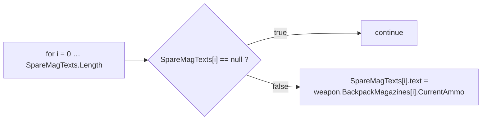
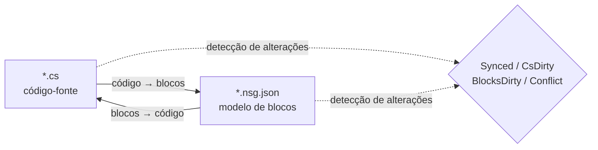

# NekoScriptGraph (NSG) — Implantação Rápida & Manual

**Versão** 1.0.2 · **Unity** 2022.3+ · **Autor** NekoAndreeva · **Licença** MIT · **Pacote** `com.nekoandreeva.nekoscriptgraph`

> Programação visual estilo Scratch para Unity que **nunca coloca nada no seu código.**
> O NSG escreve um arquivo de configuração de blocos *ao lado* de um script para torná-lo editável como blocos, e traduz em ambas as direções. O `.cs` gerado não contém qualquer vestígio do plugin — exclua a pasta do plugin e os seus scripts continuam a compilar.

---

## Sumário

**Parte A — Implantação Rápida**

1. [API global com um clique](#1-one-click-global-api)
2. [Seu primeiro programa em blocos](#2-your-first-block-program)
3. [O roteiro de integração de 10 minutos](#3-the-10-minute-onboarding-path)

**Parte B — Manual**

4. [Conceitos fundamentais](#4-core-concepts)
5. [Instalação e requisitos](#5-install--requirements)
6. [O Editor de Blocos](#6-the-block-editor)
7. [Referência de menus](#7-menu-reference)
8. [Blocos de API (imersão profunda)](#8-api-blocks-deep-dive)
9. [Idiomas e como adicionar um](#9-languages--adding-one)
10. [Sincronização, forma canônica e taxa de escape](#10-sync-canonical-form--escape-ratio)
11. [Saúde da arquitetura](#11-architecture-health)
12. [Localização](#12-localization)
13. [Agentes e MCP](#13-agents--mcp)
14. [Assistente GataPrograma (opcional)](#14-programneko-assistant-optional)
15. [Configurações](#15-settings)
16. [Estrutura de diretórios](#16-directory-layout)
17. [Desinstalação](#17-uninstall)
18. [Solução de problemas e perguntas frequentes](#18-troubleshooting--faq)
19. [Contacto](#19-contact)

**Apêndices**

- [A. Esquema de definição de blocos](#appendix-a-block-definition-schema)
- [B. Esquema de descritor de idioma](#appendix-b-language-descriptor-schema)
- [C. Chaves de configurações](#appendix-c-settings-keys)

---
---

# PARTE A — IMPLANTAÇÃO RÁPIDA

Vá de "pasta colocada em Assets" a "escrever código com blocos" em cerca de dez minutos, quase sem digitar.

<a id="1-one-click-global-api"></a>
## 1. API global com um clique

**A ideia:** o seu projeto já contém centenas de métodos. O NSG consegue lê-los e cunhar um **bloco de API** para cada um, de modo que todo método que você já escreveu se torne um bloco arrastável na paleta. O código novo passa então a ser escrito montando o vocabulário do *seu próprio* projeto.

### 1.1 Faça isto

1. Confirme que o plugin compilou (sem erros vermelhos no Console; Unity 2022.3+).
2. Menu: **`NekoScriptGraph ▸ Build API Library for Whole Project`** (Criar biblioteca de API de todo o projeto).
3. O NSG conta os arquivos-fonte que irá varrer e mostra uma caixa de diálogo de confirmação:

   > *Criar biblioteca de API de todo o projeto — N arquivos-fonte → `Assets/NekoScriptGraph/Blocks/API`. Continuar?*

4. Clique em **Continuar**. Num projeto grande, isso são milhares de blocos e leva um momento perceptível — o que é esperado, e é exatamente por isso que a contagem é mostrada primeiro.
5. Ao terminar, o Console registra um resumo e uma caixa de diálogo informa os totais:

   ```
   [NekoScriptGraph] API blocks: <generated> generated, <skipped> skipped.
   ```

6. A biblioteca de blocos é **recarregada automaticamente**. Nada mais a fazer — os novos blocos já estão ativos.

> **Âmbito.** A varredura cobre `Assets` para cada idioma registrado. C# usa `AssetDatabase` (`t:MonoScript`); C/C++/Rust/HLSL/etc. são percorridos no disco por extensão de arquivo. `Dependencies/` e `.checkpoints/` são sempre excluídos.

### 1.2 Apenas uma pasta em vez disso

Trabalhando num único subsistema? Selecione uma pasta na janela Project e use:

**`NekoScriptGraph ▸ Generate API Blocks for Selected Folder`** (Gerar blocos de API da pasta selecionada)

A mesma maquinaria, um raio de ação menor, muito mais rápido. Esta é a primeira execução recomendada — aponte para a pasta contra a qual você realmente quer programar.

### 1.3 O que você obtém

Um arquivo JSON por método elegível, gravado na pasta indicada em `apiOutputFolder` (padrão `Assets/NekoScriptGraph/Blocks/API`):

```
Blocks/API/api.DecalUtils.ProjectNormals.5.json
Blocks/API/api.DecalManager.GetSpawner.3.json
Blocks/API/api.GPUDecalUtils.UpdateDrawIndirectCommandBuffer.3.json
```

Esquema de nomes: `api.<Type>.<Method>.<arity>.json` — a **aridade** (número de parâmetros) faz parte do ID, para que as sobrecargas coexistam.

Na paleta, eles aparecem sob a categoria **API** (`cat.api`), **subagrupados pelo tipo declarante**:

| Grupo da paleta | Contém |
|---|---|
| `API` → `DecalUtils` | todos os métodos elegíveis de `DecalUtils` |
| `API` → `DecalManager` | todos os métodos elegíveis de `DecalManager` |
| `API` → *(funções livres)* | Funções de nível superior de C / HLSL |

Use a caixa de busca da paleta para encontrar um pelo nome instantaneamente.

<a id="14-the-eligibility-rule-know-this-before-you-wonder"></a>
### 1.4 A regra de elegibilidade (saiba isto antes de se perguntar)

Um **bloco de API só é gerado quando** o método é:

| Requisito | Porquê |
|---|---|
| `public` | É API pública |
| Sem genéricos (`<…>` no método ou no seu tipo de retorno) | Não há inferência de tipos em tempo de execução num bloco |
| Sem `async` | Não há agendador (scheduler) para aguardar |
| **Sem parâmetros `ref` / `out` / `in` / `params` / `this`** | Parâmetros de saída precisariam de conexões extras |
| **Sem valores padrão de parâmetro** (`=`) | Todas as conexões são obrigatórias |
| Sem restrições `where` | O mesmo que genéricos |
| Não ser um construtor | Não é uma chamada de método |

Tudo o que falhar nestes critérios é silenciosamente **ignorado** — essa contagem é o número de "ignorados" no resumo.

<a id="15-static-vs-instance--the-one-asymmetry"></a>
### 1.5 Estático vs instância — a única assimetria

Esta é a ressalva mais importante de todo o recurso de API:

| Tipo de método | Comportamento do bloco | Reversibilidade |
|---|---|---|
| **`static`** | Correspondido por alvo de chamada com pontos + aridade (`matchCall` + `matchArity`) | **Totalmente bidirecional** — código ⇄ blocos |
| **instância** | Recebe uma conexão `target` adicional à frente: `{0}.Method({1}, …)` | **Unidirecional** — imprime corretamente, mas na importação é relido como um bloco de chamada genérico |

> Regra geral: **APIs estáticas produzem blocos perfeitos.** Métodos de instância ainda dão uma chamada correta e autodocumentada, mas uma edição feita apenas em blocos de uma chamada de instância não fará o caminho de volta para um bloco especificamente reconhecível. Prefira pontos de entrada `static` para tudo o que pretende criar em blocos.

Funções livres (C, HLSL) não têm tipo proprietário e, por isso, são tratadas como estáticas — totalmente bidirecionais.

### 1.6 Disciplina de reconstrução

- **Execute novamente após refatorações.** Renomear um método deixa para trás um bloco de API obsoleto. Execute o gerador de novo e exclua os órfãos, ou simplesmente exclua `Blocks/API/` e regenere do zero.
- **A regeneração é idempotente.** Os IDs são determinísticos; as duplicatas são contadas como *ignoradas*, portanto reexecutar não vai encher a pasta.
- **É seguro fazer commit.** `Blocks/API/*.json` é dado, não código. Fazer commit significa que os colegas de equipe recebem o seu vocabulário de blocos sem precisar de varrer de novo.

---
---

<a id="2-your-first-block-program"></a>
## 2. Seu primeiro programa em blocos

Um passo a passo concreto, de ponta a ponta. Vamos reconstruir um pequeno trecho de lógica no estilo `CompassManager` — "imprimir a contagem do carregador, mostrando `--` para espaços vazios" — usando blocos de API.

### Passo 1 — Coloque um arquivo sob gestão

1. Selecione um arquivo `.cs` na janela Project.
2. **`NekoScriptGraph ▸ Take Selected Script Under Management`** (Assumir o script selecionado).

   Um arquivo aparece ao lado dele:

   ```
   Assets/Scripts/ChrControl/CompassManager.cs
   Assets/Scripts/ChrControl/CompassManager.nsg.json   ← the block model
   ```

   (O `.nsg.json` fica oculto na janela Project por padrão — isso é um recurso, não um erro. `Cmd/Ctrl+Shift+H` alterna a visibilidade.)

### Passo 2 — Abra o editor

**`NekoScriptGraph ▸ Open Block Editor`** (Abrir editor de blocos). O arquivo abre como uma aba.

### Passo 3 — Encontre os seus blocos

Olhe o painel à direita:

- **Busca da paleta** — digite `SpareMagTexts` ou `Count` para filtrar.
- O grupo **API** contém os blocos cunhados na Parte A.
- **Controle / Expressões / Variáveis / Estrutura** contêm os blocos da linguagem.

### Passo 4 — Monte

Arraste blocos para a tela. O laço clássico:



Toda conexão obrigatória deixada vazia é sinalizada pela **Saúde da arquitetura** como `danglingInput`.

### Passo 5 — Escreva de volta

Pressione **Generate** (ou use o botão de geração da barra de ferramentas). O NSG imprime o código-fonte e relata um dos seguintes:

| Status | Significado |
|---|---|
| `Synced` | Código e modelo de blocos concordam |
| `Code changed` | O `.cs` avançou — reimporte |
| `Blocks changed` | Os blocos avançaram — use Generate para gravá-los |
| `Conflict` | **Ambos** os lados mudaram — você escolhe qual vence |

### Passo 6 — Confirme que o código permaneceu limpo

Abra o `.cs`. É C# comum. Sem atributos, sem região gerada, sem referências ao plugin. É exatamente esse o ponto.

### Passo 7 — Faça commit

Faça commit tanto do `.cs` quanto do `.nsg.json`. O modelo de blocos é um recurso normal do projeto.

> **A primeira gravação reformata.** Se um método ainda não estava na forma canônica do NSG (chaves ausentes, indentação estranha, uma grafia equivalente mas diferente), a primeira passagem *blocos → código* o normaliza. A semântica não muda; a formatação, sim. Você é avisado com antecedência: *"N método(s) não estão em forma canônica…"*. Para evitar diffs inesperados, veja [§10](#10-sync-canonical-form--escape-ratio).

---

<a id="3-the-10-minute-onboarding-path"></a>
## 3. O roteiro de integração de 10 minutos

A lista de verificação condensada. Imprima-a e cole-a no monitor.

| # | Ação | Onde | ~Tempo |
|---|---|---|---|
| 1 | Solte o plugin em `Assets/` e deixe-o compilar | Unity | 1 min |
| 2 | Selecione uma pasta → **Generate API Blocks for Selected Folder** (Gerar blocos de API da pasta selecionada) | Menu | 1 min |
| 3 | **Take Selected Folder Under Management** (Assumir a pasta selecionada) | Menu | 1 min |
| 4 | **Open Block Editor** (Abrir editor de blocos) | Menu | 10 s |
| 5 | Busque na paleta um dos seus próprios métodos | Editor | 1 min |
| 6 | Arraste três blocos, conecte-os, deixe uma conexão vazia | Editor | 2 min |
| 7 | Abra **Saúde da arquitetura** e leia a constatação `danglingInput` | Menu | 1 min |
| 8 | Corrija arrastando um bloco para a conexão | Editor | 1 min |
| 9 | Pressione **Generate** e confirme que o status é `Synced` | Editor | 30 s |
| 10 | Abra o `.cs` — verifique que é C# limpo | Editor | 20 s |
| 11 | Faça commit de `.cs` + `.nsg.json` | Git | 30 s |
| 12 | *(Opcional)* **MCP Bridge: Start** e aponte o seu agente para `http://127.0.0.1:8765/` | Menu + cliente | 2 min |

**O modelo mental em uma linha:** o `.cs` é a fonte da verdade, o `.nsg.json` é uma *lente* sobre ele, e o NSG mantém a lente e a fonte em concordância.

---
---
# PARTE B — MANUAL

<a id="4-core-concepts"></a>
## 4. Conceitos fundamentais

### 4.1 Arquivos sob gestão vs arquivos livres

- **Arquivo livre** — um script comum, sem nenhum `.nsg.json` ao lado.
- **Arquivo sob gestão** — tem um `.nsg.json`; pode ser aberto como blocos.

### 4.2 Apenas corpos de métodos se tornam blocos

A regra mais importante do NSG:

- `using`, declarações de tipos, campos, atributos e comentários **fora dos corpos dos métodos** são preservados **literalmente** e sobrevivem intactos em ambas as direções.
- Os **corpos dos métodos** são analisados e convertidos em blocos.
- Tudo o que o modelo de blocos não consegue expressar é preservado como um **fragmento bruto** (raw snippet) e reportado como um diagnóstico (`NSG0002`). **Nada é jamais perdido silenciosamente.**

### 4.3 O modelo de sincronização bidirecional



| Estado | Significado |
|---|---|
| `Synced` | Código e modelo de blocos concordam |
| `CsDirty` | O `.cs` mudou; o modelo está atrás |
| `BlocksDirty` | Os blocos mudaram; o código ainda não foi reescrito |
| `Conflict` | Ambos os lados mudaram — você tem de escolher o vencedor |
| `Unmanaged` | Sem arquivo de blocos |

O NSG rastreia **que lado se moveu primeiro**, para que você saiba sempre se pressionar Generate destruiria o seu próprio trabalho.

> O caminho MCP/agente é deliberadamente **unidirecional: código → blocos**. O agente escreve código-fonte comum; o plugin volta a analisá-lo e reconstrói o modelo.

---

<a id="5-install--requirements"></a>
## 5. Instalação e requisitos

1. Unity **2022.3** ou mais recente.
2. Coloque a pasta `NekoScriptGraph` em `Assets/` (ou adicione-a como pacote local).
3. O pacote inteiro é delimitado por uma **definição de assembly apenas para Editor** — não contribui com **nada** para uma build de jogador.

### Partes opcionais (cada uma é removível como uma unidade)

| Pasta | Finalidade | Se removida |
|---|---|---|
| `Dependencies/` | Sprites arredondados 9-slice | Recorre a cantos arredondados simples; pacote ~3,3 MB |
| `LanguageSupport/{c,cpp,go,hlsl,java,python,rust,swift}` | Idiomas diferentes de C# | Esse idioma desaparece; nada mais se quebra |
| `ProgramNeko/` | Assistente gato em pixel art | O plugin funciona bem sem ela |
| `Locale/*` | Traduções da interface | Esse idioma recorre ao inglês |

### Tamanho do pacote

≈ **4,2 MB** conforme distribuído:

| Parte | Tamanho |
|---|---|
| `Editor/` — núcleo, interface, motor C#, configurações | ~1,4 MB |
| `Dependencies/Editor/Sprite/` — sprites 9-slice opcionais | ~0,86 MB |
| `Documents/` — este guia em 15 idiomas | ~0,7 MB |
| `Locale/` — 15 idiomas de interface | ~0,7 MB |
| `LanguageSupport/` — oito idiomas prontos a usar | ~0,24 MB |
| `Blocks/` — biblioteca de blocos integrada (regenerada sob demanda) | ~0,23 MB |
| `Extensions~/` — modelo de motor externo instalável | ~0,04 MB |

---

<a id="6-the-block-editor"></a>
## 6. O Editor de Blocos

Uma janela multi-abas estilo VS Code, mínimo 980×600.

| Região | Conteúdo |
|---|---|
| Barra de abas | Vários documentos abertos ao mesmo tempo |
| Tela | O script como blocos — arrastar, conectar, recolher, ampliar, ajustar |
| Painel direito | Paleta de blocos + busca + predefinições; a largura é memorizada |
| Canto inferior esquerdo | Texto de estado, desfazer/refazer, espaço do assistente (só se instalado) |
| Linha de ferramentas | Recarregar biblioteca, Problemas, Saúde, Checkpoints, Git, Sprites |

### 6.1 Dois modos de visualização

| Visualização | Estilo | Melhor para |
|---|---|---|
| **Pilha (Scratch)** | Empilhamento vertical de instruções | Ensino, lógica linear |
| **Blueprint (UE)** | Grafo de nós | Fluxo de dados e cadeias de expressões |

Alterne com o menu suspenso **Visualização** (`view.stack` / `view.blueprint`).

### 6.2 A paleta

- Agrupada por `categoryKey`, recolhível como um todo (`Collapse all` / `Expand all`).
- Os índices alfabéticos começam recolhidos; expanda manualmente.
- O campo de busca fica **fora** da lista de blocos de propósito — a lista é reconstruída a cada tecla digitada e, caso contrário, perderia o foco.
- Você pode arrastar uma **predefinição** inteira para a tela, não apenas um bloco.

**Categorias integradas:**

| Chave | Rótulo | Conteúdo |
|---|---|---|
| `cat.ctrl` | Controle | `if`, `for`, `foreach`, `while`, `break`, `continue`, `return` |
| `cat.expr` | Expressões | binary, unary, call, cast, conditional, ident, index, literal, member, new, postfix |
| `cat.var` | Variáveis | locais & atribuição |
| `cat.frame` | Estrutura | declarações |
| `cat.api` | API | blocos de API gerados (agrupados por tipo) |
| `cat.macro` | Meus blocos | predefinições do usuário |
| `cat.raw` | Escape | fragmentos brutos |

### 6.3 Checkpoints

As capturas integradas vivem em `.checkpoints/`, que é **ignorado pelo git** — nunca pode entrar em conflito com o histórico do seu repositório. Tire uma antes de uma grande gravação *blocos → código*.

### 6.4 Ocultar arquivos de blocos

`hideBlockFiles` é `true` por padrão, para que a janela Project não fique inundada de `.nsg.json`.

- Menu: **`Toggle Block Files Visibility`** — atalho global `Cmd/Ctrl+Shift+H`.
- O atalho é global: funciona mesmo com a janela do plugin fechada.

### 6.5 Explicar o bloco selecionado

`Cmd/Ctrl+Shift+E` (menu **`Explain Selected Block`**) pede ao assistente que explique o bloco atual. Também é um atalho global.

---

<a id="7-menu-reference"></a>
## 7. Referência de menus

> As legendas de `[MenuItem]` são constantes de tempo de compilação, portanto o nome **estático em inglês** é o que a Unity distribui; a camada de localização substitui os rótulos traduzidos ao carregar e ao mudar de idioma. As entradas de `MCP Bridge` são intencionalmente em inglês.

| Item de menu | Finalidade |
|---|---|
| `Open Block Editor` (Abrir editor de blocos) | Abrir a janela principal |
| `Problems` (Problemas) | Lista de diagnósticos |
| `Assistant (ProgramNeko)` | Abrir o assistente; avisa se não estiver instalado |
| `Explain Selected Block` `%#e` | Explicar o bloco selecionado |
| `Architecture Health` (Saúde da arquitetura) | Abrir a janela de saúde |
| `Take Selected Script Under Management` (Assumir o script selecionado) | Gerir um arquivo |
| `Release Selected Script` (Libertar o script selecionado) | Deixar de gerir um arquivo |
| `Take Selected Folder Under Management` (Assumir a pasta selecionada) | Gerir em massa |
| `Take Whole Project Under Management` (Assumir o projeto inteiro) | Gerir tudo |
| `Release Selected Folder` (Libertar a pasta selecionada) | Libertar em massa |
| `Release Whole Project` (Libertar o projeto inteiro) | Libertar tudo |
| `Generate API Blocks for Selected Folder` (Gerar blocos de API da pasta selecionada) | Cunhagem de API limitada à pasta |
| `Build API Library for Whole Project` (Criar biblioteca de API de todo o projeto) | API global com um clique (Parte A) |
| `Reload Block Library` (Recarregar biblioteca de blocos) | Releia `Blocks/` |
| `Export Default Block Library` (Exportar biblioteca padrão) | Escrever os blocos integrados em `Blocks/` |
| `Generate ShaderLab Shell` (Gerar invólucro ShaderLab) | Emitir a estrutura externa do shader |
| `Self Test: Round Trip` (Autoteste: ida e volta) | Autoverificação de consistência de ida e volta |
| `Toggle Block Files Visibility` `%#h` | Mostrar/ocultar `.nsg.json` |
| `Languages: Show Loaded` (Idiomas: mostrar carregados) | Despejar o registro de idiomas |
| `MCP Bridge: Start` / `Stop` / `Copy Client URL` | A ponte MCP |

---

<a id="8-api-blocks-deep-dive"></a>
## 8. Blocos de API (imersão profunda)

A Parte A cobriu o fluxo de trabalho. Isto é a maquinaria.

### 8.1 O que o gerador emite

Para cada método elegível, um `NsgBlockDef`:

```jsonc
// Blocks/API/api.DecalUtils.ProjectNormals.5.json
{
  "id": "api.DecalUtils.ProjectNormals.5",
  "level": "high",
  "shape": "expression",                 // "statement" if return type is void
  "category": "DecalUtils",              // declaring type → palette sub-group
  "categoryKey": "cat.api",              // the "API" group
  "label": "DecalUtils.ProjectNormals({0}, {1}, {2}, {3}, {4})",
  "labelEn": "DecalUtils.ProjectNormals({0}, {1}, {2}, {3}, {4})",
  "labelRu": "DecalUtils.ProjectNormals({0}, {1}, {2}, {3}, {4})",
  "sockets": [
    { "name": "decalPosW", "kind": "expr", "required": true, "variadic": false, "choices": [] },
    { "name": "parents",   "kind": "expr", "required": true, "variadic": false, "choices": [] },
    { "name": "decalNorm", "kind": "expr", "required": true, "variadic": false, "choices": [] },
    { "name": "decalTform","kind": "expr", "required": true, "variadic": false, "choices": [] },
    { "name": "decalColor","kind": "expr", "required": true, "variadic": false, "choices": [] }
  ],
  "emit": "",
  "node": "call",
  "op": "",
  "color": "",
  "matchCall": "DecalUtils.ProjectNormals",  // dotted match target
  "matchArity": 5,                           // parameter count
  "builtin": true,
  "manual": "DecalUtils.ProjectNormals(decalPosW, parents, decalNorm, decalTform, decalColor) : Color[]",
  "variantGroup": "",
  "variantLabel": ""
}
```

Notas:

- **Os nomes das conexões** são os nomes reais dos parâmetros — o rótulo da paleta é, portanto, autodocumentado.
- **`manual`** carrega a assinatura completa qualificada mais o tipo de retorno. É a *válvula de escape*: a forma manual do bloco.
- **Métodos de instância** recebem uma conexão adicional à frente chamada `target` (obrigatória), e o rótulo passa a ser `{0}.Method({1}, …)` — daí a ressalva de unidirecionalidade no §1.5.
- **Funções livres** (C/HLSL) não têm proprietário e são tratadas como `static`.

### 8.2 Determinismo e desduplicação

- O ID é `api.<QualifiedType>.<Method>.<arity>` — determinístico entre execuções.
- IDs duplicados são contados como **ignorados**, nunca gravados duas vezes.
- Reexecutar após refatorações **não** removerá os órfãos. Exclua `Blocks/API/` e regenere para começar do zero.

### 8.3 Múltiplos idiomas

`Build API Library for Whole Project` itera o registro de idiomas e chama o `GenerateApiBlocks` de cada motor. C# passa pelo `AssetDatabase`; idiomas do tipo C percorrem o sistema de arquivos pela extensão do perfil, ignorando `.checkpoints/` e `Dependencies/`. Se um motor de idioma não conseguir ser construído, esse idioma é contado como falho e os restantes continuam.

### 8.4 Orientação prática

| Situação | Conselho |
|---|---|
| Você quer blocos para um subsistema | Use a variante de **pasta**, não a de projeto |
| Você quer blocos bidirecionais | Exponha um ponto de entrada **`static`** |
| Você tem APIs com `ref`/`out`/`params` | Elas serão ignoradas — envolva-as num método estático simples se quiser blocos |
| Sobrecargas colidem na paleta | A **aridade** está no ID e as conexões desambiguam; busque pelo nome |
| Você renomeou um método | Regenere; exclua o JSON órfão |

---

<a id="9-languages--adding-one"></a>
## 9. Idiomas e como adicionar um

`C` · `C++` · `C#` · `Go` · `HLSL` · `Java` · `Rust` · `Python` · `Swift`

- Todos traduzem **nos dois sentidos**.
- **C# é integrado** (`Editor/Languages/CSharp/`: Lexer, Parser, Printer, Splitter, CodeMap).
- Os outros são **pastas prontas a usar**. Exclua `LanguageSupport/<lang>/` e esse idioma desaparece do plugin sem quebrar nada mais.

### Adicionar um idioma

Crie uma pasta com um descritor mais um motor:

```jsonc
// LanguageSupport/python/python.language.json
{
  "apiVersion": 1,
  "id": "python",
  "displayName": "Python",
  "icon": "PYTHON",
  "extensions": [".py"],
  "blocksFolder": "blocks",
  "engineType": "NekoScriptGraph.Nsg_PythonLanguage",
  "author": "",
  "note": "Self-contained language: its own engine, sharing only the block skeleton."
}
```

Depois implemente a classe indicada por `engineType` (análise, impressão, geração de blocos de API) e adicione a pasta `blocks/` do idioma. Use `Nsg_PythonLanguage`, `Nsg_CLanguage`, `Nsg_RustLanguage` etc. como implementações de referência.

---

<a id="10-sync-canonical-form--escape-ratio"></a>
## 10. Sincronização, forma canônica e taxa de escape

### 10.1 Taxa de escape

A parcela de blocos de **fragmento bruto**. Mede quanto do código é genuinamente modelado como blocos.

- Controle-a com `maxEscapeRatio: 0` (MCP) para exigir uma tradução *completa* em blocos.
- Tudo o que o analisador não consegue modelar é preservado literalmente e reportado como **`NSG0002`**.

### 10.2 Forma canônica

Código que tem uma única "grafia padrão". A primeira passagem *blocos → código* normaliza:

- chaves ausentes,
- indentação inconsistente,
- grafias equivalentes mas diferentes.

O aviso visível ao usuário:

> *"N método(s) não estão em forma canônica (chaves ausentes, indentação inconsistente ou várias grafias equivalentes). A primeira passagem blocos → código irá normalizá-los — a semântica não muda, a formatação sim."*

### 10.3 O ponto fixo

Itere até `canon(text) == text`. Quando o texto é um ponto fixo, o documento permanece `Synced` e nunca mais é reformatado. É exatamente isto que o laço do agente no §13 faz antes de gravar no disco.

---

<a id="11-architecture-health"></a>
## 11. Saúde da arquitetura

Menu **`Architecture Health`** — com um script selecionado, analisa esse arquivo; caso contrário, abre vazio.

**Métricas:** contagem de blocos/instruções, contagem de métodos, taxa de escape (`escapes`) e uma `score` composta.

**Verificações:**

| Chave | Significado |
|---|---|
| `emptyBody` / `emptyMethod` | Corpo vazio / método vazio |
| `constantCondition` | Condição sempre verdadeira ou sempre falsa |
| `cycle` | Ciclo de chamadas ou dependências |
| `danglingInput` | Conexão obrigatória deixada sem ligação |
| `duplicate` | Código duplicado |
| `escapeRatio` | Taxa elevada de fragmentos brutos |
| `expressionSize` | Expressão demasiado grande |
| `nesting` | Aninhamento excessivo |
| `methodLength` | Método demasiado longo |
| `memberChain` | Cadeia de acessos longa (`a.b.c.d.e`) |
| `magicNumber` | Número mágico |
| `placeholderName` / `shortName` | Nomes de espaço reservado / demasiado curtos |
| `unusedLocal` | Variável local não utilizada |
| `afterReturn` | Código após `return` |
| `leak` | Suspeita de vazamento |

**Ações de correção:** `fixBreakLink`, `fixFillZero`, `fixAddRelease`, `fixApply`, `rerun`.

---

<a id="12-localization"></a>
## 12. Localização

**15 idiomas de interface:**

Chinês simplificado · Chinês tradicional · Inglês · Francês · Alemão · **Italiano** · Russo · Espanhol · Português · Japonês · Coreano · Polaco · Turco · Árabe · Hebraico

- **O árabe e o hebraico espelham todo o editor**: a paleta passa para a esquerda e os blocos crescem para a esquerda (RTL).
- A própria barra de menus da Unity permanece em inglês **por opção de design**.
- As cadeias de texto vivem em `Locale/<code>/strings.json`, seccionadas por chave (`ui`, `blocks`, …). O vocabulário de blocos usa a secção `blocks`, por exemplo `c.assert` → `assert {0}`.

---

<a id="13-agents--mcp"></a>
## 13. Agentes e MCP

O NSG inclui um **servidor MCP que corre dentro do Unity Editor**: JSON-RPC 2.0 sobre o transporte **Streamable HTTP** do MCP. **Não há processo auxiliar nem runtime extra — sem Node, sem Python. O Editor *é* o servidor.**

```
MCP client ──HTTP POST JSON-RPC──▶ 127.0.0.1:8765 ──▶ Unity Editor
```

### 13.1 Iniciar

Menu **`NekoScriptGraph ▸ MCP Bridge: Start`**:

```
[NekoScriptGraph] MCP bridge listening on http://127.0.0.1:8765/
```

- Lembra-se de que estava ligado e **reinicia automaticamente** após uma recarga de domínio ou reinício do Editor.
- Pare com **`MCP Bridge: Stop`**; copie o URL com **`MCP Bridge: Copy Client URL`**.
- Verifique manualmente — não precisa de cliente:

```bash
curl -s http://127.0.0.1:8765/ -d '{"jsonrpc":"2.0","id":1,"method":"tools/list"}'
```

Um simples `GET /` devolve uma página de estado que lista a versão do servidor, as revisões de protocolo suportadas e as ferramentas disponíveis.

### 13.2 Aponte o seu cliente para ele

Qualquer cliente MCP Streamable HTTP funciona. A forma da configuração varia ligeiramente (`type` em alguns, `transport` noutros, um simples `url` em poucos):

```json
{
  "mcpServers": {
    "nekoscriptgraph": {
      "type": "http",
      "url": "http://127.0.0.1:8765/"
    }
  }
}
```

O VS Code usa `servers` em vez de `mcpServers`; fora isso, a entrada é a mesma.

Se o seu cliente só fala **stdio**, ponha à frente um proxy HTTP↔stdio (por exemplo `npx mcp-remote http://127.0.0.1:8765/`). Esse proxy é assunto do cliente, não do plugin.

> O transporte legado HTTP+SSE (`GET /sse`) **não** está implementado. A ponte serve Streamable HTTP, revisão de protocolo `2025-03-26` e mais recentes, e também aceita clientes `2024-11-05` que façam POST para o mesmo URL.

### 13.3 As sete ferramentas

| Ferramenta | Escreve? | O que faz |
|---|---|---|
| `nsg_writing_spec` | não | O subconjunto canônico de escrita para um idioma, gerado a partir da biblioteca de blocos e da impressora |
| `nsg_verify` | não | Estado de um arquivo no disco: `Synced`, `CsDirty`, `BlocksDirty`, `Conflict`, `Unmanaged` |
| `nsg_plan` | não | Analisa código candidato, reporta diagnósticos, contagens de blocos, taxa de escape, canônico? |
| `nsg_canon` | não | Texto canônico — o oráculo de ponto fixo |
| `nsg_apply` | **sim** | Reconstrói o `.nsg.json` e escreve o código-fonte canônico |
| `nsg_list_managed` | não | Todos os `.nsg.json` sob uma pasta |
| `nsg_release` | **sim** | Exclui esses arquivos `.nsg.json` (desinstalação limpa) |

### 13.4 O laço pretendido — código → blocos

1. `nsg_writing_spec` uma vez, para aprender o subconjunto do idioma.
2. Edite o `.cs` (ou apenas mantenha o texto na conversa).
3. `nsg_plan` — diagnósticos, contagens de blocos, taxa de escape. **Não escreve nada, não precisa de compilar**, por isso é seguro em código que ainda não compila.
4. Se `canonical` for falso, chame `nsg_canon` e itere até `canon(text) == text`. Esse é o ponto fixo: uma vez lá, o documento permanece `Synced` e nada é reformatado mais tarde.
5. `nsg_apply` — escreve o `.cs` canônico e o `.nsg.json` reconstruído.

Controle a taxa de escape com `maxEscapeRatio: 0` para exigir uma tradução completa em blocos.

```json
{"jsonrpc":"2.0","id":1,"method":"tools/call","params":{
  "name":"nsg_plan",
  "arguments":{"file":"Assets/Scripts/CompassManager.cs","maxEscapeRatio":0.0}}}
```

`nsg_plan`, `nsg_canon` e `nsg_apply` também aceitam `source`, para que o agente possa validar texto antes que ele chegue ao disco:

```json
{"jsonrpc":"2.0","id":2,"method":"tools/call","params":{
  "name":"nsg_canon",
  "arguments":{"file":"Assets/Scripts/Foo.cs","source":"class Foo { void A(){ } }"}}}
```

### 13.5 Segurança

A ponte escreve arquivos no seu projeto, por isso é deliberadamente restrita:

- Liga-se **apenas a `127.0.0.1`** — nunca a uma interface encaminhável.
- Pedidos que carreguem um cabeçalho **`Origin`** são recusados com **`403`**. Os navegadores enviam sempre `Origin`; os clientes MCP nativos nunca o fazem — portanto **nenhuma página aberta no seu navegador consegue alcançar a ponte**. Se realmente precisar de um cliente de navegador, relaxe isso com `Nsg_McpBridge.SetAllowOrigin(true)`.
- O servidor fica **desligado até você iniciá-lo** e para ao sair.

### 13.6 Solução de problemas

| Sintoma | Causa / correção |
|---|---|
| O Editor não respondeu a tempo | A ponte encaminha cada chamada para a thread principal, e a Unity não executa `EditorApplication.update` durante a compilação ou a recarga de domínio. Os pedidos enviados durante uma recompilação esperam e depois falham após **60 segundos**. Basta tentar de novo |
| Porta já em uso | Outro processo ocupa a `8765`. Altere com `Nsg_McpBridge.SetPort(n)`, ou feche o outro ouvinte |
| As ferramentas não estão lá | Verifique se o plugin compilou — `Nsg_Json`, `Nsg_Mcp` e `Nsg_McpBridge` são scripts de Editor comuns que não precisam de configuração. `GET /` lista as ferramentas oferecidas no momento |

### 13.7 Usar sem MCP

A ponte é um ponto de extremidade JSON-RPC comum; as mesmas operações estão disponíveis sem qualquer protocolo:

- **Headless / CI**

```bash
Unity -batchmode -quit -projectPath <project> \
      -executeMethod NekoScriptGraph.Nsg_AgentCli.Main \
      -nsgRequest req.json -nsgResponse resp.json
```

- **No código** — `Nsg_AgentApi.Run(request)`, mais `Nsg_Mcp.Handle(jsonString)` apenas para a camada de protocolo.

---

<a id="14-programneko-assistant-optional"></a>
## 14. Assistente GataPrograma (opcional)

`ProgramNeko/` é um assistente gato em pixel art opcional. **Exclua a pasta inteira e o plugin continua a funcionar.**

- O menu **`Assistant (ProgramNeko)`** abre-o. É a *mesma* janela que a de Problemas: sem ela é apenas uma lista de erros; com ela, a gata senta-se em cima e fala em baixo.
- `Cmd/Ctrl+Shift+E` pede-lhe que explique o bloco selecionado.
- Ela tem a sua própria localização: `ProgramNeko/Locale/<code>/neko.json` (15 idiomas).
- Manifesto: `ProgramNeko/programneko.json`.

---

<a id="15-settings"></a>
## 15. Configurações

`Assets/NekoScriptGraph/NekoScriptGraph.settings.json`:

```jsonc
{
  "viewMode": 0,                        // 0 = Stack (Scratch), 1 = Blueprint (UE)
  "hideBlockFiles": true,               // hide .nsg.json by default
  "useSprites": false,                  // 9-slice sprites
  "headerSprite": "block_header",
  "bodySprite": "block_body",
  "footerSprite": "block_footer",
  "exprSprite": "block_expr",
  "bodyIndent": 14,                     // body indent
  "cornerRadius": 6,
  "footerHeight": 10,
  "rightPaneWidth": 240.0,              // remembered after you drag it
  "presetPaneHeight": 200.0,
  "shaderPipeline": "auto",             // auto / ...
  "apiOutputFolder": "Assets/NekoScriptGraph/Blocks/API"
}
```

As predefinições (pacotes de arrastar com vários blocos) vivem em `.presets/presets.json`, `schemaVersion: 1`, e cada entrada registra `name`, `createdAt`, `blockCount`, `languageId` e um array `nodes`.

---

<a id="16-directory-layout"></a>
## 16. Estrutura de diretórios

```
NekoScriptGraph/
├─ Editor/
│  ├─ Core/                      engine core
│  │  ├─ Esketamine/             AST, parse/print, block library, diagnostics,
│  │  │                          settings, MCP, agent API, L10n, undo, checkpoints
│  │  └─ cstyle/                 C-style engine, shader pipeline, agent spec
│  ├─ Languages/CSharp/          lexer / parser / printer / splitter / code map
│  ├─ UI/                        main window, block view, blueprint view, health,
│  │                             error window, RTL, picker, name dialog
│  ├─ Nsg_Menu.cs                menu items
│  ├─ Nsg_McpBridge.cs           MCP HTTP bridge
│  ├─ Nsg_AgentCli.cs            headless CLI
│  └─ Nsg_SelfTest.cs            round-trip self test
├─ Blocks/                       built-in block library + API/*.json
├─ LanguageSupport/{c,cpp,go,hlsl,java,python,rust,swift}/
├─ Locale/{15 locales}/strings.json
├─ Dependencies/Editor/Sprite/   optional 9-slice sprites
├─ ProgramNeko/                  optional assistant
├─ .presets/presets.json
├─ NekoScriptGraph.settings.json
├─ MCP.md                        dedicated MCP chapter
└─ package.json                  com.nekoandreeva.nekoscriptgraph v1.0.2
```

---

<a id="17-uninstall"></a>
## 17. Desinstalação

Não invasiva, com dois caminhos:

1. **Menu** — `Release Selected Script` / `Release Selected Folder` / `Release Whole Project`, ou os botões da interface **Release** / **Release All** / **Release Folder**.
2. Exclua todos os arquivos `.nsg.json` sob a pasta escolhida ou o projeto inteiro.

**Os arquivos-fonte nunca são tocados.** Depois disso, a única coisa que resta é a própria pasta do plugin — exclua-a e está feito.

---

<a id="18-troubleshooting--faq"></a>
## 18. Solução de problemas e perguntas frequentes

**O `.cs` gerado contém vestígios do plugin?**
Não. Exclua a pasta do plugin e o script continua a compilar.

**Porque é que `using`, campos ou atributos não se tornam blocos?**
Por opção de design. Apenas os corpos dos métodos participam na tradução em blocos; tudo o resto é preservado literalmente em ambas as direções.

**Porque é que o meu arquivo foi reformatado?**
Não estava em forma canônica. A primeira passagem *blocos → código* normaliza chaves e indentação; a semântica não muda. Itere com `nsg_canon` até um ponto fixo primeiro se quiser zero alterações de formatação.

**Algumas instruções tornaram-se "fragmentos brutos" — porquê?**
Estão fora do subconjunto gravável para esse idioma. O NSG preserva-as literalmente e reporta `NSG0002` em vez de as descartar. Use `maxEscapeRatio` para transformar isso num bloqueio rígido.

**Porque é que os itens de menu `MCP Bridge` estão em inglês?**
Intencional — a barra de menus da Unity não participa na localização do plugin, e misturar entradas traduzidas e não traduzidas é pior.

**Posso gerir apenas uma pasta?**
Sim: **`Take Selected Folder Under Management`** (Assumir a pasta selecionada).

**Demasiados arquivos de blocos a atulhar a janela Project?**
Estão ocultos por padrão; alterne com `Cmd/Ctrl+Shift+H`.

**Os meus blocos de API ficaram obsoletos depois de uma renomeação.**
A regeneração não remove os órfãos. Exclua `Blocks/API/` e regenere.

**Falta um bloco de API que eu esperava.**
O método falhou a elegibilidade — mais comummente `ref`/`out`/`params`, um valor padrão de parâmetro, um genérico ou `async`. Veja [§1.4](#14-the-eligibility-rule-know-this-before-you-wonder).

**Um bloco de API de método de instância não faz ida e volta.**
Esperado. Apenas os métodos `static` são totalmente bidirecionais; os métodos de instância carregam uma conexão `target` e são unidirecionais. Veja [§1.5](#15-static-vs-instance--the-one-asymmetry).

---

<a id="19-contact"></a>
## 19. Contacto

Autor: **NekoAndreeva**

- Email: elenaandreevasvinolup@gmail.com
- WhatsApp: +852 5247 4163
- GitHub: `https://github.com/elenaandreevasvinolup-alt`

---
---
<a id="appendix-a-block-definition-schema"></a>
## Apêndice A. Esquema de definição de blocos

`Blocks/<id>.json` — um arquivo por bloco.

| Campo | Tipo | Notas |
|---|---|---|
| `id` | string | Único, também a identidade na paleta; `api.<Type>.<Method>.<arity>` para blocos gerados |
| `level` | string | `high` (nível de instrução) / outro |
| `shape` | string | `control` · `statement` · `expression` |
| `category` | string | Grupo de exibição; para blocos de API é o tipo declarante |
| `categoryKey` | string | Chave de localização do grupo: `cat.ctrl`, `cat.expr`, `cat.var`, `cat.frame`, `cat.api`, `cat.macro`, `cat.raw` |
| `label` | string | Rótulo da paleta com espaços `{0}`, `{1}`… |
| `labelEn` / `labelRu` | string | Rótulos por idioma |
| `sockets` | array | `{ name, kind, required, variadic, choices[] }` |
| `emit` | string | Modelo de emissão personalizado (vazio = padrão do motor) |
| `node` | string | Nó da AST para o qual mapeia: `if`, `call`, `binary`, … |
| `op` | string | Operador, quando relevante |
| `color` | string | Substituição opcional |
| `matchCall` | string | Alvo de chamada com pontos a reconhecer na importação |
| `matchArity` | int | Número de parâmetros a corresponder (`-1` = qualquer) |
| `builtin` | bool | Distribuído com o plugin |
| `manual` | string | Forma/signatura manual completa, usada na entrada manual do bloco |
| `variantGroup` / `variantLabel` | string | Agrupamento de variantes |

**Blocos integrados de instrução/expressão:** `stmt.if`, `stmt.for`, `stmt.foreach`, `stmt.while`, `stmt.break`, `stmt.continue`, `stmt.return`, `stmt.localDecl`, `stmt.assign`, `stmt.expr`, `stmt.add`, `stmt.sub`, `stmt.mul`, `stmt.div`, `stmt.mod`, `stmt.raw`, e as expressões `expr.binary`, `expr.unary`, `expr.call`, `expr.cast`, `expr.conditional`, `expr.ident`, `expr.index`, `expr.literal`, `expr.member`, `expr.new`, `expr.postfix`, `expr.raw`.

<a id="appendix-b-language-descriptor-schema"></a>
## Apêndice B. Esquema de descritor de idioma

`LanguageSupport/<id>/<id>.language.json`:

| Campo | Tipo | Notas |
|---|---|---|
| `apiVersion` | int | Atualmente `1` |
| `id` | string | `c`, `cpp`, `csharp`, `hlsl`, `java`, `python`, `rust` |
| `displayName` | string | Mostrado na interface |
| `icon` | string | Texto do distintivo, por exemplo `PYTHON` |
| `extensions` | string[] | por exemplo `[".py"]` |
| `blocksFolder` | string | Pasta relativa de blocos, por exemplo `blocks` |
| `engineType` | string | Classe de motor totalmente qualificada, por exemplo `NekoScriptGraph.Nsg_PythonLanguage` |
| `author` | string | Opcional |
| `note` | string | Descrição opcional |

<a id="appendix-c-settings-keys"></a>
## Apêndice C. Chaves de configurações

Veja [§15](#15-settings). As únicas chaves que você provavelmente irá alterar: `viewMode`, `hideBlockFiles`, `useSprites`, `apiOutputFolder`, `shaderPipeline`.

---

# Exportar este documento para PDF

Neste momento não há `pandoc`, `node` nem `npx` instalados nesta máquina. Opções:

**A. Integrado no macOS (zero instalação, o mais rápido)**
Salve o Markdown, converta-o em HTML (pré-visualização de Markdown do VS Code, ou Typora), abra-o no Safari e depois **File ▸ Print… (⌘P) ▸ PDF ▸ Save as PDF**.

**B. Homebrew + pandoc (melhor tipografia)**

```bash
brew install pandoc
brew install --cask basictex        # or mactex-no-gui
pandoc GUIDE.md -o NSG-GUIDE.pdf \
  --pdf-engine=xelatex \
  -V mainfont="Helvetica Neue" \
  -V monofont="Menlo" \
  -V geometry:margin=2cm \
  --toc --toc-depth=2 -N
```

**C. Extensão do VS Code**
Instale `Markdown PDF` (yzane) ou `Markdown Preview Enhanced`, depois clique com o botão direito no arquivo → **Markdown PDF: Export (pdf)**.
