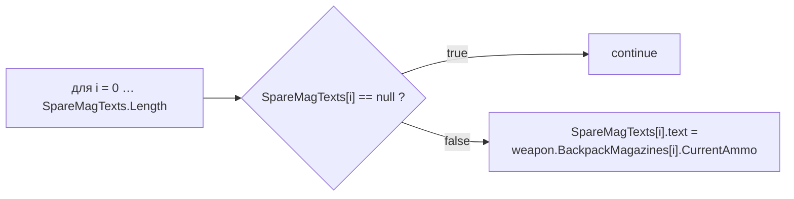
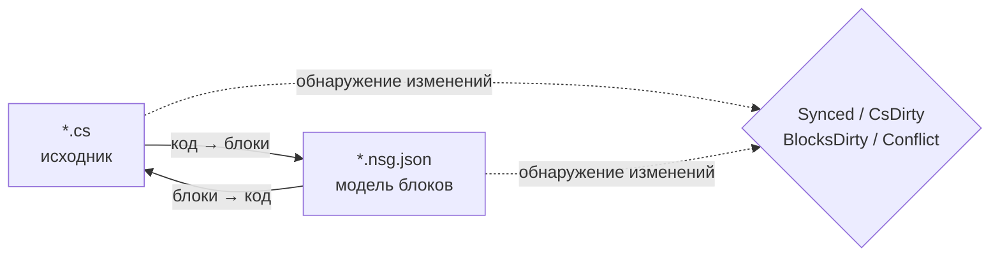

# NekoScriptGraph (NSG) — Быстрое развёртывание и справочник

**Версия** 1.0.1 · **Unity** 2022.3+ · **Автор** NekoAndreeva · **Лицензия** MIT · **Пакет** `com.nekoandreeva.nekoscriptgraph`

> Визуальное программирование для Unity в стиле Scratch, которое **никогда ничего не добавляет в ваш код.**
> NSG записывает файл конфигурации блоков *рядом* со скриптом, чтобы его можно было редактировать как блоки, и переводит в обоих направлениях. В сгенерированном `.cs` нет ни следа плагина — удалите папку плагина, и ваши скрипты по-прежнему компилируются.

---

## Table of Contents

**Часть A — Быстрое развёртывание**

1. [Глобальный API в один клик](#1-one-click-global-api)
2. [Ваша первая программа из блоков](#2-your-first-block-program)
3. [Путь знакомства за 10 минут](#3-the-10-minute-onboarding-path)

**Часть B — Справочник**

4. [Базовые понятия](#4-core-concepts)
5. [Установка и требования](#5-install--requirements)
6. [Редактор блоков](#6-the-block-editor)
7. [Справочник меню](#7-menu-reference)
8. [API-блоки (подробно)](#8-api-blocks-deep-dive)
9. [Языки и добавление нового](#9-languages--adding-one)
10. [Синхронизация, каноническая форма и доля обходных блоков](#10-sync-canonical-form--escape-ratio)
11. [Архитектурная гигиена](#11-architecture-health)
12. [Локализация](#12-localization)
13. [Агенты и MCP](#13-agents--mcp)
14. [Ассистент ProgramNeko (необязательно)](#14-programneko-assistant-optional)
15. [Настройки](#15-settings)
16. [Структура каталогов](#16-directory-layout)
17. [Удаление](#17-uninstall)
18. [Устранение неполадок и FAQ](#18-troubleshooting--faq)
19. [Контакты](#19-contact)

**Приложения**

- [A. Схема определения блока](#appendix-a-block-definition-schema)
- [B. Схема дескриптора языка](#appendix-b-language-descriptor-schema)
- [C. Ключи настроек](#appendix-c-settings-keys)

---
---

# ЧАСТЬ A — БЫСТРОЕ РАЗВЁРТЫВАНИЕ

От «папка скопирована в Assets» до «пишем код блоками» примерно за десять минут, почти без набора текста.

<a id="1-one-click-global-api"></a>
## 1. Глобальный API в один клик

**Идея:** в вашем проекте уже сотни методов. NSG умеет читать их и создавать по **API-блоку** на каждый, так что каждый уже написанный вами метод становится блоком в палитре, который можно перетаскивать. Новый код затем пишется сборкой из словаря *вашего собственного* проекта.

### 1.1 Как это сделать

1. Убедитесь, что плагин скомпилировался (в Console нет красных ошибок; Unity 2022.3+).
2. Меню: **`NekoScriptGraph ▸ Build API Library for Whole Project`**.
3. NSG подсчитывает исходные файлы, которые будет сканировать, и показывает диалог подтверждения:

   > *Собрать API-библиотеку для всего проекта — исходных файлов: N → `Assets/NekoScriptGraph/Blocks/API`. Продолжить?*

4. Нажмите **Continue**. В большом проекте это тысячи блоков и заметное время — так и задумано, поэтому сначала показывается количество.
5. По завершении Console выводит сводку, а диалог сообщает итоги:

   ```
   [NekoScriptGraph] API blocks: <generated> generated, <skipped> skipped.
   ```

6. Библиотека блоков **перезагружается автоматически**. Больше ничего не нужно — новые блоки уже доступны.

> **Охват.** Сканирование охватывает `Assets` для каждого зарегистрированного языка. C# использует `AssetDatabase` (`t:MonoScript`); C/C++/Rust/HLSL/и т. д. обходятся на диске по расширению файлов. `Dependencies/` и `.checkpoints/` всегда исключаются.

### 1.2 Только одна папка вместо всего проекта

Работаете над одной подсистемой? Выберите папку в окне Project и используйте:

**`NekoScriptGraph ▸ Generate API Blocks for Selected Folder`**

Тот же механизм, меньше зона поражения, гораздо быстрее. Это рекомендуемый первый запуск — нацельтесь на папку, с которой действительно хотите работать в скриптах.

### 1.3 Что вы получаете

Один JSON-файл на каждый подходящий метод, записывается в папку из `apiOutputFolder` (по умолчанию `Assets/NekoScriptGraph/Blocks/API`):

```
Blocks/API/api.DecalUtils.ProjectNormals.5.json
Blocks/API/api.DecalManager.GetSpawner.3.json
Blocks/API/api.GPUDecalUtils.UpdateDrawIndirectCommandBuffer.3.json
```

Схема именования: `api.<Type>.<Method>.<arity>.json` — **арность** (число параметров) входит в ID, поэтому перегрузки сосуществуют.

В палитре они попадают в категорию **API** (`cat.api`), **с подгруппами по объявляющему типу**:

| Группа в палитре | Содержит |
|---|---|
| `API` → `DecalUtils` | каждый подходящий метод `DecalUtils` |
| `API` → `DecalManager` | каждый подходящий метод `DecalManager` |
| `API` → *(свободные функции)* | функции верхнего уровня C / HLSL |

Используйте поле поиска палитры, чтобы мгновенно найти нужный по имени.

<a id="14-the-eligibility-rule-know-this-before-you-wonder"></a>
### 1.4 Правило допустимости (узнайте это до того, как удивитесь)

**API-блок создаётся только тогда**, когда метод:

| Требование | Почему |
|---|---|
| `public` | Это публичный API |
| Без обобщений (`<…>` у метода или его возвращаемого типа) | В блоке нет вывода типов во время выполнения |
| Без `async` | Нет планировщика, которого можно ожидать |
| **Без параметров `ref` / `out` / `in` / `params` / `this`** | Исходящим параметрам нужны дополнительные сокеты |
| **Без значений параметров по умолчанию** (`=`) | Все сокеты обязательны |
| Без ограничений `where` | То же, что и обобщения |
| Не конструктор | Это не вызов метода |

Всё, что не проходит эти условия, молча **пропускается** — это число и есть «skipped» в сводке.

<a id="15-static-vs-instance--the-one-asymmetry"></a>
### 1.5 Static против instance — единственная асимметрия

Это самая важная оговорка во всей функции API:

| Вид метода | Поведение блока | Обратимость |
|---|---|---|
| **`static`** | Сопоставляется по точечной цели вызова + арности (`matchCall` + `matchArity`) | **Полностью двунаправленный** — код ⇄ блоки |
| **instance** | Получает дополнительный ведущий сокет `target`: `{0}.Method({1}, …)` | **Односторонний** — печатается корректно, но при импорте снова читается как обобщённый блок вызова |

> Практическое правило: **статические API дают идеальные блоки.** Методы экземпляра всё ещё дают корректный, самодокументируемый вызов, но правка вызова экземпляра только в блоках не вернётся обратно в однозначно распознаваемый блок. Предпочитайте `static` точки входа для всего, что собираетесь писать блоками.

Свободные функции (C, HLSL) не имеют типа-владельца и потому трактуются как static — полностью двунаправленные.

### 1.6 Дисциплина пересборки

- **Перезапускайте после рефакторинга.** Переименование метода оставляет устаревший API-блок. Перезапустите генератор и удалите сироты либо просто удалите `Blocks/API/` и сгенерируйте заново с нуля.
- **Регенерация идемпотентна.** ID детерминированы; дубликаты считаются *пропущенными*, поэтому повторный запуск не засорит папку.
- **Коммитить безопасно.** `Blocks/API/*.json` — это данные, а не код. Если закоммитить их, коллеги получат ваш словарь блоков без повторного сканирования.

---

<a id="2-your-first-block-program"></a>
## 2. Ваша первая программа из блоков

Конкретный сквозной пример. Мы соберём заново небольшой фрагмент логики в стиле `CompassManager` — «вывести количество магазинов, показывая `--` для пустых слотов» — с помощью API-блоков.

### Шаг 1 — Возьмите один файл под управление

1. Выберите файл `.cs` в окне Project.
2. **`NekoScriptGraph ▸ Take Selected Script Under Management`**.

   Рядом с ним появляется файл:

   ```
   Assets/Scripts/ChrControl/CompassManager.cs
   Assets/Scripts/ChrControl/CompassManager.nsg.json   ← the block model
   ```

   (`.nsg.json` по умолчанию скрыт в окне Project — это возможность, а не ошибка. `Cmd/Ctrl+Shift+H` переключает его видимость.)

### Шаг 2 — Откройте редактор

**`NekoScriptGraph ▸ Open Block Editor`**. Файл открывается как вкладка.

### Шаг 3 — Найдите свои блоки

Посмотрите на правую панель:

- **Поиск по палитре** — введите `SpareMagTexts` или `Count` для фильтрации.
- Группа **API** содержит блоки, созданные в части A.
- **Управление / Выражения / Переменные / Структура** содержат языковые блоки.

### Шаг 4 — Соберите

Перетащите блоки на холст. Классический цикл:



Каждый обязательный сокет, оставленный пустым, отмечается **Архитектурной гигиеной** как `danglingInput`.

### Шаг 5 — Запишите обратно

Нажмите **Generate** (кнопка «Блоки → Код» на панели инструментов). NSG печатает исходник и сообщает одно из:

| Статус | Значение |
|---|---|
| `Synced` | Код и модель блоков совпадают |
| `Code changed` | `.cs` ушёл вперёд — переимпортируйте |
| `Blocks changed` | Блоки ушли вперёд — нажмите Generate, чтобы записать их |
| `Conflict` | Изменились **обе** стороны — вы выбираете победителя |

### Шаг 6 — Убедитесь, что код остался чистым

Откройте `.cs`. Это обычный C#. Никаких атрибутов, никаких сгенерированных областей, никаких ссылок на плагин. В этом весь смысл.

### Шаг 7 — Закоммитьте

Закоммитьте и `.cs`, и `.nsg.json`. Модель блоков — обычный ресурс проекта.

> **Первая запись переформатирует.** Если метод ещё не был в канонической форме NSG (отсутствуют скобки, странные отступы, равнозначный, но иной вариант записи), первый проход *блоки → код* нормализует его. Семантика не меняется; меняется форматирование. Вас предупреждают заранее: *«N метод(ов) не в канонической форме…»*. Чтобы избежать неожиданных диффов, см. [§10](#10-sync-canonical-form--escape-ratio).

---

<a id="3-the-10-minute-onboarding-path"></a>
## 3. Путь знакомства за 10 минут

Сжатый чек-лист. Распечатайте и приклейте на монитор.

| # | Действие | Где | ~Время |
|---|---|---|---|
| 1 | Скопируйте плагин в `Assets/` и дайте ему скомпилироваться | Unity | 1 мин |
| 2 | Выберите папку → **Generate API Blocks for Selected Folder** | Меню | 1 мин |
| 3 | **Take Selected Folder Under Management** | Меню | 1 мин |
| 4 | **Open Block Editor** | Меню | 10 с |
| 5 | Найдите в палитре один из своих методов | Редактор | 1 мин |
| 6 | Перетащите три блока, соедините их, оставьте один сокет пустым | Редактор | 2 мин |
| 7 | Откройте **Architecture Health** и прочитайте находку `danglingInput` | Меню | 1 мин |
| 8 | Исправьте, перетащив блок в сокет | Редактор | 1 мин |
| 9 | Нажмите **Generate**, убедитесь, что статус `Synced` | Редактор | 30 с |
| 10 | Откройте `.cs` — убедитесь, что это чистый C# | Редактор | 20 с |
| 11 | Закоммитьте `.cs` + `.nsg.json` | Git | 30 с |
| 12 | *(Необязательно)* **MCP Bridge: Start** и направьте своего агента на `http://127.0.0.1:8765/` | Меню + клиент | 2 мин |

**Модель в одной строке:** `.cs` — источник истины, `.nsg.json` — *линза* над ним, и NSG поддерживает согласованность линзы и источника.

---
---

# ЧАСТЬ B — СПРАВОЧНИК

<a id="4-core-concepts"></a>
## 4. Базовые понятия

### 4.1 Управляемые и свободные файлы

- **Свободный файл** — обычный скрипт, рядом с которым нет `.nsg.json`.
- **Управляемый файл** — есть `.nsg.json`; его можно открыть как блоки.

### 4.2 Только тела методов становятся блоками

Самое важное правило в NSG:

- `using`, объявления типов, поля, атрибуты и комментарии **вне тел методов** сохраняются **дословно** и без изменений проходят в обоих направлениях.
- **Тела методов** разбираются на блоки.
- Всё, что модель блоков не может выразить, сохраняется как **сырой фрагмент** и сообщается как диагностика (`NSG0002`). **Ничего никогда не теряется молча.**

### 4.3 Модель двунаправленной синхронизации



| Состояние | Значение |
|---|---|
| `Synced` | Код и модель блоков совпадают |
| `CsDirty` | `.cs` изменился; модель отстаёт |
| `BlocksDirty` | Блоки изменились; код ещё не перезаписан |
| `Conflict` | Изменились обе стороны — вы должны выбрать победителя |
| `Unmanaged` | Нет файла блоков |

NSG отслеживает, **какая сторона сдвинулась первой**, так что вы всегда знаете, уничтожит ли нажатие Generate вашу собственную работу.

> Путь через MCP/агента намеренно **односторонний: код → блоки**. Агент пишет обычный исходник; плагин заново разбирает и перестраивает модель.

---

<a id="5-install--requirements"></a>
## 5. Установка и требования

1. Unity **2022.3** или новее.
2. Поместите папку `NekoScriptGraph` в `Assets/` (или добавьте её как локальный пакет).
3. Весь пакет ограничен **определением сборки только для Editor** — он **ничего** не добавляет в сборку плеера.

### Необязательные части (каждую можно удалить целиком)

| Папка | Назначение | Если удалить |
|---|---|---|
| `Dependencies/` | Спрайты 9-slice со скруглением | Откат к простым скруглённым углам; пакет ~1.4 MB |
| `LanguageSupport/{c,cpp,hlsl,java,python,rust}` | Языки, кроме C# | Этот язык исчезает; больше ничего не ломается |
| `ProgramNeko/` | Пиксельный ассистент-кошка | Плагин прекрасно работает без неё |
| `Locale/*` | Переводы интерфейса | Эта локаль откатывается к английскому |

### Размер пакета

≈ **2.2 MB** в поставке:

| Часть | Размер |
|---|---|
| `Editor/` — ядро, интерфейс, движок C# | ~0.9 MB |
| `Dependencies/Editor/Sprite/` — необязательные спрайты 9-slice | ~0.86 MB |
| `Blocks/` — встроенная библиотека блоков (пересоздаётся по требованию) | ~0.23 MB |
| `LanguageSupport/` — семь подключаемых языков | ~0.21 MB |

---

<a id="6-the-block-editor"></a>
## 6. Редактор блоков

Многооконное окно в стиле VS Code, минимум 980×600.

| Область | Содержимое |
|---|---|
| Панель вкладок | Несколько открытых документов одновременно |
| Холст | Скрипт в виде блоков — перетаскивание, соединение, сворачивание, масштаб, вписывание |
| Правая панель | Палитра блоков + поиск + пресеты; ширина запоминается |
| Слева снизу | Текст статуса, отмена/повтор, слот ассистента (только если установлен) |
| Панель инструментов | Перезагрузить библиотеку, Проблемы, Гигиена, Точки сохранения, Git, Спрайты |

### 6.1 Два режима просмотра

| Вид | Стиль | Лучше всего для |
|---|---|---|
| **Стопка (Scratch)** | Вертикальная укладка операторов | Обучение, линейная логика |
| **Чертёж (UE)** | Граф узлов | Потоки данных и цепочки выражений |

Переключение через выпадающий список **Вид** (`view.stack` / `view.blueprint`).

### 6.2 Палитра

- Группировка по `categoryKey`, сворачивается целиком (`Collapse all` / `Expand all`).
- Буквенные индексы изначально свёрнуты; разворачивайте вручную.
- Поле поиска нарочно находится **вне** списка блоков — список перестраивается при каждом нажатии клавиши и иначе терял бы фокус.
- На холст можно перетащить целый **пресет**, а не только отдельный блок.

**Встроенные категории:**

| Ключ | Метка | Содержимое |
|---|---|---|
| `cat.ctrl` | Управление | `if`, `for`, `foreach`, `while`, `break`, `continue`, `return` |
| `cat.expr` | Выражения | бинарный, унарный, вызов, приведение, условный, идентификатор, индекс, литерал, доступ к члену, new, постфикс |
| `cat.var` | Переменные | локальные переменные и присваивание |
| `cat.frame` | Структура | объявления |
| `cat.api` | API | сгенерированные API-блоки (сгруппированы по типу) |
| `cat.macro` | Свои блоки | пользовательские пресеты |
| `cat.raw` | Обходной путь | сырые фрагменты |

### 6.3 Точки сохранения

Встроенные снимки лежат в `.checkpoints/`, который **игнорируется git** — он никогда не сможет конфликтовать с историей вашего репозитория. Сделайте один перед крупной записью *блоки → код*.

### 6.4 Скрытие файлов блоков

`hideBlockFiles` по умолчанию `true`, поэтому окно Project не заваливается файлами `.nsg.json`.

- Меню: **`Toggle Block Files Visibility`** — глобальная горячая клавиша `Cmd/Ctrl+Shift+H`.
- Горячая клавиша глобальна: работает даже при закрытом окне плагина.

### 6.5 Объяснение выбранного блока

`Cmd/Ctrl+Shift+E` (меню **`Explain Selected Block`**) просит ассистента объяснить текущий блок. Тоже глобальная горячая клавиша.

---

<a id="7-menu-reference"></a>
## 7. Справочник меню

> Подписи `[MenuItem]` — константы времени компиляции, поэтому Unity поставляет **статическое английское** имя; слой локализации подменяет метки при загрузке и смене языка. Пункты `MCP Bridge` намеренно на английском.

| Пункт меню | Назначение |
|---|---|
| `Open Block Editor` — «Открыть редактор блоков» | Открыть главное окно |
| `Problems` — «Окно проблем» | Список диагностики |
| `Assistant (ProgramNeko)` — «Ассистент (ProgramNeko)» | Открыть ассистента; предупреждает, если он не установлен |
| `Explain Selected Block` `%#e` — «Объяснить выбранный блок» | Объяснить выбранный блок |
| `Architecture Health` — «Архитектурная гигиена» | Открыть окно гигиены |
| `Take Selected Script Under Management` — «Взять выбранный скрипт под управление» | Взять один файл под управление |
| `Release Selected Script` — «Освободить выбранный скрипт» | Снять с управления один файл |
| `Take Selected Folder Under Management` — «Взять выбранную папку под управление» | Массовое взятие под управление |
| `Take Whole Project Under Management` — «Взять весь проект под управление» | Взять под управление всё |
| `Release Selected Folder` — «Освободить выбранную папку» | Массовое освобождение |
| `Release Whole Project` — «Освободить весь проект» | Освободить всё |
| `Generate API Blocks for Selected Folder` — «Создать API-блоки для выбранной папки» | Создание API-блоков в пределах папки |
| `Build API Library for Whole Project` — «Собрать API-библиотеку всего проекта» | Глобальный API в один клик (часть A) |
| `Reload Block Library` — «Перезагрузить библиотеку блоков» | Заново прочитать `Blocks/` |
| `Export Default Block Library` — «Экспортировать библиотеку блоков по умолчанию» | Записать встроенные блоки в `Blocks/` |
| `Generate ShaderLab Shell` — «Создать оболочку ShaderLab» | Выдать внешнюю структуру шейдера |
| `Self Test: Round Trip` — «Самопроверка: круговое преобразование» | Самопроверка согласованности кругового преобразования |
| `Toggle Block Files Visibility` `%#h` — «Переключить видимость файлов блоков» | Показать/скрыть `.nsg.json` |
| `Languages: Show Loaded` — «Языки: показать загруженные» | Выгрузить реестр языков |
| `MCP Bridge: Start` / `Stop` / `Copy Client URL` | Мост MCP |

---

<a id="8-api-blocks-deep-dive"></a>
## 8. API-блоки (подробно)

В части A описан рабочий процесс. Здесь — внутреннее устройство.

### 8.1 Что генерирует генератор

Для каждого подходящего метода — один `NsgBlockDef`:

```jsonc
// Blocks/API/api.DecalUtils.ProjectNormals.5.json
{
  "id": "api.DecalUtils.ProjectNormals.5",
  "level": "high",
  "shape": "expression",                 // "statement" if return type is void
  "category": "DecalUtils",              // declaring type → palette sub-group
  "categoryKey": "cat.api",              // the "API" group
  "label": "DecalUtils.ProjectNormals({0}, {1}, {2}, {3}, {4})",
  "labelEn": "DecalUtils.ProjectNormals({0}, {1}, {2}, {3}, {4})",
  "labelRu": "DecalUtils.ProjectNormals({0}, {1}, {2}, {3}, {4})",
  "sockets": [
    { "name": "decalPosW", "kind": "expr", "required": true, "variadic": false, "choices": [] },
    { "name": "parents",   "kind": "expr", "required": true, "variadic": false, "choices": [] },
    { "name": "decalNorm", "kind": "expr", "required": true, "variadic": false, "choices": [] },
    { "name": "decalTform","kind": "expr", "required": true, "variadic": false, "choices": [] },
    { "name": "decalColor","kind": "expr", "required": true, "variadic": false, "choices": [] }
  ],
  "emit": "",
  "node": "call",
  "op": "",
  "color": "",
  "matchCall": "DecalUtils.ProjectNormals",  // dotted match target
  "matchArity": 5,                           // parameter count
  "builtin": true,
  "manual": "DecalUtils.ProjectNormals(decalPosW, parents, decalNorm, decalTform, decalColor) : Color[]",
  "variantGroup": "",
  "variantLabel": ""
}
```

Примечания:

- **Имена сокетов** — это настоящие имена параметров, поэтому метка в палитре самодокументируема.
- **`manual`** несёт полную квалифицированную сигнатуру вместе с типом возврата. Это *обходной путь*: ручная форма блока.
- **Методы экземпляра** получают дополнительный ведущий сокет с именем `target` (обязательный), и метка становится `{0}.Method({1}, …)` — отсюда односторонняя оговорка в §1.5.
- **Свободные функции** (C/HLSL) не имеют владельца и трактуются как `static`.

### 8.2 Детерминизм и дедупликация

- ID имеет вид `api.<QualifiedType>.<Method>.<arity>` — детерминирован между запусками.
- Дублирующиеся ID считаются **пропущенными** и никогда не записываются дважды.
- Повторный запуск после рефакторинга **не** удалит сироты. Удалите `Blocks/API/` и сгенерируйте заново для чистого состояния.

### 8.3 Несколько языков

`Build API Library for Whole Project` перебирает реестр языков и вызывает `GenerateApiBlocks` каждого движка. C# идёт через `AssetDatabase`; C-подобные языки обходят файловую систему по расширениям из профиля, пропуская `.checkpoints/` и `Dependencies/`. Если движок языка не удаётся создать, этот язык считается неудачным, а остальные продолжают.

### 8.4 Практические рекомендации

| Ситуация | Совет |
|---|---|
| Нужны блоки для подсистемы | Используйте вариант для **папки**, а не для проекта |
| Нужны двунаправленные блоки | Откройте точку входа **`static`** |
| Есть API с `ref`/`out`/`params` | Они будут пропущены — оберните их в простой статический метод, если хотите блоки |
| Перегрузки конфликтуют в палитре | **Арность** входит в ID, а сокеты различают их; ищите по имени |
| Метод переименован | Сгенерируйте заново; удалите осиротевший JSON |

---

<a id="9-languages--adding-one"></a>
## 9. Языки и добавление нового

`C` · `C++` · `C#` · `Go` · `HLSL` · `Java` · `Rust` · `Python`

- Каждый переводит **в обе стороны**.
- **C# встроен** (`Editor/Languages/CSharp/`: Lexer, Parser, Printer, Splitter, CodeMap).
- Остальные — **подключаемые папки**. Удалите `LanguageSupport/<lang>/`, и этот язык исчезнет из плагина, не ломая ничего другого.

### Добавление языка

Создайте папку с дескриптором и движком:

```jsonc
// LanguageSupport/python/python.language.json
{
  "apiVersion": 1,
  "id": "python",
  "displayName": "Python",
  "icon": "PYTHON",
  "extensions": [".py"],
  "blocksFolder": "blocks",
  "engineType": "NekoScriptGraph.Nsg_PythonLanguage",
  "author": "",
  "note": "Self-contained language: its own engine, sharing only the block skeleton."
}
```

Затем реализуйте класс, указанный в `engineType` (разбор, печать, генерация API-блоков), и добавьте папку `blocks/` этого языка. Используйте `Nsg_PythonLanguage`, `Nsg_CLanguage`, `Nsg_RustLanguage` и т. п. как эталонные реализации.

---

<a id="10-sync-canonical-form--escape-ratio"></a>
## 10. Синхронизация, каноническая форма и доля обходных блоков

### 10.1 Доля обходных блоков

Доля блоков **сырых фрагментов**. Она измеряет, насколько код действительно смоделирован блоками.

- Ограничивайте её через `maxEscapeRatio: 0` (MCP), чтобы требовать *полный* перевод в блоки.
- Всё, что парсер не может смоделировать, сохраняется дословно и сообщается как **`NSG0002`**.

### 10.2 Каноническая форма

Код, у которого есть единственное «стандартное написание». Первый проход *блоки → код* нормализует:

- отсутствующие скобки,
- непоследовательные отступы,
- равнозначные, но иные варианты записи.

Видимое пользователю предупреждение:

> *«N метод(ов) не в канонической форме (отсутствуют скобки, непоследовательные отступы или несколько равнозначных вариантов записи). Первый проход «Блоки → Код» нормализует их — смысл не меняется, форматирование изменится.»*

### 10.3 Неподвижная точка

Повторяйте, пока `canon(text) == text`. Как только текст становится неподвижной точкой, документ остаётся `Synced` и больше никогда не переформатируется. Именно это делает цикл агента из §13 перед записью на диск.

---

<a id="11-architecture-health"></a>
## 11. Архитектурная гигиена

Меню **`Architecture Health`** — при выбранном скрипте анализирует этот файл; иначе открывается пустым.

**Метрики:** количество блоков/операторов, количество методов, доля обходных блоков (`escapes`) и составная `score`.

**Проверки:**

| Ключ | Значение |
|---|---|
| `emptyBody` / `emptyMethod` | Пустое тело / пустой метод |
| `constantCondition` | Всегда истинное или всегда ложное условие |
| `cycle` | Цикл вызовов или зависимостей |
| `danglingInput` | Обязательный сокет оставлен неподключённым |
| `duplicate` | Дублирующийся код |
| `escapeRatio` | Высокая доля сырых фрагментов |
| `expressionSize` | Слишком большое выражение |
| `nesting` | Чрезмерная вложенность |
| `methodLength` | Слишком длинный метод |
| `memberChain` | Длинная цепочка доступа к членам (`a.b.c.d.e`) |
| `magicNumber` | Магическое число |
| `placeholderName` / `shortName` | Имена-заглушки / слишком короткие имена |
| `unusedLocal` | Неиспользуемая локальная переменная |
| `afterReturn` | Код после `return` |
| `leak` | Подозрение на утечку |

**Действия исправления:** `fixBreakLink`, `fixFillZero`, `fixAddRelease`, `fixApply`, `rerun`.

---

<a id="12-localization"></a>
## 12. Локализация

**15 локалей интерфейса:**

Упрощённый китайский · Традиционный китайский · Английский · Французский · Немецкий · **Итальянский** · Русский · Испанский · Португальский · Японский · Корейский · Польский · Турецкий · Арабский · Иврит

- **Арабский и иврит зеркалят весь редактор**: палитра переезжает влево, а блоки растут влево (RTL).
- Собственная строка меню Unity остаётся английской **намеренно**.
- Строки лежат в `Locale/<code>/strings.json`, разбиты по ключам (`ui`, `blocks`, …). Словарь блоков использует секцию `blocks`, например `c.assert` → `assert {0}`.

---

<a id="13-agents--mcp"></a>
## 13. Агенты и MCP

NSG поставляет **MCP-сервер, работающий внутри редактора Unity**: JSON-RPC 2.0 поверх транспорта **Streamable HTTP** протокола MCP. **Никакого вспомогательного процесса и никакой дополнительной среды выполнения — ни Node, ни Python. Сервер — это сам редактор.**

```
MCP client ──HTTP POST JSON-RPC──▶ 127.0.0.1:8765 ──▶ Unity Editor
```

### 13.1 Запуск

Меню **`NekoScriptGraph ▸ MCP Bridge: Start`**:

```
[NekoScriptGraph] MCP bridge listening on http://127.0.0.1:8765/
```

- Помнит, что был включён, и **автоматически перезапускается** после перезагрузки домена или перезапуска редактора.
- Остановите через **`MCP Bridge: Stop`**; скопируйте URL через **`MCP Bridge: Copy Client URL`**.
- Проверьте вручную — клиент не нужен:

```bash
curl -s http://127.0.0.1:8765/ -d '{"jsonrpc":"2.0","id":1,"method":"tools/list"}'
```

Обычный `GET /` возвращает страницу состояния со списком версии сервера, поддерживаемых ревизий протокола и доступных инструментов.

### 13.2 Направьте на него свой клиент

Подойдёт любой MCP-клиент с Streamable HTTP. Форма конфигурации немного различается (у одних `type`, у других `transport`, у некоторых просто `url`):

```json
{
  "mcpServers": {
    "nekoscriptgraph": {
      "type": "http",
      "url": "http://127.0.0.1:8765/"
    }
  }
}
```

VS Code использует `servers` вместо `mcpServers`; в остальном запись та же.

Если ваш клиент умеет только **stdio**, поставьте перед ним прокси HTTP↔stdio (например, `npx mcp-remote http://127.0.0.1:8765/`). Этот прокси — забота клиента, а не плагина.

> Устаревший транспорт HTTP+SSE (`GET /sse`) **не** реализован. Мост обслуживает Streamable HTTP, ревизию протокола `2025-03-26` и новее, а также принимает клиентов `2024-11-05`, которые отправляют POST на тот же URL.

### 13.3 Семь инструментов

| Инструмент | Пишет? | Что делает |
|---|---|---|
| `nsg_writing_spec` | нет | Каноническое подмножество записи для языка, сгенерированное из библиотеки блоков и принтера |
| `nsg_verify` | нет | Состояние файла на диске: `Synced`, `CsDirty`, `BlocksDirty`, `Conflict`, `Unmanaged` |
| `nsg_plan` | нет | Разбирает предполагаемый код, сообщает диагностику, количество блоков, долю обходных блоков, каноничность? |
| `nsg_canon` | нет | Канонический текст — оракул неподвижной точки |
| `nsg_apply` | **да** | Перестраивает `.nsg.json` и записывает канонический исходник |
| `nsg_list_managed` | нет | Все `.nsg.json` в папке |
| `nsg_release` | **да** | Удаляет эти файлы `.nsg.json` (чистое удаление) |

### 13.4 Предполагаемый цикл — код → блоки

1. `nsg_writing_spec` один раз, чтобы узнать подмножество для языка.
2. Отредактируйте `.cs` (или просто держите текст в переписке).
3. `nsg_plan` — диагностика, количество блоков, доля обходных блоков. **Ничего не пишет, не требует компиляции**, поэтому безопасен для кода, который ещё не собирается.
4. Если `canonical` равен false, вызовите `nsg_canon` и повторяйте, пока `canon(text) == text`. Это и есть неподвижная точка: достигнув её, документ остаётся `Synced`, и позже ничего не переформатируется.
5. `nsg_apply` — записывает канонический `.cs` и перестроенный `.nsg.json`.

Ограничивайте долю обходных блоков через `maxEscapeRatio: 0`, чтобы требовать полный перевод в блоки.

```json
{"jsonrpc":"2.0","id":1,"method":"tools/call","params":{
  "name":"nsg_plan",
  "arguments":{"file":"Assets/Scripts/CompassManager.cs","maxEscapeRatio":0.0}}}
```

`nsg_plan`, `nsg_canon` и `nsg_apply` также принимают `source`, поэтому агент может проверить текст до того, как он вообще попадёт на диск:

```json
{"jsonrpc":"2.0","id":2,"method":"tools/call","params":{
  "name":"nsg_canon",
  "arguments":{"file":"Assets/Scripts/Foo.cs","source":"class Foo { void A(){ } }"}}}
```

### 13.5 Безопасность

Мост записывает файлы в ваш проект, поэтому он намеренно узок:

- Привязывается **только к `127.0.0.1`** — никогда к маршрутизируемому интерфейсу.
- Запросы с заголовком **`Origin`** отклоняются с **`403`**. Браузеры всегда отправляют `Origin`; нативные MCP-клиенты — никогда, поэтому **ни одна открытая в браузере страница не может добраться до моста**. Если вам действительно нужен браузерный клиент, ослабьте это через `Nsg_McpBridge.SetAllowOrigin(true)`.
- Сервер **выключен, пока вы его не запустите**, и останавливается при выходе.

### 13.6 Устранение неполадок

| Симптом | Причина / исправление |
|---|---|
| Редактор не ответил вовремя | Мост маршалит каждый вызов в главный поток, а Unity не выполняет `EditorApplication.update` во время компиляции или перезагрузки домена. Запросы, отправленные во время перекомпиляции, ждут, а затем падают через **60 секунд**. Просто повторите |
| Порт уже занят | Другой процесс держит `8765`. Измените его через `Nsg_McpBridge.SetPort(n)` или закройте другой слушатель |
| Инструменты отсутствуют | Проверьте, скомпилировался ли плагин — `Nsg_Json`, `Nsg_Mcp` и `Nsg_McpBridge` — обычные Editor-скрипты, не требующие настройки. `GET /` перечисляет текущие доступные инструменты |

### 13.7 Использование без MCP

Мост — обычная конечная точка JSON-RPC; те же операции доступны вообще без протокола:

- **Headless / CI**

```bash
Unity -batchmode -quit -projectPath <project> \
      -executeMethod NekoScriptGraph.Nsg_AgentCli.Main \
      -nsgRequest req.json -nsgResponse resp.json
```

- **В коде** — `Nsg_AgentApi.Run(request)`, а также `Nsg_Mcp.Handle(jsonString)` для одного лишь слоя протокола.

---

<a id="14-programneko-assistant-optional"></a>
## 14. Ассистент ProgramNeko (необязательно)

`ProgramNeko/` — необязательный пиксельный ассистент-кошка. **Удалите всю папку, и плагин продолжит работать.**

- Меню **`Assistant (ProgramNeko)`** открывает его. Это *то же самое* окно, что и Problems: без неё это только список ошибок; с ней кошка сидит сверху и говорит снизу.
- `Cmd/Ctrl+Shift+E` просит её объяснить выбранный блок.
- У неё своя локализация: `ProgramNeko/Locale/<code>/neko.json` (15 локалей).
- Манифест: `ProgramNeko/programneko.json`.

---

<a id="15-settings"></a>
## 15. Настройки

`Assets/NekoScriptGraph/NekoScriptGraph.settings.json`:

```jsonc
{
  "viewMode": 0,                        // 0 = Stack (Scratch), 1 = Blueprint (UE)
  "hideBlockFiles": true,               // hide .nsg.json by default
  "useSprites": false,                  // 9-slice sprites
  "headerSprite": "block_header",
  "bodySprite": "block_body",
  "footerSprite": "block_footer",
  "exprSprite": "block_expr",
  "bodyIndent": 14,                     // body indent
  "cornerRadius": 6,
  "footerHeight": 10,
  "rightPaneWidth": 240.0,              // remembered after you drag it
  "presetPaneHeight": 200.0,
  "shaderPipeline": "auto",             // auto / ...
  "apiOutputFolder": "Assets/NekoScriptGraph/Blocks/API"
}
```

Пресеты (перетаскиваемые наборы из нескольких блоков) лежат в `.presets/presets.json`, `schemaVersion: 1`, каждая запись содержит `name`, `createdAt`, `blockCount`, `languageId` и массив `nodes`.

---

<a id="16-directory-layout"></a>
## 16. Структура каталогов

```
NekoScriptGraph/
├─ Editor/
│  ├─ Core/                      engine core
│  │  ├─ Esketamine/             AST, parse/print, block library, diagnostics,
│  │  │                          settings, MCP, agent API, L10n, undo, checkpoints
│  │  └─ cstyle/                 C-style engine, shader pipeline, agent spec
│  ├─ Languages/CSharp/          lexer / parser / printer / splitter / code map
│  ├─ UI/                        main window, block view, blueprint view, health,
│  │                             error window, RTL, picker, name dialog
│  ├─ Nsg_Menu.cs                menu items
│  ├─ Nsg_McpBridge.cs           MCP HTTP bridge
│  ├─ Nsg_AgentCli.cs            headless CLI
│  └─ Nsg_SelfTest.cs            round-trip self test
├─ Blocks/                       built-in block library + API/*.json
├─ LanguageSupport/{c,cpp,hlsl,java,python,rust}/
├─ Locale/{15 locales}/strings.json
├─ Dependencies/Editor/Sprite/   optional 9-slice sprites
├─ ProgramNeko/                  optional assistant
├─ .presets/presets.json
├─ NekoScriptGraph.settings.json
├─ MCP.md                        dedicated MCP chapter
└─ package.json                  com.nekoandreeva.nekoscriptgraph v1.0.1
```

---

<a id="17-uninstall"></a>
## 17. Удаление

Неинвазивно, два пути:

1. **Меню** — `Release Selected Script` / `Release Selected Folder` / `Release Whole Project` или кнопки интерфейса **Release** / **Release All** / **Release Folder**.
2. Удалите все файлы `.nsg.json` в выбранной папке или во всём проекте.

**Исходные файлы никогда не трогаются.** После этого остаётся только сама папка плагина — удалите её, и готово.

---

<a id="18-troubleshooting--faq"></a>
## 18. Устранение неполадок и FAQ

**Содержит ли сгенерированный `.cs` следы плагина?**
Нет. Удалите папку плагина, и скрипт всё ещё компилируется.

**Почему `using`, поля или атрибуты не превращаются в блоки?**
Так задумано. В перевод в блоки участвуют только тела методов; всё остальное сохраняется дословно в обоих направлениях.

**Почему мой файл переформатировался?**
Он не был в канонической форме. Первый проход *блоки → код* нормализует скобки и отступы; семантика не меняется. Если вы хотите нулевых изменений форматирования, сначала дойдите до неподвижной точки с помощью `nsg_canon`.

**Некоторые операторы стали «сырыми фрагментами» — почему?**
Они выходят за пределы подмножества записи для этого языка. NSG сохраняет их дословно и сообщает `NSG0002`, а не отбрасывает. Используйте `maxEscapeRatio`, чтобы превратить это в жёсткое ограничение.

**Почему пункты меню `MCP Bridge` на английском?**
Намеренно — строка меню Unity не участвует в локализации плагина, а смешивать переведённые и непереведённые пункты хуже.

**Можно управлять только одной папкой?**
Да: **`Take Selected Folder Under Management`**.

**Слишком много файлов блоков засоряют окно Project?**
По умолчанию они скрыты; переключайте через `Cmd/Ctrl+Shift+H`.

**Мои API-блоки устарели после переименования.**
Регенерация не удаляет сироты. Удалите `Blocks/API/` и сгенерируйте заново.

**Ожидаемый API-блок отсутствует.**
Метод не прошёл по допустимости — чаще всего из-за `ref`/`out`/`params`, значения параметра по умолчанию, обобщения или `async`. См. [§1.4](#14-the-eligibility-rule-know-this-before-you-wonder).

**API-блок метода экземпляра не проходит круговое преобразование.**
Ожидаемо. Полностью двунаправленны только методы `static`; методы экземпляра несут сокет `target` и односторонни. См. [§1.5](#15-static-vs-instance--the-one-asymmetry).

---

<a id="19-contact"></a>
## 19. Контакты

Автор: **NekoAndreeva**

- Email: elenaandreevasvinolup@gmail.com
- WhatsApp: +852 5247 4163
- GitHub: `https://github.com/elenaandreevasvinolup-alt`

---
---

<a id="appendix-a-block-definition-schema"></a>
## Приложение A. Схема определения блока

`Blocks/<id>.json` — один файл на блок.

| Поле | Тип | Примечания |
|---|---|---|
| `id` | string | Уникальный, он же идентификатор в палитре; `api.<Type>.<Method>.<arity>` для сгенерированных блоков |
| `level` | string | `high` (уровень оператора) / другое |
| `shape` | string | `control` · `statement` · `expression` |
| `category` | string | Отображаемая группа; для API-блоков это объявляющий тип |
| `categoryKey` | string | Ключ локализации группы: `cat.ctrl`, `cat.expr`, `cat.var`, `cat.frame`, `cat.api`, `cat.macro`, `cat.raw` |
| `label` | string | Метка в палитре со слотами `{0}`, `{1}`… |
| `labelEn` / `labelRu` | string | Метки для конкретного языка |
| `sockets` | array | `{ name, kind, required, variadic, choices[] }` |
| `emit` | string | Пользовательский шаблон генерации (пусто = по умолчанию движка) |
| `node` | string | Узел AST, которому он соответствует: `if`, `call`, `binary`, … |
| `op` | string | Оператор, когда уместно |
| `color` | string | Необязательное переопределение |
| `matchCall` | string | Точечная цель вызова для распознавания при импорте |
| `matchArity` | int | Число параметров для сопоставления (`-1` = любое) |
| `builtin` | bool | Поставляется с плагином |
| `manual` | string | Полная ручная форма / сигнатура, используется в ручной записи блока |
| `variantGroup` / `variantLabel` | string | Группировка вариантов |

**Встроенные блоки операторов/выражений:** `stmt.if`, `stmt.for`, `stmt.foreach`, `stmt.while`, `stmt.break`, `stmt.continue`, `stmt.return`, `stmt.localDecl`, `stmt.assign`, `stmt.expr`, `stmt.add`, `stmt.sub`, `stmt.mul`, `stmt.div`, `stmt.mod`, `stmt.raw`, а выражения `expr.binary`, `expr.unary`, `expr.call`, `expr.cast`, `expr.conditional`, `expr.ident`, `expr.index`, `expr.literal`, `expr.member`, `expr.new`, `expr.postfix`, `expr.raw`.

<a id="appendix-b-language-descriptor-schema"></a>
## Приложение B. Схема дескриптора языка

`LanguageSupport/<id>/<id>.language.json`:

| Поле | Тип | Примечания |
|---|---|---|
| `apiVersion` | int | Сейчас `1` |
| `id` | string | `c`, `cpp`, `csharp`, `hlsl`, `java`, `python`, `rust` |
| `displayName` | string | Показывается в интерфейсе |
| `icon` | string | Текст значка, например `PYTHON` |
| `extensions` | string[] | например `[".py"]` |
| `blocksFolder` | string | Относительная папка блоков, например `blocks` |
| `engineType` | string | Полное имя класса движка, например `NekoScriptGraph.Nsg_PythonLanguage` |
| `author` | string | Необязательно |
| `note` | string | Необязательное описание |

<a id="appendix-c-settings-keys"></a>
## Приложение C. Ключи настроек

См. [§15](#15-settings). Единственные ключи, которые вы, вероятно, будете менять: `viewMode`, `hideBlockFiles`, `useSprites`, `apiOutputFolder`, `shaderPipeline`.

---

# Экспорт этого документа в PDF

На этой машине сейчас не установлены `pandoc`, `node` или `npx`. Варианты:

**A. Встроенные средства macOS (без установки, самый быстрый)**
Сохраните Markdown, отрендерите его в HTML (предпросмотр Markdown в VS Code или Typora), откройте в Safari, затем **File ▸ Print… (⌘P) ▸ PDF ▸ Save as PDF**.

**B. Homebrew + pandoc (лучшая типографика)**

```bash
brew install pandoc
brew install --cask basictex        # or mactex-no-gui
pandoc GUIDE.md -o NSG-GUIDE.pdf \
  --pdf-engine=xelatex \
  -V mainfont="Helvetica Neue" \
  -V monofont="Menlo" \
  -V geometry:margin=2cm \
  --toc --toc-depth=2 -N
```

**C. Расширение VS Code**
Установите `Markdown PDF` (yzane) или `Markdown Preview Enhanced`, затем щёлкните файл правой кнопкой → **Markdown PDF: Export (pdf)**.
