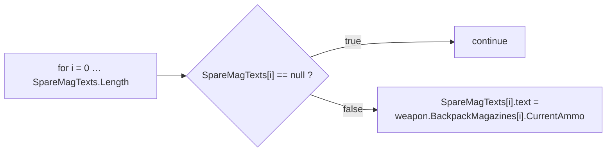
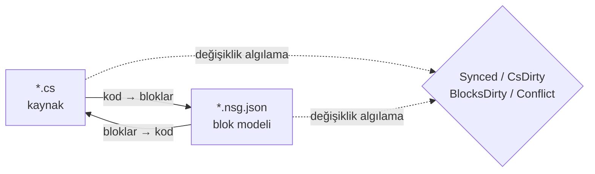

# NekoScriptGraph (NSG) — Hızlı Kurulum ve El Kitabı

**Sürüm** 1.0.1 · **Unity** 2022.3+ · **Yazar** NekoAndreeva · **Lisans** MIT · **Paket** `com.nekoandreeva.nekoscriptgraph`

> Unity için Scratch tarzı görsel programlama; **kodunuza asla hiçbir şey koymaz.**
> NSG, bir betiğin *yanına* bir blok yapılandırma dosyası yazar; böylece betik bloklar olarak düzenlenebilir hale gelir ve NSG iki yönde çeviri yapar. Üretilen `.cs` eklentiye dair hiçbir iz taşımaz — eklenti klasörünü silin, betikleriniz yine de derlenir.

---

## İçindekiler

**Bölüm A — Hızlı Kurulum**

1. [Tek Tıkla Genel API](#1-one-click-global-api)
2. [İlk Blok Programınız](#2-your-first-block-program)
3. [10 Dakikalık Başlangıç Yolu](#3-the-10-minute-onboarding-path)

**Bölüm B — El Kitabı**

4. [Temel Kavramlar](#4-core-concepts)
5. [Kurulum ve Gereksinimler](#5-install--requirements)
6. [Blok Düzenleyici](#6-the-block-editor)
7. [Menü Başvurusu](#7-menu-reference)
8. [API Blokları (Derinlemesine)](#8-api-blocks-deep-dive)
9. [Diller ve Yeni Bir Dil Ekleme](#9-languages--adding-one)
10. [Eşitleme, Kurallı Biçim ve Kaçış Oranı](#10-sync-canonical-form--escape-ratio)
11. [Mimari Sağlık](#11-architecture-health)
12. [Yerelleştirme](#12-localization)
13. [Aracılar ve MCP](#13-agents--mcp)
14. [ProgramNeko Asistanı (İsteğe Bağlı)](#14-programneko-assistant-optional)
15. [Ayarlar](#15-settings)
16. [Dizin Yapısı](#16-directory-layout)
17. [Kaldırma](#17-uninstall)
18. [Sorun Giderme ve SSS](#18-troubleshooting--faq)
19. [İletişim](#19-contact)

**Ekler**

- [A. Blok Tanım Şeması](#appendix-a-block-definition-schema)
- [B. Dil Tanımlayıcı Şeması](#appendix-b-language-descriptor-schema)
- [C. Ayar Anahtarları](#appendix-c-settings-keys)

---
---

# BÖLÜM A — HIZLI KURULUM

"Assets'e klasör atıldı" durumundan "bloklarla kod yazmaya" yaklaşık on dakikada, neredeyse hiç yazmadan geçin.

<a id="1-one-click-global-api"></a>
## 1. Tek Tıkla Genel API

**Fikir:** projenizde zaten yüzlerce yöntem vardır. NSG bunları okuyup her biri için bir **API bloğu** üretebilir; böylece zaten yazdığınız her yöntem, palette sürükle-bırak bir blok haline gelir. Yeni kod da böylece *kendi* projenizin sözcük dağarcığını birleştirerek yazılır.

### 1.1 Nasıl yapılır

1. Eklentinin derlendiğini doğrulayın (Console'da kırmızı hata yok; Unity 2022.3+).
2. Menü: **`NekoScriptGraph ▸ Build API Library for Whole Project`** (Tüm proje için API kütüphanesi oluştur).
3. NSG, tarayacağı kaynak dosyaları sayar ve bir onay iletişim kutusu gösterir:

   > *Tüm proje için API kütüphanesi oluşturulsun mu — N kaynak dosya → `Assets/NekoScriptGraph/Blocks/API`. Devam edilsin mi?*

4. **Devam**'a tıklayın. Büyük bir projede bu binlerce blok demektir ve gözle görülür bir süre alır — bu beklenen bir durumdur, sayının önce gösterilmesinin nedeni de budur.
5. Bittiğinde Console bir özet kaydeder ve bir iletişim kutusu toplamları bildirir:

   ```
   [NekoScriptGraph] API blocks: <generated> generated, <skipped> skipped.
   ```

6. Blok kütüphanesi **otomatik olarak yeniden yüklenir**. Yapılacak başka bir şey yok — yeni bloklar kullanıma hazırdır.

> **Kapsam.** Tarama, kayıtlı her dil için `Assets` klasörünü kapsar. C# `AssetDatabase` (`t:MonoScript`) kullanır; C/C++/Rust/HLSL/vb. disk üzerinde dosya uzantısına göre gezilir. `Dependencies/` ve `.checkpoints/` her zaman hariç tutulur.

### 1.2 Bunun yerine yalnızca bir klasör

Tek bir alt sistem üzerinde mi çalışıyorsunuz? Project penceresinde bir klasör seçin ve şunu kullanın:

**`NekoScriptGraph ▸ Generate API Blocks for Selected Folder`** (Seçili klasör için API blokları üret)

Aynı mekanizma, daha küçük etki alanı, çok daha hızlı. Önerilen ilk çalıştırma budur — aslında bloklarla betiklemek istediğiniz klasörü hedefleyin.

### 1.3 Elde ettiğiniz şey

Uygun her yöntem için bir JSON dosyası, `apiOutputFolder` klasörüne yazılır (varsayılan `Assets/NekoScriptGraph/Blocks/API`):

```
Blocks/API/api.DecalUtils.ProjectNormals.5.json
Blocks/API/api.DecalManager.GetSpawner.3.json
Blocks/API/api.GPUDecalUtils.UpdateDrawIndirectCommandBuffer.3.json
```

Adlandırma düzeni: `api.<Type>.<Method>.<arity>.json` — **arity** (parametre sayısı) kimliğin bir parçasıdır, böylece aşırı yüklemeler bir arada bulunur.

Palette, **API** kategorisi (`cat.api`) altına, **bildiren türe göre alt gruplanmış** olarak düşerler:

| Palet grubu | İçerik |
|---|---|
| `API` → `DecalUtils` | uygun olan her `DecalUtils` yöntemi |
| `API` → `DecalManager` | uygun olan her `DecalManager` yöntemi |
| `API` → *(serbest işlevler)* | C / HLSL üst düzey işlevleri |

Bir bloğu adına göre anında bulmak için palet arama kutusunu kullanın.

### 1.4 <a id="14-the-eligibility-rule-know-this-before-you-wonder"></a>Uygunluk kuralı (merak etmeden önce bunu bilin)

Bir **API bloğu yalnızca** yöntem şu koşulları sağladığında üretilir:

| Gereksinim | Neden |
|---|---|
| `public` | Genel API'dir |
| Jenerik yok (yöntemde ya da dönüş türünde `<…>`) | Bir blokta çalışma zamanı tür çıkarımı yoktur |
| `async` yok | Beklenecek bir zamanlayıcı yoktur |
| **`ref` / `out` / `in` / `params` / `this` parametresi yok** | Çıkış parametreleri ek soketler gerektirirdi |
| **Varsayılan parametre değeri yok** (`=`) | Soketlerin tümü zorunludur |
| `where` kısıtı yok | Jeneriklerle aynı |
| Oluşturucu değil | Bu bir yöntem çağrısı değildir |

Bunları karşılamayan her şey sessizce **atlanır** — özet içindeki "atlandı" sayısı budur.

### 1.5 <a id="15-static-vs-instance--the-one-asymmetry"></a>Statik ile örnek — tek asimetri

Bu, tüm API özelliğindeki en önemli tek uyarıdır:

| Yöntem türü | Blok davranışı | Tersinirlik |
|---|---|---|
| **`static`** | Noktalı çağrı hedefi + arity ile eşleşir (`matchCall` + `matchArity`) | **Tamamen çift yönlü** — kod ⇄ bloklar |
| **instance** | Başta fazladan bir `target` soketi alır: `{0}.Method({1}, …)` | **Tek yönlü** — doğru yazdırılır, ama içe aktarımda genel bir çağrı bloğu olarak yeniden okunur |

> Altın kural: **statik API'ler kusursuz bloklar oluşturur.** Örnek yöntemler yine de doğru ve kendi kendini belgeleyen bir çağrı verir; ancak bir örnek çağrının yalnızca blok üzerinden düzenlenmesi, özel olarak tanınabilir bir bloğa geri dönmez. Bloklarla yazmayı planladığınız her şey için `static` giriş noktalarını tercih edin.

Serbest işlevlerin (C, HLSL) sahibi olan bir tür yoktur, bu yüzden statik sayılırlar — tamamen çift yönlü.

### 1.6 Yeniden üretme disiplini

- **Yeniden düzenlemelerden sonra tekrar çalıştırın.** Bir yöntemin adını değiştirmek geride eskimiş bir API bloğu bırakır. Üreteci tekrar çalıştırıp yetimleri silin ya da doğrudan `Blocks/API/` klasörünü silip sıfırdan yeniden üretin.
- **Yeniden üretme idempotenttir.** Kimlikler belirlenimcidir; yinelenenler *atlandı* olarak sayılır, böylece tekrar çalıştırmak klasörü doldurmaz.
- **Commit'lemek güvenlidir.** `Blocks/API/*.json` veridir, kod değildir. Commit'lemek, ekip arkadaşlarınızın yeniden tarama yapmadan blok sözcük dağarcığınıza sahip olması demektir.

---

<a id="2-your-first-block-program"></a>
## 2. İlk Blok Programınız

Baştan sona somut bir örnek. API bloklarını kullanarak `CompassManager` tarzı mantığın küçük bir parçasını yeniden oluşturacağız — "şarjör sayısını yazdır, boş yuvalar için `--` göster".

### Adım 1 — Bir dosyayı yönetime alın

1. Project penceresinde bir `.cs` dosyası seçin.
2. **`NekoScriptGraph ▸ Take Selected Script Under Management`** (Seçili betiği yönetime al).

   Yanında bir dosya belirir:

   ```
   Assets/Scripts/ChrControl/CompassManager.cs
   Assets/Scripts/ChrControl/CompassManager.nsg.json   ← the block model
   ```

   (`.nsg.json` dosyası varsayılan olarak Project penceresinde gizlidir — bu bir özellik, hata değil. `Cmd/Ctrl+Shift+H` ile açılıp kapanır.)

### Adım 2 — Düzenleyiciyi açın

**`NekoScriptGraph ▸ Open Block Editor`** (Bloğu Aç). Dosya bir sekme olarak açılır.

### Adım 3 — Bloklarınızı bulun

Sağ panele bakın:

- **Palet araması** — filtrelemek için `SpareMagTexts` veya `Count` yazın.
- **API** grubu, Bölüm A'da üretilen blokları barındırır.
- **Denetim / İfadeler / Değişkenler / Yapı** dil bloklarını barındırır.

### Adım 4 — Birleştirin

Blokları tuvale sürükleyin. Klasik döngü:



Boş bırakılan her zorunlu soket, **Mimari Sağlık** tarafından `danglingInput` olarak işaretlenir.

### Adım 5 — Geri yazın

**Üret** (`Bloklar → Kod`) düğmesine basın (ya da araç çubuğundaki üret düğmesini kullanın). NSG kaynağı yazdırır ve şunlardan birini bildirir:

| Durum | Anlamı |
|---|---|
| `Synced` | Kod ile blok modeli uyuşuyor |
| `Code changed` | `.cs` ilerledi — yeniden içe aktarın |
| `Blocks changed` | Bloklar ilerledi — yazmak için Üret'e basın |
| `Conflict` | **İki** taraf da değişti — hangisinin kazanacağını siz seçersiniz |

### Adım 6 — Kodun temiz kaldığını doğrulayın

`.cs` dosyasını açın. Sıradan C#'tır. Öznitelik yok, üretilmiş bölge yok, eklenti referansı yok. Bütün mesele bu.

### Adım 7 — Commit'leyin

Hem `.cs` hem de `.nsg.json` dosyasını commit'leyin. Blok modeli normal bir proje varlığıdır.

> **İlk yazma yeniden biçimlendirir.** Bir yöntem zaten NSG'nin kurallı biçiminde değilse (eksik ayraçlar, tuhaf girinti, eşdeğer ama farklı bir yazım), ilk *bloklar → kod* geçişi onu normalleştirir. Anlam değişmez; biçim değişir. Önceden uyarılırsınız: *"N yöntem kurallı biçimde değil…"*. Sürpriz diff'lerden kaçınmak için bkz. [§10](#10-sync-canonical-form--escape-ratio).

---

<a id="3-the-10-minute-onboarding-path"></a>
## 3. 10 Dakikalık Başlangıç Yolu

Kısaltılmış kontrol listesi. Yazdırın, monitöre bantlayın.

| # | Eylem | Nerede | ~Süre |
|---|---|---|---|
| 1 | Eklentiyi `Assets/` içine bırakın ve derlenmesini bekleyin | Unity | 1 dk |
| 2 | Bir klasör seçin → **Generate API Blocks for Selected Folder** | Menü | 1 dk |
| 3 | **Take Selected Folder Under Management** | Menü | 1 dk |
| 4 | **Open Block Editor** | Menü | 10 sn |
| 5 | Palette kendi yöntemlerinizden birini arayın | Düzenleyici | 1 dk |
| 6 | Üç blok sürükleyin, bağlayın, bir soketi boş bırakın | Düzenleyici | 2 dk |
| 7 | **Mimari Sağlık**'ı açın ve `danglingInput` bulgusunu okuyun | Menü | 1 dk |
| 8 | Sokete bir blok sürükleyerek düzeltin | Düzenleyici | 1 dk |
| 9 | **Üret**'e basın, durumun `Synced` olduğunu doğrulayın | Düzenleyici | 30 sn |
| 10 | `.cs` dosyasını açın — temiz C# olduğunu doğrulayın | Düzenleyici | 20 sn |
| 11 | `.cs` + `.nsg.json` dosyalarını commit'leyin | Git | 30 sn |
| 12 | *(İsteğe bağlı)* **MCP Bridge: Start** ve aracınızı `http://127.0.0.1:8765/` adresine yönlendirin | Menü + istemci | 2 dk |

**Tek satırda zihinsel model:** `.cs` doğruluk kaynağıdır, `.nsg.json` onun üzerinde bir *mercektir* ve NSG mercek ile kaynağı uyum içinde tutar.

---
---
# BÖLÜM B — EL KİTABI

<a id="4-core-concepts"></a>
## 4. Temel Kavramlar

### 4.1 Yönetilen ve serbest dosyalar

- **Serbest dosya** — yanında `.nsg.json` olmayan sıradan bir betik.
- **Yönetilen dosya** — bir `.nsg.json` dosyası vardır; blok olarak açılabilir.

### 4.2 Yalnızca yöntem gövdeleri blok olur

NSG'deki en önemli kural:

- **Yöntem gövdelerinin dışındaki** `using`, tür bildirimleri, alanlar, öznitelikler ve açıklamalar **birebir** korunur ve her iki yönde de dokunulmadan geçer.
- **Yöntem gövdeleri** bloklara ayrıştırılır.
- Blok modelinin ifade edemediği her şey bir **ham parça** olarak korunur ve tanılama (`NSG0002`) olarak bildirilir. **Hiçbir şey asla sessizce kaybolmaz.**

### 4.3 Çift yönlü eşitleme modeli



| Durum | Anlamı |
|---|---|
| `Synced` | Kod ile blok modeli uyuşuyor |
| `CsDirty` | `.cs` değişti; model geride kaldı |
| `BlocksDirty` | Bloklar değişti; kod henüz yeniden yazılmadı |
| `Conflict` | İki taraf da değişti — kazananı siz seçmelisiniz |
| `Unmanaged` | Blok dosyası yok |

NSG **hangi tarafın önce hareket ettiğini** izler, böylece Üret'e basmanın kendi çalışmanızı yok edip etmeyeceğini her zaman bilirsiniz.

> MCP/aracı yolu kasıtlı olarak **tek yönlüdür: kod → bloklar**. Aracı sıradan kaynak yazar; eklenti yeniden ayrıştırıp modeli yeniden kurar.

---

<a id="5-install--requirements"></a>
## 5. Kurulum ve Gereksinimler

1. Unity **2022.3** veya daha yeni.
2. `NekoScriptGraph` klasörünü `Assets/` altına koyun (ya da yerel paket olarak ekleyin).
3. Tüm paket bir **yalnızca-Editor derleme tanımı** ile kapsanmıştır — oyuncu derlemesine **hiçbir şey** katmaz.

### İsteğe bağlı parçalar (her biri bir birim olarak kaldırılabilir)

| Klasör | Amaç | Kaldırılırsa |
|---|---|---|
| `Dependencies/` | 9 dilim yuvarlatılmış sprite'lar | Düz yuvarlatılmış köşelere döner; paket ~1,4 MB |
| `LanguageSupport/{c,cpp,hlsl,java,python,rust}` | C# dışı diller | O dil kaybolur; başka bir şey bozulmaz |
| `ProgramNeko/` | Piksel kedi asistan | Eklenti onu olmadan sorunsuz çalışır |
| `Locale/*` | Arayüz çevirileri | O yerel ayar İngilizceye döner |

### Paket boyutu

Gönderildiği haliyle ≈ **2,2 MB**:

| Parça | Boyut |
|---|---|
| `Editor/` — çekirdek, arayüz, C# motoru | ~0,9 MB |
| `Dependencies/Editor/Sprite/` — isteğe bağlı 9 dilim sprite'lar | ~0,86 MB |
| `Blocks/` — yerleşik blok kütüphanesi (istek üzerine yeniden üretilir) | ~0,23 MB |
| `LanguageSupport/` — yedi eklenebilir dil | ~0,21 MB |

---

<a id="6-the-block-editor"></a>
## 6. Blok Düzenleyici

VS Code tarzı, çok sekmeli bir pencere, en az 980×600.

| Bölge | İçerik |
|---|---|
| Sekme çubuğu | Aynı anda birkaç belge açık |
| Tuval | Bloklar halinde betik — sürükle, bağla, daralt, yakınlaştır, sığdır |
| Sağ panel | Blok paleti + arama + ön ayarlar; genişlik hatırlanır |
| Sol alt | Durum metni, geri al/yinele, asistan yuvası (yalnızca kuruluysa) |
| Araç satırı | Kütüphaneyi yenile, Sorunlar, Sağlık, Kayıt noktaları, Git, Sprite'lar |

### 6.1 İki görünüm modu

| Görünüm | Biçem | En uygun |
|---|---|---|
| **Yığın (Scratch)** | Dikey deyim yığma | Öğretim, doğrusal mantık |
| **Blueprint (UE)** | Düğüm grafiği | Veri akışı ve ifade zincirleri |

**Görünüm** (`view.stack` / `view.blueprint`) açılır menüsüyle değiştirin.

### 6.2 Palet

- `categoryKey`'e göre gruplanır, bir bütün olarak daraltılabilir (`Collapse all` / `Expand all` — Tümünü daralt / Tümünü genişlet).
- Harf indeksleri daraltılmış başlar; elle genişletin.
- Arama alanı kasıtlı olarak blok listesinin **dışındadır** — liste her tuş vuruşunda yeniden kurulur ve aksi halde odağı kaybederdi.
- Tek bir blok değil, bütün bir **ön ayarı** da tuvale sürükleyebilirsiniz.

**Yerleşik kategoriler:**

| Anahtar | Etiket | İçerik |
|---|---|---|
| `cat.ctrl` | Denetim | `if`, `for`, `foreach`, `while`, `break`, `continue`, `return` |
| `cat.expr` | İfadeler | ikili, tekli, çağrı, dönüştürme, koşullu, tanımlayıcı, dizin, değişmez, üye, new, sonek |
| `cat.var` | Değişkenler | yerel değişkenler ve atama |
| `cat.frame` | Yapı | bildirimler |
| `cat.api` | API | üretilen API blokları (türe göre gruplanmış) |
| `cat.macro` | Kendi bloklarım | kullanıcı ön ayarları |
| `cat.raw` | Kaçış yolu | ham parçalar |

### 6.3 Kayıt noktaları

Yerleşik anlık görüntüler `.checkpoints/` içinde yaşar; bu klasör **git tarafından yok sayılır** — depo geçmişinizle asla çakışamaz. Büyük bir *bloklar → kod* yazımından önce bir tane alın.

### 6.4 Blok dosyalarını gizleme

`hideBlockFiles` varsayılan olarak `true`'dur, böylece Project penceresi `.nsg.json` dosyalarıyla dolmaz.

- Menü: **`Toggle Block Files Visibility`** (Ayar dosyalarını gizle/göster) — genel kısayol `Cmd/Ctrl+Shift+H`.
- Kısayol geneldir: eklenti penceresi kapalıyken bile çalışır.

### 6.5 Seçili bloğu açıklama

`Cmd/Ctrl+Shift+E` (menü **`Explain Selected Block`** — Seçili bloğu açıkla) asistanın geçerli bloğu açıklamasını ister. Bu da genel bir kısayoldur.

---

<a id="7-menu-reference"></a>
## 7. Menü Başvurusu

> `[MenuItem]` başlıkları derleme zamanı sabitleridir, bu yüzden Unity'nin gönderdiği **statik İngilizce** addır; yerelleştirme katmanı yükleme ve dil değişiminde çevrilmiş etiketleri yerine koyar. `MCP Bridge` girdileri kasıtlı olarak İngilizcedir.

| Menü öğesi | Amacı |
|---|---|
| `Open Block Editor` | Ana pencereyi açar |
| `Problems` | Tanılama listesi |
| `Assistant (ProgramNeko)` | Asistanı açar; kurulu değilse uyarır |
| `Explain Selected Block` `%#e` | Seçili bloğu açıklar |
| `Architecture Health` | Sağlık penceresini açar |
| `Take Selected Script Under Management` | Tek dosyayı yönetime alır |
| `Release Selected Script` | Tek dosyanın yönetimini bırakır |
| `Take Selected Folder Under Management` | Toplu yönetime alma |
| `Take Whole Project Under Management` | Her şeyi yönetime alır |
| `Release Selected Folder` | Toplu bırakma |
| `Release Whole Project` | Her şeyi bırakır |
| `Generate API Blocks for Selected Folder` | Klasöre özel API üretimi |
| `Build API Library for Whole Project` | Tek tıkla genel API (Bölüm A) |
| `Reload Block Library` | `Blocks/` klasörünü yeniden okur |
| `Export Default Block Library` | Yerleşik blokları `Blocks/` içine yazar |
| `Generate ShaderLab Shell` | Shader'ın dış yapısını üretir |
| `Self Test: Round Trip` | Gidiş-dönüş tutarlılığı öz testi |
| `Toggle Block Files Visibility` `%#h` | `.nsg.json` gösterir/gizler |
| `Languages: Show Loaded` | Dil kayıt defterini döker |
| `MCP Bridge: Start` / `Stop` / `Copy Client URL` | MCP köprüsü |

---

<a id="8-api-blocks-deep-dive"></a>
## 8. API Blokları (Derinlemesine)

Bölüm A iş akışını ele aldı. Bu, mekanizmadır.

### 8.1 Üretecin ne yaydığı

Uygun her yöntem için bir `NsgBlockDef`:

```jsonc
// Blocks/API/api.DecalUtils.ProjectNormals.5.json
{
  "id": "api.DecalUtils.ProjectNormals.5",
  "level": "high",
  "shape": "expression",                 // "statement" if return type is void
  "category": "DecalUtils",              // declaring type → palette sub-group
  "categoryKey": "cat.api",              // the "API" group
  "label": "DecalUtils.ProjectNormals({0}, {1}, {2}, {3}, {4})",
  "labelEn": "DecalUtils.ProjectNormals({0}, {1}, {2}, {3}, {4})",
  "labelRu": "DecalUtils.ProjectNormals({0}, {1}, {2}, {3}, {4})",
  "sockets": [
    { "name": "decalPosW", "kind": "expr", "required": true, "variadic": false, "choices": [] },
    { "name": "parents",   "kind": "expr", "required": true, "variadic": false, "choices": [] },
    { "name": "decalNorm", "kind": "expr", "required": true, "variadic": false, "choices": [] },
    { "name": "decalTform","kind": "expr", "required": true, "variadic": false, "choices": [] },
    { "name": "decalColor","kind": "expr", "required": true, "variadic": false, "choices": [] }
  ],
  "emit": "",
  "node": "call",
  "op": "",
  "color": "",
  "matchCall": "DecalUtils.ProjectNormals",  // dotted match target
  "matchArity": 5,                           // parameter count
  "builtin": true,
  "manual": "DecalUtils.ProjectNormals(decalPosW, parents, decalNorm, decalTform, decalColor) : Color[]",
  "variantGroup": "",
  "variantLabel": ""
}
```

Notlar:

- **Soket adları** gerçek parametre adlarıdır — bu yüzden palet etiketi kendi kendini belgeler.
- **`manual`** tam nitelikli imzayı ve dönüş türünü taşır. Bu *kaçış yoludur*: bloğun elle yazılan biçimi.
- **Örnek yöntemler** `target` adlı (zorunlu) fazladan bir baştaki soket alır ve etiket `{0}.Method({1}, …)` olur — dolayısıyla §1.5'teki tek yönlü uyarı.
- **Serbest işlevlerin** (C/HLSL) sahibi yoktur ve `static` sayılır.

### 8.2 Belirlenimcilik ve yinelenenleri ayıklama

- Kimlik `api.<QualifiedType>.<Method>.<arity>` biçimindedir — çalıştırmalar arasında belirlenimcidir.
- Yinelenen kimlikler **atlandı** olarak sayılır, asla iki kez yazılmaz.
- Yeniden düzenlemelerden sonra tekrar çalıştırmak yetimleri **silmez**. Temiz bir sayfa için `Blocks/API/` klasörünü silin ve yeniden üretin.

### 8.3 Birden çok dil

`Build API Library for Whole Project` dil kayıt defterini dolaşır ve her motorun `GenerateApiBlocks` yöntemini çağırır. C# `AssetDatabase` üzerinden gider; C benzeri diller profil uzantısına göre dosya sistemini gezer, `.checkpoints/` ve `Dependencies/` klasörlerini atlar. Bir dil motoru oluşturulamazsa, o dil başarısız sayılır ve geri kalanlar devam eder.

### 8.4 Pratik rehber

| Durum | Öneri |
|---|---|
| Bir alt sistem için blok istiyorsunuz | Proje varyantı yerine **klasör** varyantını kullanın |
| Çift yönlü bloklar istiyorsunuz | Bir **`static`** giriş noktası açığa çıkarın |
| `ref`/`out`/`params` API'leriniz var | Atlanırlar — blok istiyorsanız bunları basit bir statik yöntemle sarın |
| Aşırı yüklemeler palette çakışıyor | **Arity** kimliktedir ve soketler ayırt eder; adına göre arayın |
| Bir yöntemi yeniden adlandırdınız | Yeniden üretin; yetim JSON'u silin |

---

<a id="9-languages--adding-one"></a>
## 9. Diller ve Yeni Bir Dil Ekleme

`C` · `C++` · `C#` · `Go` · `HLSL` · `Java` · `Rust` · `Python`

- Her biri **iki yönde de** çevirir.
- **C# yerleşiktir** (`Editor/Languages/CSharp/`: Lexer, Parser, Printer, Splitter, CodeMap).
- Diğerleri **eklenebilir klasörlerdir**. `LanguageSupport/<lang>/` klasörünü silin, o dil başka hiçbir şeyi bozmadan eklentiden kaybolur.

### Dil ekleme

Bir tanımlayıcı ve bir motor içeren bir klasör oluşturun:

```jsonc
// LanguageSupport/python/python.language.json
{
  "apiVersion": 1,
  "id": "python",
  "displayName": "Python",
  "icon": "PYTHON",
  "extensions": [".py"],
  "blocksFolder": "blocks",
  "engineType": "NekoScriptGraph.Nsg_PythonLanguage",
  "author": "",
  "note": "Self-contained language: its own engine, sharing only the block skeleton."
}
```

Ardından `engineType` ile adlandırılan sınıfı (ayrıştırma, yazdırma, API bloğu üretimi) uygulayın ve dilin `blocks/` klasörünü ekleyin. Referans uygulamalar olarak `Nsg_PythonLanguage`, `Nsg_CLanguage`, `Nsg_RustLanguage` vb. kullanın.

---

<a id="10-sync-canonical-form--escape-ratio"></a>
## 10. Eşitleme, Kurallı Biçim ve Kaçış Oranı

### 10.1 Kaçış oranı

**Ham parça** bloklarının payı. Kodun ne kadarının gerçekten blok olarak modellendiğini ölçer.

- Bloklara *tam* bir çeviri istemek için `maxEscapeRatio: 0` (MCP) ile kapı koyun.
- Ayrıştırıcının modelleyemediği her şey birebir korunur ve **`NSG0002`** olarak bildirilir.

### 10.2 Kurallı biçim

Tek bir "standart yazıma" sahip kod. İlk *bloklar → kod* geçişi şunları normalleştirir:

- eksik ayraçlar,
- tutarsız girinti,
- eşdeğer ama farklı yazımlar.

Kullanıcıya görünen uyarı:

> *"N yöntem kurallı biçimde değil (eksik ayraç, tutarsız girinti veya birkaç eşdeğer yazım). İlk bloklar → kod geçişi bunları normalleştirir — anlam değişmez, biçim değişir."*

### 10.3 Sabit nokta

`canon(text) == text` olana kadar yineleyin. Metin sabit bir nokta olduğunda belge `Synced` kalır ve bir daha asla yeniden biçimlendirilmez. §13'teki aracı döngüsünün diske yazmadan önce yaptığı tam olarak budur.

---

<a id="11-architecture-health"></a>
## 11. Mimari Sağlık

Menü **`Architecture Health`** (Mimari Sağlık) — bir betik seçiliyken o dosyayı analiz eder; aksi halde boş açılır.

**Ölçütler:** blok/deyim sayısı, yöntem sayısı, kaçış oranı (`escapes`) ve bileşik bir `score`.

**Denetimler:**

| Anahtar | Anlamı |
|---|---|
| `emptyBody` / `emptyMethod` | Boş gövde / boş yöntem |
| `constantCondition` | Her zaman doğru ya da her zaman yanlış koşul |
| `cycle` | Çağrı ya da bağımlılık döngüsü |
| `danglingInput` | Zorunlu soket bağlanmadan bırakılmış |
| `duplicate` | Yinelenen kod |
| `escapeRatio` | Yüksek ham parça oranı |
| `expressionSize` | Aşırı büyük ifade |
| `nesting` | Aşırı iç içe geçme |
| `methodLength` | Yöntem çok uzun |
| `memberChain` | Uzun üye zinciri (`a.b.c.d.e`) |
| `magicNumber` | Sihirli sayı |
| `placeholderName` / `shortName` | Yer tutucu / çok kısa adlar |
| `unusedLocal` | Kullanılmayan yerel değişken |
| `afterReturn` | `return` sonrası kod |
| `leak` | Şüpheli bellek sızıntısı |

**Düzeltme eylemleri:** `fixBreakLink`, `fixFillZero`, `fixAddRelease`, `fixApply`, `rerun`.

---

<a id="12-localization"></a>
## 12. Yerelleştirme

**15 arayüz yerel ayarı:**

Basitleştirilmiş Çince · Geleneksel Çince · İngilizce · Fransızca · Almanca · **İtalyanca** · Rusça · İspanyolca · Portekizce · Japonca · Korece · Lehçe · Türkçe · Arapça · İbranice

- **Arapça ve İbranice tüm düzenleyiciyi aynalar**: palet sola geçer ve bloklar sola doğru büyür (RTL).
- Unity'nin kendi menü çubuğu **tasarım gereği** İngilizce kalır.
- Dizeler `Locale/<code>/strings.json` içinde yaşar, anahtara göre bölümlenmiştir (`ui`, `blocks`, …). Blok sözcük dağarcığı `blocks` bölümünü kullanır, örn. `c.assert` → `assert {0}`.

---

<a id="13-agents--mcp"></a>
## 13. Aracılar ve MCP

NSG, **Unity Editor içinde çalışan bir MCP sunucusu** ile gelir: MCP **Streamable HTTP** taşıması üzerinden JSON-RPC 2.0. **Yan süreç yok, ek çalışma zamanı yok — Node yok, Python yok. Sunucu *Editor*'ün kendisidir.**

```
MCP client ──HTTP POST JSON-RPC──▶ 127.0.0.1:8765 ──▶ Unity Editor
```

### 13.1 Başlatma

Menü **`NekoScriptGraph ▸ MCP Bridge: Start`**:

```
[NekoScriptGraph] MCP bridge listening on http://127.0.0.1:8765/
```

- Açık olduğunu hatırlar ve bir alan yeniden yüklemesi ya da Editor yeniden başlatmasından sonra **otomatik olarak yeniden başlar**.
- **`MCP Bridge: Stop`** ile durdurun; URL'yi **`MCP Bridge: Copy Client URL`** ile kopyalayın.
- Elle doğrulayın — istemci gerekmez:

```bash
curl -s http://127.0.0.1:8765/ -d '{"jsonrpc":"2.0","id":1,"method":"tools/list"}'
```

Düz bir `GET /`, sunucu sürümünü, desteklenen protokol revizyonlarını ve kullanılabilir araçları listeleyen bir durum sayfası döndürür.

### 13.2 İstemcinizi ona yönlendirin

Herhangi bir Streamable HTTP MCP istemcisi çalışır. Yapılandırma biçimi biraz değişir (bazılarında `type`, bazılarında `transport`, azında çıplak `url`):

```json
{
  "mcpServers": {
    "nekoscriptgraph": {
      "type": "http",
      "url": "http://127.0.0.1:8765/"
    }
  }
}
```

VS Code `mcpServers` yerine `servers` kullanır; girdi bunun dışında aynıdır.

İstemciniz yalnızca **stdio** konuşuyorsa önüne bir HTTP↔stdio vekili koyun (örn. `npx mcp-remote http://127.0.0.1:8765/`). Bu vekil istemcinin işidir, eklentinin değil.

> Eski HTTP+SSE taşıması (`GET /sse`) **uygulanmamıştır**. Köprü Streamable HTTP sunar, protokol revizyonu `2025-03-26` ve daha yenisi, ayrıca aynı URL'ye POST yapan `2024-11-05` istemcilerini de kabul eder.

### 13.3 Yedi araç

| Araç | Yazar mı? | Ne yapar |
|---|---|---|
| `nsg_writing_spec` | hayır | Bir dil için kurallı yazım alt kümesi; blok kütüphanesinden ve yazıcıdan üretilir |
| `nsg_verify` | hayır | Diskteki bir dosyanın durumu: `Synced`, `CsDirty`, `BlocksDirty`, `Conflict`, `Unmanaged` |
| `nsg_plan` | hayır | Aday kodu ayrıştırır; tanılamaları, blok sayılarını, kaçış oranını ve kurallı olup olmadığını bildirir |
| `nsg_canon` | hayır | Kurallı metin — sabit nokta kâhini |
| `nsg_apply` | **evet** | `.nsg.json` dosyasını yeniden kurar ve kurallı kaynağı yazar |
| `nsg_list_managed` | hayır | Bir klasör altındaki her `.nsg.json` |
| `nsg_release` | **evet** | Bu `.nsg.json` dosyalarını siler (temiz kaldırma) |

### 13.4 Amaçlanan döngü — kod → bloklar

1. Dilin alt kümesini öğrenmek için bir kez `nsg_writing_spec`.
2. `.cs` dosyasını düzenleyin (ya da metni yalnızca konuşmada tutun).
3. `nsg_plan` — tanılamalar, blok sayıları, kaçış oranı. **Hiçbir şey yazmaz, derleme gerektirmez**, bu yüzden henüz derlenmeyen kodda güvenlidir.
4. `canonical` yanlışsa `nsg_canon` çağırın ve `canon(text) == text` olana kadar yineleyin. Sabit nokta budur: oraya ulaşıldığında belge `Synced` kalır ve sonradan hiçbir şey yeniden biçimlendirilmez.
5. `nsg_apply` — kurallı `.cs` dosyasını ve yeniden kurulmuş `.nsg.json` dosyasını yazar.

Bloklara tam bir çeviri istemek için kaçış oranına `maxEscapeRatio: 0` ile kapı koyun.

```json
{"jsonrpc":"2.0","id":1,"method":"tools/call","params":{
  "name":"nsg_plan",
  "arguments":{"file":"Assets/Scripts/CompassManager.cs","maxEscapeRatio":0.0}}}
```

`nsg_plan`, `nsg_canon` ve `nsg_apply` ayrıca `source` kabul eder, böylece aracı metni diske hiç ulaşmadan doğrulayabilir:

```json
{"jsonrpc":"2.0","id":2,"method":"tools/call","params":{
  "name":"nsg_canon",
  "arguments":{"file":"Assets/Scripts/Foo.cs","source":"class Foo { void A(){ } }"}}}
```

### 13.5 Güvenlik

Köprü projenize dosya yazar, bu yüzden kasıtlı olarak dardır:

- Yalnızca **`127.0.0.1`'e bağlanır** — asla yönlendirilebilir bir arayüze değil.
- **`Origin`** başlığı taşıyan istekler **`403`** ile reddedilir. Tarayıcılar her zaman `Origin` gönderir; yerel MCP istemcileri asla göndermez — yani **tarayıcınızda açık hiçbir sayfa köprüye erişemez**. Gerçekten bir tarayıcı istemcisine ihtiyacınız varsa `Nsg_McpBridge.SetAllowOrigin(true)` ile gevşetin.
- Sunucu **siz başlatana kadar kapalıdır** ve çıkışta durur.

### 13.6 Sorun giderme

| Belirti | Neden / çözüm |
|---|---|
| Editor zamanında yanıt vermedi | Köprü her çağrıyı ana iş parçacığına taşır ve Unity derleme ya da alan yeniden yükleme sırasında `EditorApplication.update` çalıştırmaz. Yeniden derleme sırasında gönderilen istekler bekler, sonra **60 saniye** sonra başarısız olur. Yalnızca tekrar deneyin |
| Bağlantı noktası zaten kullanımda | Başka bir süreç `8765` portunu tutuyor. `Nsg_McpBridge.SetPort(n)` ile değiştirin ya da diğer dinleyiciyi kapatın |
| Araçlar eksik | Eklentinin derlendiğini kontrol edin — `Nsg_Json`, `Nsg_Mcp` ve `Nsg_McpBridge` kurulum gerektirmeyen sıradan Editor betikleridir. `GET /` şu anda sunulan araçları listeler |

### 13.7 MCP olmadan kullanma

Köprü düz bir JSON-RPC uç noktasıdır; aynı işlemler hiç protokol olmadan da kullanılabilir:

- **Başsız / CI**

```bash
Unity -batchmode -quit -projectPath <project> \
      -executeMethod NekoScriptGraph.Nsg_AgentCli.Main \
      -nsgRequest req.json -nsgResponse resp.json
```

- **Kod içinde** — `Nsg_AgentApi.Run(request)`, ayrıca yalnızca protokol katmanı için `Nsg_Mcp.Handle(jsonString)`.

---

<a id="14-programneko-assistant-optional"></a>
## 14. ProgramNeko Asistanı (İsteğe Bağlı)

`ProgramNeko/` isteğe bağlı bir piksel kedi asistandır. **Tüm klasörü silin, eklenti çalışmaya devam eder.**

- Menü **`Assistant (ProgramNeko)`** onu açar. Problems ile *aynı* penceredir: o olmadan yalnızca bir hata listesidir; onunla, kedi üstte oturur ve altta konuşur.
- `Cmd/Ctrl+Shift+E` ondan seçili bloğu açıklamasını ister.
- Kendi yerelleştirmesi vardır: `ProgramNeko/Locale/<code>/neko.json` (15 yerel ayar).
- Bildirim: `ProgramNeko/programneko.json`.

---

<a id="15-settings"></a>
## 15. Ayarlar

`Assets/NekoScriptGraph/NekoScriptGraph.settings.json`:

```jsonc
{
  "viewMode": 0,                        // 0 = Stack (Scratch), 1 = Blueprint (UE)
  "hideBlockFiles": true,               // hide .nsg.json by default
  "useSprites": false,                  // 9-slice sprites
  "headerSprite": "block_header",
  "bodySprite": "block_body",
  "footerSprite": "block_footer",
  "exprSprite": "block_expr",
  "bodyIndent": 14,                     // body indent
  "cornerRadius": 6,
  "footerHeight": 10,
  "rightPaneWidth": 240.0,              // remembered after you drag it
  "presetPaneHeight": 200.0,
  "shaderPipeline": "auto",             // auto / ...
  "apiOutputFolder": "Assets/NekoScriptGraph/Blocks/API"
}
```

Ön ayarlar (çok bloklu sürükleme demetleri) `.presets/presets.json` içinde yaşar, `schemaVersion: 1`, her girdi `name`, `createdAt`, `blockCount`, `languageId` ve bir `nodes` dizisi kaydeder.

---

<a id="16-directory-layout"></a>
## 16. Dizin Yapısı

```
NekoScriptGraph/
├─ Editor/
│  ├─ Core/                      engine core
│  │  ├─ Esketamine/             AST, parse/print, block library, diagnostics,
│  │  │                          settings, MCP, agent API, L10n, undo, checkpoints
│  │  └─ cstyle/                 C-style engine, shader pipeline, agent spec
│  ├─ Languages/CSharp/          lexer / parser / printer / splitter / code map
│  ├─ UI/                        main window, block view, blueprint view, health,
│  │                             error window, RTL, picker, name dialog
│  ├─ Nsg_Menu.cs                menu items
│  ├─ Nsg_McpBridge.cs           MCP HTTP bridge
│  ├─ Nsg_AgentCli.cs            headless CLI
│  └─ Nsg_SelfTest.cs            round-trip self test
├─ Blocks/                       built-in block library + API/*.json
├─ LanguageSupport/{c,cpp,hlsl,java,python,rust}/
├─ Locale/{15 locales}/strings.json
├─ Dependencies/Editor/Sprite/   optional 9-slice sprites
├─ ProgramNeko/                  optional assistant
├─ .presets/presets.json
├─ NekoScriptGraph.settings.json
├─ MCP.md                        dedicated MCP chapter
└─ package.json                  com.nekoandreeva.nekoscriptgraph v1.0.1
```

---

<a id="17-uninstall"></a>
## 17. Kaldırma

Müdahaleci olmayan, iki yol:

1. **Menü** — `Release Selected Script` / `Release Selected Folder` / `Release Whole Project` (Seçili betiği bırak / Seçili klasörü bırak / Tüm projeyi bırak) ya da arayüzdeki **Release** (Yönetimi bırak) / **Release All** / **Release Folder** düğmeleri.
2. Seçilen klasördeki ya da tüm projedeki tüm `.nsg.json` dosyalarını silin.

**Kaynak dosyalara asla dokunulmaz.** Sonrasında geriye yalnızca eklenti klasörünün kendisi kalır — onu silin ve işiniz biter.

---

<a id="18-troubleshooting--faq"></a>
## 18. Sorun Giderme ve SSS

**Üretilen `.cs` eklenti izleri içeriyor mu?**
Hayır. Eklenti klasörünü silin, betik yine de derlenir.

**Neden `using`, alanlar ya da öznitelikler bloklara dönüştürülmüyor?**
Tasarım gereği. Blok çevirisine yalnızca yöntem gövdeleri katılır; geri kalan her şey her iki yönde de birebir korunur.

**Dosyam neden yeniden biçimlendirildi?**
Kurallı biçimde değildi. İlk *bloklar → kod* geçişi ayraçları ve girintiyi normalleştirir; anlam değişmez. Sıfır biçim değişikliği istiyorsanız önce `nsg_canon` ile bir sabit noktaya yineleyin.

**Bazı deyimler "ham parça" oldu — neden?**
O dilin yazılabilir alt kümesinin dışındadırlar. NSG bunları birebir korur ve atmak yerine `NSG0002` bildirir. Bunu katı bir kapıya dönüştürmek için `maxEscapeRatio` kullanın.

**`MCP Bridge` menü öğeleri neden İngilizce?**
Kasıtlı — Unity'nin menü çubuğu eklenti yerelleştirmesine katılmaz ve çevrilmiş ile çevrilmemiş girdileri karıştırmak daha kötüdür.

**Yalnızca bir klasörü yönetebilir miyim?**
Evet: **`Take Selected Folder Under Management`** (Seçili klasörü yönetime al).

**Project penceresini çok fazla blok dosyası mı dolduruyor?**
Varsayılan olarak gizlidirler; `Cmd/Ctrl+Shift+H` ile açıp kapatın.

**Yeniden adlandırmadan sonra API bloklarım eskidi.**
Yeniden üretme yetimleri budamaz. `Blocks/API/` klasörünü silin ve yeniden üretin.

**Beklediğim bir API bloğu eksik.**
Yöntem uygunluk kuralını geçemedi — en sık nedenler `ref`/`out`/`params`, bir varsayılan parametre değeri, bir jenerik ya da `async`. Bkz. [§1.4](#14-the-eligibility-rule-know-this-before-you-wonder).

**Bir örnek yöntem API bloğu gidiş-dönüş yapmıyor.**
Beklenen. Yalnızca `static` yöntemler tamamen çift yönlüdür; örnek yöntemler bir `target` soketi taşır ve tek yönlüdür. Bkz. [§1.5](#15-static-vs-instance--the-one-asymmetry).

---

<a id="19-contact"></a>
## 19. İletişim

Yazar: **NekoAndreeva**

- E-posta: elenaandreevasvinolup@gmail.com
- WhatsApp: +852 5247 4163
- GitHub: `https://github.com/elenaandreevasvinolup-alt`

---
---
<a id="appendix-a-block-definition-schema"></a>
## Ek A. Blok Tanım Şeması

`Blocks/<id>.json` — her blok için bir dosya.

| Alan | Tür | Notlar |
|---|---|---|
| `id` | string | Benzersiz, aynı zamanda palet kimliği; üretilen bloklar için `api.<Type>.<Method>.<arity>` |
| `level` | string | `high` (deyim düzeyi) / diğer |
| `shape` | string | `control` · `statement` · `expression` |
| `category` | string | Görüntüleme grubu; API blokları için bildiren türdür |
| `categoryKey` | string | Grubun yerelleştirme anahtarı: `cat.ctrl`, `cat.expr`, `cat.var`, `cat.frame`, `cat.api`, `cat.macro`, `cat.raw` |
| `label` | string | `{0}`, `{1}`… yuvalarıyla palet etiketi |
| `labelEn` / `labelRu` | string | Dile göre etiketler |
| `sockets` | array | `{ name, kind, required, variadic, choices[] }` |
| `emit` | string | Özel yayma şablonu (boş = motor varsayılanı) |
| `node` | string | Eşlendiği AST düğümü: `if`, `call`, `binary`, … |
| `op` | string | İlgili olduğunda operatör |
| `color` | string | İsteğe bağlı geçersiz kılma |
| `matchCall` | string | İçe aktarımda tanınacak noktalı çağrı hedefi |
| `matchArity` | int | Eşleşecek parametre sayısı (`-1` = herhangi) |
| `builtin` | bool | Eklentiyle birlikte gelir |
| `manual` | string | Bloğun elle yazılan girdisinde kullanılan tam elle biçim / imza |
| `variantGroup` / `variantLabel` | string | Varyant gruplama |

**Yerleşik deyim/ifade blokları:** `stmt.if`, `stmt.for`, `stmt.foreach`, `stmt.while`, `stmt.break`, `stmt.continue`, `stmt.return`, `stmt.localDecl`, `stmt.assign`, `stmt.expr`, `stmt.add`, `stmt.sub`, `stmt.mul`, `stmt.div`, `stmt.mod`, `stmt.raw` ve ifadeler `expr.binary`, `expr.unary`, `expr.call`, `expr.cast`, `expr.conditional`, `expr.ident`, `expr.index`, `expr.literal`, `expr.member`, `expr.new`, `expr.postfix`, `expr.raw`.

<a id="appendix-b-language-descriptor-schema"></a>
## Ek B. Dil Tanımlayıcı Şeması

`LanguageSupport/<id>/<id>.language.json`:

| Alan | Tür | Notlar |
|---|---|---|
| `apiVersion` | int | Şu anda `1` |
| `id` | string | `c`, `cpp`, `csharp`, `hlsl`, `java`, `python`, `rust` |
| `displayName` | string | Arayüzde gösterilir |
| `icon` | string | Rozet metni, örn. `PYTHON` |
| `extensions` | string[] | örn. `[".py"]` |
| `blocksFolder` | string | Göreli blok klasörü, örn. `blocks` |
| `engineType` | string | Tam nitelikli motor sınıfı, örn. `NekoScriptGraph.Nsg_PythonLanguage` |
| `author` | string | İsteğe bağlı |
| `note` | string | İsteğe bağlı açıklama |

<a id="appendix-c-settings-keys"></a>
## Ek C. Ayar Anahtarları

Bkz. [§15](#15-settings). Değiştirmeniz muhtemel tek anahtarlar: `viewMode`, `hideBlockFiles`, `useSprites`, `apiOutputFolder`, `shaderPipeline`.

---

# Bu Belgeyi PDF'ye Aktarma

Bu makinede şu anda `pandoc`, `node` veya `npx` kurulu değil. Seçenekler:

**A. Yerleşik macOS (kurulum yok, en hızlı)**
Markdown'ı kaydedin, HTML'e işleyin (VS Code Markdown önizlemesi ya da Typora), Safari'de açın, ardından **Dosya ▸ Yazdır… (⌘P) ▸ PDF ▸ PDF Olarak Kaydet**.

**B. Homebrew + pandoc (en iyi tipografi)**

```bash
brew install pandoc
brew install --cask basictex        # or mactex-no-gui
pandoc GUIDE.md -o NSG-GUIDE.pdf \
  --pdf-engine=xelatex \
  -V mainfont="Helvetica Neue" \
  -V monofont="Menlo" \
  -V geometry:margin=2cm \
  --toc --toc-depth=2 -N
```

**C. VS Code uzantısı**
`Markdown PDF` (yzane) ya da `Markdown Preview Enhanced` kurun, sonra dosyaya sağ tıklayın → **Markdown PDF: Export (pdf)**.
