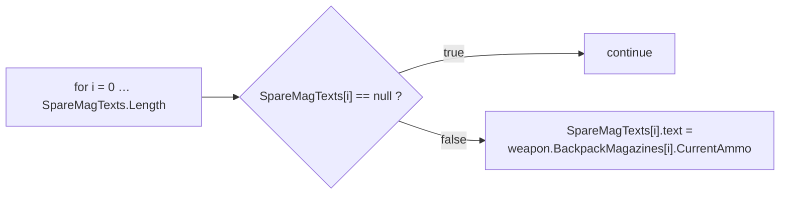
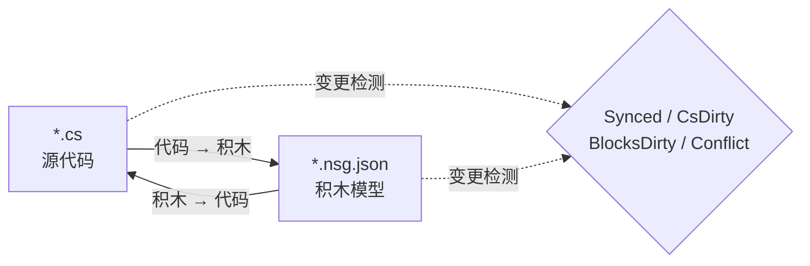

# NekoScriptGraph（NSG）—— 快速部署与手册

**版本** 1.0.2 · **Unity** 2022.3+ · **作者** NekoAndreeva · **许可证** MIT · **包名** `com.nekoandreeva.nekoscriptgraph`

> 面向 Unity 的 Scratch 风格可视化编程，**绝不往你的代码里塞任何东西。**
> NSG 会在脚本*旁边*写一个积木配置文件，让它能以积木形式编辑，并支持双向转换。生成的 `.cs` 中不含插件的任何痕迹——删掉插件文件夹，你的脚本依然可以编译。

---

## 目录

**A 部分 —— 快速部署**

1. [一键全项目 API](#1-one-click-global-api)
2. [你的第一个积木程序](#2-your-first-block-program)
3. [10 分钟上手路径](#3-the-10-minute-onboarding-path)

**B 部分 —— 手册**

4. [核心概念](#4-core-concepts)
5. [安装与要求](#5-install--requirements)
6. [积木编辑器](#6-the-block-editor)
7. [菜单参考](#7-menu-reference)
8. [API 积木（深入）](#8-api-blocks-deep-dive)
9. [语言与新增语言](#9-languages--adding-one)
10. [同步、规范形与逃生比例](#10-sync-canonical-form--escape-ratio)
11. [架构健康度](#11-architecture-health)
12. [本地化](#12-localization)
13. [Agent 与 MCP](#13-agents--mcp)
14. [代码喵喵 助手（可选）](#14-programneko-assistant-optional)
15. [设置](#15-settings)
16. [目录结构](#16-directory-layout)
17. [卸载](#17-uninstall)
18. [故障排查与常见问题](#18-troubleshooting--faq)
19. [联系方式](#19-contact)

**附录**

- [A. 积木定义模式（Schema）](#appendix-a-block-definition-schema)
- [B. 语言描述符模式（Schema）](#appendix-b-language-descriptor-schema)
- [C. 设置项键名](#appendix-c-settings-keys)

---
---

# A 部分 —— 快速部署

从「把文件夹丢进 Assets」到「用积木写代码」大约十分钟，几乎不用打字。

<a id="1-one-click-global-api"></a>
## 1. 一键全项目 API

**思路：** 你的项目里已经有成百上千个方法。NSG 可以读取它们，并为每个方法铸出一个 **API 积木**，于是你写过的每个方法都会变成积木面板里可拖拽的积木。新代码就这样由*你自己*项目的词汇拼装而成。

### 1.1 动手做

1. 确认插件已编译通过（Console 中没有红色报错；Unity 2022.3+）。
2. 菜单：**`NekoScriptGraph ▸ Build API Library for Whole Project`**（一键构建全项目 API 库）。
3. NSG 会统计将要扫描的源文件数量，并弹出确认对话框：

   > *为全项目构建 API 库 —— N 个源文件 → `Assets/NekoScriptGraph/Blocks/API`。是否继续？*

4. 点击 **Continue**。在大型项目中这会生成数千个积木，需要等待一会儿——这是正常现象，也正是先显示数量的原因。
5. 完成后，Console 会记录一份摘要，对话框会报告总计：

   ```
   [NekoScriptGraph] API blocks: <generated> generated, <skipped> skipped.
   ```

6. 积木库会**自动重新载入**。无需其他操作——新积木即刻可用。

> **范围。** 扫描会针对每一种已注册语言覆盖 `Assets`。C# 使用 `AssetDatabase`（`t:MonoScript`）；C/C++/Rust/HLSL 等则按文件扩展名在磁盘上遍历。`Dependencies/` 和 `.checkpoints/` 始终排除在外。

### 1.2 只处理一个文件夹

只做某个子系统？在 Project 窗口中选中一个文件夹，然后使用：

**`NekoScriptGraph ▸ Generate API Blocks for Selected Folder`**（为选中文件夹生成 API 积木库）

同一套机制，影响范围更小，速度快得多。推荐第一次就执行这个——直接指向你真正想用积木编写的那个文件夹。

### 1.3 你会得到什么

每个符合条件的方法生成一个 JSON 文件，写入 `apiOutputFolder` 指定的文件夹（默认 `Assets/NekoScriptGraph/Blocks/API`）：

```
Blocks/API/api.DecalUtils.ProjectNormals.5.json
Blocks/API/api.DecalManager.GetSpawner.3.json
Blocks/API/api.GPUDecalUtils.UpdateDrawIndirectCommandBuffer.3.json
```

命名规则：`api.<Type>.<Method>.<arity>.json`——**arity**（参数个数）是 ID 的一部分，因此重载可以共存。

在积木面板中，它们归入 **API** 分类（`cat.api`），并**按声明类型分子组**：

| 面板分组 | 内容 |
|---|---|
| `API` → `DecalUtils` | 所有符合条件的 `DecalUtils` 方法 |
| `API` → `DecalManager` | 所有符合条件的 `DecalManager` 方法 |
| `API` → *（自由函数）* | C / HLSL 顶层函数 |

用面板搜索框按名称即可立刻找到。

<a id="14-the-eligibility-rule-know-this-before-you-wonder"></a>
### 1.4 适用条件（先看这里，免得困惑）

**只有当**方法满足以下条件时，才会生成 **API 积木**：

| 要求 | 原因 |
|---|---|
| `public` | 它是公开 API |
| 无泛型（方法或其返回类型上没有 `<…>`） | 积木中无法做运行时类型推断 |
| 非 `async` | 没有可等待的调度器 |
| **没有 `ref` / `out` / `in` / `params` / `this`** 参数 | 输出参数需要额外的插槽 |
| **没有默认参数值**（`=`） | 插槽全部为必填 |
| 无 `where` 约束 | 同泛型 |
| 不是构造函数 | 它不属于方法调用 |

不满足这些条件的一律被静默**跳过**——这个数量就是摘要里的 “skipped” 数字。

<a id="15-static-vs-instance--the-one-asymmetry"></a>
### 1.5 静态（static）与实例（instance）—— 唯一的不对称之处

这是整个 API 功能中最重要的一条注意事项：

| 方法类型 | 积木行为 | 可逆性 |
|---|---|---|
| **`static`** | 通过带点的调用目标 + 参数个数匹配（`matchCall` + `matchArity`） | **完全双向**——代码 ⇄ 积木 |
| **instance（实例）** | 会多出一个位于最前面的 `target` 插槽：`{0}.Method({1}, …)` | **单向**——打印正确，但导入时会重新读作通用调用积木 |

> 经验法则：**static API 能做成完美的积木。** 实例方法同样能给你一个正确、自文档化的调用，但仅通过积木修改的实例调用无法往返还原为一个能明确识别的积木。凡是你打算用积木编写的部分，优先使用 `static` 入口。

自由函数（C、HLSL）没有所属类型，因此被当作 static 处理——完全双向。

### 1.6 重建纪律

- **重构之后要重新运行。** 重命名方法会留下过期的 API 积木。重新运行生成器并删除孤儿文件，或者直接删掉 `Blocks/API/` 后从头重新生成。
- **重新生成是幂等的。** ID 是确定性的；重复项会被计为*跳过*，所以重复运行不会让文件夹膨胀。
- **提交到版本库是安全的。** `Blocks/API/*.json` 是数据而非代码。提交它意味着队友无需重新扫描就能得到你的积木词汇表。

---

<a id="2-your-first-block-program"></a>
## 2. 你的第一个积木程序

一个具体的端到端演练。我们将用 API 积木重建一小段 `CompassManager` 风格的逻辑——「打印弹匣数量，空槽显示 `--`」。

### 步骤 1 —— 把一个文件纳入托管

1. 在 Project 窗口中选中一个 `.cs` 文件。
2. **`NekoScriptGraph ▸ Take Selected Script Under Management`**（把选中脚本纳入托管）。

   它旁边会出现一个文件：

   ```
   Assets/Scripts/ChrControl/CompassManager.cs
   Assets/Scripts/ChrControl/CompassManager.nsg.json   ← the block model
   ```

   （`.nsg.json` 默认在 Project 窗口中隐藏——这是特性而非缺陷。`Cmd/Ctrl+Shift+H` 可切换显示。）

### 步骤 2 —— 打开编辑器

**`NekoScriptGraph ▸ Open Block Editor`**（打开积木编辑器）。文件会以标签页形式打开。

### 步骤 3 —— 找到你的积木

看右侧面板：

- **面板搜索**——输入 `SpareMagTexts` 或 `Count` 进行筛选。
- **API** 分组里是 A 部分铸出的积木。
- **控制 / 表达式 / 变量 / 结构** 中放的是语言积木。

### 步骤 4 —— 拼装

把积木拖到画布上。经典的循环：



每一个留空的必填插槽都会被**架构健康度**标记为 `danglingInput`。

### 步骤 5 —— 写回代码

点击 **Generate**（积木 → 代码；或使用工具栏上的生成按钮）。NSG 会输出源码并报告以下状态之一：

| 状态 | 含义 |
|---|---|
| `Synced` | 代码与积木模型一致 |
| `Code changed` | `.cs` 已先行变更——需要重新导入 |
| `Blocks changed` | 积木已先行变更——执行 Generate 写入 |
| `Conflict` | **两侧**都发生变化——由你选择保留哪一边 |

### 步骤 6 —— 确认代码保持干净

打开 `.cs`。它就是普通的 C#。没有特性（attribute）、没有生成区域、没有插件引用。这正是本插件的意义所在。

### 步骤 7 —— 提交

把 `.cs` 和 `.nsg.json` 一起提交。积木模型就是普通的项目资源。

> **第一次写入会重排格式。** 如果某个方法原本不是 NSG 的规范形（缺少花括号、缩进异常、写法等价但不同），第一次*积木 → 代码*会把它规范化。语义不变，格式会变。你会事先收到警告：*「有 N 个方法不是规范形……」*。想避免意外的差异，请见 [§10](#10-sync-canonical-form--escape-ratio)。

---

<a id="3-the-10-minute-onboarding-path"></a>
## 3. 10 分钟上手路径

精简版清单。打印出来，贴在显示器上。

| # | 操作 | 位置 | 约耗时 |
|---|---|---|---|
| 1 | 把插件放入 `Assets/` 并等待其编译 | Unity | 1 分钟 |
| 2 | 选中一个文件夹 → **Generate API Blocks for Selected Folder** | 菜单 | 1 分钟 |
| 3 | **Take Selected Folder Under Management** | 菜单 | 1 分钟 |
| 4 | **Open Block Editor** | 菜单 | 10 秒 |
| 5 | 在面板中搜索你自己的某个方法 | 编辑器 | 1 分钟 |
| 6 | 拖三个积木，把它们连接起来，留空一个插槽 | 编辑器 | 2 分钟 |
| 7 | 打开 **Architecture Health** 并阅读 `danglingInput` 诊断结果 | 菜单 | 1 分钟 |
| 8 | 通过把一个积木拖进插槽来修复 | 编辑器 | 1 分钟 |
| 9 | 点击 **Generate**，确认状态为 `Synced` | 编辑器 | 30 秒 |
| 10 | 打开 `.cs`——确认它是干净的 C# | 编辑器 | 20 秒 |
| 11 | 提交 `.cs` + `.nsg.json` | Git | 30 秒 |
| 12 | *（可选）* **MCP Bridge: Start**，并让你的 agent 指向 `http://127.0.0.1:8765/` | 菜单 + 客户端 | 2 分钟 |

**一句话心智模型：** `.cs` 是唯一事实来源，`.nsg.json` 是它之上的*透镜*，NSG 让透镜与来源保持一致。

---
---

# B 部分 —— 手册

<a id="4-core-concepts"></a>
## 4. 核心概念

### 4.1 托管文件与自由文件

- **自由文件**——旁边没有 `.nsg.json` 的普通脚本。
- **托管文件**——带有 `.nsg.json`；可以按积木方式打开。

### 4.2 只有方法体会变成积木

NSG 中最重要的规则：

- **方法体之外**的 `using`、类型声明、字段、特性（attribute）和注释都会被**原样**保留，双向转换中都原封不动。
- **方法体**会被解析为积木。
- 积木模型无法表达的任何内容都会作为**原始片段（raw snippet）**保留，并作为诊断报告出来（`NSG0002`）。**绝不会静默丢失任何内容。**

### 4.3 双向同步模型



| 状态 | 含义 |
|---|---|
| `Synced` | 代码与积木模型一致 |
| `CsDirty` | `.cs` 已变更；模型落后 |
| `BlocksDirty` | 积木已变更；代码尚未重写 |
| `Conflict` | 两侧都已变更——你必须选择保留哪一边 |
| `Unmanaged` | 没有积木文件 |

NSG 会追踪**哪一侧先变动**，因此你始终知道按下 Generate 是否会毁掉你自己的劳动成果。

> MCP/agent 路径刻意设计为**单向：代码 → 积木**。agent 写的是普通源码；插件重新解析并重建模型。

---

<a id="5-install--requirements"></a>
## 5. 安装与要求

1. Unity **2022.3** 或更高版本。
2. 把 `NekoScriptGraph` 文件夹放到 `Assets/` 下（或作为本地包添加）。
3. 整个包由**仅编辑器（Editor-only）程序集定义**限定——它对播放器（player）构建**毫无**贡献。

### 可选部分（每一部分都可以整体删除）

| 文件夹 | 用途 | 删除后 |
|---|---|---|
| `Dependencies/` | 九宫格（9-slice）圆角精灵 | 回退为普通圆角；包体约 3.3 MB |
| `LanguageSupport/{c,cpp,go,hlsl,java,python,rust,swift}` | 非 C# 语言 | 该语言消失；其他功能不受影响 |
| `ProgramNeko/` | 像素猫助手 | 没有它插件照常工作 |
| `Locale/*` | UI 翻译 | 该语言回退为英文 |

### 包体大小

发布时约为 **4.2 MB**：

| 部分 | 大小 |
|---|---|
| `Editor/` —— 核心、UI、C# 引擎、设置 | ~1.4 MB |
| `Dependencies/Editor/Sprite/` —— 可选的九宫格精灵 | ~0.86 MB |
| `Documents/` —— 15 种语言的这份指南 | ~0.7 MB |
| `Locale/` —— 15 种界面语言 | ~0.7 MB |
| `LanguageSupport/` —— 八种即插即用语言 | ~0.24 MB |
| `Blocks/` —— 内置积木库（按需重新生成） | ~0.23 MB |
| `Extensions~/` —— 可安装的外部引擎模板 | ~0.04 MB |

---

<a id="6-the-block-editor"></a>
## 6. 积木编辑器

VS Code 风格的多标签窗口，最小尺寸 980×600。

| 区域 | 内容 |
|---|---|
| 标签栏 | 可同时打开多个文档 |
| 画布 | 以积木形式呈现脚本——拖拽、连接、折叠、缩放、适应窗口 |
| 右侧面板 | 积木面板 + 搜索 + 预设；宽度会被记住 |
| 左下角 | 状态文本、撤销/重做、助手槽位（仅在已安装时） |
| 工具行 | 重载积木库、报错窗口、健康度、检查点、Git、精灵 |

### 6.1 两种视图模式

| 视图 | 风格 | 最适合 |
|---|---|---|
| **堆叠（Scratch）** | 纵向语句堆叠 | 教学、线性逻辑 |
| **蓝图（UE）** | 节点图 | 数据流与表达式链 |

通过 **View** 下拉框切换（`view.stack` / `view.blueprint`）。

### 6.2 积木面板

- 按 `categoryKey` 分组，可整体折叠（`Collapse all` / `Expand all`）。
- 字母索引默认折叠；需手动展开。
- 搜索框刻意放在积木列表**之外**——列表在每次按键时都会重建，否则会失去焦点。
- 你可以把整个**预设**拖进画布，而不只是单个积木。

**内置分类：**

| Key | 标签 | 内容 |
|---|---|---|
| `cat.ctrl` | 控制 | `if`、`for`、`foreach`、`while`、`break`、`continue`、`return` |
| `cat.expr` | 表达式 | binary、unary、call、cast、conditional、ident、index、literal、member、new、postfix |
| `cat.var` | 变量 | 局部变量与赋值 |
| `cat.frame` | 结构 | 声明 |
| `cat.api` | API | 生成的 API 积木（按类型分组） |
| `cat.macro` | 自制积木 | 用户预设 |
| `cat.raw` | 逃生舱 | 原始片段 |

### 6.3 检查点

内置快照存放在 `.checkpoints/`，该目录**已被 git 忽略**——它永远不会与你的仓库历史冲突。在大型*积木 → 代码*写入之前先取一个快照。

### 6.4 隐藏积木文件

`hideBlockFiles` 默认为 `true`，因此 Project 窗口不会被 `.nsg.json` 淹没。

- 菜单：**`Toggle Block Files Visibility`**——全局快捷键 `Cmd/Ctrl+Shift+H`。
- 该快捷键是全局的：即使插件窗口已关闭也有效。

### 6.5 解释选中的积木

`Cmd/Ctrl+Shift+E`（菜单 **`Explain Selected Block`**）会让助手解释当前积木。同样是全局快捷键。

---

<a id="7-menu-reference"></a>
## 7. 菜单参考

> `[MenuItem]` 的标题是编译期常量，因此 Unity 实际发布的是**静态英文**名称；本地化层会在加载和切换语言时替换为翻译后的标签。`MCP Bridge` 相关条目刻意保留英文。

**顶栏路径**：所有 NekoWorks 系列插件共用**一个**顶栏栏位，各自占一个子菜单，装再多插件也不会把顶栏横向撑爆。

```
NekoWorks
├── NSG   ← 本插件（NekoScriptGraph）
└── NDC   ← Neko Dynamic Collision
```

下表列的是 `NekoWorks → NSG` 子菜单里的条目。

| 菜单项 | 用途 |
|---|---|
| `Open Block Editor` | 打开主窗口 |
| `Problems` | 诊断列表 |
| `Assistant (ProgramNeko)` | 打开助手；未安装时会给出提示 |
| `Explain Selected Block` `%#e` | 解释选中的积木 |
| `Architecture Health` | 打开健康度窗口 |
| `Take Selected Script Under Management` | 托管单个文件 |
| `Release Selected Script` | 解除单个文件的托管 |
| `Take Selected Folder Under Management` | 批量托管 |
| `Take Whole Project Under Management` | 托管全部 |
| `Release Selected Folder` | 批量解除 |
| `Release Whole Project` | 解除全部 |
| `Generate API Blocks for Selected Folder` | 以文件夹为范围生成 API 积木 |
| `Build API Library for Whole Project` | 一键全项目 API（A 部分） |
| `Reload Block Library` | 重新读取 `Blocks/` |
| `Export Default Block Library` | 把内置积木写入 `Blocks/` |
| `Generate ShaderLab Shell` | 输出着色器外层结构 |
| `Self Test: Round Trip` | 往返一致性自检 |
| `Toggle Block Files Visibility` `%#h` | 显示/隐藏 `.nsg.json` |
| `Languages: Show Loaded` | 输出语言注册表 |
| `MCP Bridge: Start` / `Stop` / `Copy Client URL` | MCP 桥接 |

---

<a id="8-api-blocks-deep-dive"></a>
## 8. API 积木（深入）

A 部分讲的是工作流。这里讲的是底层机制。

### 8.1 生成器产出什么

对每个符合条件的方法，生成一个 `NsgBlockDef`：

```jsonc
// Blocks/API/api.DecalUtils.ProjectNormals.5.json
{
  "id": "api.DecalUtils.ProjectNormals.5",
  "level": "high",
  "shape": "expression",                 // "statement" if return type is void
  "category": "DecalUtils",              // declaring type → palette sub-group
  "categoryKey": "cat.api",              // the "API" group
  "label": "DecalUtils.ProjectNormals({0}, {1}, {2}, {3}, {4})",
  "labelEn": "DecalUtils.ProjectNormals({0}, {1}, {2}, {3}, {4})",
  "labelRu": "DecalUtils.ProjectNormals({0}, {1}, {2}, {3}, {4})",
  "sockets": [
    { "name": "decalPosW", "kind": "expr", "required": true, "variadic": false, "choices": [] },
    { "name": "parents",   "kind": "expr", "required": true, "variadic": false, "choices": [] },
    { "name": "decalNorm", "kind": "expr", "required": true, "variadic": false, "choices": [] },
    { "name": "decalTform","kind": "expr", "required": true, "variadic": false, "choices": [] },
    { "name": "decalColor","kind": "expr", "required": true, "variadic": false, "choices": [] }
  ],
  "emit": "",
  "node": "call",
  "op": "",
  "color": "",
  "matchCall": "DecalUtils.ProjectNormals",  // dotted match target
  "matchArity": 5,                           // parameter count
  "builtin": true,
  "manual": "DecalUtils.ProjectNormals(decalPosW, parents, decalNorm, decalTform, decalColor) : Color[]",
  "variantGroup": "",
  "variantLabel": ""
}
```

说明：

- **插槽名称**就是真实的参数名——因此面板标签是自文档化的。
- **`manual`** 携带完整的限定签名以及返回类型。它是*逃生舱*：积木的手册形态。
- **实例方法**会多出一个名为 `target` 的前置插槽（必填），标签变为 `{0}.Method({1}, …)`——这就是 §1.5 中单向限制的由来。
- **自由函数**（C/HLSL）没有所属类型，被当作 `static` 处理。

### 8.2 确定性与去重

- ID 为 `api.<QualifiedType>.<Method>.<arity>`——每次运行都一致。
- 重复的 ID 会计为**跳过**，绝不会写两次。
- 重构后重新运行**不会**清除孤儿文件。删除 `Blocks/API/` 后重新生成，才能得到干净的状态。

### 8.3 多语言

`Build API Library for Whole Project` 会遍历语言注册表，并调用每个引擎的 `GenerateApiBlocks`。C# 走 `AssetDatabase`；类 C 语言则按配置文件中的扩展名遍历文件系统，跳过 `.checkpoints/` 和 `Dependencies/`。如果某个语言引擎构造失败，该语言会被计为失败，其余语言继续。

### 8.4 实用建议

| 情况 | 建议 |
|---|---|
| 你想为某个子系统生成积木 | 用**文件夹**版本，而不是全项目版本 |
| 你想要双向的积木 | 暴露一个 **`static`** 入口 |
| 你有 `ref`/`out`/`params` API | 它们会被跳过——如果想要积木，用简单的 static 方法包一层 |
| 重载在面板中冲突 | **arity** 已在 ID 中，插槽会加以区分；按名称搜索 |
| 你重命名了方法 | 重新生成；删除孤儿 JSON |

---

<a id="9-languages--adding-one"></a>
## 9. 语言与新增语言

`C` · `C++` · `C#` · `Go` · `HLSL` · `Java` · `Rust` · `Python` · `Swift`

- 每一种都支持**双向**转换。
- **C# 是内置的**（`Editor/Languages/CSharp/`：Lexer、Parser、Printer、Splitter、CodeMap）。
- 其他语言都是**即插即用文件夹**。删除 `LanguageSupport/<lang>/`，该语言就会从插件中消失，且不影响其他任何功能。

### 新增一种语言

创建一个包含描述符和引擎的文件夹：

```jsonc
// LanguageSupport/python/python.language.json
{
  "apiVersion": 1,
  "id": "python",
  "displayName": "Python",
  "icon": "PYTHON",
  "extensions": [".py"],
  "blocksFolder": "blocks",
  "engineType": "NekoScriptGraph.Nsg_PythonLanguage",
  "author": "",
  "note": "Self-contained language: its own engine, sharing only the block skeleton."
}
```

然后实现 `engineType` 指定的类（解析、打印、API 积木生成），并加入该语言的 `blocks/` 文件夹。可参考 `Nsg_PythonLanguage`、`Nsg_CLanguage`、`Nsg_RustLanguage` 等实现。

---

<a id="10-sync-canonical-form--escape-ratio"></a>
## 10. 同步、规范形与逃生比例

### 10.1 逃生比例

指**原始片段**积木所占的比例。它衡量有多少代码真正被建模为积木。

- 用 `maxEscapeRatio: 0`（MCP）作为门槛，要求*完整*转换为积木。
- 解析器无法建模的任何内容都会原样保留，并报告为 **`NSG0002`**。

### 10.2 规范形

指只有唯一「标准写法」的代码。第一次*积木 → 代码*会规范化：

- 缺失的花括号，
- 不一致的缩进，
- 等价但不同的写法。

用户可见的警告：

> *「有 N 个方法不是规范形（缺花括号、缩进不一致或写法有多种等价形式）。第一次「积木 → 代码」会把它们规范化——语义不变，格式会变。」*

### 10.3 不动点

迭代直到 `canon(text) == text`。文本一旦成为不动点，文档就会保持 `Synced`，之后再也不会被重新格式化。§13 中的 agent 循环在写盘之前做的正是这件事。

---

<a id="11-architecture-health"></a>
## 11. 架构健康度

菜单 **`Architecture Health`**（架构健康度）——选中脚本时会分析该文件；否则打开时内容为空。

**指标：** 积木/语句数量、方法数量、逃生比例（`escapes`），以及一个综合 `score`。

**检查项：**

| Key | 含义 |
|---|---|
| `emptyBody` / `emptyMethod` | 空方法体 / 空方法 |
| `constantCondition` | 恒真或恒假的条件 |
| `cycle` | 调用或依赖环 |
| `danglingInput` | 必填插槽未连接 |
| `duplicate` | 重复代码 |
| `escapeRatio` | 原始片段比例过高 |
| `expressionSize` | 表达式过大 |
| `nesting` | 嵌套过深 |
| `methodLength` | 方法过长 |
| `memberChain` | 过长的成员链（`a.b.c.d.e`） |
| `magicNumber` | 魔法数字 |
| `placeholderName` / `shortName` | 占位名称 / 过短名称 |
| `unusedLocal` | 未使用的局部变量 |
| `afterReturn` | `return` 之后的代码 |
| `leak` | 疑似泄漏 |

**修复操作：** `fixBreakLink`, `fixFillZero`, `fixAddRelease`, `fixApply`, `rerun`。

---

<a id="12-localization"></a>
## 12. 本地化

**15 种 UI 语言：**

简体中文 · 繁体中文 · 英语 · 法语 · 德语 · **意大利语** · 俄语 · 西班牙语 · 葡萄牙语 · 日语 · 韩语 · 波兰语 · 土耳其语 · 阿拉伯语 · 希伯来语

- **阿拉伯语和希伯来语会镜像整个编辑器**：面板移到左侧，积木向左生长（RTL）。
- Unity 自带的菜单栏**刻意**保持英文。
- 字符串存放在 `Locale/<code>/strings.json`，按 key 分节（`ui`、`blocks` 等）。积木词汇使用 `blocks` 节，例如 `c.assert` → `assert {0}`。

---

<a id="13-agents--mcp"></a>
## 13. Agent 与 MCP

NSG 内置一个**在 Unity 编辑器内运行的 MCP 服务器**：基于 MCP **Streamable HTTP** 传输的 JSON-RPC 2.0。**没有伴随进程，也没有额外运行时——不需要 Node，不需要 Python。编辑器*本身*就是服务器。**

```
MCP client ──HTTP POST JSON-RPC──▶ 127.0.0.1:8765 ──▶ Unity Editor
```

### 13.1 启动它

菜单 **`NekoScriptGraph ▸ MCP Bridge: Start`**：

```
[NekoScriptGraph] MCP bridge listening on http://127.0.0.1:8765/
```

- 会记住上次处于开启状态，并在域重载或编辑器重启后**自动重启**。
- 用 **`MCP Bridge: Stop`** 停止；用 **`MCP Bridge: Copy Client URL`** 复制 URL。
- 手动验证——无需客户端：

```bash
curl -s http://127.0.0.1:8765/ -d '{"jsonrpc":"2.0","id":1,"method":"tools/list"}'
```

直接 `GET /` 会返回一个状态页，列出服务器版本、支持的协议修订版以及可用的工具。

### 13.2 让客户端指向它

任何 Streamable HTTP MCP 客户端都可以。配置写法略有差异（有的用 `type`，有的用 `transport`，少数只用 `url`）：

```json
{
  "mcpServers": {
    "nekoscriptgraph": {
      "type": "http",
      "url": "http://127.0.0.1:8765/"
    }
  }
}
```

VS Code 使用 `servers` 而不是 `mcpServers`；条目其他部分相同。

如果你的客户端只支持 **stdio**，请在前面加一个 HTTP↔stdio 代理（例如 `npx mcp-remote http://127.0.0.1:8765/`）。该代理是客户端的事，与本插件无关。

> 旧的 HTTP+SSE 传输（`GET /sse`）**未**实现。该桥接提供 Streamable HTTP，协议修订版为 `2025-03-26` 及更新版本，同时也接受向同一 URL 发送 POST 的 `2024-11-05` 客户端。

### 13.3 七个工具

| 工具 | 是否写入 | 作用 |
|---|---|---|
| `nsg_writing_spec` | 否 | 某语言的规范写作子集，由积木库和打印器生成 |
| `nsg_verify` | 否 | 磁盘上某文件的状态：`Synced`、`CsDirty`、`BlocksDirty`、`Conflict`、`Unmanaged` |
| `nsg_plan` | 否 | 解析候选代码，报告诊断、积木数量、逃生比例、是否规范形？ |
| `nsg_canon` | 否 | 规范文本——不动点的判定依据 |
| `nsg_apply` | **是** | 重建 `.nsg.json` 并写入规范源码 |
| `nsg_list_managed` | 否 | 某文件夹下的所有 `.nsg.json` |
| `nsg_release` | **是** | 删除那些 `.nsg.json` 文件（干净卸载） |

### 13.4 预期循环 —— 代码 → 积木

1. 先调用一次 `nsg_writing_spec`，了解该语言的子集。
2. 编辑 `.cs`（或仅在对话中保留文本）。
3. `nsg_plan`——诊断、积木数量、逃生比例。**不写入任何内容，也无需编译**，因此在尚不能构建的代码上使用是安全的。
4. 如果 `canonical` 为 false，调用 `nsg_canon` 并迭代直到 `canon(text) == text`。这就是不动点：一旦达到，文档会保持 `Synced`，之后不会再被重新格式化。
5. `nsg_apply`——写入规范 `.cs` 和重建后的 `.nsg.json`。

用 `maxEscapeRatio: 0` 作为逃生比例门槛，要求完整转换为积木。

```json
{"jsonrpc":"2.0","id":1,"method":"tools/call","params":{
  "name":"nsg_plan",
  "arguments":{"file":"Assets/Scripts/CompassManager.cs","maxEscapeRatio":0.0}}}
```

`nsg_plan`、`nsg_canon` 和 `nsg_apply` 也接受 `source`，因此 agent 可以在文本落到磁盘之前先校验：

```json
{"jsonrpc":"2.0","id":2,"method":"tools/call","params":{
  "name":"nsg_canon",
  "arguments":{"file":"Assets/Scripts/Foo.cs","source":"class Foo { void A(){ } }"}}}
```

### 13.5 安全性

该桥接会向你的项目中写文件，因此它刻意做得很窄：

- 仅绑定 **`127.0.0.1`**——绝不绑定到可路由的网络接口。
- 带有 **`Origin`** 头的请求会被以 **`403`** 拒绝。浏览器总会发送 `Origin`；原生 MCP 客户端从不发送——因此**你浏览器中打开的任何页面都无法访问该桥接**。如果你确实需要浏览器客户端，可用 `Nsg_McpBridge.SetAllowOrigin(true)` 放宽限制。
- 服务器在你启动之前**处于关闭状态**，并在退出时停止。

### 13.6 故障排查

| 现象 | 原因 / 修复 |
|---|---|
| 编辑器未及时响应 | 桥接会把每次调用都编组到主线程上，而 Unity 在编译或重载域时不会运行 `EditorApplication.update`。在重新编译期间发出的请求会等待，然后在 **60 秒**后失败。重试即可 |
| 端口已被占用 | 另一个进程占用了 `8765`。用 `Nsg_McpBridge.SetPort(n)` 更改，或关闭另一个监听者 |
| 工具缺失 | 检查插件是否已编译——`Nsg_Json`、`Nsg_Mcp` 和 `Nsg_McpBridge` 都是普通的 Editor 脚本，无需任何配置。`GET /` 会列出当前提供的工具 |

### 13.7 不使用 MCP 时如何使用

该桥接就是一个普通的 JSON-RPC 端点；完全不用协议也能执行同样的操作：

- **无头 / CI**

```bash
Unity -batchmode -quit -projectPath <project> \
      -executeMethod NekoScriptGraph.Nsg_AgentCli.Main \
      -nsgRequest req.json -nsgResponse resp.json
```

- **代码中**——`Nsg_AgentApi.Run(request)`，以及仅用于协议层的 `Nsg_Mcp.Handle(jsonString)`。

---

<a id="14-programneko-assistant-optional"></a>
## 14. 代码喵喵 助手（可选）

`ProgramNeko/` 是一个可选的像素猫助手。**删掉整个文件夹，插件依然照常工作。**

- 菜单 **`Assistant (ProgramNeko)`** 可打开它。它与报错窗口是*同一个*窗口：没有她时只是一个错误列表；有她时，猫坐在上方，在下方说话。
- `Cmd/Ctrl+Shift+E` 让她解释选中的积木。
- 她有自己的本地化：`ProgramNeko/Locale/<code>/neko.json`（15 种语言）。
- 清单文件：`ProgramNeko/programneko.json`。

---

<a id="15-settings"></a>
## 15. 设置

`Assets/NekoScriptGraph/NekoScriptGraph.settings.json`：

```jsonc
{
  "viewMode": 0,                        // 0 = Stack (Scratch), 1 = Blueprint (UE)
  "hideBlockFiles": true,               // hide .nsg.json by default
  "useSprites": false,                  // 9-slice sprites
  "headerSprite": "block_header",
  "bodySprite": "block_body",
  "footerSprite": "block_footer",
  "exprSprite": "block_expr",
  "bodyIndent": 14,                     // body indent
  "cornerRadius": 6,
  "footerHeight": 10,
  "rightPaneWidth": 240.0,              // remembered after you drag it
  "presetPaneHeight": 200.0,
  "shaderPipeline": "auto",             // auto / ...
  "apiOutputFolder": "Assets/NekoScriptGraph/Blocks/API"
}
```

预设（多积木拖拽包）存放在 `.presets/presets.json`，`schemaVersion: 1`，每个条目记录 `name`、`createdAt`、`blockCount`、`languageId` 以及一个 `nodes` 数组。

---

<a id="16-directory-layout"></a>
## 16. 目录结构

```
NekoScriptGraph/
├─ Editor/
│  ├─ Core/                      engine core
│  │  ├─ Esketamine/             AST, parse/print, block library, diagnostics,
│  │  │                          settings, MCP, agent API, L10n, undo, checkpoints
│  │  └─ cstyle/                 C-style engine, shader pipeline, agent spec
│  ├─ Languages/CSharp/          lexer / parser / printer / splitter / code map
│  ├─ UI/                        main window, block view, blueprint view, health,
│  │                             error window, RTL, picker, name dialog
│  ├─ Nsg_Menu.cs                menu items
│  ├─ Nsg_McpBridge.cs           MCP HTTP bridge
│  ├─ Nsg_AgentCli.cs            headless CLI
│  └─ Nsg_SelfTest.cs            round-trip self test
├─ Blocks/                       built-in block library + API/*.json
├─ LanguageSupport/{c,cpp,go,hlsl,java,python,rust,swift}/
├─ Locale/{15 locales}/strings.json
├─ Dependencies/Editor/Sprite/   optional 9-slice sprites
├─ ProgramNeko/                  optional assistant
├─ .presets/presets.json
├─ NekoScriptGraph.settings.json
├─ MCP.md                        dedicated MCP chapter
└─ package.json                  com.nekoandreeva.nekoscriptgraph v1.0.2
```

---

<a id="17-uninstall"></a>
## 17. 卸载

无侵入，两种方式：

1. **菜单**——`Release Selected Script` / `Release Selected Folder` / `Release Whole Project`，或 UI 按钮 **Release** / **Release All** / **Release Folder**。
2. 删除所选文件夹或整个项目下的所有 `.nsg.json` 文件。

**源文件绝不会被改动。** 之后剩下的只有插件文件夹本身——删掉它就结束了。

---

<a id="18-troubleshooting--faq"></a>
## 18. 故障排查与常见问题

**生成的 `.cs` 会带有插件痕迹吗？**
不会。删掉插件文件夹，脚本依然能编译。

**为什么 `using`、字段或特性（attribute）不会变成积木？**
设计如此。只有方法体参与积木转换；其他一切在双向转换中都原样保留。

**为什么我的文件被重新格式化了？**
因为它不是规范形。第一次*积木 → 代码*会规范化花括号和缩进；语义不变。如果想要零格式变动，先用 `nsg_canon` 迭代到不动点。

**有些语句变成了「原始片段」——为什么？**
它们超出了该语言的可写子集。NSG 会把它们原样保留并报告 `NSG0002`，而不是丢弃。用 `maxEscapeRatio` 可以把它变成硬性门槛。

**为什么 `MCP Bridge` 菜单项是英文的？**
有意为之——Unity 的菜单栏不参与插件的本地化，而翻译与未翻译条目混在一起更糟。

**我可以只托管一个文件夹吗？**
可以：**`Take Selected Folder Under Management`**（给选中文件夹托管积木）。

**积木文件太多，把 Project 窗口搞乱了？**
它们默认隐藏；用 `Cmd/Ctrl+Shift+H` 切换。

**重命名后我的 API 积木过期了。**
重新生成不会清理孤儿文件。删除 `Blocks/API/` 后重新生成。

**我预期存在的某个 API 积木不见了。**
该方法不符合适用条件——最常见的是 `ref`/`out`/`params`、默认参数值、泛型或 `async`。见 [§1.4](#14-the-eligibility-rule-know-this-before-you-wonder)。

**实例方法的 API 积木无法往返。**
这是预期行为。只有 `static` 方法是完全双向的；实例方法带有一个 `target` 插槽，是单向的。见 [§1.5](#15-static-vs-instance--the-one-asymmetry)。

---

<a id="19-contact"></a>
## 19. 联系方式

作者：**NekoAndreeva**

- 邮箱：elenaandreevasvinolup@gmail.com
- WhatsApp：+852 5247 4163
- GitHub：`https://github.com/elenaandreevasvinolup-alt`

---
---

<a id="appendix-a-block-definition-schema"></a>
## 附录 A. 积木定义模式（Schema）

`Blocks/<id>.json`——每个积木一个文件。

| 字段 | 类型 | 说明 |
|---|---|---|
| `id` | string | 唯一，同时也是面板中的身份标识；生成的积木为 `api.<Type>.<Method>.<arity>` |
| `level` | string | `high`（语句层级）/ 其他 |
| `shape` | string | `control` · `statement` · `expression` |
| `category` | string | 显示分组；对 API 积木而言就是声明类型 |
| `categoryKey` | string | 分组的本地化 key：`cat.ctrl`、`cat.expr`、`cat.var`、`cat.frame`、`cat.api`、`cat.macro`、`cat.raw` |
| `label` | string | 带 `{0}`、`{1}`…… 插槽的面板标签 |
| `labelEn` / `labelRu` | string | 各语言标签 |
| `sockets` | array | `{ name, kind, required, variadic, choices[] }` |
| `emit` | string | 自定义输出模板（空 = 引擎默认） |
| `node` | string | 它映射到的 AST 节点：`if`、`call`、`binary`…… |
| `op` | string | 运算符（在相关时） |
| `color` | string | 可选的覆盖值 |
| `matchCall` | string | 导入时用于识别的带点调用目标 |
| `matchArity` | int | 要匹配的参数个数（`-1` = 任意） |
| `builtin` | bool | 随插件一起提供 |
| `manual` | string | 完整的手册形态 / 签名，用于积木的手册条目 |
| `variantGroup` / `variantLabel` | string | 变体分组 |

**内置语句/表达式积木：** `stmt.if`、`stmt.for`、`stmt.foreach`、`stmt.while`、`stmt.break`、`stmt.continue`、`stmt.return`、`stmt.localDecl`、`stmt.assign`、`stmt.expr`、`stmt.add`、`stmt.sub`、`stmt.mul`、`stmt.div`、`stmt.mod`、`stmt.raw`，以及表达式 `expr.binary`、`expr.unary`、`expr.call`、`expr.cast`、`expr.conditional`、`expr.ident`、`expr.index`、`expr.literal`、`expr.member`、`expr.new`、`expr.postfix`、`expr.raw`。

<a id="appendix-b-language-descriptor-schema"></a>
## 附录 B. 语言描述符模式（Schema）

`LanguageSupport/<id>/<id>.language.json`：

| 字段 | 类型 | 说明 |
|---|---|---|
| `apiVersion` | int | 当前为 `1` |
| `id` | string | `c`、`cpp`、`csharp`、`hlsl`、`java`、`python`、`rust` |
| `displayName` | string | 在 UI 中显示的名称 |
| `icon` | string | 徽标文本，例如 `PYTHON` |
| `extensions` | string[] | 例如 `[".py"]` |
| `blocksFolder` | string | 相对的积木文件夹，例如 `blocks` |
| `engineType` | string | 完全限定的引擎类，例如 `NekoScriptGraph.Nsg_PythonLanguage` |
| `author` | string | 可选 |
| `note` | string | 可选的描述 |

<a id="appendix-c-settings-keys"></a>
## 附录 C. 设置项键名

见 [§15](#15-settings)。你可能会改动的键只有：`viewMode`、`hideBlockFiles`、`useSprites`、`apiOutputFolder`、`shaderPipeline`。

---

# 将本文档导出为 PDF

本机当前没有安装 `pandoc`、`node` 或 `npx`。可选方案：

**A. macOS 内置方案（零安装，最快）**
保存 Markdown，把它渲染为 HTML（VS Code 的 Markdown 预览，或 Typora），在 Safari 中打开，然后 **File ▸ Print…（⌘P）▸ PDF ▸ Save as PDF**。

**B. Homebrew + pandoc（排版最佳）**

```bash
brew install pandoc
brew install --cask basictex        # or mactex-no-gui
pandoc GUIDE.md -o NSG-GUIDE.pdf \
  --pdf-engine=xelatex \
  -V mainfont="Helvetica Neue" \
  -V monofont="Menlo" \
  -V geometry:margin=2cm \
  --toc --toc-depth=2 -N
```

**C. VS Code 扩展**
安装 `Markdown PDF`（yzane）或 `Markdown Preview Enhanced`，然后右键点击文件 → **Markdown PDF: Export (pdf)**。
