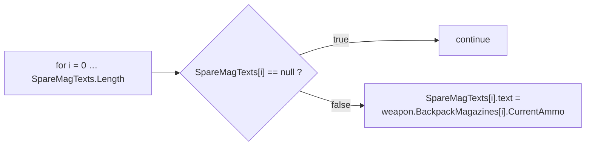
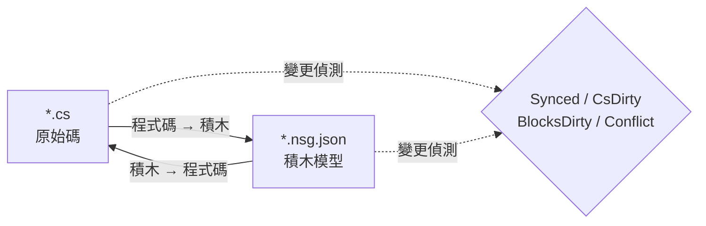

# NekoScriptGraph (NSG) — 快速部署與手冊

**版本** 1.0.2 · **Unity** 2022.3+ · **作者** NekoAndreeva · **授權** MIT · **套件** `com.nekoandreeva.nekoscriptgraph`

> 為 Unity 打造的 Scratch 風格視覺化程式設計，**絕不把任何東西寫進你的程式碼。**
> NSG 會在指令碼*旁邊*寫入一個積木設定檔，讓它能以積木形式編輯，並支援雙向轉譯。產生的 `.cs` 不含任何外掛痕跡——刪除外掛資料夾後，你的指令碼依然可以編譯。

---

## 目錄

**Part A — 快速部署**

1. [一鍵全域 API](#1-one-click-global-api)
2. [你的第一個積木程式](#2-your-first-block-program)
3. [10 分鐘上手路徑](#3-the-10-minute-onboarding-path)

**Part B — 手冊**

4. [核心概念](#4-core-concepts)
5. [安裝與需求](#5-install--requirements)
6. [積木編輯器](#6-the-block-editor)
7. [選單參考](#7-menu-reference)
8. [API 積木（深入探討）](#8-api-blocks-deep-dive)
9. [語言與新增語言](#9-languages--adding-one)
10. [同步、標準形式與逃生比率](#10-sync-canonical-form--escape-ratio)
11. [架構健康度](#11-architecture-health)
12. [在地化](#12-localization)
13. [代理與 MCP](#13-agents--mcp)
14. [程式喵喵 助手（選用）](#14-programneko-assistant-optional)
15. [設定](#15-settings)
16. [目錄結構](#16-directory-layout)
17. [解除安裝](#17-uninstall)
18. [疑難排解與常見問題](#18-troubleshooting--faq)
19. [聯絡方式](#19-contact)

**附錄**

- [A. 積木定義結構描述](#appendix-a-block-definition-schema)
- [B. 語言描述子結構描述](#appendix-b-language-descriptor-schema)
- [C. 設定鍵](#appendix-c-settings-keys)

---
---

# PART A — 快速部署

從「把資料夾丟進 Assets」到「用積木寫程式碼」，大約十分鐘，幾乎不用打字。

<a id="1-one-click-global-api"></a>
## 1. 一鍵全域 API

**構想：** 你的專案中早已有數百個方法。NSG 可以讀取它們，並為每個方法鑄造一個 **API 積木**，讓你已經寫好的每個方法都成為面板中可拖放的積木。之後撰寫新程式碼，就是組裝*你自己*專案的詞彙。

### 1.1 動手做

1. 確認外掛已編譯（Console 中沒有紅色錯誤；Unity 2022.3+）。
2. 選單：**`NekoScriptGraph ▸ Build API Library for Whole Project`（一鍵構建全專案 API 庫）**。
3. NSG 會計算它將掃描的原始檔數量，並顯示確認對話方塊：

   > *為整個專案建置 API 積木庫——N 個原始檔 → `Assets/NekoScriptGraph/Blocks/API`。要繼續嗎？*

4. 按一下 **Continue**。在大型專案上這會是數千個積木，且會花上明顯的一段時間——這是預期中的，所以才會先顯示數量。
5. 完成時，Console 會記錄一份摘要，並以對話方塊回報總計：

   ```
   [NekoScriptGraph] API blocks: <generated> generated, <skipped> skipped.
   ```

6. 積木庫會**自動重新載入**。無需其他操作——新的積木立即可用。

> **範圍。** 掃描會針對每個已註冊的語言涵蓋 `Assets`。C# 使用 `AssetDatabase`（`t:MonoScript`）；C/C++/Rust/HLSL 等則依副檔名在磁碟上走訪。`Dependencies/` 與 `.checkpoints/` 一律排除。

### 1.2 只處理單一資料夾

只處理單一子系統？在 Project 視窗中選取一個資料夾，然後使用：

**`NekoScriptGraph ▸ Generate API Blocks for Selected Folder`（為選取資料夾產生 API 積木庫）**

相同的機制，影響範圍更小，速度也快得多。這是建議的第一次執行方式——鎖定你真正想以積木撰寫的資料夾。

### 1.3 你會得到什麼

每個符合資格的方法會產生一個 JSON 檔，寫入 `apiOutputFolder` 指定的資料夾（預設為 `Assets/NekoScriptGraph/Blocks/API`）：

```
Blocks/API/api.DecalUtils.ProjectNormals.5.json
Blocks/API/api.DecalManager.GetSpawner.3.json
Blocks/API/api.GPUDecalUtils.UpdateDrawIndirectCommandBuffer.3.json
```

命名規則：`api.<Type>.<Method>.<arity>.json`——**arity**（參數數量）是 ID 的一部分，因此多載可以並存。

在面板中，它們會歸入 **API** 類別（`cat.api`），並**依宣告型別分為子群組**：

| 面板群組 | 內容 |
|---|---|
| `API` → `DecalUtils` | 每個符合資格的 `DecalUtils` 方法 |
| `API` → `DecalManager` | 每個符合資格的 `DecalManager` 方法 |
| `API` → *(free functions)* | C / HLSL 頂層函式 |

使用面板搜尋框即可依名稱立即找到。

<a id="14-the-eligibility-rule-know-this-before-you-wonder"></a>
### 1.4 資格規則（在你感到疑惑之前，先看這裡）

**只有在**方法符合下列條件時，才會產生 **API 積木**：

| 條件 | 原因 |
|---|---|
| `public` | 它是公開 API |
| 沒有泛型（方法或其傳回型別上沒有 `<…>`） | 積木中無法進行執行階段型別推斷 |
| 沒有 `async` | 沒有排程器可供 await |
| **沒有 `ref` / `out` / `in` / `params` / `this`** 參數 | 輸出參數需要額外的插槽 |
| **沒有預設參數值**（`=`） | 插槽全都必須填寫 |
| 沒有 `where` 條件約束 | 同泛型 |
| 不是建構函式 | 它不是方法呼叫 |

任何不符合這些條件的項目都會被默默**略過**——該數量就是摘要中的「skipped」數字。

<a id="15-static-vs-instance--the-one-asymmetry"></a>
### 1.5 靜態與執行個體——唯一的不對稱

這是整個 API 功能中最重要的唯一注意事項：

| 方法種類 | 積木行為 | 可逆性 |
|---|---|---|
| **`static`** | 以點狀呼叫目標 + arity 比對（`matchCall` + `matchArity`） | **完全雙向**——程式碼 ⇄ 積木 |
| **instance** | 會多出一個前置的 `target` 插槽：`{0}.Method({1}, …)` | **單向**——能正確印出，但匯入時會重新讀取為一般呼叫積木 |

> 經驗法則：**靜態 API 能做成完美的積木。** 執行個體方法仍能給你正確、自我說明的呼叫，但只以積木形式編輯執行個體呼叫，將無法往返還原成可明確辨識的積木。對於任何你想用積木撰寫的東西，請優先使用 `static` 進入點。

自由函式（C、HLSL）沒有擁有者型別，因此被視為靜態——完全雙向。

### 1.6 重建紀律

- **重構後請重新執行。** 重新命名方法會留下過期的 API 積木。重新執行產生器並刪除孤兒項目，或直接刪除 `Blocks/API/` 並從頭重新產生。
- **重新產生是冪等的。** ID 是確定性的；重複項目會被計為*略過*，因此重新執行不會在資料夾中灌入大量重複檔案。
- **可以安全地提交。** `Blocks/API/*.json` 是資料，不是程式碼。提交它意味著隊友無需重新掃描就能取得你的積木詞彙。

---

<a id="2-your-first-block-program"></a>
## 2. 你的第一個積木程式

一個具體的端到端逐步操作。我們將使用 API 積木，重建一小段 `CompassManager` 風格的邏輯——「印出彈匣數量，空插槽顯示 `--`」。

### 步驟 1 — 將一個檔案納入管理

1. 在 Project 視窗中選取一個 `.cs` 檔案。
2. **`NekoScriptGraph ▸ Take Selected Script Under Management`（將選取的指令碼納入管理）**。

   旁邊會出現一個檔案：

   ```
   Assets/Scripts/ChrControl/CompassManager.cs
   Assets/Scripts/ChrControl/CompassManager.nsg.json   ← the block model
   ```

   （`.nsg.json` 預設在 Project 視窗中隱藏——這是特性，不是錯誤。`Cmd/Ctrl+Shift+H` 可切換顯示。）

### 步驟 2 — 開啟編輯器

**`NekoScriptGraph ▸ Open Block Editor`（開啟積木編輯器）**。檔案會以分頁開啟。

### 步驟 3 — 找到你的積木

看一下右側窗格：

- **面板搜尋**——輸入 `SpareMagTexts` 或 `Count` 來篩選。
- **API** 群組存放 Part A 中鑄造的積木。
- **控制（Control）/ 表達式（Expressions）/ 變數（Variables）/ 結構（Structure）** 存放語言積木。

### 步驟 4 — 組裝

把積木拖到畫布上。經典迴圈：



每個留空的必要插槽都會被 **Architecture Health**（架構健康度）標記為 `danglingInput`。

### 步驟 5 — 寫回去

按下 **Generate**（或使用工具列上的產生按鈕）。NSG 會印出原始碼並回報下列其中一種狀態：

| 狀態 | 意義 |
|---|---|
| `Synced` | 程式碼與積木模型一致 |
| `Code changed` | `.cs` 領先了——請重新匯入 |
| `Blocks changed` | 積木領先了——按 Generate 將它們寫入 |
| `Conflict` | **兩邊**都變了——由你選擇哪一邊勝出 |

### 步驟 6 — 確認程式碼維持乾淨

開啟 `.cs`。它是一般的 C#。沒有屬性、沒有產生區域、沒有外掛參照。這就是重點所在。

### 步驟 7 — 提交

同時提交 `.cs` 與 `.nsg.json`。積木模型是一般的專案資產。

> **第一次寫入會重新格式化。** 如果某個方法原本不是 NSG 的標準形式（缺少大括號、縮排怪異、等價但不同的寫法），第一次*積木 → 程式碼*的處理會將其正規化。語意不變；格式改變。系統會事先警告你：*「有 N 個方法不是標準形式…」*。若要避免意外的差異，請參閱 [§10](#10-sync-canonical-form--escape-ratio)。

---

<a id="3-the-10-minute-onboarding-path"></a>
## 3. 10 分鐘上手路徑

精簡版檢查清單。把它印出來，貼在螢幕上。

| # | 動作 | 位置 | 約略時間 |
|---|---|---|---|
| 1 | 將外掛放入 `Assets/` 並讓它編譯 | Unity | 1 分鐘 |
| 2 | 選取資料夾 → **Generate API Blocks for Selected Folder**（為選取資料夾產生 API 積木庫） | 選單 | 1 分鐘 |
| 3 | **Take Selected Folder Under Management**（將選取資料夾納入管理） | 選單 | 1 分鐘 |
| 4 | **Open Block Editor**（開啟積木編輯器） | 選單 | 10 秒 |
| 5 | 在面板中搜尋你自己的一個方法 | 編輯器 | 1 分鐘 |
| 6 | 拖入三個積木、連接它們、留一個插槽空著 | 編輯器 | 2 分鐘 |
| 7 | 開啟 **Architecture Health**（架構健康度）並閱讀 `danglingInput` 發現 | 選單 | 1 分鐘 |
| 8 | 將積木拖進插槽來修正 | 編輯器 | 1 分鐘 |
| 9 | 按下 **Generate**，確認狀態為 `Synced` | 編輯器 | 30 秒 |
| 10 | 開啟 `.cs`——確認它是乾淨的 C# | 編輯器 | 20 秒 |
| 11 | 提交 `.cs` + `.nsg.json` | Git | 30 秒 |
| 12 | *（選用）* **MCP Bridge: Start** 並讓你的代理指向 `http://127.0.0.1:8765/` | 選單 + 用戶端 | 2 分鐘 |

**一句話說清心智模型：** `.cs` 是真實來源，`.nsg.json` 是它的*鏡頭*，而 NSG 讓鏡頭與來源保持一致。

---
---

# PART B — 手冊

<a id="4-core-concepts"></a>
## 4. 核心概念

### 4.1 受管理檔案與自由檔案

- **自由檔案**——旁邊沒有 `.nsg.json` 的一般指令碼。
- **受管理檔案**——有 `.nsg.json`；可以積木形式開啟。

### 4.2 只有方法主體會變成積木

NSG 中最重要的規則：

- `using`、型別宣告、欄位、屬性，以及**方法主體之外**的註解都會**逐字**保留，且在雙向轉換中不受影響。
- **方法主體**會被解析成積木。
- 積木模型無法表達的任何內容，都會以**原始片段**保留，並回報為診斷訊息（`NSG0002`）。**絕不會有任何東西被默默遺失。**

### 4.3 雙向同步模型



| 狀態 | 意義 |
|---|---|
| `Synced` | 程式碼與積木模型一致 |
| `CsDirty` | `.cs` 改變了；模型落後 |
| `BlocksDirty` | 積木改變了；程式碼尚未重寫 |
| `Conflict` | 兩邊都變了——你必須選擇勝出的一方 |
| `Unmanaged` | 沒有積木檔案 |

NSG 會追蹤**哪一邊先變動**，因此你永遠知道按下 Generate 是否會摧毀你自己的成果。

> MCP／代理路徑刻意設計成**單向：程式碼 → 積木**。代理撰寫一般原始碼；外掛會重新解析並重建模型。

---

<a id="5-install--requirements"></a>
## 5. 安裝與需求

1. Unity **2022.3** 或更新版本。
2. 將 `NekoScriptGraph` 資料夾放在 `Assets/` 下（或將它新增為本機套件）。
3. 整個套件由一個**僅限 Editor 的組件定義**界定——它對玩家組建**毫無貢獻**。

### 選用部分（每一項都可整組移除）

| 資料夾 | 用途 | 若移除 |
|---|---|---|
| `Dependencies/` | 九宮格圓角精靈圖 | 退回純圓角；套件約 3.3 MB |
| `LanguageSupport/{c,cpp,go,hlsl,java,python,rust,swift}` | 非 C# 語言 | 該語言消失；其他都不受影響 |
| `ProgramNeko/` | 像素貓助手 | 沒有她，外掛仍運作良好 |
| `Locale/*` | UI 翻譯 | 該語系退回英文 |

### 套件大小

出貨時約 **4.2 MB**：

| 部分 | 大小 |
|---|---|
| `Editor/` — 核心、UI、C# 引擎、設定 | ~1.4 MB |
| `Dependencies/Editor/Sprite/` — 選用九宮格精靈圖 | ~0.86 MB |
| `Documents/` — 15 種語言的這份指南 | ~0.7 MB |
| `Locale/` — 15 種介面語言 | ~0.7 MB |
| `LanguageSupport/` — 八種即插即用語言 | ~0.24 MB |
| `Blocks/` — 內建積木庫（視需求重新產生） | ~0.23 MB |
| `Extensions~/` — 可安裝的外部引擎範本 | ~0.04 MB |

---

<a id="6-the-block-editor"></a>
## 6. 積木編輯器

VS Code 風格的多分頁視窗，最小 980×600。

| 區域 | 內容 |
|---|---|
| 分頁列 | 可同時開啟多份文件 |
| 畫布 | 以積木呈現的指令碼——拖曳、連接、收合、縮放、符合視窗 |
| 右側窗格 | 積木面板 + 搜尋 + 預設集；寬度會被記住 |
| 左下 | 狀態文字、復原／重做、助手插槽（僅在已安裝時） |
| 工具列 | 重新載入積木庫、問題、健康度、檢查點、Git、精靈圖 |

### 6.1 兩種檢視模式

| 檢視 | 風格 | 最適合 |
|---|---|---|
| **堆疊（Scratch）** | 垂直陳述式堆疊 | 教學、線性邏輯 |
| **藍圖（UE）** | 節點圖 | 資料流與表達式鏈 |

用 **View**（檢視）下拉選單切換（`view.stack` / `view.blueprint`）。

### 6.2 面板

- 依 `categoryKey` 分組，可整組收合（`Collapse all` / `Expand all`）。
- 字母索引一開始是收合的；請手動展開。
- 搜尋欄刻意放在積木清單**之外**——清單在每次按鍵時都會重建，否則會失去焦點。
- 你可以將整個**預設集**拖進畫布，而不只是單一積木。

**內建類別：**

| 鍵 | 標籤 | 內容 |
|---|---|---|
| `cat.ctrl` | 控制 | `if`, `for`, `foreach`, `while`, `break`, `continue`, `return` |
| `cat.expr` | 表達式 | binary、unary、call、cast、conditional、ident、index、literal、member、new、postfix |
| `cat.var` | 變數 | 區域變數與指派 |
| `cat.frame` | 結構 | 宣告 |
| `cat.api` | API | 產生的 API 積木（依型別分組） |
| `cat.macro` | 自製積木 | 使用者預設集 |
| `cat.raw` | 逃生艙 | 原始片段 |

### 6.3 檢查點

內建快照存放於 `.checkpoints/`，它被 **git 忽略**——永遠不會與你的儲存庫歷史衝突。在進行大規模*積木 → 程式碼*寫入前先取一個快照。

### 6.4 隱藏積木檔案

`hideBlockFiles` 預設為 `true`，因此 Project 視窗不會被 `.nsg.json` 淹沒。

- 選單：**`Toggle Block Files Visibility`（切換積木檔案可見度）**——全域快速鍵 `Cmd/Ctrl+Shift+H`。
- 這個快速鍵是全域的：即使外掛視窗關閉也能運作。

### 6.5 解說選取的積木

`Cmd/Ctrl+Shift+E`（選單 **`Explain Selected Block`（解說選取的積木）**）會要求助手解說目前的積木。同樣是全域快速鍵。

---

<a id="7-menu-reference"></a>
## 7. 選單參考

> `[MenuItem]` 的標題是編譯期常數，所以 Unity 出貨的是**靜態英文**名稱；在地化層會在載入及切換語言時替換成翻譯標籤。`MCP Bridge` 項目刻意保持英文。

| 選單項目 | 用途 |
|---|---|
| `Open Block Editor`（開啟積木編輯器） | 開啟主視窗 |
| `Problems`（問題） | 診斷清單 |
| `Assistant (ProgramNeko)`（助手） | 開啟助手；未安裝時會警告 |
| `Explain Selected Block` `%#e`（解說選取的積木） | 解說選取的積木 |
| `Architecture Health`（架構健康度） | 開啟健康度視窗 |
| `Take Selected Script Under Management`（將選取的指令碼納入管理） | 管理單一檔案 |
| `Release Selected Script`（解除選取指令碼的管理） | 解除單一檔案的管理 |
| `Take Selected Folder Under Management`（將選取資料夾納入管理） | 批次管理 |
| `Take Whole Project Under Management`（將整個專案納入管理） | 管理所有內容 |
| `Release Selected Folder`（解除選取資料夾的管理） | 批次解除 |
| `Release Whole Project`（解除整個專案的管理） | 解除所有內容 |
| `Generate API Blocks for Selected Folder`（為選取資料夾產生 API 積木庫） | 資料夾範圍的 API 鑄造 |
| `Build API Library for Whole Project`（一鍵構建全專案 API 庫） | 一鍵全域 API（Part A） |
| `Reload Block Library`（重新載入積木庫） | 重新讀取 `Blocks/` |
| `Export Default Block Library`（匯出預設積木庫） | 將內建積木寫入 `Blocks/` |
| `Generate ShaderLab Shell`（產生 ShaderLab 外殼） | 產生著色器的外層結構 |
| `Self Test: Round Trip`（自檢：往返測試） | 往返一致性自我檢查 |
| `Toggle Block Files Visibility` `%#h`（切換積木檔案可見度） | 顯示／隱藏 `.nsg.json` |
| `Languages: Show Loaded`（語言：顯示已載入） | 傾印語言登錄檔 |
| `MCP Bridge: Start` / `Stop` / `Copy Client URL` | MCP 橋接 |

---

<a id="8-api-blocks-deep-dive"></a>
## 8. API 積木（深入探討）

Part A 介紹了工作流程。這裡說明其內部機制。

### 8.1 產生器會輸出什麼

對每個符合資格的方法，產生一個 `NsgBlockDef`：

```jsonc
// Blocks/API/api.DecalUtils.ProjectNormals.5.json
{
  "id": "api.DecalUtils.ProjectNormals.5",
  "level": "high",
  "shape": "expression",                 // "statement" if return type is void
  "category": "DecalUtils",              // declaring type → palette sub-group
  "categoryKey": "cat.api",              // the "API" group
  "label": "DecalUtils.ProjectNormals({0}, {1}, {2}, {3}, {4})",
  "labelEn": "DecalUtils.ProjectNormals({0}, {1}, {2}, {3}, {4})",
  "labelRu": "DecalUtils.ProjectNormals({0}, {1}, {2}, {3}, {4})",
  "sockets": [
    { "name": "decalPosW", "kind": "expr", "required": true, "variadic": false, "choices": [] },
    { "name": "parents",   "kind": "expr", "required": true, "variadic": false, "choices": [] },
    { "name": "decalNorm", "kind": "expr", "required": true, "variadic": false, "choices": [] },
    { "name": "decalTform","kind": "expr", "required": true, "variadic": false, "choices": [] },
    { "name": "decalColor","kind": "expr", "required": true, "variadic": false, "choices": [] }
  ],
  "emit": "",
  "node": "call",
  "op": "",
  "color": "",
  "matchCall": "DecalUtils.ProjectNormals",  // dotted match target
  "matchArity": 5,                           // parameter count
  "builtin": true,
  "manual": "DecalUtils.ProjectNormals(decalPosW, parents, decalNorm, decalTform, decalColor) : Color[]",
  "variantGroup": "",
  "variantLabel": ""
}
```

注意事項：

- **插槽名稱**是真正的參數名稱——因此面板標籤本身就是自我說明的。
- **`manual`** 帶有完整的限定簽章與傳回型別。它是*逃生艙*：積木的手動形式。
- **執行個體方法**會多一個名為 `target` 的前置插槽（必要），標籤會變成 `{0}.Method({1}, …)`——這就是 §1.5 中單向注意事項的由來。
- **自由函式**（C/HLSL）沒有擁有者，會被視為 `static`。

### 8.2 確定性與去重

- ID 為 `api.<QualifiedType>.<Method>.<arity>`——每次執行都相同，具確定性。
- 重複的 ID 會被計為**略過**，絕不會寫入兩次。
- 重構後重新執行**不會**移除孤兒項目。請刪除 `Blocks/API/` 並重新產生，以獲得乾淨的狀態。

### 8.3 多種語言

`Build API Library for Whole Project` 會逐一走訪語言登錄檔，並呼叫每個引擎的 `GenerateApiBlocks`。C# 透過 `AssetDatabase`；類 C 語言則依設定檔副檔名走訪檔案系統，並略過 `.checkpoints/` 與 `Dependencies/`。如果某個語言引擎建構失敗，該語言會被計為失敗，其餘則繼續。

### 8.4 實用建議

| 情況 | 建議 |
|---|---|
| 你想要某個子系統的積木 | 使用**資料夾**版本，而不是專案版本 |
| 你想要雙向積木 | 公開一個 **`static`** 進入點 |
| 你有 `ref`/`out`/`params` 的 API | 它們會被略過——若想要積木，請將它們包裝在簡單的靜態方法中 |
| 多載在面板中衝突 | **arity** 已在 ID 中，插槽也能區分；請依名稱搜尋 |
| 你重新命名了某個方法 | 重新產生；刪除成為孤兒的 JSON |

---

<a id="9-languages--adding-one"></a>
## 9. 語言與新增語言

`C` · `C++` · `C#` · `Go` · `HLSL` · `Java` · `Rust` · `Python` · `Swift`

- 每一種都能**雙向**轉譯。
- **C# 是內建的**（`Editor/Languages/CSharp/`：Lexer, Parser, Printer, Splitter, CodeMap）。
- 其他都是**即插即用資料夾**。刪除 `LanguageSupport/<lang>/`，該語言就會從外掛中消失，而不會破壞其他任何東西。

### 新增一種語言

建立一個包含描述子與引擎的資料夾：

```jsonc
// LanguageSupport/python/python.language.json
{
  "apiVersion": 1,
  "id": "python",
  "displayName": "Python",
  "icon": "PYTHON",
  "extensions": [".py"],
  "blocksFolder": "blocks",
  "engineType": "NekoScriptGraph.Nsg_PythonLanguage",
  "author": "",
  "note": "Self-contained language: its own engine, sharing only the block skeleton."
}
```

接著實作由 `engineType` 指定的類別（解析、列印、API 積木產生），並新增該語言的 `blocks/` 資料夾。可參考 `Nsg_PythonLanguage`、`Nsg_CLanguage`、`Nsg_RustLanguage` 等實作。

---

<a id="10-sync-canonical-form--escape-ratio"></a>
## 10. 同步、標準形式與逃生比率

### 10.1 逃生比率

**原始片段**積木所占的比例。它衡量有多少程式碼真正被建模成積木。

- 用 `maxEscapeRatio: 0`（MCP）設為門檻，以要求*完整*轉譯成積木。
- 解析器無法建模的任何內容都會逐字保留，並回報為 **`NSG0002`**。

### 10.2 標準形式

具有單一「標準寫法」的程式碼。第一次*積木 → 程式碼*的處理會正規化：

- 缺少的大括號，
- 不一致的縮排，
- 等價但不同的寫法。

使用者可見的警告：

> *「有 N 個方法不是標準形式（缺少大括號、縮排不一致，或有多種等價寫法）。第一次積木 → 程式碼的處理會將它們正規化——語意不變，格式改變。」*

### 10.3 不動點

反覆迭代直到 `canon(text) == text`。一旦文字成為不動點，文件就會保持 `Synced`，且不會再被重新格式化。這正是 §13 中的代理迴圈在寫入磁碟前所做的事。

---

<a id="11-architecture-health"></a>
## 11. 架構健康度

選單 **`Architecture Health`（架構健康度）**——選取指令碼時會分析該檔案；否則開啟時是空的。

**指標：** 積木／陳述式數量、方法數量、逃生比率（`escapes`），以及綜合 `score`。

**檢查項目：**

| 鍵 | 意義 |
|---|---|
| `emptyBody` / `emptyMethod` | 空主體／空方法 |
| `constantCondition` | 永遠為真或永遠為假的條件 |
| `cycle` | 呼叫或相依循環 |
| `danglingInput` | 必要插槽未連接 |
| `duplicate` | 重複的程式碼 |
| `escapeRatio` | 原始片段比例過高 |
| `expressionSize` | 表達式過大 |
| `nesting` | 巢狀層級過多 |
| `methodLength` | 方法過長 |
| `memberChain` | 過長的成員鏈（`a.b.c.d.e`） |
| `magicNumber` | 魔術數字 |
| `placeholderName` / `shortName` | 佔位名稱／名稱過短 |
| `unusedLocal` | 未使用的區域變數 |
| `afterReturn` | `return` 之後的程式碼 |
| `leak` | 疑似洩漏 |

**修正動作：** `fixBreakLink`、`fixFillZero`、`fixAddRelease`、`fixApply`、`rerun`。

---

<a id="12-localization"></a>
## 12. 在地化

**15 種 UI 語系：**

簡體中文 · 繁體中文 · 英文 · 法文 · 德文 · **義大利文** · 俄文 · 西班牙文 · 葡萄牙文 · 日文 · 韓文 · 波蘭文 · 土耳其文 · 阿拉伯文 · 希伯來文

- **阿拉伯文與希伯來文會將整個編輯器鏡像**：面板移到左側，積木向左延伸（RTL）。
- Unity 自己的選單列**刻意**保持英文。
- 字串存放於 `Locale/<code>/strings.json`，並依鍵分段（`ui`、`blocks`…）。積木詞彙使用 `blocks` 區段，例如 `c.assert` → `assert {0}`。

---

<a id="13-agents--mcp"></a>
## 13. 代理與 MCP

NSG 隨附一個**在 Unity Editor 內執行的 MCP 伺服器**：透過 MCP **Streamable HTTP** 傳輸使用 JSON-RPC 2.0。**沒有附帶程序，也沒有額外的執行階段——不需要 Node，也不需要 Python。Editor *本身*就是伺服器。**

```
MCP client ──HTTP POST JSON-RPC──▶ 127.0.0.1:8765 ──▶ Unity Editor
```

### 13.1 啟動它

選單 **`NekoScriptGraph ▸ MCP Bridge: Start`**：

```
[NekoScriptGraph] MCP bridge listening on http://127.0.0.1:8765/
```

- 會記住它先前是開啟的，並在網域重新載入或 Editor 重新啟動後**自動重新啟動**。
- 用 **`MCP Bridge: Stop`** 停止；用 **`MCP Bridge: Copy Client URL`** 複製 URL。
- 手動驗證——不需要用戶端：

```bash
curl -s http://127.0.0.1:8765/ -d '{"jsonrpc":"2.0","id":1,"method":"tools/list"}'
```

單純的 `GET /` 會傳回狀態頁面，列出伺服器版本、支援的通訊協定修訂版本，以及可用的工具。

### 13.2 讓你的用戶端指向它

任何 Streamable HTTP MCP 用戶端都可以運作。設定的形式略有差異（有些用 `type`，有些用 `transport`，少數只用裸 `url`）：

```json
{
  "mcpServers": {
    "nekoscriptgraph": {
      "type": "http",
      "url": "http://127.0.0.1:8765/"
    }
  }
}
```

VS Code 使用 `servers` 而非 `mcpServers`；除此之外項目內容相同。

如果你的用戶端只支援 **stdio**，請在前面放一個 HTTP↔stdio 代理（例如 `npx mcp-remote http://127.0.0.1:8765/`）。那個代理是用戶端的事，不是外掛的事。

> 舊版的 HTTP+SSE 傳輸（`GET /sse`）**並未**實作。此橋接提供 Streamable HTTP，通訊協定修訂版本為 `2025-03-26` 及更新版本，同時也接受 POST 到同一 URL 的 `2024-11-05` 用戶端。

### 13.3 七個工具

| 工具 | 會寫入嗎？ | 功能 |
|---|---|---|
| `nsg_writing_spec` | 否 | 某語言的標準可寫子集，由積木庫與列印器產生 |
| `nsg_verify` | 否 | 磁碟上檔案的狀態：`Synced`, `CsDirty`, `BlocksDirty`, `Conflict`, `Unmanaged` |
| `nsg_plan` | 否 | 解析候選程式碼，回報診斷、積木數量、逃生比率、是否為標準形式？ |
| `nsg_canon` | 否 | 標準文字——不動點預言機 |
| `nsg_apply` | **是** | 重建 `.nsg.json` 並寫入標準原始碼 |
| `nsg_list_managed` | 否 | 某資料夾下的每個 `.nsg.json` |
| `nsg_release` | **是** | 刪除那些 `.nsg.json` 檔案（乾淨解除安裝） |

### 13.4 預期迴圈——程式碼 → 積木

1. 先呼叫一次 `nsg_writing_spec`，以了解該語言的子集。
2. 編輯 `.cs`（或只是在對話中保有該文字）。
3. `nsg_plan`——診斷、積木數量、逃生比率。**不寫入任何東西，也不需要編譯**，因此對尚未能建置的程式碼也很安全。
4. 如果 `canonical` 為 false，呼叫 `nsg_canon` 並反覆迭代直到 `canon(text) == text`。這就是不動點：一旦到達，文件就會保持 `Synced`，之後不會有任何東西被重新格式化。
5. `nsg_apply`——寫入標準 `.cs` 與重建後的 `.nsg.json`。

用 `maxEscapeRatio: 0` 將逃生比率設為門檻，以要求完整轉譯成積木。

```json
{"jsonrpc":"2.0","id":1,"method":"tools/call","params":{
  "name":"nsg_plan",
  "arguments":{"file":"Assets/Scripts/CompassManager.cs","maxEscapeRatio":0.0}}}
```

`nsg_plan`、`nsg_canon` 與 `nsg_apply` 也接受 `source`，因此代理可以在文字寫入磁碟前先驗證它：

```json
{"jsonrpc":"2.0","id":2,"method":"tools/call","params":{
  "name":"nsg_canon",
  "arguments":{"file":"Assets/Scripts/Foo.cs","source":"class Foo { void A(){ } }"}}}
```

### 13.5 安全性

此橋接會將檔案寫入你的專案，因此刻意設計得很窄：

- **只**繫結到 **`127.0.0.1`**——絕不繫結到可路由的介面。
- 帶有 **`Origin`** 標頭的請求會以 **`403`** 拒絕。瀏覽器一律會送出 `Origin`；原生 MCP 用戶端從不送出——因此**你瀏覽器中開啟的任何頁面都無法觸及此橋接**。如果你確實需要瀏覽器用戶端，可用 `Nsg_McpBridge.SetAllowOrigin(true)` 放寬。
- 伺服器**在你啟動之前是關閉的**，並在結束時停止。

### 13.6 疑難排解

| 症狀 | 原因／修正 |
|---|---|
| Editor 未及時回應 | 橋接會將每次呼叫封送處理到主執行緒，而 Unity 在編譯或重新載入網域時不會執行 `EditorApplication.update`。在重新編譯期間送出的請求會等待，然後在 **60 秒**後失敗。重新嘗試即可 |
| 連接埠已被占用 | 有其他程序占用了 `8765`。用 `Nsg_McpBridge.SetPort(n)` 變更，或關閉另一個監聽程式 |
| 工具不見了 | 檢查外掛是否已編譯——`Nsg_Json`、`Nsg_Mcp` 與 `Nsg_McpBridge` 是普通的 Editor 指令碼，無需任何設定。`GET /` 會列出目前提供的工具 |

### 13.7 不使用 MCP 也能用

此橋接是單純的 JSON-RPC 端點；完全不用通訊協定也能使用相同的操作：

- **無介面／CI**

```bash
Unity -batchmode -quit -projectPath <project> \
      -executeMethod NekoScriptGraph.Nsg_AgentCli.Main \
      -nsgRequest req.json -nsgResponse resp.json
```

- **在程式碼中**——`Nsg_AgentApi.Run(request)`，另外可用 `Nsg_Mcp.Handle(jsonString)` 單獨處理通訊協定層。

---

<a id="14-programneko-assistant-optional"></a>
## 14. 程式喵喵 助手（選用）

`ProgramNeko/` 是選用的像素貓助手。**刪除整個資料夾，外掛仍可運作。**

- 選單 **`Assistant (ProgramNeko)`（助手）**會開啟它。它與 Problems 是*同一個*視窗：沒有她時，它只是錯誤清單；有她時，貓會坐在上方，並在下方說話。
- `Cmd/Ctrl+Shift+E` 會請她解說選取的積木。
- 她有自己的在地化檔：`ProgramNeko/Locale/<code>/neko.json`（15 種語系）。
- 資訊清單：`ProgramNeko/programneko.json`。

---

<a id="15-settings"></a>
## 15. 設定

`Assets/NekoScriptGraph/NekoScriptGraph.settings.json`：

```jsonc
{
  "viewMode": 0,                        // 0 = Stack (Scratch), 1 = Blueprint (UE)
  "hideBlockFiles": true,               // hide .nsg.json by default
  "useSprites": false,                  // 9-slice sprites
  "headerSprite": "block_header",
  "bodySprite": "block_body",
  "footerSprite": "block_footer",
  "exprSprite": "block_expr",
  "bodyIndent": 14,                     // body indent
  "cornerRadius": 6,
  "footerHeight": 10,
  "rightPaneWidth": 240.0,              // remembered after you drag it
  "presetPaneHeight": 200.0,
  "shaderPipeline": "auto",             // auto / ...
  "apiOutputFolder": "Assets/NekoScriptGraph/Blocks/API"
}
```

預設集（多積木拖曳組合）存放於 `.presets/presets.json`，`schemaVersion: 1`，每個項目記錄 `name`、`createdAt`、`blockCount`、`languageId`，以及一個 `nodes` 陣列。

---

<a id="16-directory-layout"></a>
## 16. 目錄結構

```
NekoScriptGraph/
├─ Editor/
│  ├─ Core/                      engine core
│  │  ├─ Esketamine/             AST, parse/print, block library, diagnostics,
│  │  │                          settings, MCP, agent API, L10n, undo, checkpoints
│  │  └─ cstyle/                 C-style engine, shader pipeline, agent spec
│  ├─ Languages/CSharp/          lexer / parser / printer / splitter / code map
│  ├─ UI/                        main window, block view, blueprint view, health,
│  │                             error window, RTL, picker, name dialog
│  ├─ Nsg_Menu.cs                menu items
│  ├─ Nsg_McpBridge.cs           MCP HTTP bridge
│  ├─ Nsg_AgentCli.cs            headless CLI
│  └─ Nsg_SelfTest.cs            round-trip self test
├─ Blocks/                       built-in block library + API/*.json
├─ LanguageSupport/{c,cpp,go,hlsl,java,python,rust,swift}/
├─ Locale/{15 locales}/strings.json
├─ Dependencies/Editor/Sprite/   optional 9-slice sprites
├─ ProgramNeko/                  optional assistant
├─ .presets/presets.json
├─ NekoScriptGraph.settings.json
├─ MCP.md                        dedicated MCP chapter
└─ package.json                  com.nekoandreeva.nekoscriptgraph v1.0.2
```

---

<a id="17-uninstall"></a>
## 17. 解除安裝

非侵入式，兩種途徑：

1. **選單**——`Release Selected Script` / `Release Selected Folder` / `Release Whole Project`，或 UI 按鈕 **Release** / **Release All** / **Release Folder**（解除管理／拆除全專案的積木設定／拆除選取資料夾的積木設定）。
2. 刪除所選資料夾或整個專案下的所有 `.nsg.json` 檔案。

**原始檔永遠不會被觸及。** 之後剩下的就只有外掛資料夾本身——刪除它，就完成了。

---

<a id="18-troubleshooting--faq"></a>
## 18. 疑難排解與常見問題

**產生的 `.cs` 會含有外掛痕跡嗎？**
不會。刪除外掛資料夾後，指令碼依然可以編譯。

**為什麼 `using`、欄位或屬性沒有變成積木？**
這是刻意的設計。只有方法主體會參與積木轉譯；其他所有內容在雙向轉換中都會逐字保留。

**為什麼我的檔案被重新格式化了？**
因為它不是標準形式。第一次*積木 → 程式碼*的處理會正規化大括號與縮排；語意不變。如果你想要零格式變動，請先用 `nsg_canon` 迭代到不動點。

**有些陳述式變成了「原始片段」——為什麼？**
它們超出該語言的可寫子集。NSG 會逐字保留它們並回報 `NSG0002`，而不是捨棄。用 `maxEscapeRatio` 可以把它變成硬性門檻。

**為什麼 `MCP Bridge` 選單項目是英文？**
這是刻意的——Unity 的選單列不參與外掛在地化，而混雜已翻譯與未翻譯的項目更糟。

**我可以只管理一個資料夾嗎？**
可以：**`Take Selected Folder Under Management`（將選取資料夾納入管理）**。

**積木檔案太多，把 Project 視窗弄得很亂？**
它們預設是隱藏的；用 `Cmd/Ctrl+Shift+H` 切換。

**重新命名後，我的 API 積木過期了。**
重新產生不會修剪孤兒項目。請刪除 `Blocks/API/` 並重新產生。

**我預期會有的 API 積木不見了。**
該方法不符合資格——最常見的是 `ref`/`out`/`params`、預設參數值、泛型，或 `async`。請參閱 [§1.4](#14-the-eligibility-rule-know-this-before-you-wonder)。

**執行個體方法的 API 積木無法往返。**
這是預期的。只有 `static` 方法是完全雙向的；執行個體方法帶有 `target` 插槽，屬於單向。請參閱 [§1.5](#15-static-vs-instance--the-one-asymmetry)。

---

<a id="19-contact"></a>
## 19. 聯絡方式

作者：**NekoAndreeva**

- 電子郵件：elenaandreevasvinolup@gmail.com
- WhatsApp：+852 5247 4163
- GitHub：`https://github.com/elenaandreevasvinolup-alt`

---
---

<a id="appendix-a-block-definition-schema"></a>
## 附錄 A. 積木定義結構描述

`Blocks/<id>.json`——每個積木一個檔案。

| 欄位 | 型別 | 備註 |
|---|---|---|
| `id` | string | 唯一，也是面板識別；產生的積木為 `api.<Type>.<Method>.<arity>` |
| `level` | string | `high`（陳述式層級）／其他 |
| `shape` | string | `control` · `statement` · `expression` |
| `category` | string | 顯示群組；對 API 積木而言是宣告型別 |
| `categoryKey` | string | 群組的在地化鍵：`cat.ctrl`、`cat.expr`、`cat.var`、`cat.frame`、`cat.api`、`cat.macro`、`cat.raw` |
| `label` | string | 面板標籤，帶有 `{0}`、`{1}`… 插槽 |
| `labelEn` / `labelRu` | string | 各語言標籤 |
| `sockets` | array | `{ name, kind, required, variadic, choices[] }` |
| `emit` | string | 自訂輸出範本（空 = 引擎預設） |
| `node` | string | 對應的 AST 節點：`if`、`call`、`binary`… |
| `op` | string | 運算子（相關時） |
| `color` | string | 選用的覆寫 |
| `matchCall` | string | 匯入時要辨識的點狀呼叫目標 |
| `matchArity` | int | 要比對的參數數量（`-1` = 任意） |
| `builtin` | bool | 隨外掛出貨 |
| `manual` | string | 完整手動形式／簽章，用於積木的手動項目 |
| `variantGroup` / `variantLabel` | string | 變體分組 |

**內建陳述式／表達式積木：** `stmt.if`, `stmt.for`, `stmt.foreach`, `stmt.while`, `stmt.break`, `stmt.continue`, `stmt.return`, `stmt.localDecl`, `stmt.assign`, `stmt.expr`, `stmt.add`, `stmt.sub`, `stmt.mul`, `stmt.div`, `stmt.mod`, `stmt.raw`，以及表達式 `expr.binary`, `expr.unary`, `expr.call`, `expr.cast`, `expr.conditional`, `expr.ident`, `expr.index`, `expr.literal`, `expr.member`, `expr.new`, `expr.postfix`, `expr.raw`.

<a id="appendix-b-language-descriptor-schema"></a>
## 附錄 B. 語言描述子結構描述

`LanguageSupport/<id>/<id>.language.json`：

| 欄位 | 型別 | 備註 |
|---|---|---|
| `apiVersion` | int | 目前為 `1` |
| `id` | string | `c`、`cpp`、`csharp`、`hlsl`、`java`、`python`、`rust` |
| `displayName` | string | 顯示於 UI |
| `icon` | string | 徽章文字，例如 `PYTHON` |
| `extensions` | string[] | 例如 `[".py"]` |
| `blocksFolder` | string | 相對積木資料夾，例如 `blocks` |
| `engineType` | string | 完整限定的引擎類別，例如 `NekoScriptGraph.Nsg_PythonLanguage` |
| `author` | string | 選用 |
| `note` | string | 選用描述 |

<a id="appendix-c-settings-keys"></a>
## 附錄 C. 設定鍵

請參閱 [§15](#15-settings)。你大概唯一會改的鍵：`viewMode`、`hideBlockFiles`、`useSprites`、`apiOutputFolder`、`shaderPipeline`。

---

# 將本文件匯出為 PDF

這台機器目前沒有安裝 `pandoc`、`node` 或 `npx`。選項：

**A. macOS 內建（免安裝，最快）**
儲存 Markdown，將它轉譯為 HTML（VS Code 的 Markdown 預覽，或 Typora），在 Safari 中開啟，然後 **File ▸ Print… (⌘P) ▸ PDF ▸ Save as PDF**。

**B. Homebrew + pandoc（最佳排版）**

```bash
brew install pandoc
brew install --cask basictex        # or mactex-no-gui
pandoc GUIDE.md -o NSG-GUIDE.pdf \
  --pdf-engine=xelatex \
  -V mainfont="Helvetica Neue" \
  -V monofont="Menlo" \
  -V geometry:margin=2cm \
  --toc --toc-depth=2 -N
```

**C. VS Code 擴充功能**
安裝 `Markdown PDF`（yzane）或 `Markdown Preview Enhanced`，然後在檔案上按右鍵 → **Markdown PDF: Export (pdf)**。
